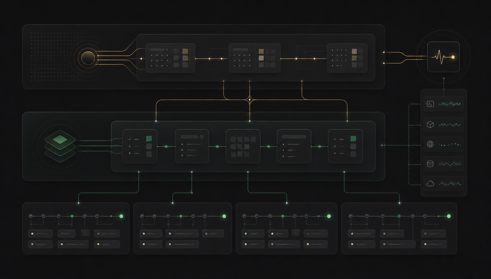
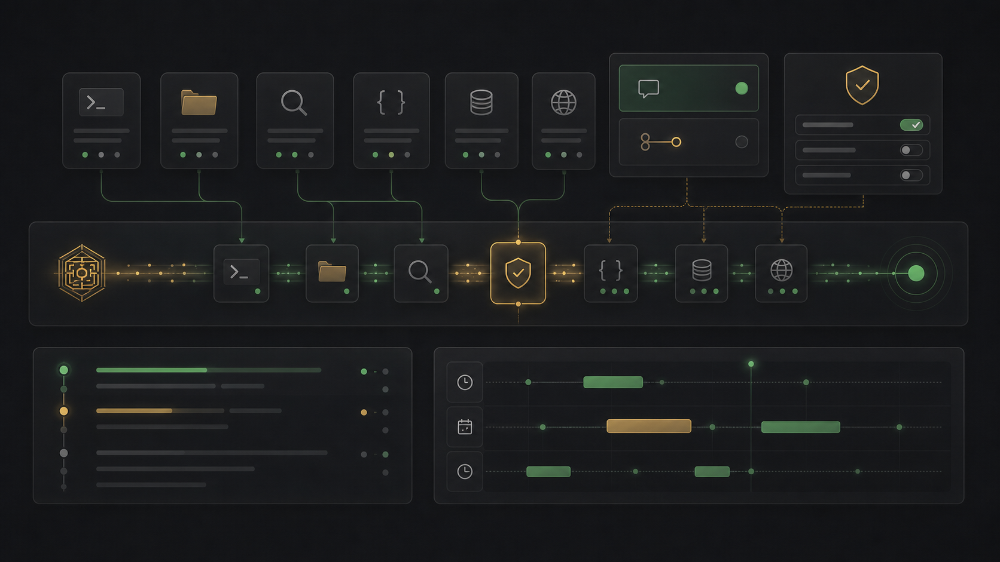

<p align="center">
  
</p>

<h1 align="center">Emperor Agent · 皇帝智能体</h1>

<p align="center">
  <b>本地运行的个人 Agent 工作台</b><br/>
  Chat / Build 多会话 · 项目级记忆 · 工具执行 · Scheduler · Codex 风格桌面端
</p>

<p align="center">
  
</p>

Emperor Agent 是一个面向个人长期使用的本地 Agent 系统。它把日常对话、项目构建、长期记忆、工具执行、定时任务和多模型路由放在同一个桌面工作台里，重点不是 demo，而是一个可以持续迭代、可恢复、可审计的个人工程环境。

---

## 产品定位

| 模式 | 用途 | 上下文来源 |
|---|---|---|
| `chat` | 日常问答、资料整理、轻量任务 | 系统提示词、用户档案、全局长期记忆、项目索引短摘要 |
| `build` | 绑定本地文件夹，专注构建项目 | 系统提示词、用户档案、项目 `AGENTS.md`、当前项目工作区 |
| Scheduler | 长期自动检查、定时运行、后台维护 | 当前配置、任务 payload、权限模式和运行记录 |

核心原则：

- **会话隔离**：每个 session 都有独立 `history.jsonl`、checkpoint 和 runtime events。
- **记忆分流**：Chat 写全局长期记忆；Build 写项目 `AGENTS.md` 托管区块。
- **本地优先**：模型配置、记忆、附件、任务和运行轨迹都落在本地文件系统。
- **桌面工作流**：Electron 桌面端自动拉起后端，提供 Codex 风格侧边栏、设置页和底部 Composer。

---

## ✨ 快速开始

### 1. Python 后端

```bash
python -m venv .venv
source .venv/bin/activate                 # Windows: .venv\Scripts\activate
pip install -r requirements.txt
pip install -e .                           # 提供 emperor-agent 命令

emperor-agent init                         # 终端向导配置 provider / model / WebUI 参数
# 也可以使用：python agent.py init
```

### 2. CLI 模式

```bash
emperor-agent chat
# 兼容入口：python agent.py
```

常用命令：

```bash
emperor-agent status
emperor-agent doctor
emperor-agent web --host 127.0.0.1 --port 8765 --open
```

启动时若发现旧版根级 `memory/history.jsonl` 中有活跃对话，会按迁移逻辑归入会话体系，之后以 `memory/sessions/<id>/` 为事实来源。

### 3. WebUI 模式

前端内置于桌面应用 `desktop/`，用 **electron-vite**（Vue 3 + TypeScript + Tailwind + vue-router）构建。主界面采用 Codex 风格单侧栏：顶部是新对话、搜索、插件和定时任务，中部按项目 / 对话分组，底部进入设置；模型、记忆、Token、MCP、配置、外观和归档统一收纳到设置页。

```bash
cd desktop
npm install              # 安装 Electron + 前端依赖（首次）
npm run dev              # 开发模式（HMR + 自动拉起后端）
npm run build            # 生产构建 → out/
npm start                # 预览生产构建
npm test                 # vitest 单元测试
npm run dist             # electron-builder 打包 → dist/*.dmg
```

需要 Node ≥ 18。Electron 启动时自动探测后端 8765 端口：未运行则 spawn `emperor-agent web`（退出时回收），已运行则附着。生产模式下通过自定义 `app://` 协议加载构建产物，支持 Vue Router history 模式的深层路由。

开发模式下 electron-vite 内置 Vite dev server（HMR），并代理 `/api`/`/ws` 到后端；可用 `EMPEROR_BACKEND_CMD` 环境变量覆盖后端启动命令。host/port 从仓库根 `emperor.local.json` 读取。

**安装包**：`npm run dist` 通过 electron-builder 产出 macOS `.dmg`（`desktop/dist/`）。打包产物仅含 Electron 前端；目标机需 `emperor-agent` 可用或设置 `EMPEROR_BACKEND_CMD`。代码签名需 Apple Developer ID（本地自用可跳过）。

### 4. 可选桌宠

桌宠 companion 默认关闭。首次使用需单独安装 Electron 依赖，然后在 WebUI「配置文件」页开启，或用 CLI 管理：

```bash
cd desktop-pet
npm install
cd ..

emperor-agent pet status
emperor-agent pet start
emperor-agent pet stop
emperor-agent pet restart
```

桌宠窗口位置写入 `memory/desktop_pet/window.json`；运行时会用顶部气泡展示简短动作摘要，不显示用户原文或工具参数。若 Electron 依赖缺失，WebUI 只显示安装命令，不会影响主服务启动。

### 5. 质量检查

开发环境建议安装 dev 依赖：

```bash
.venv/bin/python -m pip install -r requirements-dev.txt
make check
```

`make check` 会调用 `scripts/check.sh`，固定执行 `git diff --check`、Python 编译、`ruff`、`pytest`、`vitest`、electron-vite 构建和 TypeScript 类型检查。需要同时查看本地配置、依赖、持久化状态时可运行：

```bash
emperor-agent doctor --dev
```

## 🧧 首次启动会发生什么

`memory/`、`templates/USER.local.md`、`model_config.json`、`emperor.local.json`、`desktop/node_modules/`、`desktop-pet/node_modules/`、`desktop/out/`、`desktop/dist/` 都被 `.gitignore` 排除，所以新克隆的仓库是**干净**的。首次启动会自动从仓库内的初始化模板生成本地副本：

| 私密文件 | 由谁生成 | 来源 |
|---|---|---|
| `memory/`（整个目录） | `MemoryStore._ensure()` | `mkdir` |
| `memory/MEMORY.local.md` | `MemoryStore._ensure()` | 复制 `templates/init/MEMORY.md` |
| `memory/history.jsonl` | legacy 兼容 | 旧版根级热对话日志，当前会迁移到 `memory/sessions/<id>/` |
| `memory/history_index.json` | legacy 兼容 | 旧版热/冷历史统计索引 |
| `memory/history_archive/*.jsonl.gz` | legacy 兼容 | 旧版已压缩原始对话冷归档 |
| `memory/versions/` | 记忆写入或恢复时生成 | `MEMORY.local.md`、`USER.local.md` 与情景记忆的本地快照 |
| `memory/tokens.jsonl` | `TokenTracker` 首次写入 | append |
| `memory/control/state.json` | `ControlStore` 首次启动 | 当前 ask / plan 等待状态 |
| `memory/runtime/events.jsonl` | legacy 兼容 | 旧版 Chat 行为事件热日志；当前按 session 记录 |
| `memory/runtime/index.json` | legacy 兼容 | 旧版 Runtime 热/冷统计索引 |
| `memory/runtime/archive/*.jsonl.gz` | legacy 兼容 | 旧版已归档行为事件 |
| `memory/external/state.json` | `ExternalBridgeStore` 首次写入 | 外部平台基础层的 seen / pending / outbox durable 状态 |
| `memory/desktop_pet/` | 桌宠启动后生成 | 悬浮窗位置、pid 与最近错误 |
| `memory/scheduler/jobs.json` | `SchedulerStore` 首次启动 | 本地持久定时任务热配置 |
| `memory/scheduler/action.jsonl` | `SchedulerStore` 写操作 | 跨入口 action log，用于合并任务变更 |
| `memory/scheduler/action.corrupt-*.jsonl` | `SchedulerStore` 发现坏 action 时生成 | 无法解析或未知 action 的隔离备份，diagnostics 可见 |
| `memory/watchlist.md` | `WatchlistStore` 首次启动 | 主动检查清单，供 Scheduler heartbeat 周期判断 |
| `memory/watchlist_state.json` | Watchlist 检查后写入 | 最近一次 skip/run 决策与模型信息 |
| `memory/sessions/index.json` | `SessionStore` 首次创建会话 | 本地会话注册表；旧会话缺少 mode 时迁移为 `chat` |
| `memory/sessions/<id>/history.jsonl` | 首条消息或会话恢复 | 会话独立历史；新对话发送首条消息前只在前端占位 |
| `memory/sessions/<id>/runtime/events.jsonl` | WebUI 行为事件 | 会话独立的工具流、Ask/Plan、标题更新等 runtime 事件 |
| `memory/projects/index.json` | `ProjectStore` 解析 Build 项目时写入 | 项目路径索引、摘要和最近活动时间 |
| `memory/projects/<project_id>/team/` | Build 模式使用项目 Team 时写入 | 项目级内部 Team 状态，不写入外部项目根目录 |
| `memory/ui/sidebar-state.json` | 侧边栏排序、折叠、归档状态变更时写入 | 本地 UI 状态 |
| `templates/USER.local.md` | `AgentLoop._ensure_local_user_file()` | 复制 `templates/init/USER.md` |
| `model_config.json` | `emperor-agent init` 或 WebUI 设置页保存 | 本地私密模型配置 |
| `emperor.local.json` | `emperor-agent init` 或桌宠开关 | 本地 CLI/WebUI 偏好：host、port、openBrowser、desktopPet |
| `desktop/out/` | 首次 `npm run build` | electron-vite 构建产物（main / preload / renderer） |

只要按"快速开始"两步走，引导链路就完整了，无需再手动建任何目录。

---

## ⚔️ 核心能力

- **Chat / Build 双模式** — `chat` 用于日常会话；`build` 绑定本地项目目录，同一项目下可新建多个 session。
- **多会话隔离** — 每个 session 独立保存 `history.jsonl`、checkpoint 与 runtime events；新会话先是前端占位，发送首条消息后才真实创建。
- **分层记忆** — Chat 注入系统提示词、`USER.local.md`、全局长期记忆和项目索引短摘要；Build 注入系统提示词、`USER.local.md` 与项目根目录 `AGENTS.md`。
- **项目级记忆** — Build 项目按规范化真实路径生成 `project_id`，项目下多个 session 共享项目 `AGENTS.md` 托管记忆区块，不写入全局 `MEMORY.local.md`。
- **自动压缩** — Chat 压缩更新全局长期记忆；Build 压缩更新项目 `AGENTS.md` 托管区块与项目索引摘要，并保留每个 session 的热历史隔离。
- **记忆版本回滚** — 长期记忆、用户档案与每日情景记忆写入前自动保存轻量快照；Memory 页和 `/memory-log` / `/memory-restore` 可查看 diff 并恢复。
- **多厂家 + 双模型路由** — DeepSeek、Anthropic、OpenAI、Azure OpenAI、AWS Bedrock、OpenRouter、DashScope（阿里云）、SiliconFlow、Ollama、vLLM、OpenAI Codex、GitHub Copilot 与自定义 OpenAI-compatible endpoint；每个 entry 同时配置主模型与次模型，简单任务自动走次模型，失败后升主模型一次。
- **MCP 外部工具** — 通过 stdio 或 SSE 连接外部 MCP 服务器，自动发现工具并注册为 `mcp_{server}_{tool}`，与内置工具统一调度。
- **Codex 风格 WebUI** — 单侧栏包含新对话、搜索、插件、定时任务、项目组、对话组和设置；模型、记忆、Token、MCP、配置、外观与归档统一进入设置页。
- **流式 WebUI** — 网页聊天通过 WebSocket 接收 `message_delta`、`tool_call`、`tool_result`、`subagent_*` 等事件；活跃行为事件按会话持久化到 `memory/sessions/<id>/runtime/events.jsonl`，旧事件进入同会话 `runtime/archive/*.jsonl.gz`，刷新或后端重启后按 seq 回放未压缩会话细节；Scheduler 主动 turn 会显示为中性的“定时任务触发”卡片，不伪装成用户消息；Chat 停止按钮与 `/stop` 会通过统一 active task registry 取消当前 turn / Scheduler run / Watchlist check。
- **懒创建与标题生成** — 点击新对话只创建前端 draft；发送第一条消息时后端创建真实 session，并后台异步生成 2-12 字短标题。
- **三模式权限与 Ask / Plan 控制流** — 默认 `ask_before_edit` 会在危险或不确定动作前审批；`auto` 走最高自动权限；`plan` 只允许只读探索、提问和提交 PlanCard，批准或取消后恢复进入 Plan 前的模式。
- **本地 Scheduler** — 持久保存 `at` / `every` / `cron` 任务，启动 WebUI 后后台 timer 自动恢复；支持触发本地主动 Agent turn、Team wake 与系统维护 heartbeat；Agent 可通过 `scheduler` 工具查看任务，创建/修改/删除/手动运行长期任务会走权限审批。
- **Watchlist Heartbeat** — `memory/watchlist.md` 记录希望系统主动留意的事项；受保护的 `watchlist-check` 定期用次模型判断 `skip/run`，只有必要时才投递完整主动 turn。
- **External Bridge 基础** — `agent/external/` 提供通用外部平台适配骨架、入站去重、inbox/outbox 状态和 runtime 事件；当前不内置任何具体平台实现。外部消息汇总到默认 Chat 会话。
- **Token 统计** — 按日期、provider/model、使用种类（main_agent / subagent / memory_compaction）汇总，并按“输入缓存命中 / 输入缓存未命中 / 输出 / 总 Token”展示。
- **工具调用** — 命令执行、网页抓取、文件读写、Glob/Grep 搜索、技能加载、todo 维护、子代理派遣。
- **任务规划** — 内置 todolist，未完成时自动 nudge 模型继续执行。
- **子代理派遣** — 把独立任务交给不同身份的子代理（独立 history、独立工具白名单），结果摘要回填主上下文，多个子代理可并发派遣。
- **项目级内部 Team** — Build 模式下 Team 作为 AI 内部项目执行池，状态放在 `memory/projects/<project_id>/team/`；同项目多个 session 共享，Chat 模式不启用持久 Team，用户界面不再提供人工管理页。
- **技能系统** — 按需加载 `skills/` 下的能力包，避免一开始塞满 system prompt。
- **桌宠 Companion** — 可选 Electron 悬浮桌宠，开启后用 Clawd Tank 像素动画与顶部短气泡实时展示 Agent 思考、工具调用、子代理、Ask / Plan、完成与错误状态；默认关闭，可在 WebUI 或 CLI 启停。
- **历史保护** — `runner._pair_tool_calls` 保证 OpenAI 格式 history 中 assistant `tool_calls` 与 tool 消息严格配对，运行时异常或压缩切边都不会污染下一次请求。
- **上下文治理** — 每次 LLM 调用前自动跑两步：单条工具结果硬截断（`_cap_tool_result`，留头尾，默认 8KB 上限）+ 旧大体积工具消息摘要化（`_shrink_old_tool_results`，最近 10 条保留原文，更早的替换为 `[shrunk] name → N chars omitted`）。让长对话从 8-10 轮稳定到 30+ 轮不撞 token 上限。
- **LLM 错误恢复** — `step_async` 内置两个状态机：模型偶发空响应时自动注入 nudge 重试（≤2 次）；`finish_reason="length" / "max_tokens"` 时自动续写并拼接（≤3 次）。前端通过既有 `tool_error` 事件可见 `_empty_response` / `_length_truncation` 提示。
- **中断恢复 Checkpoint** — 每个 session 在 turn 开始与工具批次完成后把 history 原子写到 `memory/sessions/<id>/_checkpoint.json`（gitignore），关 tab / Ctrl-C / 模型超时都不丢。切换或恢复会话时优先读取 checkpoint，再读取该会话 `history.jsonl` 热段；`_pair_tool_calls` 兜底处理任何 orphan tool_call。turn 正常落地时自动清理。
- **对话附件** — Composer 支持点选 / 拖拽上传图片（png / jpeg / webp / gif，≤10MB）和文档（pdf / json / csv / text / markdown，≤25MB），单条消息至多 5 个。文件落盘到 `memory/attachments/YYYY-MM/{hash8}-{name}.{ext}`，PDF 与文本文档同步抽取 sidecar 文本（`pypdf`），发消息时按 OpenAI 多模态格式装配 user content：vision-capable entry 走 `image_url` block，否则替换为占位提示；文档总把抽出的文本内联进 prompt，并在末尾附落盘路径供 `read_file` 兜底读取。User 多模态消息在 cap/shrink 链上原样保留，不会被截断；WebUI 刷新恢复时只显示用户原话与附件卡片，不把模型侧提取文本 / 落盘说明塞回气泡。
- **视觉徽章 + 连通测试** — `/settings/model` 模型页内置「测试文本」「测试视觉」两个按钮：发一次最小 ping 或一张内置 2×2 红色 PNG 探测图，返回延迟、模型名、响应 sample。视觉测试通过会自动把 `entry.supports_vision = true` 持久化到 `model_config.json`，entry 列表立刻显示视觉能力徽章；Composer 的附件路径会依据该能力决定走视觉链还是占位文字。

---

## 🏯 项目结构

```text
agent.py                        CLI 兼容入口（转发到 agent.cli）
webui.py                        API 服务器启动入口

agent/
├── loop.py                     主循环、组件装配、CLI 命令处理
├── cli.py                      Python CLI 命令入口：init / chat / web / status / doctor / pet
├── onboarding.py               Rich + Questionary 初始化向导、doctor 检查、配置构造
├── local_config.py             emperor.local.json 本地偏好读写
├── model_router.py             主/次模型路由：main_agent、memory、subagent、team 的模型选择与 fallback
├── runner.py                   单轮执行编排、tool_use 循环、并发安全工具组合、tool_call 配对保护、上下文治理（cap/shrink）、空响应+截断重试
├── runner_factory.py           子代理 / Team runner 构造入口，集中套用模型路由快照与 fallback
├── runner_model.py             ModelCaller：模型调用、流式 delta、次模型失败后升主模型一次
├── memory.py                   分层记忆存储、未归档历史载入、中断恢复 checkpoint
├── memory_versions.py          记忆快照、diff 与 restore，本地存储在 memory/versions/
├── attachments.py              附件落盘 + mime 校验 + PDF/文本抽取 + 引用反查（LRU）
├── compactor.py                历史压缩与长期记忆 / 用户档案更新
├── model_config.py             多 provider 模型配置读写
├── context.py                  按 session scope 组装 system prompt（Chat 全局记忆 / Build 项目记忆 / Skills）
├── projects/                   Build 项目索引与项目 AGENTS.md 托管区块维护
├── sessions/                   多会话注册表、会话历史、懒创建标题生成
├── sidebar_state.py            侧边栏排序、折叠、归档等本地 UI 状态 store
├── workspace.py                Chat / Build 模式下工具工作目录上下文
├── control/                    Ask / Plan 会话控制：pending interaction、暂停/恢复、Ask Guard
├── permissions/                Claude Code 风格三模式权限策略：ask_before_edit / auto / plan
├── runtime/                    WebUI 行为事件冷记录、event payload、seq replay
├── scheduler/                  本地长期自动运行中枢：job store / timer service / scheduler tool
├── desktop_pet/                可选 Electron 桌宠进程管理、pid/state、偏好读写
├── watchlist/                  Watchlist heartbeat：本地清单、次模型 skip/run 决策、主动 turn 过滤
├── external/                   外部平台适配基础：adapter 抽象、统一消息模型、bridge service、durable store
├── web/                        aiohttp Web 后端：app/state/routes/services 分层
│   ├── app.py                  aiohttp app 与中间件
│   ├── container.py            Web 后端组合根，集中 startup / cleanup 生命周期
│   ├── state.py                共享依赖、广播、bootstrap glue
│   ├── routes/                 HTTP / WS 路由注册，不拼复杂 payload
│   └── services/               chat / model / memory / team 业务服务
├── skills.py                   skill 加载与摘要生成
├── telemetry.py                token 用量记录、压缩触发判断、按多维度统计
├── webui.py                    兼容入口，导出 create_app() / main()
├── providers/                  Provider 抽象层
│   ├── base.py                 LLMProvider / GenerationSettings / ToolCallRequest / LLMResponse
│   ├── registry.py             ProviderSpec 表 + 名称查找
│   ├── factory.py              ProviderSnapshot 与 create_provider()
│   ├── anthropic_provider.py   Anthropic Messages API
│   ├── bedrock_provider.py     AWS Bedrock
│   └── openai_compat.py        OpenAI / Azure / Codex / Copilot / DeepSeek / DashScope / SiliconFlow / Ollama / vLLM / OpenRouter
├── subagents/                  子代理 spec 与 registry
├── team/                       项目级内部 Team：持久队友、MessageBus、TeamStore、team tools
├── tools/                      内建工具
└── mcp/                        MCP Client（外部工具连接）
    ├── base.py / registry.py / schema.py
    ├── shell.py / web.py / filesystem.py / search.py
    ├── skills.py / todo.py / dispatch.py

templates/
├── SOUL.md                     智能体灵魂档案（已提交）
├── TOOL.md                     工具使用约定（已提交）
├── USER.local.md               本地个人用户档案（gitignore，首启自动生成）
├── init/
│   ├── MEMORY.md               长期记忆初始化模板（已提交）
│   └── USER.md                 用户档案初始化模板（已提交）
├── agent/                      主智能体 prompt 模板（compact_prompt.md / identity.md / skills_section.md ...）
└── subagents/                  各身份子代理模板

skills/                         技能包，每个目录一个 SKILL.md
memory/                         运行期产物（gitignore，首启自动创建）
├── MEMORY.local.md             长期记忆
├── history.jsonl               legacy 根级热对话日志；当前迁移到 sessions/
├── history_index.json          history 热/冷统计索引
├── history_archive/            已压缩原始对话冷归档：YYYY-MM.jsonl.gz
├── versions/                   记忆版本快照：index.json + snapshots/*.json
├── tokens.jsonl                token 用量明细
├── control/state.json          Ask / Plan 当前模式与等待交互状态
├── sessions/
│   ├── index.json              多会话注册表：mode、project、标题、归档状态
│   └── <id>/                   会话独立 history、checkpoint 与 runtime 事件
├── projects/
│   ├── index.json              Build 项目索引：project_id、路径、名称、摘要、最近活动
│   └── <project_id>/team/      Build 项目级内部 Team 状态
├── ui/sidebar-state.json       侧边栏排序、折叠、归档、本地顺序
├── runtime/events.jsonl        legacy 运行流兼容路径；当前 WebUI 以会话 runtime 为事实来源
├── scheduler/
│   ├── jobs.json               持久 Scheduler jobs：at / every / cron
│   └── action.jsonl            append-only action log，用于跨入口写入合并
├── watchlist.md                主动检查清单：每行一个希望系统定期留意的事项
├── watchlist_state.json        最近一次 Watchlist skip/run 决策
├── _checkpoint.json            legacy 根级 checkpoint；当前使用 sessions/<id>/_checkpoint.json
├── attachments/                上传附件落盘：YYYY-MM/{hash8}-{name}.{ext} + sidecar .txt
└── YYYY-MM-DD.md               每日情景记忆

model_config.json               本地私密模型配置（gitignore，由 init 或设置页保存）
emperor.local.json              本地 CLI/WebUI 偏好配置（gitignore，由 init 创建）
model_config.example.json       配置范例（已提交）

assets/                         WebUI 品牌与生成素材库（已提交）
├── desktop-pet/clawd-tank/     可选 Electron 桌宠使用的 Clawd Tank MIT 动画资产
├── tools/                      11 张工具事件图标
├── actions/                    10 张操作 / 状态图标
├── attachments/                5 张附件类型图标（image / pdf / markdown / text / file）
├── model/                      4 张模型能力图标（text / vision / test ok / test fail）
├── avatars/                    3 张角色头像
├── brand/                      logo / favicon / og-cover
├── empty/                      4 张空态插画
├── generated/                  imagegen 生成素材与 PROMPTS.md 记录
└── textures/                   纹理素材

desktop-pet/                    可选 Electron 桌宠 companion（需单独 npm install）
├── package.json
├── main.js / preload.js
└── renderer.html / renderer.css / renderer.js

desktop/                        Electron 桌面应用（electron-vite：main + preload + Vue renderer）
├── package.json               scripts：dev / build / start / test / typecheck / dist
├── playwright.config.ts        可复跑 UI 截图验证配置
├── electron.vite.config.ts    三段构建：main / preload / renderer（Vue + Tailwind）
├── electron-builder.yml       打包配置：macOS dmg，appId，asar
├── tsconfig*.json              / vitest.config.ts
├── tailwind.config.ts / postcss.config.js
├── build/icon.png             应用图标
├── src/
│   ├── main/
│   │   ├── index.ts           Electron 装配层（后端 spawn/attach、app:// 协议、窗口、回收）
│   │   ├── config.ts / backend-command.ts / health.ts / lifecycle.ts / window-bounds.ts / protocol.ts
│   │   └── *.test.ts          vitest 单元测试
│   ├── preload/
│   │   └── index.ts           contextBridge 暴露 backendBaseUrl / version / platform
│   └── renderer/
│       ├── index.html
│       ├── public/             favicon
│       └── src/                迁自原 webui/src/（App / router / views / components / composables / runtime / api / styles / assets.ts / types.ts...）
├── tests/                      Playwright 截图冒烟用例
├── out/                        electron-vite 构建产物（gitignore）
├── dist/                       electron-builder 安装包产物（gitignore）
└── node_modules/               gitignore
```

---

## 🗺️ WebUI 架构

主应用采用 Codex 风格单侧栏，设置页采用独立 shell。聊天页保留左侧主侧栏，进入 `/settings/*` 后隐藏主侧栏，只显示设置分类与当前设置内容。

| 区域 | 当前行为 |
|---|---|
| 顶部入口 | `新对话`、`搜索`、`插件`、`定时任务` 固定在侧栏顶部 |
| 项目区 | Build 项目按项目分组展示；项目标题栏提供排序、折叠和新增项目入口；项目下可创建多个 build session |
| 对话区 | 只展示 chat session；新对话先创建前端 draft，首条消息后创建真实 session |
| 搜索 | 命令面板式 overlay，第一版检索 session title、project name、project path |
| 插件 | `/plugins` 聚合 Skills 与 Tools 两个 tab；旧 `/skills`、`/tools` 保持兼容 |
| 定时任务 | `/scheduler` 直接进入 Scheduler 面板，并在侧栏显示任务数量 |
| 设置 | `/settings/:section` 收纳常规、模型、记忆、Token、MCP/集成、配置、外观和已归档对话；不再暴露 Team 人工管理入口 |

主要路由：

| 路由 | 视图 | 用途 |
|---|---|---|
| `/chat` | `ChatView` | 默认页，流式聊天，tool / subagent / Ask / Plan 事件可视化 |
| `/plugins` | `PluginsView` | Skills 与 Tools 统一入口 |
| `/scheduler` | `SchedulerView` | 本地长期任务、运行历史与手动调度 |
| `/settings/:section` | `SettingsView` | 设置页 shell，复用模型、记忆、Token、MCP、配置、外观、归档等面板 |

**Composer**：底部输入框采用极简工具栏。左侧 `+` 打开 Add palette，第一项是文件/文件夹，后续复用 slash command 与 Skill 候选；可见 `/` 按钮已移除，但用户手动输入 `/` 仍会触发同一套候选逻辑。右侧依次放置上下文占用状态、模型与思考强度、执行方式和发送按钮。模型上下文窗口与输出上限在设置页模型分组管理，不在 Composer 浮层中编辑。

**跨路由保活**：`useBootstrap` / `useRuntime` 在 `App.vue` 顶层执行，通过 `provide()` 注入；`<router-view>` 用 `<keep-alive>` 包住，切换路由时 WebSocket、消息流、Composer 草稿、滚动位置都不丢。

**SPA fallback**：`agent/web/routes/chat.py` 注册静态处理器，对未匹配 `/api/*` 与 `/ws` 的路径回退到 `index.html`，刷新 `/settings/model`、`/plugins` 等深层路由不会 404。

**素材管线**：普通 UI 图标优先使用 `lucide-vue-next` 并在 `desktop/src/renderer/src/icons.ts` 统一映射。确实需要位图品牌或欢迎态素材时使用 `$imagegen`，最终文件放入 `assets/`，并同步记录对应目录的 `PROMPTS.md`。

**桌宠素材署名**：可选桌宠使用
[`marciogranzotto/clawd-tank`](https://github.com/marciogranzotto/clawd-tank)
在 `6f0093b40e3714db24615409bf31c351f66114f7` 的 MIT SVG 动画资产。仓库只 vendored
`assets/desktop-pet/clawd-tank/` 下的视觉资源、`LICENSE` 与 `NOTICE.md`，不包含上游 ESP32 固件、SDL2 simulator、BLE daemon 或 menu bar app。

---

## ⚙️ 模型配置

模型配置使用本地 `model_config.json`，允许明文保存 API key。该文件已加入 `.gitignore`。推荐用 `emperor-agent init` 打开终端初始化向导，或在 WebUI `/settings/model` 页编辑；旧 `/model` 路由仅作为兼容入口保留。手动复制 `model_config.example.json` 仍然兼容。

默认配置摘要：

```json
{
  "agents": {
    "defaults": {
      "model": "deepseek-work",
      "provider": "deepseek",
      "maxTokens": 20000,
      "temperature": 0.1,
      "reasoningEffort": null,
      "contextWindowTokens": 200000
    }
  },
  "models": [
    {
      "name": "deepseek-work",
      "provider": "deepseek",
      "mainModelId": "deepseek-reasoner",
      "secondaryModelId": "deepseek-chat",
      "apiKey": "",
      "apiBase": null
    }
  ],
  "providers": {
    "deepseek":   { "apiKey": "", "apiBase": "https://api.deepseek.com" },
    "anthropic":  { "apiKey": "", "apiBase": null },
    "openai":     { "apiKey": "", "apiBase": null },
    "openrouter": { "apiKey": "", "apiBase": "https://openrouter.ai/api/v1" },
    "dashscope":  { "apiKey": "", "apiBase": "https://dashscope.aliyuncs.com/compatible-mode/v1" },
    "ollama":     { "apiKey": "", "apiBase": "http://localhost:11434/v1" },
    "vllm":       { "apiKey": "", "apiBase": "http://localhost:8000/v1" },
    "...": "等等"
  }
}
```

WebUI `/settings/model` 页可以编辑全部字段并热更新。一个模型条目共享同一套 `provider / apiKey / apiBase`，但必须同时填写 `mainModelId` 与 `secondaryModelId`：主模型负责主 Agent、复杂决策和写入型任务；次模型负责记忆压缩、轻量子代理和只读/核验型任务。旧配置里的 `id` 会被兼容读取为 `mainModelId`，启动与普通运行仍可在缺少次模型时降级主模型；但再次保存时必须补齐 `secondaryModelId`。

模型页按“身份 / 模型 / 容量 / 连接 / 高级”分组展示。`contextWindowTokens` 与 `maxTokens` 属于容量设置，在模型页主编辑区直接可见；Composer 只保留当前模型与思考强度的快速切换，不编辑上下文窗口或输出上限。

`/api/model-test` 的语义更严格：显式测试 `role=secondary` 时，如果 entry 没有 `secondaryModelId`，后端会返回 `400`，前端也会禁用“测试次模型”按钮并提示先补齐；这条测试路径不会偷偷 fallback 到主模型。视觉测试始终绑定主模型，因为 `supportsVision` 表示主模型附件能力。

终端初始化向导只覆盖核心配置：LLM provider、entry name/label、API key、API base、主/次模型、maxTokens、temperature、contextWindowTokens、reasoningEffort、WebUI host/port/openBrowser 和默认权限模式。API key 输入为空时会保留已有值，摘要只显示脱敏尾号。向导不会配置 MCP、Scheduler jobs、项目 Team 或 External Bridge。

---

## 🧠 记忆系统

<p align="center">
  
</p>

记忆按 session mode 分流：

- **Chat**：系统提示词、`templates/USER.local.md`、全局长期记忆 `memory/MEMORY.local.md`、全局项目索引短摘要。
- **Build**：系统提示词、`templates/USER.local.md`、绑定项目根目录的 `AGENTS.md`。Build 不注入全局 `MEMORY.local.md`，压缩只更新项目 `AGENTS.md` 托管区块和项目索引摘要。
- **多会话历史隔离**：每个 session 独立保存 `memory/sessions/<id>/history.jsonl`、`_checkpoint.json` 与 `runtime/events.jsonl`；全局记忆或项目记忆只作为上下文来源共享。

| 层 | 载体 | 写入时机 | 读取方式 |
|----|------|----------|----------|
| 工作记忆 | session 内 `history` 列表（内存） | 每轮对话追加 | 当前 session 热上下文 |
| 会话热历史 | `memory/sessions/<id>/history.jsonl` | 每轮 user/assistant 追加；压缩后原子重写 | 启动或切换 session 时载入 |
| 会话 checkpoint | `memory/sessions/<id>/_checkpoint.json` | turn 开始与工具批次后写入 | 中断恢复优先载入 |
| 情景记忆 | `memory/YYYY-MM-DD.md` 或项目 `AGENTS.md` 托管区块 | 压缩触发时生成 / 更新 | Chat 走全局；Build 走项目 |
| 长期记忆模板 | `templates/init/MEMORY.md` | 仓库格式 | 首启自动复制到本地 |
| 全局长期记忆 | `memory/MEMORY.local.md` | Chat 压缩或启动归档时更新 | Chat 每轮注入 |
| 项目级记忆 | `<project>/AGENTS.md` 托管区块 | Build 压缩时更新 | Build 每轮注入 |
| 项目索引 | `memory/projects/index.json` | 项目解析与 Build 压缩时更新 | Chat 只读取短摘要 |
| 用户档案模板 | `templates/init/USER.md` | 仓库格式 | 首启自动复制到本地 |
| 用户档案 | `templates/USER.local.md` | 压缩或 WebUI Config 编辑时更新 | 每轮注入 system prompt |
| 原始历史冷归档 | `memory/sessions/<id>/history_archive/YYYY-MM.jsonl.gz` | 压缩完成后写入 | 默认不注入上下文，保留审计/备份 |
| 行为事件热记录 | `memory/sessions/<id>/runtime/events.jsonl` | 每个活跃 WebUI runtime 事件 append；压缩/维护后旧事件轮转 | 刷新后重放未压缩 turn 的工具、Ask/Plan、标题更新等细节 |
| 行为事件冷归档 | `memory/sessions/<id>/runtime/archive/YYYY-MM.jsonl.gz` | Runtime 维护或压缩后生成 | 默认不重放，保留审计/备份 |

Token 账本：`memory/tokens.jsonl` 每行记录一次模型调用，字段包括 `input`、`output`、`cache_read`、`cache_create`、`provider`、`model`、`usage_type`、`model_role`，并在可用时记录 `route_reason`、`estimated_input_tokens`、`route_estimated_tokens`、`used_fallback`、`fallback_reason`，用于排查主/次模型路由和 fallback。Anthropic 的 `cache_read_input_tokens` / `cache_creation_input_tokens` 会归一化到 `cache_read` / `cache_create`；OpenAI-compatible 的 `prompt_tokens_details.cached_tokens` 会归一化到 `cache_read`，并从普通 `input` 中扣除以避免重复统计。WebUI Token 页把这些字段派生为 4 个主口径：输入缓存命中 = `cache_read`，输入缓存未命中 = `input + cache_create`，输出 = `output`，总 Token = 前三者合计；大数字按 K / W / M 自动缩写，完整值保留在悬停提示里。

压缩触发：`TokenTracker.should_compact(max_context, threshold=0.7)` —— 上一次调用的 input + cache_read + cache_create 估算超过窗口的 70% 时，下一轮 step 结束后压缩当前 session 的 `history[:-K]`（K 默认 10），保留最近 K 条。Chat 压缩输出更新全局长期记忆与用户档案；Build 压缩输出更新项目 `AGENTS.md` 托管区块与项目索引摘要。缺失关键字段时会做一次 repair retry，仍失败则保留原记忆和热历史，并把诊断写入 `memory/compact_diagnostics.jsonl`，避免半更新。压缩完成后，会话 `history.jsonl` 会被重写为热日志；旧原始行进入同会话 `history_archive/YYYY-MM.jsonl.gz`，对应 index 记录热日志大小、归档文件数和最近归档时间。

Chat 页面只展示未压缩 turn 的完整行为细节；压缩前的工具调用、Ask/Plan 卡片和标题事件会从当前 session 的热 `runtime/events.jsonl` 转入同会话 `runtime/archive/YYYY-MM.jsonl.gz`，后续可用于审计或历史浏览页。

`memory/`、`templates/USER.local.md`、`model_config.json`、`mcp_config.json`、`emperor.local.json` 都是本地私密文件，**不要提交**。

---

## 🛠️ 内置工具

<p align="center">
  
</p>

| 工具 | 作用 | 并发安全 |
|------|------|----------|
| `run_command` | 执行 shell 命令 | ✗ |
| `web_fetch` | 抓取 URL 内容 | ✓ |
| `read_file` | 工作区文件读取 | ✓ |
| `write_file` | 工作区文件写入 | ✗ |
| `edit_file` | 局部编辑 | ✗ |
| `glob` | 工作区路径匹配 | ✓ |
| `grep` | 工作区内容搜索 | ✓ |
| `load_skill` | 按需加载技能 | ✓ |
| `update_todos` | 维护当前任务列表 | ✗ |
| `ask_user` | 暂停当前 turn，向用户提结构化问题 | ✗ |
| `propose_plan` | Plan 模式下提交计划草案并等待评论/批准 | ✗ |
| `scheduler` | 查看/管理本地长期定时任务 | ✗（`list` 走权限层放行） |
| `dispatch_subagent` | 派遣子代理独立办差 | ✓（多个子代理可并发） |
| `spawn_teammate` | Build 项目级内部 Team 召入队友 | ✗ |
| `list_teammates` | 查看当前 Build 项目 Team 状态 | ✓ |
| `send_message` | 向项目 Team inbox 留言 | ✗ |
| `read_inbox` | 读取当前 actor 的 inbox | ✗（默认会移动已读游标） |
| `broadcast` | 向当前项目多个队友广播并可逐个唤醒 | ✗ |
| `shutdown_teammate` | 关闭队友，保留历史记录 | ✗ |

`AgentRunner` 会把同一帧内多个并发安全的工具调用合并为 `asyncio.gather`，按原顺序回填结果。

`dispatch_subagent` 的旧参数 `agent_type` / `task` / `purpose` 继续兼容；新派遣建议补充 `expected_output`、`evidence_required`、`scope_limit`，子代理最终回禀统一包含结论、证据、风险和建议下一步。

附件文档落盘后，主代理也可以主动 `read_file memory/attachments/.../foo.pdf.txt` 读取被抽出来的 sidecar 文本——这是给非视觉模型保留的一条兜底链路。

---

## 🧭 权限模式与 Ask / Plan 控制流

`agent/control/` 负责可暂停交互，`agent/permissions/` 负责 Claude Code 风格的执行模式判断。状态持久化在 `memory/control/state.json`，配合当前 session 的 `memory/sessions/<id>/_checkpoint.json` 与 `memory/sessions/<id>/runtime/events.jsonl`，刷新页面或后端重启后仍能恢复 pending interaction 与对应 Chat 卡片。

| 模式 | 入口 | 行为 |
|---|---|---|
| `ask_before_edit` | 默认、`/mode ask` | 读操作直接执行，普通编辑可执行；危险、不确定、破坏性或高影响操作先进入 AskCard 审批 |
| `auto` | `/mode auto` 或 Composer 模式选择器 | 工具层不主动审批；仍保留路径安全、schema 校验和工具自身异常保护 |
| `plan` | `/mode plan`、`/plan on` 或 Composer 模式选择器 | 只读探索 + `ask_user` + `propose_plan`；写文件、命令执行、Team 写操作、子代理派遣不可用 |

| 机制 | 入口 | 行为 |
|---|---|---|
| Ask | `ask_user(questions, context?)` | Agent 提出 1-3 个结构化问题，每题 2-4 个选项，可带自由补充；Ask Guard 在高影响歧义下会阻止写操作/最终答复并强制进入 Ask；用户回答后把结构化答案注入 history 并继续当前任务 |
| Plan | `/plan on` 或 WebUI Chat Composer 模式选择器 | 进入硬门禁模式：模型只看到只读工具 + `ask_user` + `propose_plan`；普通最终文字会被 Runner 包装成 PlanCard 并暂停 |
| Approve | PlanCard / CLI `approve` | 批准后自动恢复进入 Plan 前的模式（`ask_before_edit` 或 `auto`），并把批准事件作为用户反馈注入 history，随后继续执行 |

Plan 模式不是提示词约束，而是工具层 + 输出层硬门禁：`write_file`、`edit_file`、`run_command`、`dispatch_subagent`、Team 写操作等不会暴露给模型；`scheduler` 在 Plan 模式下只允许 `action=list` 用于了解现有长期任务，创建/修改/删除/运行任务必须等计划批准后再执行。如果模型尝试调用未授权工具，Runner 会返回明确的拒绝结果；如果模型直接普通回复，Runner 会生成 `plan_draft` 并暂停，确保用户必须先看到 PlanCard。执行中或已有 pending Ask/Plan 时，`POST /api/control/mode` 会返回 409，避免中途切换模式导致工具策略漂移。

WebUI 手动点击被视为用户直接操作，不再二次弹 Agent AskCard；但执行型 mutation 仍会走统一 Web guard：存在 pending Ask/Plan 时拒绝 Scheduler run、Team wake、Team message wake、桌宠启停等操作，Plan 模式下拒绝新增/修改/运行长期任务、Team 写操作与桌宠开关，防止绕过计划门禁。

Ask Guard 当前采用“高影响歧义强制”策略：大范围工程化/重构/UI 取舍、提交推送、删除覆盖、发布部署、安全/权限/成本边界不清时，会要求先 `ask_user`；低风险、目标明确的小任务不打扰；`PLEASE IMPLEMENT THIS PLAN` 或决策完整的计划会跳过主动提问。

权限审批是“一次性同参授权”：用户允许后，同一个工具名 + 参数组合下一次执行会放行一次；用户拒绝后，同参操作下一次会返回明确拒绝，避免审批循环。

Scheduler 相关 HTTP API 已接入 Web 后端：`GET /api/scheduler`、`POST /api/scheduler/jobs`、`PATCH /api/scheduler/jobs/{id}`、`POST /api/scheduler/jobs/{id}/run|pause|resume`、`DELETE /api/scheduler/jobs/{id}`。运行事件会通过 `scheduler_job_update`、`scheduler_run_start`、`scheduler_run_done`、`scheduler_run_error`、`scheduler_run_cancelled` 进入 runtime 事件流。`memory/scheduler/action.jsonl` 合并时若遇到坏行或未知 action，会把坏记录隔离到 `action.corrupt-*.jsonl` 并通过 scheduler diagnostics 暴露，不静默丢弃。

当前运行中的 Chat turn、Scheduler run、Watchlist 手动检查会登记到进程内 active task registry；`POST /api/runtime/stop`、WebUI 停止按钮与 `/stop` 共用这一层取消任务，并发出 `runtime_task_cancelled` 事件。刷新后未完成轨迹仍由 runtime event log 还原，取消后的工具 / 子代理段会显示为已中断。

当前可执行 payload：`agent_turn` 会作为“定时任务触发”的主动 turn；`deliver=true` 时写入当前 Chat runtime，`deliver=false` 时只作为后台运行写入 Scheduler run history，不插入当前对话流；`team_wake` 必须携带 `project_id`，会向对应 Build 项目的 teammate 写入 task 消息并唤醒，缺少项目的旧 Team job 会被拒绝或暂停，避免跑到错误项目；`system_event` 仅允许系统代码注册，普通 API / tool 创建会被拒绝。

Scheduler 投递到 Chat 的主动 turn 仍使用主线 `user_message` 事件，但会带 `source="scheduler"` 和 `{ jobId, jobName }` 元数据；前端会把它渲染为“定时任务触发”时间线卡片，而不是右侧用户圣旨气泡。`scheduler_run_done`、`scheduler_run_cancelled` 和 `scheduler_job_update` 的完成提示会短暂显示后自动消失；`scheduler_run_error` 会保持可见，直到下一次 pending 状态覆盖。

WebUI 启动时会自动登记 5 个受保护系统任务：`memory-maintenance`、`runtime-maintenance`、`team-stale-recovery`、`token-ledger-maintenance`、`watchlist-check`。它们在 Scheduler 页可见、可暂停/恢复/手动运行，但不能删除；Memory 页会显示维护任务状态，并提供 `memory/watchlist.md` 编辑与手动检查入口。

Watchlist 不是后台常驻聊天，而是“先过滤再投递”：`watchlist-check` 会读取 `memory/watchlist.md` 的有效条目，用次模型判断是否需要运行；`skip` 只记录状态，`run` 才把可投递消息包装成一次本地主动 `agent_turn`。这样可以保留长期自主性，同时避免清单项每次心跳都污染 Chat。

External Bridge 当前是基础设施层：`ExternalAdapter` 负责未来平台收发，`ExternalBridgeService` 负责入站去重、忙碌/Ask/Plan 时排队、outbox 状态与 `external_*` runtime 事件。Bridge 状态会持久化到 `memory/external/state.json`，重启后恢复 `seen`、`pending`、`outbox` 与最近错误；坏状态文件会保留为 `state.json.corrupt-*` 并在 diagnostics 中可见。它不提供真实飞书/Slack/Telegram adapter，也不会生成平台独立历史；外部消息进入模型前会带 `[EXTERNAL_MESSAGE]` 来源上下文，然后作为一次普通主线 turn 运行。

本地诊断统一入口：

| 类型 | 名称 |
|---|---|
| HTTP | `GET /api/diagnostics` |
| CLI | `emperor-agent doctor --dev` |

`/api/diagnostics` 返回 model config、local config、scheduler store、runtime event store、external bridge、desktop pet 和依赖提示。`/api/*` 未处理异常只返回安全错误与 `errorId`，完整异常细节写入日志，不直接暴露到浏览器。

WebUI 相关接口：

| 类型 | 名称 |
|---|---|
| HTTP | `GET /api/control`、`POST /api/control/mode`、`POST /api/control/interactions/{id}/cancel` |
| HTTP | `GET /api/external`、`GET /api/diagnostics` |
| WS client message | `interaction_answer`、`plan_comment`、`plan_approve`、`interaction_cancel` |
| WS server event | `user_message`（可带 `source="scheduler"`）、`scheduler_*`、`runtime_task_cancelled`、`control_mode_update`、`ask_request`、`ask_answered`、`plan_draft`、`plan_comment_added`、`plan_approved`、`interaction_cancelled`、`turn_paused`、`external_inbound`、`external_queued`、`external_outbound_*` |

CLI 也支持 `/mode ask|auto|plan|status` 与 `/plan on|off|status`。Ask pending 时会在终端打印问题并读取答案；Plan pending 时支持 `approve`、`comment <内容>`、`cancel`。

---

## 🔌 MCP 外部工具

Emperor Agent 内置 MCP Client，可连接外部 MCP 服务器扩展工具能力。

### 配置方式

创建 `mcp_config.json`（与 `model_config.json` 同级）：

```json
{
  "servers": {
    "filesystem": {
      "transport": "stdio",
      "command": "npx",
      "args": ["-y", "@modelcontextprotocol/server-filesystem", "/workspace"],
      "enabled": true,
      "tool_overrides": {
        "read_file": { "read_only": true }
      }
    },
    "fetch": {
      "transport": "stdio",
      "command": "uvx",
      "args": ["mcp-server-fetch"],
      "enabled": true
    },
    "remote": {
      "transport": "sse",
      "url": "http://localhost:3001/sse",
      "headers": {},
      "enabled": false
    }
  },
  "defaults": {
    "read_only": false,
    "exclusive": false
  }
}
```

| 字段 | 说明 |
|---|---|
| `transport` | `stdio`（本地命令）或 `sse`（HTTP 服务器） |
| `command` / `args` | stdio 模式下执行的命令 |
| `url` / `headers` | sse 模式下服务器地址与请求头 |
| `enabled` | 是否启用该服务器 |
| `tool_overrides` | 按工具名覆盖 `read_only` / `exclusive` |
| `env` | 额外环境变量（支持 `${ENV_VAR}` 插值） |

### WebUI 管理

`/settings/integrations` 页面提供 MCP JSON 配置编辑器 + 已加载 MCP 工具列表。保存后自动关闭旧连接、重新发现工具并注册。

### 安全提示

- MCP 子进程**仅继承白名单环境变量**（PATH、HOME、USER 等），API key 等敏感变量不会泄露给第三方 MCP 服务器
- 工具名格式为 `mcp_{server}_{tool}`，与内置工具隔离
- 单服务器连接失败不影响其他服务器和内置工具

---

## 👥 角色与子代理

<p align="center">
  
</p>

主智能体（"大内总管"）服侍用户（"皇上"），可派遣"小太监"作为子代理处理独立差事——子代理拥有独立 `history` 与受限工具白名单，办完只把摘要返回主上下文。WebUI 会通过 `subagent_*` 事件实时显示子代理的进度（delta、tool_call、result、done / error）。轻量只读/核验子代理默认走当前 entry 的 `secondaryModelId`，写入型 `neiguan_yingzao` 仍走 `mainModelId`；次模型失败时自动升主模型重试一次。

Agent Team 是 Build 模式的项目级内部协作层，不再作为用户可管理设置项暴露。Lead 使用 `spawn_teammate` 创建队友时，状态写入 `memory/projects/<project_id>/team/`，同一项目下多个 session 共享；Chat session 不注入持久 Team 工具。v1 不启动后台常驻线程；`send_message(..., wake=true)` / `broadcast(..., wake=true)` 会按消息唤醒队友执行一次。队友按 agent_type 复用同一套主/次模型路由，token 用量记录为 `usage_type=team:<name>` 并带 `model_role`，主上下文只接收摘要，避免长期协作污染当前 session history。

role 默认映射：

- `coder` → `neiguan_yingzao`
- `reviewer` → `shangbao_dianbu`
- `researcher` → `dongchang_tanshi`
- `reader` → `sili_suitang`
- `runner` → `xiaohuangmen`
- 未知 role → `sili_suitang`

当前内置子代理身份：

- `xiaohuangmen` — 轻量只读，适合快速确认和短命令。
- `sili_suitang` — 只读文书，适合阅读代码与整理文档。
- `dongchang_tanshi` — 只读查访，适合网页抓取和资料探索。
- `shangbao_dianbu` — 只读核验，适合清点文件、校对清单、检查遗漏。
- `neiguan_yingzao` — 可读写、可执行命令，适合修改文件、搭建工程、跑验收。

`researcher` 与 `general` 作为兼容别名保留，分别映射到 `dongchang_tanshi` 与 `neiguan_yingzao`。

---

## 📜 技能系统

`skills/{name}/SKILL.md` 用 YAML frontmatter 描述触发条件，Markdown 写能力说明。主智能体在需要时通过 `load_skill` 拉取，避免一开始塞满 system prompt；提示词模板不得要求绕过 `load_skill` 直接读取 `SKILL.md`。

Composer 的 `+` Add palette 会同时列出文件/文件夹、常用命令和当前项目全部 Skill；可见 `/` 按钮已移除，但手动输入 `/` 仍会打开同一套候选。点击 Skill 会补全 `/<skill-name> ` 前缀；输入 `/<skill-name> 任务` 或 `/<skill-name>-skill 任务` 会作为结构化 `requested_skills` 随消息发送，后端会在本轮强制预加载 Skill 内容。Composer 和 Chat 气泡中，非系统命令的 `/skill` 前缀会以特殊颜色字体高亮；聊天气泡与刷新恢复仍只显示你的原始输入。

当前内置技能：

- `clawhub` — 技能库搜寻与安装
- `ddg-web-search` — DuckDuckGo 搜索
- `github` — GitHub CLI 交互
- `skill-creator` — 创建或更新技能
- `summarize` — URL、播客、文件总结
- `weather` — 天气查询

WebUI `/plugins` 页的 Skills tab 可以新建、编辑、保存 Skill；旧 `/skills` 路由保持兼容。保存后会触发 `loop.refresh_runtime_context()` 重建 system prompt。

---

## 💬 CLI / WebUI 斜杠命令

CLI 与 WebUI Composer 共用一批斜杠命令；部分工作台页面命令只在 WebUI 生效：

| 命令 | 说明 |
|---|---|
| `/help` | 列出所有命令 |
| `/status` | 当前 provider / model / token / 工具与技能数 |
| `/init` | CLI 内打开终端初始化向导 |
| `/model` | 当前模型详细信息；WebUI 跳转到设置里的模型页 |
| `/tokens` | Token 用量统计；WebUI 跳转到设置里的 Token 页 |
| `/tools` | 工具列表；WebUI 跳转到插件页 Tools tab |
| `/skills` | 技能列表；WebUI 跳转到插件页 Skills tab |
| `/config` | CLI 中同 `/init`；WebUI 中进入设置里的配置文件页 |
| `/memory` | 记忆状态摘要；WebUI 跳转到设置里的记忆页 |
| `/memory-log` | 最近记忆版本快照（WebUI） |
| `/memory-restore <id>` | 恢复指定记忆版本（WebUI） |
| `/plan on|off|status` | 开关或查看 Plan 模式 |
| `/mode ask|auto|plan|status` | 切换或查看三模式权限层 |
| `/stop` | 停止当前运行中的 turn / Scheduler 任务 / Watchlist 手动检查（WebUI） |
| `/compact` | 立即压缩未归档对话（WebUI） |
| `/clear` | 清空当前屏幕/上下文（不删 memory） |
| `/reload` | 重新拉取 bootstrap（WebUI） |
| `/exit` | 退出 CLI |

WebUI 还支持 Skill 快捷调用：`/<skill-name> 任务` 会强制本轮使用指定 Skill；若 Skill 名与系统命令冲突，可用 `/<skill-name>-skill 任务`。Composer 与 Chat 中的 `/skill` 前缀会用特殊颜色字体区分，正文仍按普通文字显示。

---

## 🌐 环境变量

模型 API Key 默认从 `model_config.json` 读取。`.env` 仍可保留给你自己的工具或脚本使用，但主 Agent 不再依赖任何 `*_API_KEY` 环境变量。`emperor-agent doctor` 会检查模型条目、WebUI 构建产物、本地偏好文件和 CLI 依赖；`emperor-agent doctor --dev` 会额外运行统一质量门禁。

---

## 🤝 协作约定

- **不要提交**：`memory/`、`.team/`（legacy 本地状态）、`templates/USER.local.md`、`model_config.json`、`mcp_config.json`、`emperor.local.json`、`.env`、`desktop/node_modules/`、`desktop/out/`、`desktop/dist/`、`desktop/screenshots/`、`desktop/test-results/`、`desktop-pet/node_modules/`、任何 `*.local.md`。
- **可以提交**：`templates/init/*.md` 模板（保持通用）、`templates/SOUL.md` / `TOOL.md`、`assets/`（含 `assets/generated/PROMPTS.md`）、`skills/`、`desktop/src/`、`desktop/tests/`、`desktop/electron.vite.config.ts`、`desktop/playwright.config.ts`、`desktop/package*.json`、`desktop/tsconfig*.json`、`desktop/vitest.config.ts`、`desktop/tailwind.config.ts`、`desktop/postcss.config.js`、`desktop/electron-builder.yml`、`desktop/build/icon.png`。
- **提交前门禁**：优先运行 `make check`。它是当前唯一推荐的本地质量入口；涉及桌面 UI 时额外运行 `npm --prefix desktop run screenshots` 保存固定视口截图做人工检查。
- **资产预算**：PNG 素材允许保留品牌识别度，但新增或替换单个资产超过 2.5MB 时必须说明原因；生成素材必须落到 `assets/` 并在对应 `PROMPTS.md` 记录提示词。
- 新增 provider：在 `agent/providers/registry.py` 加 `ProviderSpec`，需要新 backend 时在 `factory.py` 加分支并新增 provider 实现。
- 新增工具：在 `agent/tools/` 实现 `Tool` 子类，到 `agent/loop.py` 注册。
- 新增会话控制能力：优先放在 `agent/control/`；权限审批策略放在 `agent/permissions/`；同步 `agent/runner.py` 暂停/恢复语义、`agent/web/routes/*` API / WS、`desktop/src/renderer/src/types.ts` 与 chat 组件。
- 新增 WebUI 行为事件：优先通过 `agent/runtime/events.py` 构造 payload，经 `RuntimeEventStore` 持久化；前端同步 `desktop/src/renderer/src/runtime/*` 与 `useRuntime.ts`。
- 新增外部平台适配：优先实现 `agent/external/ExternalAdapter` 并接入 `ExternalBridgeService`；汇入默认 Chat 会话，普通用户会话仍各自拥有独立对话历史。
- 新增 MCP 服务器：在 `mcp_config.json` 中配置即可，无需改代码。
- 新增子代理：先在 `agent/subagents/registry.py` 增加内置 spec 和工具白名单，再在 `templates/subagents/{name}.md` 加身份模板；子代理列表以 registry 为事实来源，`researcher` / `general` 这类兼容别名不再拥有独立模板。
- 新增图标：优先使用 `lucide-vue-next` 并在 `desktop/src/renderer/src/icons.ts` 做统一映射；只有真正需要位图素材时才使用 `$imagegen`，最终文件放入 `assets/` 并记录对应 `PROMPTS.md`。

---

<p align="center">
  
</p>

<p align="center">
  <sub>"大内总管 · 多会话独立并存，边想边回。"</sub>
</p>
