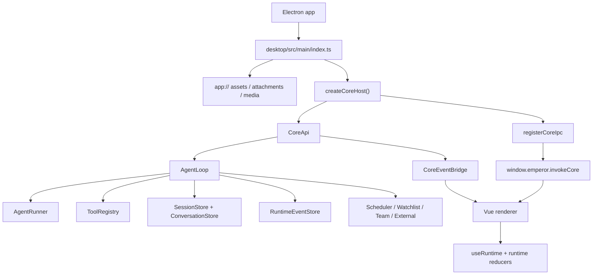
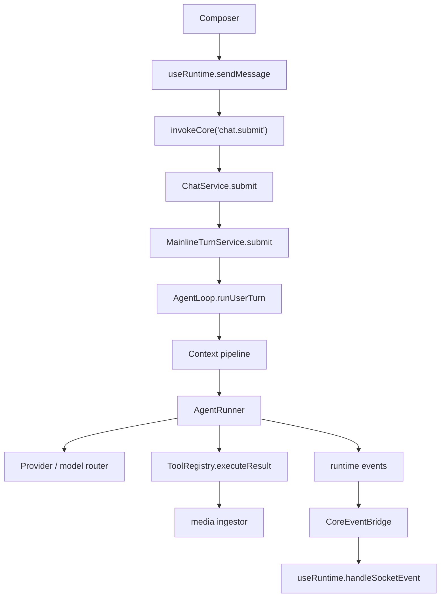

# Emperor Agent 逻辑执行文档

生成日期：2026-06-29

本文档记录当前 TypeScript / Electron 主线的 Agent 执行链路。旧 Python CLI、aiohttp Web 后端、外部 backend spawn/probe/wait 路径已经退役；如果历史设计文档仍提到 `agent.py`、`webui.py`、`agent/` 或 Python 单测，它们只作为迁移来源或兼容性对账材料存在。

## 1. 当前主线总览

Emperor Agent 现在是一个本地 Electron 应用：

- Electron main 进程进程内创建 `@emperor/core` 的 `CoreApi` 单例。
- Renderer 通过 preload 暴露的 IPC 调用 `CoreApi` operation。
- Core 内部托管 `AgentLoop`、`AgentRunner`、模型路由、工具注册、会话、记忆、Runtime events、Scheduler、Team、External、MCP。
- `app://attachments/{id}/raw` 和 `app://media/{id}/raw` 由 main 进程安全解析本地受管文件，不把任意本机路径暴露给 renderer。
- HTTP/WS helper 只保留 browser-only fallback 语义；桌面主路径不启动 Python server，也不监听 aiohttp/FastAPI 后端端口。

核心入口：

- `desktop/src/main/index.ts`：Electron main 入口、`app://` 协议、窗口与桌宠窗口。
- `desktop/src/main/core-host.ts`：创建 `CoreApi` 并注册 IPC operation。
- `desktop/src/main/event-bridge.ts`：把 core runtime event 推到 renderer。
- `desktop/src/preload/core-ipc.ts`：暴露 `window.emperor.invokeCore()` 和 runtime event 订阅。
- `packages/core/src/api/core-api.ts`：进程内 API 门面，替代旧 HTTP routes。
- `packages/core/src/api/chat-service.ts`：Chat turn 入口服务。
- `packages/core/src/agent/loop.ts`：Agent composition root。
- `packages/core/src/agent/runner.ts`：单轮模型与工具状态机。
- `desktop/src/renderer/src/composables/useRuntime.ts`：renderer runtime 状态、提交消息、事件接收与恢复。

## 2. 启动与装配

桌面启动顺序：

1. `desktop/src/main/index.ts` 读取 argv/env 并调用 `resolveConfig()`。
2. 打包态调用 `initializePackagedRuntime()`，把 `runtime-defaults` 复制到用户数据目录下的 runtime root。
3. `registerAppProtocol()` 注册 `app://`，统一处理 renderer 资源、附件原图和 media raw 文件。
4. `createCoreHost()` 调用 `CoreApi.create({ root, eventSink })`，并把 `CORE_API_ROUTE_OPERATIONS` 注册到 IPC。
5. `CoreEventBridge.attach(webContents)` 连接 runtime event 推送。
6. 创建 `BrowserWindow`，开发态加载 Vite URL，打包态加载 `app://bundle/index.html`。

当前不再存在的启动行为：

- 不 probe `/api/bootstrap` 来判断外部后端健康。
- 不 spawn `emperor-agent web`、`.venv/bin/emperor-agent` 或 packaged Python backend。
- 不使用 `EMPEROR_BACKEND_CMD` / `EMPEROR_USE_PY_BACKEND` / `--python-backend`。
- 不为生产包注入 backend base URL/token。

## 3. CoreApi 组合

`CoreApi.create()` 是桌面主路径的服务组合点：

- 创建或接收 `AgentLoop`。
- 创建 `AttachmentStore`。
- 创建 `CoreConfigService`、`CoreModelService`、`CoreDiagnosticsService`、`CoreMemoryService`、`CoreSkillService`、`CoreTeamService`、`CoreDesktopPetService`。
- 创建 `MainlineTurnService` 和 `ChatService`。
- 把 Scheduler / Watchlist / External 的后台 turn 汇入同一个 `MainlineTurnService`。
- 通过 `assertCoreMutationAllowed()` 保护需要用户授权或模式约束的 mutation。

新增 CoreApi operation 时必须同步：

- `packages/core/src/api/core-api.ts` 的 operation 和 handler。
- `desktop/src/main/core-host.test.ts` 或相关 IPC contract 测试。
- `desktop/src/preload/*` bridge 类型。
- `desktop/src/renderer/src/api/*` 映射和 renderer 类型。

## 4. Chat Turn 执行链路

用户在 Chat 中发送消息后，桌面主路径是：

1. Renderer 由 composer 收集文本、附件和请求技能。
2. `useRuntime.sendMessage()` 做本地 optimistic user bubble 和 assistant streaming bubble。
3. 有 Core bridge 时走 `invokeCore('chat.submit', payload)`；browser-only fallback 才会尝试 WebSocket。
4. `CoreApi` 调用 `ChatService.submit()`。
5. `ChatService` 调用 `MainlineTurnService.submit()`，并设置 `source='chat'`。
6. `MainlineTurnService` 必要时 `loop.activateSession(sessionId)`，然后调用 `loop.runUserTurn()`。
7. `AgentLoop` 将输入写入会话 history，构建上下文，调用 `AgentRunner`。
8. `AgentRunner` 请求模型、执行工具、处理 Ask / Plan 暂停、压缩和最终 assistant 输出。
9. 工具结果、模型增量、Ask/Plan、Scheduler/Team/Subagent 等过程通过 runtime events 持久化并推送到 renderer。

## 5. 会话、记忆与恢复

每个 session 的事实来源保存在 `memory/sessions/<id>/`：

- `history.jsonl`：会话消息历史。
- `_checkpoint.json`：未完成或可恢复 turn 的 checkpoint。
- `runtime/events.jsonl`：UI runtime 投影的事件日志。

恢复时 renderer 先请求 `bootstrap`：

- Core 激活目标 session。
- 返回历史、runtime replay、control、scheduler、team、projects、sidebar、diagnostics 等摘要。
- Renderer 通过 `replayRuntimeEvents()` 和 runtime handlers 恢复工具卡、Plan/Ask、任务、团队和调度状态。

修改 runtime event 时必须同步：

- `packages/core/src/runtime/events.ts` 或对应事件构造点。
- `desktop/src/renderer/src/types.ts`。
- `desktop/src/renderer/src/runtime/reducer.ts` 与 `runtime/handlers/*`。
- `desktop/src/renderer/src/composables/useRuntime.ts`。

## 6. 工具与 Media 产物

工具执行由 `packages/core/src/tools/*` 和 `ToolRegistry` 管理。工具结果会统一映射为 runtime event 和 model follow-up 内容。

图片类工具产物当前按 media artifact 处理：

- Core 在工具结果映射后扫描工具参数、raw/model content 和已有 artifacts 中的图片路径。
- 只导入真实存在、图片 MIME/魔数匹配、大小合规且路径安全的文件。
- 文件复制到 `memory/media/YYYY-MM/{hash8}-{safeName}`。
- Runtime event 携带 `artifact.media` 元数据。
- Renderer 通过 `app://media/{id}/raw` 内联展示图片，工具详情保留原始路径、media 类型和大小。
- 模型后续上下文会收到 `[media_artifacts]` 摘要，避免 agent 继续声称“无法显图”。

未来如果加入 audio，应沿用 `media.kind` 扩展协议；不要把工具产物混入用户上传附件 store。

## 7. 配置与诊断

本地配置文件：

- `model_config.json`：模型 provider、key、model id、上下文窗口等。
- `mcp_config.json`：MCP server 配置。
- `emperor.local.json`：本地运行偏好。
- `templates/USER.local.md`、`memory/MEMORY.local.md`：用户和长期记忆本地覆盖。

模型配置向导是用户主动选择的入口，不再在启动时强制阻塞。未配置模型时，应用仍可进入；对话或模型测试会通过诊断/错误提示引导用户配置。

诊断面板由 `CoreDiagnosticsService` 提供只读摘要，不应为了诊断自动创建或改写用户配置。

## 8. 维护检查清单

- 不要新增 Python runtime、CLI fallback、HTTP server fallback 或打包后端。
- 新增数据文件必须落在受管 `memory/`、配置文件或明确的 asset 目录，并遵守 `.gitignore`。
- 新增 `app://` 资源时必须在 main 进程做路径解析和目录约束。
- 新增 renderer API 时优先走 Core IPC；browser-only fallback 只能作为开发兼容层。
- 新增工具结果字段时同步 core 类型、runtime event、renderer projection 和工具详情 UI。
- 新增会话/记忆/Scheduler/Team/External/MCP 能力时优先放在 `packages/core/src/<domain>/`，再通过 CoreApi 暴露。
