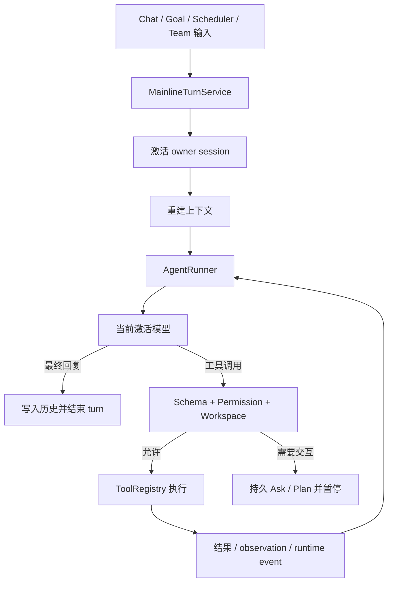

# Agent 执行链路

> 文档状态：Active<br>
> 面向读者：维护者、Agent runtime 开发者<br>
> 最后核验：2026-07-16<br>
> 事实源：`packages/core/src/agent/`、`packages/core/src/api/services/`、`packages/core/src/sessions/`、`desktop/src/renderer/src/composables/useRuntime.ts`

本文记录当前 TypeScript / Electron 主线的一次 Agent turn 如何进入 Core、构建上下文、调用模型、执行工具并持久化。旧 Python CLI、Web backend 和 HTTP / WebSocket fallback 不属于当前产品链路。

## 主链路



所有入口复用主线 turn 服务。`source` 用于区分 chat、goal、scheduler 等来源，但不会选择另一套权限系统。

## 启动与组合

Electron main 通过 `createCoreHost()` 创建 `CoreApi`，注册 IPC operation 和 event bridge。`CoreApi.create()` 组合 Agent loop、附件、配置、模型、诊断、记忆、Skill、Team、Scheduler、Goal 等服务。

主进程不会探测或启动外部 Python server，不读取 backend base URL，也不为 renderer 提供 browser-only HTTP fallback。打包态的只读资源来自 `runtimeRoot`，用户运行数据写入独立的 `stateRoot`。

## 上下文构建

每个 turn 都从 Store 重建必要上下文，而不是把 renderer 当前状态当作真相。上下文通常包括：

- 系统模板和当前日期等运行信息；
- 用户档案、全局记忆与 Build 项目的私有项目记忆；
- 当前 session 的有界对话历史与压缩摘要；
- 项目 `AGENTS.md`、workspace 与可用 Skill；
- 权限模式、pending Ask / Plan 和批准范围；
- 当前 Goal contract、phase、Plan、验收与 evidence 摘要。

上下文超出模型窗口时由 Core 压缩。压缩文本是导航摘要，不取代 session、Plan 或 Goal Store 中的权威状态。

## 模型与工具循环

当前配置允许保存多个模型条目，但全局只激活一个 `activeModelId`。Runner 使用激活条目创建 Provider 请求；没有可用模型时返回可诊断错误，不静默切换到未激活配置。

模型响应可能包含普通文本或工具调用。每次工具调用依次经过：

1. 工具名与输入 schema 校验；
2. 当前 session / Goal / Plan 上下文绑定；
3. permission pipeline 与 pending interaction 检查；
4. workspace 路径约束和工具自身安全策略；
5. 执行、结果规范化与 runtime event 投影。

`ask_user` 和 `propose_plan` 会创建可恢复 interaction。Runner 在等待用户时保存 checkpoint，不用普通 assistant 文本伪造批准。

## 会话持久化与恢复

每个 session 位于 `stateRoot/sessions/<session-id>/`：

```text
history.jsonl
_checkpoint.json
runtime/events.jsonl
prompt-snapshots/
```

`history.jsonl` 保存模型上下文需要的消息；checkpoint 描述未完成 turn 的恢复边界；runtime events 用于 renderer replay。切换 Chat / Build 或应用重启时，Core 先激活 owner session，再返回历史、control 和领域摘要。

Build 项目的 `AGENTS.md` 只读；私有 session、记忆、附件和 Goal 不写入项目源码目录。详见[全局私有存储根](global-state-store.md)。

## 附件与工具产物

用户附件先进入 AttachmentStore，再以受管引用加入模型输入。图片能否被模型读取取决于 Provider 的视觉能力。工具生成的图片等产物进入 media store；renderer 通过受限 `app://attachments/...` 或 `app://media/...` URL 展示，不能据此读取任意文件路径。

工具原始输出会经过大小和字段约束后进入历史或 event。Goal 中可作为证据的工具结果还必须由 Core 捕获为 eligible observation；普通工具卡片或模型总结不等同于 Goal evidence。

## Turn 的结束语义

- 普通 Chat / Build：assistant 最终回复表示当前 Agent turn 已结束。
- Plan：批准方案后，后续 turn 按批准步骤执行；Plan 完成表示步骤与验证要求满足。
- Goal：可以跨多个 turn；只有 Completion Gate 通过才表示结果完成。
- Ask：存在 pending interaction 时，相关 mutation 保持暂停，直到用户明确处理。

## 修改时的同步面

- 上下文项：ContextBuilder、压缩、token 预算与 prompt snapshot 测试。
- 工具结果：Core 类型、history 映射、runtime event、renderer 卡片和 Goal observation 资格。
- Session 文件：迁移、原子写入、bootstrap、删除与诊断。
- 新后台入口：必须复用 MainlineTurnService、owner session 和权限边界。
- Runtime event：按 [IPC 与 Runtime Events](ipc-and-runtime-events.md) 的清单同步。

权限决策详见[Control、Plan 与权限架构](control-and-permissions.md)。
