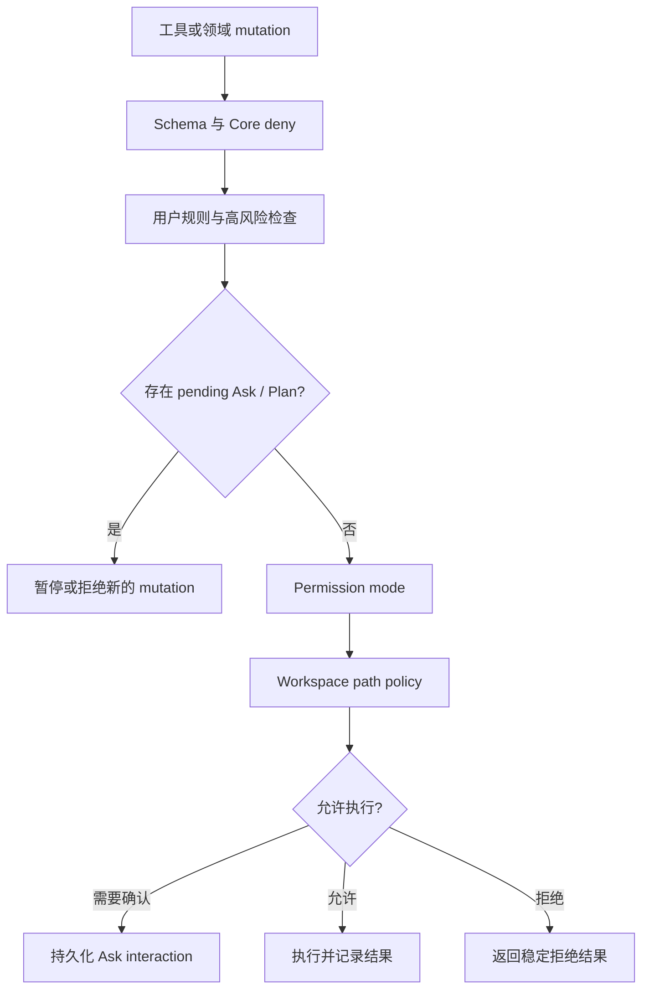

# Control、Plan 与权限架构

> 文档状态：Active 
> 面向读者：维护者、开发者 
> 最后核验：2026-07-16 
> 事实源：`packages/core/src/control/`、`packages/core/src/permissions/`、`packages/core/src/plans/`、slash command parser

Control 系统把“模型想做什么”和“Core 允许做什么”分开。界面、模型、Goal、Scheduler、Team 和 Hook 都不能自行扩大权限；最终决定由 Core 的 permission pipeline、pending interaction、workspace policy 和 mutation guard 共同完成。

## 四种内部模式

| 内部值            | Slash command              | 语义                                                                               |
| ----------------- | -------------------------- | ---------------------------------------------------------------------------------- |
| `ask_before_edit` | `/mode ask`                | 低风险读取、普通文件写入和低风险命令可直接执行；敏感路径、批量替换和高风险操作询问 |
| `accept_edits`    | `/mode edits`              | 普通文件编辑可直接执行；shell、高风险和非文件 mutation 仍按规则询问                |
| `auto`            | `/mode auto`               | 在既有安全策略内尽量继续；不能证明为只读的 shell 命令仍需批准                      |
| `plan`            | `/mode plan` 或 `/plan on` | 只读探索、询问用户和提交方案；不执行方案中的写操作                                 |

`/mode status` 查看当前权限模式；`/plan status` 查看 Plan 控制状态。命令名字相近，但 Plan 是受约束的规划阶段，不是 Goal 的别名。

## 决策顺序

用户规则和确定性高风险限制优先于模式。`auto` 不是关闭安全检查，`accept_edits` 也不是 shell 的通行证。路径操作在执行前必须 canonicalize，并受 workspace allow / deny 规则限制。

## Ask 生命周期

Ask 是持久的用户交互，不是普通 assistant 文本：

1. Core 创建带 operation、风险和上下文的 pending interaction。
2. Runner 暂停当前 turn；renderer 展示允许的选择。
3. 用户决定由 CoreApi 提交，Core 验证 interaction 与 session 的归属。
4. 一次性允许只对对应请求生效；拒绝不会被 Goal continuation 或后台任务跳过。
5. 重启后 pending interaction 仍按 Store 状态恢复。

`ask_user` 是模型向用户补充信息的交互入口；权限 Ask 则由 Core 决策产生。两者都必须通过正式 interaction 解决，不能从普通回复推断“用户已经同意”。

## Plan 生命周期

进入 Plan 时，Core 保存此前的权限模式。Plan 阶段允许只读探索、`ask_user` 和 `propose_plan`；用户批准后恢复进入 Plan 前的模式，再执行批准范围内的步骤。

Plan 保存步骤、依赖和验证要求。Plan permission token 只授权与已批准方案匹配的执行，不覆盖高风险限制、workspace policy 或新的 Ask。方案被修改、替换或失效后，旧 token 不能继续使用。

Plan 可以独立用于一次任务，也可被 Goal 绑定。Goal 中 Plan 完成只表示步骤执行完毕；Goal 还要通过 Acceptance Criteria、Evidence 和 Completion Gate。

## 领域 mutation guard

CoreApi 对 Scheduler、Team、Goal、Hooks 和其他领域 mutation 使用统一 guard。存在 pending Ask / Plan，或者当前权限不允许时，后台入口也必须暂停或拒绝。Renderer 不能通过调用另一条 operation 绕开正在等待的交互。

具体边界：

- Goal 不提高权限，恢复 Goal 也不会自动批准旧请求。
- Scheduler 到时触发的 turn 与普通 turn 使用同一套权限约束。
- Team / subagent 输出是输入或证据候选，不是授权决定。
- Hook 可以观察和提出动作，不能直接写入 Goal 终态。
- Todo、Plan 卡片和普通 assistant 最终回复都没有领域终态写权限。

## 修改时必须同步

- 权限模式：slash parser、command palette、Core 类型、持久化与用户文档。
- 新工具风险：tool metadata、permission pipeline、只读判定、测试。
- Plan 语义：Plan Store、token 验证、renderer interaction 与 Goal bridge。
- 新领域 mutation：CoreApi guard、pending interaction 行为、重启恢复与诊断。

用户操作说明见[Plan 与 Goal](../user/plan-goal.md)，执行链路见[Agent runtime](agent-runtime.md)。
