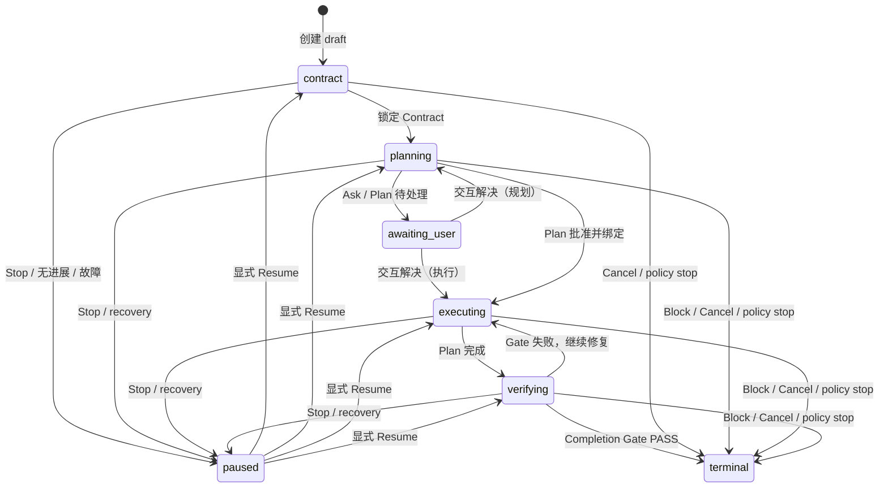

# Goal 模式架构

> 文档状态：Active<br>
> 面向读者：维护者、Goal 与 Agent runtime 开发者<br>
> 最后核验：2026-07-16<br>
> 事实源：`packages/core/src/goals/`、`packages/core/src/agent/goal-*`、Goal CoreApi 与 renderer runtime projection

Goal 模式是 Emperor Agent 的 TypeScript-only 长任务执行能力。它把“持续推进一个结果”建模为独立于单次模型回合的持久状态机，并复用现有 Session、Plan、Ask、权限、工具与 runtime event 链路。它不是 Python 教学实现的运行时移植，也不会启动 Python、HTTP 或 WebSocket fallback。

## 用户入口与边界

- 在 Chat 或 Build 会话输入 `/goal <outcome>` 创建 Goal；草稿会话会先经 CoreApi 原子 materialize，再创建 Goal。
- `/goal status` 查看当前 Goal，`/goals` 查看当前会话最近 Goal；`/goal pause` / `/goal-pause`、`/goal resume` / `/goal-resume`、`/goal cancel` / `/goal-cancel` 分别暂停、恢复和取消当前 Goal。
- 桌面端 Project Execution 面板展示 Outcome、状态/阶段、cycle、当前 Plan、验收汇总、最近 evidence/Gate 结果及合法操作。
- 每个 session 最多有一个非终态 Goal。Goal 只能读取或修改所属 session；跨 session 的 `get`、`resume` 等操作由 Core 拒绝。
- Stop 的含义是可恢复的 `paused`，Cancel 才是不可恢复的 `cancelled` 终态。应用重启不会自动恢复写操作。

Goal 不会扩大权限。`ask_before_edit`、`accept_edits`、`auto`、`plan` 的语义仍由现有 permission/control 模块决定；pending Ask/Plan、workspace policy、Plan permission token 和工具 schema 仍在 Goal 之上生效。

## 状态机

Goal 同时保存业务 `status` 与执行 `phase`：



业务状态为 `draft | active | completed | blocked | cancelled | stopped_by_policy`；执行阶段为 `contract | planning | executing | verifying | awaiting_user | paused | terminal`。`completed`、`blocked`、`cancelled` 和 `stopped_by_policy` 都不可回退。Contract 锁定后 Outcome 不可由模型、renderer 或 Hook 改写。

Coordinator 以 `goal:<goalId>` 注册一条 `ActiveTask(kind=goal)`，外层 Goal cycle 可以跨越多个 Runner `maxTurns`。第一轮用户输入可见，后续 continuation 以 `source=goal`、`uiHidden=true` 写入历史。默认不设总 cycle、时长或成本上限；显式 guard 命中时进入 `stopped_by_policy`。连续三个 cycle 没有 Goal event、Plan step、observation、evidence 或 interaction 进展时安全暂停。

## Contract、Plan 与上下文

模型只能通过五个 Goal 工具提交意图：`get_goal`、`define_goal_contract`、`record_goal_evidence`、`complete_goal`、`block_goal`。工具不接受 `goalId`、Outcome、终态、路径、hash 或工具名等权威字段；当前 Goal 从 `ToolExecutionContext.sessionId` 和 Store 推导。终态 Goal 只暴露 `get_goal`。

Contract 包含 in/out of scope、约束、required/optional acceptance criteria 和升级条件。锁定后进入 planning。GoalPlanBridge 负责 Goal 与 Plan 的完整 scope、approval generation、依赖、step verification、skip waiver、replan/supersession 和 Todo 投影；Todo 只是执行清单，不能决定 Goal 完成。

每轮模型上下文由 GoalContextBuilder 从 Store 重建，顺序固定在 Plan/control 上下文之前。首次、每五轮、阶段变化、恢复和压缩后附加完整上下文，其余使用有界 sparse 摘要；压缩摘要只提供 ID/seq 提示，不能替代 Store 真相。

## Evidence 与完成 Gate

工具完成后，Runner 把 Core 捕获的 observation 写入 `observations.jsonl`。Observation 固定绑定 Goal、turn、tool call、输入摘要、输出 SHA-256、eligibility、runtime event seq 和受管 artifact ref；模型只能引用 observation/receipt ID，不能自报路径、hash、exit code 或“已通过”。

Evidence ledger 只接受当前 Goal 的 eligible source，并验证：

- source 归属与完整性；跨 Goal source 拒绝；
- verification kind 与 command/Plan step 的精确绑定；
- PASS 不能引用 error observation；
- manual、Plan verification 与 reviewer 必须有 Core 签发的 typed receipt；
- `dispatch_subagent` 摘要、普通最终文字、Todo 状态、Plan 状态和 Stop Hook 都不构成完成证据；
- 同一 criterion 采用 latest evidence，历史 FAIL 保留审计，新的 PASS 不删除旧记录。

`complete_goal` 触发确定性的 Completion Gate。完成至少要求：Goal 为 active/verifying、Contract 已锁定、当前 Plan 完成且 step/dependency/verification/waiver 有效、每条 required AC 的 latest evidence 通过且完整、需要时独立 reviewer PASS 或明确 waiver、无 pending interaction、scope 匹配、存储健康、硬约束满足、guard 未超限。任一输入缺失或损坏都 fail closed，并返回稳定 reason code；模型文字和 renderer 都没有终态写权限。

Gate PASS 后在同一 Goal mutation/CAS 边界重读所有事实并提交 `goal_completed` 与 completion receipt。完成后的 Plan token 撤销、active run 清理、pending interaction 清理和 runtime event 发射使用持久 cleanup journal；side effect 是 at-least-once，处理器以 receipt/obligation 作为幂等键。未完成清理由启动恢复重试，失败写入 post-commit diagnostics，不回滚已经持久化的终态。

Block 同样需要 Core 持久化的 typed blocker cause 和与当前 Goal event seq 精确绑定的 blocker fact。测试失败是可修复状态，不能伪装成 terminal block；能通过 Ask 解决的问题必须先 Ask。

### 生产事实来源与可达性

Goal Gate 不接受调用方布尔值或 renderer/model 自报状态。生产链路中的事实来源如下：

| Gate 输入              | 唯一生产来源                                                                                               | 生成时机                                                     | 失效条件                                                             |
| ---------------------- | ---------------------------------------------------------------------------------------------------------- | ------------------------------------------------------------ | -------------------------------------------------------------------- |
| manual AC              | Core 创建的专用 Ask、用户持久回答、Core 签名 action receipt                                                | verifying 阶段发现缺少 manual PASS 时自动请求                | 问题、criterion、Goal 或签名不匹配                                   |
| reviewer AC / 风险复核 | `GoalReviewerExecutor` 创建的专用 reviewer Task、真实命令 observation、终态 transcript 与 reviewer receipt | reviewer AC 或风险策略要求且没有当前有效 decision 时自动调度 | Plan generation、风险 frontier、Task、observation 或 transcript 变化 |
| Plan step verification | Runner 捕获的真实工具 observation + Core Plan verification receipt                                         | 执行批准 Plan 中精确匹配的验证命令时                         | Plan、step、requirement、输入 hash 或工具结果不匹配                  |
| hard constraints       | Core 对当前 Goal 状态、owner session scope、guard policy 的即时检查                                        | 每次进入 Gate 前刷新，并在 terminal CAS 前纯读重查           | scope 丢失、Goal 非 active、cycle/deadline 超限                      |
| pending interaction    | owner session 的持久 Control store                                                                         | Ask/Plan 创建、回答或取消时                                  | 只有精确交互被解决后才清除                                           |
| blocker                | 专用 permission Ask 的用户拒绝、Core blocker cause ledger 与 blocker fact                                  | 模型声明缺少必需权限且用户明确拒绝时                         | 原因、权限请求、Goal seq 或签名不匹配                                |

Manual/reviewer/blocker 不是只存在于测试夹具里的 resolver：Coordinator 会在 verifying 阶段自动触发对应 Control/Task 链路，CoreApi 负责把用户回答转换为 typed receipt。任何来源在 Gate mutation lease 内重放时都使用只读 ledger inspection，不能启动修复性 Store mutation；否则按证据无效处理。

## 磁盘布局

所有 Goal 数据都在全局私有 `stateRoot`（默认 `~/.emperor-agent`），不会写入项目源码目录：

```text
stateRoot/goals/
  index.json                         # 可重建的 Goal 列表投影
  diagnostics.json                   # recovery / observation / delete 问题
  gate-facts.json                    # Core 签发的 Gate facts
  gate-mutations.json                # Gate 输入 mutation epoch/version
  blocker-causes.json                # typed blocker cause ledger
  blocker-facts.json                 # terminal blocker facts
  post-commit-cleanup-acks.jsonl     # cleanup acknowledgement journal
  post-commit-cleanup-claims/        # 跨进程 cleanup claim
  post-commit-diagnostics.jsonl      # 终态后副作用失败
  post-commit-diagnostics.recovery.json
  mutation-guard-recovery.jsonl
  <goal-id>/
    events.jsonl                     # hash-chained authoritative ledger
    goal.json                        # 可重建 snapshot
    observations.jsonl               # Core 工具 observation ledger
```

`events.jsonl` 是权威源，`goal.json` 和 `index.json` 是投影。Evidence、Plan binding、cycle receipt 与 terminal receipt 作为 typed event payload 保存。事件 append 先于 snapshot/index；进程在两步之间退出时，重启从 ledger 重建投影。文件和目录使用私有权限与原子写/同步策略。

每次领域事件提交完成后，GoalStore 通过 best-effort `afterCommit` 投影钩子生成 session runtime event。投影失败不会回滚已经落盘的 Goal 真相；终态清理由 cleanup journal 重试，普通投影缺口可由 CoreApi bootstrap/Goal summary 重建。Evidence ledger 只解析自身带 `kind=user_manual|plan_verification|independent_reviewer` 的 receipt，忽略同一领域事件流里的 cycle、reviewer 或 completion receipt，避免不同 typed payload 互相污染。

Session 历史、checkpoint 和 renderer runtime replay 仍分别保存在 `stateRoot/sessions/<id>/history.jsonl`、`_checkpoint.json`、`runtime/events.jsonl`。Goal store 不批量改写旧 Session 或非 Goal Plan 数据。

## 重启、故障与恢复

启动时 GoalRecoveryService 校验 event JSONL、hash chain、snapshot 和 scope：

- stale/missing snapshot 从 ledger 重建，事件不重复应用；
- event/hash/scope 异常记录 diagnostics，并把可识别的非终态 Goal 投影为 `paused/recovery_required`；在显式恢复前拒绝 append；
- 没有对应 ActiveTask 的 executing/verifying（以及带遗留 runId 的 planning）Goal 一律暂停；
- 原本 planning（无遗留 runId）或 paused 的 Goal不自动运行；
- 用户 Resume 后重新验证 session、workspace 与 project fingerprint，再创建新的 runId；旧 runId 不复用；
- shutdown 先持久化 `shutdown_recovery_required` pause，再 abort 并等待所有 Goal handle settle。

Store、Gate、Plan approval/replan、observation、pause/complete race 和 cleanup 都使用 serial mutation、expected event seq 或持久 intent/claim 处理。任何无法证明安全的中间态都暂停或拒绝完成，不会降级成普通 Chat 后继续写入。

## Runtime event 与桌面投影

Core 只发出白名单化的 Goal 事件：`goal_created`、`goal_runtime_update`、`goal_evidence_recorded`、`goal_gate_evaluated`、`goal_completed`、`goal_blocked`、`goal_paused`、`goal_resumed`、`goal_cancelled`、`goal_policy_stopped`。Payload 只包含 bounded summary、ID、计数、reason code 和 event seq，不包含原始工具输出、绝对路径、hash 或凭证。

事件永远写入 Goal 的 owner session，而不是 UI 当前激活的 session。后台 Goal turn 临时使用 owner session 的模型/Control/runtime scope；用户在执行期间切换会话时，turn 结束后恢复真实前台 scope。Goal start 使用跨实例串行保留，两个 session 并发开始时至多一个成功，另一个得到明确冲突，不会产生两个 mutation owner。

Renderer 对 live、replay 和 bootstrap 使用同一 reducer；按 `last_event_seq` 幂等，忽略旧事件，并按 session 隔离 active Goal。刷新或重连不会重复用户消息、工具调用或操作。GoalCard 的 action matrix 由 phase/status 派生：运行中可 Pause/Cancel，paused 可 Resume/Cancel，awaiting_user 只允许 Cancel，terminal 不提供动作；Cancel 需要二次确认。

## Diagnostics 与排障

优先查看以下信号：

1. `stateRoot/goals/diagnostics.json`：`event_corrupt`、`hash_chain_broken`、`snapshot_stale`、`scope_missing`、observation corruption 和 session delete failure。
2. `post-commit-diagnostics.jsonl`：Plan token、active run、pending interaction 或 runtime event 等终态后清理失败。
3. `mutation-guard-recovery.jsonl` 与 cleanup claims/acks：崩溃后的 mutation owner、claim 接管和重试轨迹。
4. Session `runtime/events.jsonl`：桌面卡片缺失或 live/replay 不一致时核对 Goal 事件 seq；事件只用于 UI 投影，不能替代 Goal ledger。
5. `CoreApi.goals.list/get` 与 `/goals`：确认当前 session 的 Store 摘要；如果 phase 为 `paused` 且 reason 为 `recovery_required` 或 `scope_mismatch`，先修复 workspace/session 绑定，再显式 Resume。

不要手工编辑 Goal JSONL、snapshot、Gate fact 或 cleanup 文件，也不要通过删除 diagnostics 强制继续。需要隔离损坏数据时保留整个 `stateRoot/goals/<goal-id>` 目录供审计；当前版本不提供把损坏 Goal 隐式转换成普通 Chat 的回退路径。
