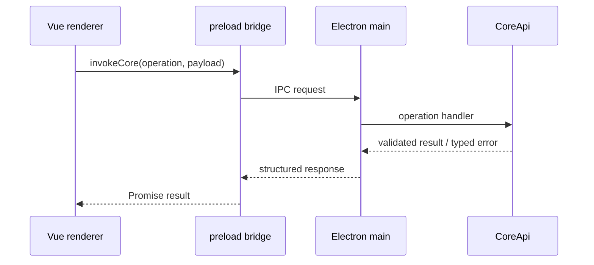

# IPC 与 Runtime Events

> 文档状态：Active 
> 面向读者：桌面端与 Core 开发者 
> 最后核验：2026-07-16 
> 事实源：`desktop/src/main/core-host.ts`、`desktop/src/preload/`、`packages/core/src/runtime/events.ts`、`desktop/src/renderer/src/runtime/`

Electron renderer 不直接导入 Core，也不访问本地 Store。同步请求通过 preload 的 Core IPC contract，异步过程通过 runtime events。两条链路共同构成桌面主路径。

## 请求链路

operation 是显式 allowlist。Renderer 传入的数据必须在 Core 边界重新校验；renderer 已校验、TypeScript 类型或隐藏按钮都不是安全边界。

## Runtime event 链路

模型增量、工具调用、Ask / Plan、Scheduler、Goal 和其他过程状态由 Core 产生 runtime event：

1. Core 生成白名单化事件并写入 owner session 的 runtime store。
2. Main 的 event bridge 把 live event 推给 renderer。
3. Renderer reducer / handler 将事件投影成卡片、消息和状态。
4. 刷新或重启时，bootstrap 返回历史与可 replay 的事件；live 与 replay 走同一处理逻辑。

事件必须带 session 归属和可用于去重的顺序信息。后台任务的事件写入任务所属 session，不能因为用户切换了当前页面而写入前台 session。

## 三类数据不要混淆

| 数据                  | 用途                             | 是否权威             |
| --------------------- | -------------------------------- | -------------------- |
| Session history       | 模型可见的对话与工具消息         | 对会话内容权威       |
| Domain store / ledger | Goal、Plan、Scheduler 等业务状态 | 对对应领域权威       |
| Runtime events        | renderer 的过程投影与恢复        | 不是领域终态的替代品 |

例如 `goal_completed` runtime event 只能在 Completion Gate 已提交终态后发出。即使投影事件暂时失败，Goal ledger 仍是事实源；Core 可在 bootstrap 时重建摘要。

## 本地资源协议

附件与 media 通过受限的 `app://` URL 读取。Main 根据受管 ID 解析 `stateRoot` 中的文件，校验目录和类型，不接受 renderer 提供任意绝对路径。普通浏览器运行模式不属于当前产品支持边界。

## 新增 operation

新增 CoreApi operation 时至少同步：

1. CoreApi operation 类型、schema 和 handler。
2. Electron main 的 operation allowlist / contract。
3. Preload bridge 的输入输出类型。
4. Renderer API 映射和调用方。
5. IPC contract、错误与权限测试。

operation 若会修改状态，还必须接入对应 permission / mutation guard，而不是只在 renderer 禁用按钮。

## 新增 runtime event

新增事件时至少同步：

1. Core event union、构造点和持久化策略。
2. Main bridge 的转发与字段过滤。
3. Renderer `types.ts`。
4. Reducer、专用 handler 和 `useRuntime`。
5. Live、replay、bootstrap、重复与跨 session 测试。

Payload 应保持有界，不包含密钥、任意绝对路径或未经筛选的工具原始输出。大对象保存在受管 Store，只在事件里传 ID 和摘要。

## 失败与恢复

- IPC 输入无效：Core 返回结构化错误，不执行部分 mutation。
- Renderer 关闭：领域执行与持久化不应依赖 DOM 生命周期。
- Live event 丢失：重连后由 bootstrap / replay 恢复。
- 重复 event：renderer 依据 session 和 seq 幂等处理。
- Domain 已提交但投影失败：保留领域真相，记录诊断并重建投影。

完整 turn 顺序见[Agent runtime](agent-runtime.md)，数据位置见[全局私有存储根](global-state-store.md)。
