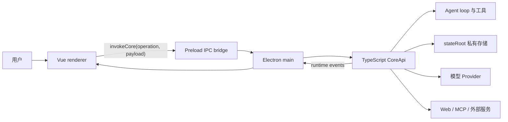

# Emperor Agent 架构总览

> 文档状态：Active 
> 面向读者：维护者、开发者、希望理解产品边界的用户 
> 最后核验：2026-07-16 
> 事实源：`packages/core/src/api/core-api.ts`、`desktop/src/main/`、`desktop/src/preload/`、`desktop/src/renderer/src/`

Emperor Agent 是本地单用户 Electron 应用。Electron main 进程内创建一个 TypeScript `CoreApi` host；Vue renderer 只能通过 preload 暴露的 IPC contract 请求 Core，并通过 runtime events 接收过程状态。当前产品主线没有 Python runtime、Python CLI、HTTP backend 或 WebSocket backend。

## 系统边界

“本地运行”指应用、Core、会话存储和工具调度位于用户设备上，不代表完全离线。模型输入会发送给用户配置的 Provider；Web、MCP 或外部消息能力被调用时，也可能连接第三方服务。

## 主要层次

| 层次             | 责任                                                   | 主要位置                                                   |
| ---------------- | ------------------------------------------------------ | ---------------------------------------------------------- |
| Renderer         | 界面、用户输入、runtime event 投影，不持有权威业务状态 | `desktop/src/renderer/src/`                                |
| Preload / IPC    | 限定 renderer 可调用的 operation 和可订阅事件          | `desktop/src/preload/`、`desktop/src/main/core-host.ts`    |
| CoreApi          | 进程内 API 门面、输入校验、服务组合与 mutation guard   | `packages/core/src/api/`                                   |
| Agent runtime    | 上下文构建、模型回合、工具执行、压缩、Ask / Plan 暂停  | `packages/core/src/agent/`                                 |
| Domain services  | Session、Memory、Scheduler、Goal、Team、MCP 等领域逻辑 | `packages/core/src/<domain>/`                              |
| Stores           | `stateRoot` 下的文件持久化、事件账本和可重建投影       | 各领域的 `store` / `repository`                            |
| Provider / Tools | 外部模型调用与受策略约束的本地或联网能力               | `packages/core/src/providers/`、`packages/core/src/tools/` |

## 一次会话请求

1. Renderer 提交 `chat.submit`，附带 session、文本、附件和可选 Skill。
2. CoreApi 校验 payload，并把请求交给 `ChatService` / `MainlineTurnService`。
3. `AgentLoop` 激活 session，从 Store 重建会话、记忆、项目规则、Plan 和 Goal 上下文。
4. `AgentRunner` 调用当前激活的模型。模型可以回复，也可以提出工具调用。
5. 工具先经过 schema、权限管线和 workspace policy；需要 Ask 或 Plan 时，本轮安全暂停。
6. Core 把历史、checkpoint 和 runtime events 写入 `stateRoot`，renderer 只消费白名单化投影。

后台入口如 Scheduler、Goal continuation 和 Team 任务会复用同一条主线 turn 服务，不拥有另一套绕过权限的 runtime。

## 权威状态与投影

系统不把 renderer、模型回复或 Todo 卡片当作权威状态：

- Session 历史和 checkpoint 由 Core 持久化。
- Plan、Ask、权限决定和 Goal 由各自 Store 管理。
- Runtime event 是界面恢复用的投影，不替代领域账本。
- Goal 只有 Completion Gate 可以写入 `completed`。
- `stateRoot` 与应用资源所在的 `runtimeRoot` 相互独立。

详细数据布局见[全局私有存储根](global-state-store.md)，Goal 的事件账本和恢复协议见[Goal 模式架构](goal-mode.md)。

## 扩展约束

- 新 Core 能力先进入对应 domain service，再由 CoreApi 暴露，不能直接把 store 暴露给 renderer。
- 新 IPC operation 需要同步 CoreApi、main contract、preload、renderer API 和测试。
- 新 runtime event 需要同步 Core 类型、renderer 类型、reducer / handler 和 replay。
- 新工具必须经过统一 registry、输入 schema、权限与 workspace policy。
- 新持久数据必须定义位置、权限、原子写入、恢复和兼容策略。
- 不恢复 Python、HTTP 或 WebSocket 的产品主链路。

具体执行清单见[扩展 Emperor Agent](../development/extending-emperor.md)。
