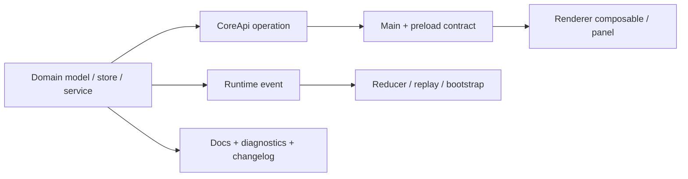

# 扩展 Emperor Agent

> 文档状态：Active 
> 面向读者：Core、Electron 与 renderer 开发者 
> 最后核验：2026-07-16 
> 事实源：当前 CoreApi / IPC / runtime event / domain service 分层与 `AGENTS.md`

Emperor Agent 的扩展通常横跨 Core、Electron contract、renderer 投影、持久化和文档。先确定权威状态属于哪个领域，再从 domain service 向外接入；不要把策略散落到组件或 prompt 文案。

## 通用顺序

1. 定义用户入口、失败语义、权限和成熟度。
2. 确定权威状态、schema、Store 位置与恢复方式。
3. 在对应 `packages/core/src/<domain>/` 实现 model / store / service。
4. 由 CoreApi 暴露最小 operation，并接入 validation 与 mutation guard。
5. 同步 Electron main contract、preload 和 renderer API。
6. 需要异步投影时增加 runtime event、reducer 和 replay。
7. 加测试、诊断、用户文档、架构文档和 changelog。

## 新 Provider 或模型字段

- 在 Provider registry / factory 增加实现，不从 renderer 拼接未经验证的 endpoint 或请求体。
- 更新 `model-config` schema、迁移、credential 解析和 availability 诊断。
- 当前模型配置契约是 schema v2：可以保存多个条目，但只有一个全局 `activeModelId`。
- 同步设置面板、测试连接、错误映射和用户模型文档。
- 不在日志、runtime event、诊断或截图中暴露 API key。

## 新工具

- 实现统一工具 contract：稳定名称、描述、输入 schema 和有界输出。
- 在 composition root 注册；声明读写性质和权限行为。
- 文件路径必须走 workspace policy；shell 需要可靠的只读判断，无法证明时按受控操作处理。
- 联网工具把外部内容视为不可信输入，不把网页或 MCP 返回值当作系统指令。
- 产物进入受管 attachment / media store，不把任意绝对路径直接交给 renderer。
- 若结果能成为 Goal evidence，还需定义 Core observation eligibility，不能让模型自报 PASS。

## 新 CoreApi operation

- Handler 只编排 service，不在 API 门面复制领域逻辑。
- 输入在 Core 边界做 runtime validation，不能只依赖 TypeScript。
- Mutation 接入 pending Ask / Plan 与领域 guard；owner session 必须明确。
- 同步 main operation allowlist、preload 类型、renderer API 和 contract test。
- 错误使用稳定 code 与安全消息，不回传堆栈、凭证或任意本机路径。

## 新 Runtime event

- 确定事件是 UI 投影，不是领域权威事实。
- Payload 有界且可序列化，包含 session 归属和去重顺序。
- 同步 Core union、main bridge、renderer `types.ts`、reducer / handler、`useRuntime`。
- 同时测试 live、replay、bootstrap、重复 event 和切换 session。
- 领域提交成功而投影失败时记录诊断，由 bootstrap 重建；不要回滚已提交终态。

## 新持久化领域

- 私有数据写入 `stateRoot`，内置只读资源写入 `runtimeRoot`；二者不能混用。
- 定义 schema 版本、原子写、文件权限、索引重建和损坏时的 fail-closed 行为。
- 需要事件账本时明确权威 ledger 与 snapshot / index 投影的关系。
- 删除 session 或项目关联时处理所属数据、后台任务和失败诊断。
- 磁盘布局变化提供只复制、不覆盖或其他明确兼容策略，并使用临时目录测试。

## 新面板或路由

- 先确认能力已有稳定 Core 入口。存在 store / service 不等于已经是用户产品。
- 遵循现有 view、panel、composable、API 和 runtime handler 分层。
- 图标统一从 `desktop/src/renderer/src/icons.ts` 映射。
- 导航、深链、空状态、错误状态、键盘操作和窄窗口都要验证。
- UI 改动运行 `npm --prefix desktop run screenshots`；只保留有意更新的基线。

## 新后台能力

Scheduler、Goal、Team、Hook、Watchlist 或 External 触发的 turn 必须：

- 使用 owner session，不写入当前前台 session；
- 复用 MainlineTurnService 和相同模型 / 工具 contract；
- 遵守 pending Ask / Plan、权限模式与 workspace policy；
- 在重启时默认不擅自恢复写操作；
- 提供暂停、取消、重试或诊断中的至少一种可控失败路径。

## 验收矩阵

| 检查面        | 最低要求                                              |
| ------------- | ----------------------------------------------------- |
| 类型与 schema | 静态类型和运行时输入校验一致                          |
| 权限          | Ask、Plan、Auto、workspace 与高风险路径均有覆盖       |
| 持久化        | 重启、重复请求、部分写入、损坏与迁移行为明确          |
| IPC           | Core、main、preload、renderer contract 同步           |
| Runtime       | live / replay / bootstrap 幂等且按 session 隔离       |
| 安全          | 不泄露凭证，不信任 renderer / model / external input  |
| 文档          | 用户入口、边界、架构与 Changelog 同步                 |
| 验证          | 相关测试、typecheck、lint、build 和 `make check` 通过 |

更细的事实源映射见[文档维护规范](../DOCUMENTATION.md)。
