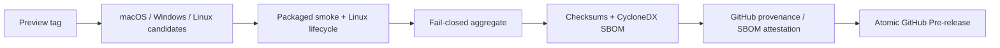

# 未签名 Preview 发布手册

> 文档状态：Active<br>
> 面向读者：发布维护者<br>
> 最后核验：2026-07-16<br>
> 事实源：`.github/workflows/release-preview.yml`、`scripts/preview-*-contract.mjs`、`scripts/publish-preview-release.sh`

当前公开安装包使用未签名 Preview 渠道。它通过独立 workflow 构建、验证和发布为 GitHub Pre-release，不应被描述为 Stable，也不能混入受信签名渠道的产物。

## 发布前条件

- 目标 commit 已进入仓库默认分支，或 Preview tag 的 commit 可从默认分支到达。
- 根目录和 desktop lockfile 已提交，`make check` 在干净环境通过。
- `CHANGELOG.md` 的 `Unreleased` 已记录用户可感知变化。
- [未签名 Preview 安全说明](unsigned-preview-notice.md)仍与当前包签名状态一致。
- 版本名不与已有 Release、tag 或包资产冲突。

## 触发方式

使用 annotated tag，格式为：

```text
v<version>-preview.<n>
```

推送 tag 后由 `.github/workflows/release-preview.yml` 自动触发。不要手工从平台 build job 创建 Release，也不要把 `UNSIGNED-PREVIEW` candidate 改名后放入 Stable 渠道。

## Workflow 阶段



平台矩阵：

- macOS arm64：unsigned DMG 与 ZIP。
- macOS x64：unsigned DMG 与 ZIP。
- Windows x64：unsigned NSIS EXE。
- Linux x64：AppImage 与 DEB，并在 Ubuntu 22.04 / 24.04 跑安装、smoke、移除生命周期验证。

每个平台先运行质量门禁、打包 smoke 并生成 candidate receipt。Aggregate job 下载所有 candidate 和 Linux lifecycle receipt，按 publication contract 检查 tag、commit、workflow run、平台矩阵、marker 与文件清单；缺少或混入意外资产时直接失败。

## 聚合与供应链材料

聚合 job 生成或验证：

- 平台安装包及 `UNSIGNED-PREVIEW` 命名；
- candidate、packaged smoke 和 Linux lifecycle receipts；
- `ARTIFACT-SHA256SUMS.txt` 与全 bundle `SHA256SUMS.txt`；
- 合并后的 CycloneDX SBOM；
- GitHub build provenance 与 SBOM attestations；
- 随 tag 渲染的未签名安全说明。

Publish job 会重新验证 contract、checksums 和 attestations，先创建 draft，再核对完整资产清单，最后发布 Pre-release。任何核验失败都不应留下部分公开 Release。

## 发布后验收

1. GitHub Release 标记为 Pre-release，标题和正文明确 `UNSIGNED-PREVIEW`。
2. 七个用户安装资产齐全：两个 macOS 架构各 DMG / ZIP、Windows EXE、Linux AppImage / DEB。
3. 安全说明、SBOM、checksum、manifest 与 receipt 资产齐全。
4. 随机下载每个平台至少一个资产，用 `SHA256SUMS.txt` 复核。
5. 使用下面的命令验证构建来源；`<file>` 替换为实际资产：

   ```bash
   gh attestation verify <file> --repo TheSyart/emperor-agent
   ```

6. README 的 Releases 入口能到达当前 Pre-release，且没有写死某个 Preview 版本。

Attestation 证明 GitHub workflow 的来源和完整性，不等于 Apple Developer ID、Apple notarization 或 Windows trusted publisher 签名。

## 用户遇到系统拦截

不要在 Release notes 或问题回复中建议关闭整机防护。让用户先核验来源和 SHA-256，再按[未签名 Preview 安全说明](unsigned-preview-notice.md)使用系统提供的单应用确认入口。官方参考：

- [Apple：Safely open apps on your Mac](https://support.apple.com/en-us/102445)
- [Microsoft：Publish your first Windows app](https://learn.microsoft.com/en-us/windows/apps/package-and-deploy/publish-first-app)

## 失败处理

- Candidate 或 receipt 缺失：修复构建或 contract，删除错误 tag 后以新的 Preview 序号重发；不要手工补资产。
- Aggregate / attestation 失败：保留 Actions 日志，查明原因后重新走完整 workflow。
- 已创建 draft 但未发布：核对资产与脚本状态；未通过 contract 不得手工公开。
- 已公开资产错误：立即撤下对应 Pre-release，记录影响，修复后发布新的 Preview；不要原地替换同名二进制。

未来受信发布流程见[Stable 发布手册](stable-release-runbook.md)，当前仍是 Frozen 渠道。
