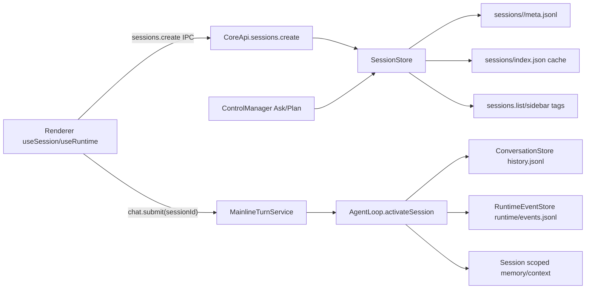
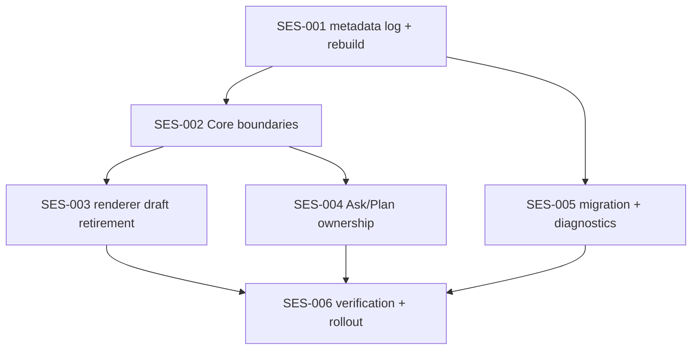

# PLAN-SES-001 · Claude Code 规则重塑 Emperor Session 体系 Implementation Plan

> **Version**: v1.0
> **Date**: 2026-07-01
> **Status**: review
> **Owner**: Emperor Agent maintainers
> **Depends On**: TypeScript/Electron migration completed; Electron-only IPC direction confirmed
> **Depended By**: Ask/Plan interaction stability, Build session reliability, sidebar session recovery, runtime replay reliability

> **For implementers**: Use `subagent-driven-development` or `executing-plans` to execute task-by-task. Write tests first, confirm RED, implement, then confirm GREEN. This plan intentionally does not change model invocation, tool execution semantics, media store, or Ask/Plan product strategy.

## 1. Overview

### 1.1 Problem Statement

Emperor currently treats `sessions/index.json` and renderer-side `draft:*` sessions as part of the effective session authority. This has caused user-visible failures: conversations disappear after restart, project/build work is written into ordinary chat sessions, stale Ask/Plan control panels remain attached to the wrong session, and first messages can silently route to the active session instead of the intended new session. Claude Code avoids this class of failures by making the session id and session transcript path an atomic Core-side fact, while list views are derived from durable transcript files. Emperor needs the same principle adapted to its TS/Electron architecture: session directory files are authoritative, central index is rebuildable cache, and renderer state is never allowed to become the persistence authority.

### 1.2 Goals

1. Every persisted session is recoverable from `memory/sessions/<id>/meta.jsonl`, `history.jsonl`, and `runtime/events.jsonl` even if `sessions/index.json` is deleted or corrupt.
2. `sessions/index.json` becomes a derived cache only; all mutating operations first update the session directory fact source, then refresh the cache.
3. `sessions.create` returns a real Core session id before the first message; `chat.submit` rejects `draft:*`, missing, or unknown UI session ids instead of writing into the active session.
4. Build sessions preserve `mode`, `project_id`, `project_path`, and `project_name` from creation through activation, restart, list, and replay.
5. Renderer local drafts are reduced to short-lived visual skeletons and never enter Core IPC for bootstrap, activation, or submit.
6. Ask/Plan pending tags and bottom panels belong only to the session that owns the control interaction.
7. Startup diagnostics expose whether session list came from cache or rebuild and how many sessions were repaired.

### 1.3 Non-Goals

- Do not restore browser HTTP/WebSocket transport; this project remains Electron-only.
- Do not reintroduce Python runtime, Python web server, or Python CLI fallback.
- Do not change model/provider routing, tool permission policy, media artifact ingestion, or Plan Mode strategy.
- Do not redesign the sidebar visual system beyond the session ownership/tag data needed for correctness.
- Do not merge project registry records with build sessions; projects remain project facts, build sessions remain conversation facts.
- Do not delete existing session data during migration except for explicit archive/delete operations requested by the user.

### 1.4 Constraints

| Type               | Constraint                                                                                                             | Reason                                     |
| ------------------ | ---------------------------------------------------------------------------------------------------------------------- | ------------------------------------------ |
| Runtime            | Electron main owns `@emperor/core`; renderer uses preload IPC                                                          | Confirmed product direction                |
| Disk compatibility | Existing `memory/sessions/index.json`, `history.jsonl`, `_checkpoint.json`, and `runtime/events.jsonl` remain readable | User data safety                           |
| Fact source        | Session directory files are authoritative; central index is cache                                                      | Matches Claude Code principle              |
| Write safety       | Metadata writes use append-only JSONL and cache writes use same-directory temp+rename                                  | Avoid partial corruption                   |
| UI safety          | `draft:*` must not reach Core bootstrap, activate, submit, or persistent sidebar state                                 | Prevent silent routing into active session |
| Testing            | Each implementation task uses TDD with RED confirmation before production edits                                        | Prevent false-positive regression tests    |
| Performance        | Listing 1,000 sessions should avoid loading full transcripts when meta cache is present                                | Sidebar must stay responsive               |
| Data scope         | `memory/` remains gitignored and never committed                                                                       | Project policy                             |

## 2. Architecture Context

### 2.1 System Boundaries

**In scope**:

- `packages/core/src/sessions/*` — session metadata, transcript migration, index rebuild, archive/delete semantics.
- `packages/core/src/api/core-api.ts` and `packages/core/src/api/chat-service.ts` — session creation, bootstrap, submit, and IPC-facing boundaries.
- `packages/core/src/agent/loop.ts` — atomic activation of `SessionEntry`, `ConversationStore`, `RuntimeEventStore`, and session-scoped memory.
- `packages/core/src/control/*` and `packages/core/src/runtime/*` — Ask/Plan ownership, runtime replay, hidden control resume messages.
- `desktop/src/renderer/src/composables/useSession.ts` — create/activate/list state, draft retirement, build session creation flow.
- `desktop/src/renderer/src/composables/useRuntime.ts` — send path session id enforcement and bootstrap session switching.
- `desktop/src/renderer/src/components/layout/SessionSidebar.vue` and sidebar projection helpers — stable rendering of chat/build entries and pending tags.
- `desktop/src/renderer/src/components/chat/*` and `desktop/src/renderer/src/views/ChatView.vue` — bottom Ask/Plan panel visibility tied to active session ownership.

**Out of scope with integration awareness**:

- `skills/` and `templates/` — no prompt or skill semantics changes.
- `desktop-pet/` — no companion session ownership changes.
- `packages/core/src/providers/*` — no provider protocol changes.
- `packages/core/src/tools/*` — no tool behavior changes except session ownership of emitted runtime events through existing loop APIs.

### 2.2 Affected Modules

| File                                                                  | Action | Description                                                                                   |
| --------------------------------------------------------------------- | ------ | --------------------------------------------------------------------------------------------- |
| `packages/core/src/sessions/store.ts`                                 | Modify | Add `meta.jsonl`, authoritative reducer, index rebuild/cache, metadata mutation helpers       |
| `packages/core/src/sessions/migrate.ts`                               | Modify | Materialize legacy Default session metadata after moving legacy `memory/history.jsonl`        |
| `packages/core/src/sessions/sessions.test.ts`                         | Modify | Add recovery, rebuild, metadata, migration, and stale tag tests                               |
| `packages/core/src/api/chat-service.ts`                               | Modify | Reject invalid UI session ids; require real session for user chat submit                      |
| `packages/core/src/api/core-api.ts`                                   | Modify | Harden `bootstrap`, `sessions.create`, `sessions.activate`, `chat.submit`, expose diagnostics |
| `packages/core/src/api/core-api.test.ts`                              | Modify | Cover session create/build metadata and bootstrap diagnostics                                 |
| `packages/core/src/api/chat-service.test.ts`                          | Modify | Cover draft/unknown/missing submit rejection and no cross-write                               |
| `packages/core/src/agent/loop.ts`                                     | Modify | Keep `activateSession()` as sole atomic switch; converge pending tags from authority          |
| `packages/core/src/agent/loop.test.ts`                                | Modify | Verify activation store switching and control ownership                                       |
| `packages/core/src/runtime/events.ts`                                 | Modify | Preserve `ui_hidden`/`source=control` handling if needed by control resume                    |
| `desktop/src/renderer/src/composables/useSession.ts`                  | Modify | Make `create()` async, call Core first, remove persistent local draft authority               |
| `desktop/src/renderer/src/composables/useSession.test.ts`             | Modify | Verify real id creation, build project metadata, failure rollback                             |
| `desktop/src/renderer/src/composables/useRuntime.ts`                  | Modify | Enforce real session id before send/bootstrap/switch; no submit for `draft:*`                 |
| `desktop/src/renderer/src/composables/useRuntime.test.ts`             | Modify | Verify send payload session id and draft rejection                                            |
| `desktop/src/renderer/src/runtime/sessionDrafts.ts`                   | Modify | Keep compatibility helpers only for transient UI skeleton and old event replacement           |
| `desktop/src/renderer/src/runtime/sidebarModel.ts`                    | Modify | Render pending tags from real `control_pending`; separate project/build/chat grouping         |
| `desktop/src/renderer/src/runtime/sidebarModel.test.ts`               | Modify | Add tag ownership and no draft persistence cases                                              |
| `desktop/src/renderer/src/components/chat/bottomControlPanel.ts`      | Modify | Ensure bottom panel only appears for active session matching pending interaction id           |
| `desktop/src/renderer/src/components/chat/bottomControlPanel.test.ts` | Modify | Cover stale pending and cross-session visibility                                              |
| `desktop/src/renderer/src/views/ChatView.vue`                         | Modify | Use active session ownership to block composer only when appropriate                          |
| `desktop/src/main/core-host.test.ts`                                  | Modify | Confirm IPC path does not permit draft session submission                                     |
| `docs/superpowers/plans/progress.json`                                | Create | Machine-readable task state                                                                   |
| `docs/superpowers/plans/check_progress.py`                            | Create | Local progress verification helper                                                            |

### 2.3 Data Flow



### 2.4 Claude Code Reference Principle

The relevant Claude Code pattern is not the exact directory name or lazy materialization timing; it is the ownership rule:

1. A session id is chosen before message writes.
2. A session path is derived from Core-side context, not the UI.
3. Transcript files are the durable truth.
4. Listing/resume scans durable files and derives display metadata.
5. UI selection does not decide where a message is persisted.

Emperor adapts this by using `memory/sessions/<id>/meta.jsonl` as a fast durable metadata log alongside existing `history.jsonl` and `runtime/events.jsonl`.

## 3. Dependency & Topology

### 3.1 Upstream Dependencies

| Plan/System                     | Status                        | Depends On                                                         |
| ------------------------------- | ----------------------------- | ------------------------------------------------------------------ |
| TypeScript migration            | complete                      | Python runtime retired; CoreApi is TS                              |
| Electron-only transport cleanup | complete enough for this plan | Renderer uses `window.emperor.invokeCore`                          |
| Ask/Plan UI work                | in working tree               | Bottom panel and sidebar tag hooks exist                           |
| Session audit finding           | accepted                      | User confirmed sessions disappear and project work leaks into chat |

### 3.2 Downstream Impact

| Plan/System              | Impact                                               | Blocked On       |
| ------------------------ | ---------------------------------------------------- | ---------------- |
| Stable Build sessions    | First build prompt routes to correct project session | SES-002, SES-003 |
| Ask/Plan polish          | Stale bottom panel and wrong sidebar tag disappear   | SES-004          |
| Future transcript search | Can index from directory fact source                 | SES-001, SES-005 |
| Session sync/export      | Can rely on self-contained session directories       | SES-001          |

### 3.3 Task Dependency Graph



### 3.4 Topological Sort

| Phase | Tasks            | Depends On                | Parallel                                                            |
| ----- | ---------------- | ------------------------- | ------------------------------------------------------------------- |
| W01   | SES-001          | None                      | Foundation task runs alone                                          |
| W02   | SES-002, SES-005 | SES-001                   | SES-002 and SES-005 can run in parallel after metadata APIs exist   |
| W03   | SES-003, SES-004 | SES-002                   | Renderer draft retirement and control ownership can run in parallel |
| W04   | SES-006          | SES-003, SES-004, SES-005 | Final verification only after all behavior changes land             |

## 4. Task Decomposition

### SES-001 · Build authoritative session metadata log and index rebuild

#### 1. Task ID + Title

`SES-001 · Build authoritative session metadata log and index rebuild`

#### 2. Purpose & Scope

- **Purpose**: Make session directory files the durable source of truth so sessions survive cache deletion/corruption and sidebar state can be rebuilt from disk.
- **Scope**: `SessionStore` metadata write/read/reduce, index cache rebuild, corrupt index quarantine, history-only recovery, archived state recovery, stable sorting.
- **Excluded**: Chat submit validation and renderer draft retirement are handled by SES-002 and SES-003.

#### 3. Source Mapping

- **Existing Emperor code**:
  - `packages/core/src/sessions/store.ts` — `SessionStore.list()` — currently reads central `index.json`.
  - `packages/core/src/sessions/store.ts` — `create()`, `rename()`, `archive()`, `restore()`, `touch()`, `setControlPending()`, `clearControlPending()` — currently mutate central index.
  - `packages/core/src/sessions/store.ts` — `quarantineIndex()` — corrupt index handling to preserve.
  - `packages/core/src/sessions/sessions.test.ts` — current session store regression suite.
  - `packages/core/src/sessions/conversation.ts` — `ConversationStore` history file shape used by recovery.
- **Claude Code reference principle**:
  - Project/session list derives from transcript files under per-project directories.
  - Session id and transcript path are Core-side facts, not UI-owned records.

#### 4. Target Specification

- **Target files**:
  - Modify `packages/core/src/sessions/store.ts`
  - Modify `packages/core/src/sessions/sessions.test.ts`
- **Public API additions**:

```typescript
export type SessionIndexSource = 'cache' | 'rebuilt'

export interface SessionStoreDiagnostics {
  sessionIndexSource: SessionIndexSource
  repairedSessions: number
  rebuildReasons: string[]
}

export interface SessionMetaSnapshotEvent {
  type: 'session_snapshot'
  ts: string
  session: SessionEntry
}

class SessionStore {
  metaPath(sessionId: string): string
  diagnostics(): SessionStoreDiagnostics
}
```

- **Disk files**:

```text
memory/sessions/<id>/meta.jsonl
memory/sessions/<id>/history.jsonl
memory/sessions/<id>/_checkpoint.json
memory/sessions/<id>/runtime/events.jsonl
memory/sessions/index.json
```

#### 5. Detailed Design

##### Data Models

```typescript
interface SessionControlPending {
  kind: 'ask' | 'plan'
  label: string
  tone: 'blue' | 'green'
  interaction_id: string
  updated_at: number
}

interface SessionEntry {
  id: string
  title: string
  created_at: string
  updated_at: string
  preview: string
  message_count: number
  title_status: string
  mode: 'chat' | 'build'
  project_id: string | null
  project_path: string | null
  project_name: string | null
  archived_at: string | null
  control_pending: SessionControlPending | null
  version: number
}

type SessionMetaEvent =
  | { type: 'session_snapshot'; ts: string; session: SessionEntry }
  | { type: 'session_deleted'; ts: string; id: string }
```

##### Key Algorithms

**Mutating write flow**:

```text
1. Load authoritative sessions with includeArchived=true.
2. Apply the mutation in memory.
3. Ensure sessions/<id>/ exists.
4. Append one JSON line to sessions/<id>/meta.jsonl:
   {"type":"session_snapshot","ts":now,"session":normalizedSession}
5. Rebuild index cache from authoritative entries.
6. Write sessions/index.json atomically via same-directory tmp + rename.
7. Return a cloned SessionEntry.
```

**Authoritative list flow**:

```text
1. Ensure memory/sessions exists.
2. Read index.json if present and parseable.
3. If index parse fails:
   a. Rename it to index.corrupt-<timestamp>.json.
   b. Mark diagnostics source as rebuilt.
4. Materialize legacy index entries:
   a. For every normalized index entry whose sessions/<id>/meta.jsonl is missing,
      create sessions/<id>/ and append a session_snapshot.
5. Scan sessions/* directories.
6. For each directory:
   a. If meta.jsonl exists, reduce events to latest non-deleted SessionEntry.
   b. Else if history.jsonl or runtime/events.jsonl exists, recover a minimal SessionEntry.
   c. Else skip empty directory.
7. Deduplicate by id; if metadata and index disagree, metadata wins.
8. Normalize every entry and sort by updated_at descending for list output.
9. Write fresh index cache.
```

**History-only recovery flow**:

```text
1. Read sessions/<id>/history.jsonl line by line.
2. Ignore malformed lines.
3. Keep rows where role is user or assistant and content is a string.
4. created_at = first valid row timestamp or current timestamp.
5. updated_at = last valid row timestamp or created_at.
6. title = first user content trimmed to title length, fallback to directory id.
7. preview = last visible message content sliced to 280 chars.
8. message_count = visible message count.
9. mode = chat; project fields = null.
10. Append recovered snapshot to meta.jsonl and include in index cache.
```

##### State Machine

| Current State    | Event       | New State          | Side Effect                                                     |
| ---------------- | ----------- | ------------------ | --------------------------------------------------------------- |
| No directory     | `create()`  | Active metadata    | Create dir, append snapshot, refresh index                      |
| Metadata exists  | `touch()`   | Metadata updated   | Append snapshot with preview/message_count                      |
| Metadata exists  | `archive()` | Archived metadata  | Append snapshot with `archived_at`                              |
| Metadata exists  | `restore()` | Active metadata    | Append snapshot with `archived_at=null`                         |
| Metadata exists  | `delete()`  | Deleted            | Append `session_deleted` if possible, remove dir, refresh index |
| Index corrupt    | `list()`    | Rebuilt cache      | Quarantine index and rebuild from directories                   |
| History-only dir | `list()`    | Recovered metadata | Derive minimal entry and append snapshot                        |

##### Invariants

1. **Directory authority**: If `sessions/<id>/meta.jsonl` has a valid latest snapshot and the directory exists, `SessionStore.list({ includeArchived: true })` returns that session unless a later delete event exists.
2. **Cache reconstructability**: Deleting `sessions/index.json` cannot delete a session from `list()`.
3. **Metadata-first mutation**: No public mutation writes a session change only to `index.json`.
4. **Archived preservation**: Archived sessions remain in `includeArchived=true` and are excluded from default `list()`.
5. **Build metadata preservation**: A build session snapshot always retains project fields unless the source session was malformed and normalized.
6. **Control pending locality**: `control_pending` is stored inside the owning session metadata snapshot.
7. **Corrupt cache safety**: Invalid `index.json` is quarantined before a new cache is written.

##### Edge Cases

| Scenario                              | Expected Behavior                                                                       |
| ------------------------------------- | --------------------------------------------------------------------------------------- |
| `index.json` missing                  | Rebuild from session directories; diagnostics source is `rebuilt`                       |
| `index.json` invalid JSON             | Rename to `index.corrupt-<timestamp>.json`, rebuild, no sessions lost                   |
| Legacy index entry has no directory   | Create directory and materialize `meta.jsonl` snapshot                                  |
| Directory has history but no metadata | Recover minimal chat entry and append snapshot                                          |
| Empty session directory               | Skip from list and record rebuild reason                                                |
| Duplicate id in index and metadata    | Metadata snapshot wins; one entry in list                                               |
| Archived session in metadata          | Hidden from default list; visible with `includeArchived=true`                           |
| Disk write fails during cache refresh | Metadata append remains; next list can rebuild cache                                    |
| Malformed line in meta.jsonl          | Ignore bad line, use latest valid snapshot; if none valid, fallback to history recovery |
| Runtime events exist without history  | Recover title from id and preview empty; keep session visible                           |

##### Compatibility

- `index.json` remains an array of `SessionEntry` for existing renderer/API consumers.
- `meta.jsonl` is append-only UTF-8 JSON Lines.
- Existing `history.jsonl` and runtime event formats are not changed.
- Existing `SessionEntry.version` remains `1`.
- Old data without `mode` is normalized to `chat`.

#### 6. Dependencies

- **Internal dependencies**: None.
- **External dependencies**: Node.js `fs` and `path`; no new npm package.

#### 7. Risk / Complexity

- **Complexity**: L
- **Risk sources**:
  1. Migration from index-authoritative code can accidentally double-count sessions.
  2. Corrupt metadata lines can break listing if parser is not line-tolerant.
  3. Rebuilding list by scanning many histories can slow startup.
  4. Atomic cache write failure can leave a stale index.
- **Mitigation strategy**:
  1. Deduplicate by session id with metadata priority.
  2. Parse JSONL line-by-line and ignore invalid lines after recording diagnostics.
  3. Read full history only when `meta.jsonl` is absent.
  4. Treat index as cache; stale or missing cache is harmless.

#### 8. Test Plan

**TDD flow**:

1. Add all tests below to `packages/core/src/sessions/sessions.test.ts`.
2. Run the target test and confirm RED.
3. Implement metadata/rebuild logic.
4. Re-run and confirm GREEN.
5. Run `npm test --workspace @emperor/core -- sessions.test.ts`.

**Test cases**:

1. Happy: `create()` creates `sessions/<id>/meta.jsonl` and `index.json`.
2. Happy: `rename()` appends a new snapshot and `list()` returns renamed title.
3. Happy: build session create/list preserves project metadata.
4. Edge: delete `index.json`; `list()` rebuilds the same sessions from metadata.
5. Edge: corrupt `index.json`; `list()` quarantines it and rebuilds.
6. Edge: history-only directory recovers title, preview, and message count.
7. Edge: archived session remains hidden by default and visible with `includeArchived=true`.
8. Error: malformed `meta.jsonl` lines do not crash listing.
9. Error: empty session directory is skipped without throwing.
10. Compatibility: legacy index entry without metadata is materialized into `meta.jsonl`.

#### 9. Acceptance Criteria

- [ ] Every public mutation writes a session snapshot before refreshing index cache.
- [ ] `index.json` can be deleted and fully rebuilt from session directories.
- [ ] Corrupt `index.json` is preserved as `index.corrupt-*.json`.
- [ ] History-only sessions remain visible after recovery.
- [ ] `control_pending` survives restart because it lives in metadata.
- [ ] `SessionStore.diagnostics()` reports source and repaired count.
- [ ] No existing session store test regresses.

#### 10. Effort Estimate

12-16 hours: 4 hours tests, 7 hours store/rebuild logic, 2 hours migration compatibility, 3 hours regression fixes.

#### 11. Status

☐ todo

#### 12. Notes

This task is the foundation. Do not start renderer draft removal until this is green.

### SES-002 · Harden Core creation, activation, and submit boundaries

#### 1. Task ID + Title

`SES-002 · Harden Core creation, activation, and submit boundaries`

#### 2. Purpose & Scope

- **Purpose**: Prevent first messages and control resumes from silently writing into the wrong active session.
- **Scope**: `CoreApi.sessions`, `CoreApi.bootstrap`, `CoreApi.chat.submit`, `MainlineTurnService.submit()`, `AgentLoop.activateSession()`, active session diagnostics.
- **Excluded**: Renderer local draft retirement is SES-003; metadata rebuild internals are SES-001.

#### 3. Source Mapping

- `packages/core/src/api/core-api.ts` — `bootstrap()` currently ignores `draft:*`.
- `packages/core/src/api/core-api.ts` — `sessions.create` currently creates a store entry and does not enforce activation semantics.
- `packages/core/src/api/chat-service.ts` — `MainlineTurnService.submit()` currently ignores `draft:*` and uses active session.
- `packages/core/src/agent/loop.ts` — `activateSession()` already performs atomic switching and should remain the single switch point.
- `packages/core/src/api/core-api.test.ts` and `packages/core/src/api/chat-service.test.ts` — API boundary tests.

#### 4. Target Specification

```typescript
interface ChatSubmitSessionPolicy {
  source: 'chat' | 'control' | 'scheduler' | 'external' | string
  sessionId: string | null
}

class MainlineTurnService {
  submit(input: MainlineSubmitInput): Promise<MainlineSubmitResult>
}
```

Decision table:

| Source      | `sessionId`   | Behavior                                                                                                 |
| ----------- | ------------- | -------------------------------------------------------------------------------------------------------- |
| `chat`      | real known id | Activate id and run turn                                                                                 |
| `chat`      | `draft:*`     | Throw `InvalidSessionError`                                                                              |
| `chat`      | empty/null    | Throw `InvalidSessionError`                                                                              |
| `chat`      | unknown id    | Throw `InvalidSessionError`                                                                              |
| `control`   | real known id | Activate id and resume                                                                                   |
| `control`   | empty/null    | Resolve owner from pending interaction metadata; throw if unresolved                                     |
| `scheduler` | empty/null    | Use scheduler-target session if supplied by payload, otherwise current active session by existing policy |
| `external`  | empty/null    | Use active session only if `ExternalBridgeService.canAcceptTurn()` allows it                             |

#### 5. Detailed Design

##### Data Models

```typescript
class InvalidSessionError extends Error {
  readonly code = 'invalid_session'
  constructor(
    message: string,
    readonly sessionId: string | null,
  ) {
    super(message)
  }
}

interface MainlineSubmitInput {
  content: string
  sessionId?: string | null
  source?: string | null
  uiHidden?: boolean | null
  emit?: MainlineEventSink | null
}
```

##### Key Algorithms

**submit session resolution**:

```text
1. Normalize source = input.source ?? "chat".
2. Normalize sessionId = trim(input.sessionId ?? "").
3. If source is "chat":
   a. If sessionId empty, throw InvalidSessionError("chat.submit requires a real sessionId").
   b. If sessionId starts with "draft:", throw InvalidSessionError("draft sessions cannot be submitted").
   c. Activate sessionId through AgentLoop.activateSession(); if unknown, propagate InvalidSessionError.
4. If source is "control":
   a. Prefer explicit sessionId when provided.
   b. Otherwise resolve pending owner using controlPendingSessionId or SessionStore.find by interaction id.
   c. Activate resolved id before run.
5. For scheduler/external:
   a. Preserve existing behavior unless payload introduces a real session id.
6. Run loop.runUserTurn only after session activation has succeeded.
```

**bootstrap session validation**:

```text
1. If opts.sessionId is empty, keep active session from loop.ensureActiveSession().
2. If opts.sessionId starts with "draft:", throw InvalidSessionError.
3. If opts.sessionId is unknown, throw InvalidSessionError.
4. Activate sessionId.
5. Reconcile control pending after activation.
6. Return bootstrap payload with session diagnostics.
```

##### Invariants

1. `chat.submit(source=chat)` never calls `runUserTurn()` without a real session id.
2. `draft:*` never reaches `AgentLoop.activateSession()`.
3. Unknown session id never falls back to current active session.
4. `activateSession()` remains the only place that swaps conversation store, runtime store, memory store, context scope, and runner.
5. Build session context is active before the first user message is appended.

##### Edge Cases

| Scenario                                      | Expected Behavior                                   |
| --------------------------------------------- | --------------------------------------------------- |
| Renderer sends `draft:abc` to `chat.submit`   | Reject with `invalid_session`, no history write     |
| Renderer sends no session id to `chat.submit` | Reject with clear error, no history write           |
| Renderer sends deleted session id             | Reject, no active session fallback                  |
| Bootstrap receives `draft:*`                  | Reject and surface error to renderer                |
| Build session first message                   | Activates build context and writes to build history |
| Control answer after restart                  | Resolves owner from metadata pending tag            |
| Scheduler turn during active user turn        | Existing active task guard remains in force         |
| External bridge turn with no active session   | Existing `canAcceptTurn()` policy gates execution   |

#### 6. Dependencies

- **Internal dependencies**: SES-001.
- **External dependencies**: None.

#### 7. Risk / Complexity

- **Complexity**: M
- **Risk sources**:
  1. Existing tests may rely on `chat.submit({content})` without session id.
  2. Scheduler/external flows may not carry session ids.
  3. Control resume has hidden UI messages that must still enter model context.
- **Mitigation strategy**:
  1. Update tests to create/activate explicit sessions for chat source.
  2. Limit strict session requirement to `source=chat` and explicit renderer paths.
  3. Add targeted control resume tests before changing logic.

#### 8. Test Plan

**TDD flow**:

1. Add failing tests in `chat-service.test.ts`, `core-api.test.ts`, and `loop.test.ts`.
2. Confirm RED for invalid session cases.
3. Implement resolution/validation.
4. Confirm GREEN and run core target suite.

**Test cases**:

1. Happy: `sessions.create({mode:'chat'})` creates real id and `chat.submit(sessionId)` writes to that session.
2. Happy: `sessions.create({mode:'build', project})` persists project metadata.
3. Happy: `bootstrap({sessionId})` activates that session and returns its history.
4. Edge: `chat.submit(sessionId:'draft:x')` rejects and active history is unchanged.
5. Edge: `chat.submit(sessionId:'missing')` rejects and active history is unchanged.
6. Edge: `chat.submit()` with source `chat` rejects missing id.
7. Error: deleted/archived id activation error is surfaced with operation context.
8. Error: bootstrap draft id rejects before side effects.
9. Compatibility: scheduler submitter still works with existing payload shape.
10. Compatibility: control resume user message can be hidden in UI while still in model history.

#### 9. Acceptance Criteria

- [ ] Chat source submits require a real known session id.
- [ ] Draft or unknown ids never write into active session.
- [ ] Build session project metadata survives create, activate, submit, restart, and list.
- [ ] `activateSession()` stays the single atomic switch point.
- [ ] Bootstrap returns `sessionIndexSource` and `repairedSessions` diagnostics.
- [ ] Existing scheduler/external flows continue passing tests.

#### 10. Effort Estimate

8-12 hours: 3 hours tests, 5 hours validation logic, 2 hours control/scheduler compatibility, 2 hours regression fixes.

#### 11. Status

☐ todo

#### 12. Notes

If strict missing-session rejection breaks a non-renderer caller, add an explicit non-chat source in that caller rather than weakening chat source safety.

### SES-003 · Retire renderer local session authority

#### 1. Task ID + Title

`SES-003 · Retire renderer local session authority`

#### 2. Purpose & Scope

- **Purpose**: Ensure renderer cannot create persistent `draft:*` sessions or send messages before Core returns a real session id.
- **Scope**: `useSession`, `useRuntime`, `App.vue` activation chain, sidebar create handlers, startup restoration.
- **Excluded**: Core session validation is SES-002; visual redesign of sidebar is outside this task.

#### 3. Source Mapping

- `desktop/src/renderer/src/composables/useSession.ts` — `create()` currently creates local drafts synchronously.
- `desktop/src/renderer/src/composables/useRuntime.ts` — `sendMessageViaCore()` currently omits session id for draft active session.
- `desktop/src/renderer/src/App.vue` — activation skips bootstrap for draft ids.
- `desktop/src/renderer/src/runtime/sessionDrafts.ts` — draft helpers and replacement of `session_created` events.
- `desktop/src/renderer/src/components/layout/SessionSidebar.vue` — new chat/build create actions.
- `desktop/src/renderer/src/appStartup.ts` — startup restoration skips drafts.

#### 4. Target Specification

```typescript
interface UseSessionState {
  sessions: Ref<SessionInfo[]>
  activeId: Ref<string>
  loading: Ref<boolean>
  creating: Ref<boolean>
}

interface CreateSessionOptions {
  title?: string
  mode?: SessionMode
  project?: ProjectInfo
}

async function create(
  options?: string | CreateSessionOptions,
): Promise<SessionInfo>
```

Renderer contract:

```text
1. New chat click calls sessions.create over Core IPC.
2. New build click resolves project, calls sessions.create with project metadata.
3. Only after Core returns real id: insert/replace sidebar row, set activeId, activate, bootstrap.
4. Composer submit is disabled while creating or when active id is missing/draft.
5. `draft:*` can remain only inside old event compatibility tests or transient skeleton state that never reaches Core.
```

#### 5. Detailed Design

##### Data Models

```typescript
interface SessionInfo {
  id: string
  title: string
  mode?: 'chat' | 'build'
  project_id?: string | null
  project_path?: string | null
  project_name?: string | null
  control_pending?: SessionControlPending | null
  draft?: boolean
}

interface SessionCreateInFlight {
  kind: 'chat' | 'build'
  projectId: string | null
  startedAt: number
}
```

##### Key Algorithms

**create session flow**:

```text
1. Set creating=true and remember in-flight kind/project id.
2. Call api('/api/sessions', POST body).
3. On success:
   a. Remove matching visual skeleton if one exists.
   b. Insert returned real session at top.
   c. Set activeId to returned id.
   d. Call activate(returned.id).
   e. Return returned SessionInfo.
4. On failure:
   a. Remove unpersisted skeleton.
   b. Keep previous active session unchanged.
   c. Surface error to caller.
5. Finally creating=false.
```

**send message guard**:

```text
1. On composer send, read active session id.
2. If no id or id starts with draft:
   a. Do not enqueue local user turn.
   b. Show "正在创建会话，请稍后再试".
   c. Return false.
3. Include exact active real id in chat.submit payload.
```

##### Invariants

1. No `draft:*` appears in `chat.submit`, `bootstrap`, `sessions.activate`, or persistent session list payloads.
2. `sessions.create` failure does not leave a sidebar row that looks persisted.
3. Build session create preserves project metadata in both Core payload and renderer state.
4. Active id after create is always the Core returned id.
5. Composer is disabled or guarded while `creating=true`.

##### Edge Cases

| Scenario                                          | Expected Behavior                                                              |
| ------------------------------------------------- | ------------------------------------------------------------------------------ |
| App starts with no sessions                       | Renderer asks Core to create Default/new chat, not local draft                 |
| User clicks new chat repeatedly                   | Second click reuses in-flight state or queues after first; no duplicate drafts |
| Project resolve succeeds but session create fails | No build row persists; previous active stays active                            |
| Session create succeeds but activate IPC fails    | Row remains, error surfaced, user can retry activation                         |
| Old `session_created` event has `client_draft_id` | Compatibility replacement works, but new flow does not depend on it            |
| User sends during create                          | Send blocked before local timeline append                                      |
| Active id missing after delete/archive            | Select next real session or create a real session                              |
| Sidebar tag exists on non-active session          | Tag visible, bottom panel hidden until activation                              |

#### 6. Dependencies

- **Internal dependencies**: SES-002.
- **External dependencies**: Vue 3 refs/computed; existing `api()` IPC helper.

#### 7. Risk / Complexity

- **Complexity**: L
- **Risk sources**:
  1. Changing `create()` from sync to async affects many call sites.
  2. Existing tests may assume immediate draft row.
  3. HMR/replay may still deliver legacy `session_created` events.
- **Mitigation strategy**:
  1. Update call sites to `await create()` explicitly.
  2. Keep `sessionDrafts.ts` compatibility helpers but remove them from main creation path.
  3. Add tests that assert no draft enters Core IPC.

#### 8. Test Plan

**TDD flow**:

1. Add failing renderer tests before editing `useSession` and `useRuntime`.
2. Confirm RED for async create and draft submit rejection.
3. Implement renderer changes.
4. Confirm GREEN with targeted renderer suite.

**Test cases**:

1. Happy: `useSession.create('新会话')` calls `sessions.create` and returns real id.
2. Happy: build create sends `mode=build` and project metadata.
3. Happy: after create success, `activeId` equals returned real id.
4. Edge: create failure leaves previous active session unchanged.
5. Edge: loading empty list creates a real Core session rather than local draft.
6. Edge: remove/archive last real session creates a new real session.
7. Error: `sendMessageViaCore()` with `draft:*` does not call `chat.submit`.
8. Error: send while active id missing does not enqueue user message.
9. Compatibility: old `session_created` with `client_draft_id` still replaces matching skeleton in tests.
10. Safety: every `chat.submit` call includes `sessionId`.

#### 9. Acceptance Criteria

- [ ] `useSession.create()` is async and Core-backed.
- [ ] No normal UI path persists a local draft session.
- [ ] Composer cannot send without a real active session id.
- [ ] Build project metadata is preserved from create through sidebar display.
- [ ] Existing startup and sidebar tests pass after async conversion.
- [ ] `draft:*` remains only in compatibility utilities/tests, not in active IPC paths.

#### 10. Effort Estimate

10-14 hours: 4 hours tests, 5 hours composable/call-site conversion, 3 hours UI state fixes, 2 hours regression cleanup.

#### 11. Status

☐ todo

#### 12. Notes

This task should be implemented with small commits or checkpoints because async API changes create broad TypeScript fallout.

### SES-004 · Bind Ask/Plan ownership to authoritative sessions

#### 1. Task ID + Title

`SES-004 · Bind Ask/Plan ownership to authoritative sessions`

#### 2. Purpose & Scope

- **Purpose**: Prevent stale Ask/Plan panels and tags from appearing in the wrong session after switching, restart, or failure.
- **Scope**: Core pending tag persistence, control resume session resolution, runtime replay ownership, renderer bottom panel gating, sidebar tag rendering.
- **Excluded**: Ask/Plan visual redesign and Plan streaming provider changes are outside this task.

#### 3. Source Mapping

- `packages/core/src/agent/loop.ts` — `setActiveSessionControlPending()`, `clearSessionControlPending()`, `reconcileSessionControlPending()`.
- `packages/core/src/control/manager.ts` — interaction lifecycle and resume APIs.
- `packages/core/src/api/core-api.ts` — `control.answerInteraction`, `commentPlan`, `approvePlan`, `cancelInteraction`.
- `desktop/src/renderer/src/components/chat/bottomControlPanel.ts` — active session check already exists and needs stricter source data.
- `desktop/src/renderer/src/composables/useRuntime.ts` — handling `ask_answered`, `plan_approved`, hidden control user messages.
- `desktop/src/renderer/src/runtime/sidebarModel.ts` — pending tag derivation.

#### 4. Target Specification

```typescript
interface ControlPendingOwnership {
  interactionId: string
  sessionId: string
  kind: 'ask' | 'plan'
  label: string
  tone: 'blue' | 'green'
  updatedAt: number
}

function activeBottomControlPanel(
  control: ControlPayload | null,
  activeSession: SessionInfo | null,
): BottomControlPanel | null
```

Ownership rules:

```text
1. When Ask/Plan enters waiting, Core writes control_pending into active session meta.
2. When Ask/Plan resolves, Core clears only the owning session tag.
3. On bootstrap/list, Core reconciles global control pending with session metadata:
   a. pending=null -> clear all tags.
   b. pending exists -> keep matching interaction tag on one session; clear all stale tags.
4. Renderer shows bottom panel only when active session control_pending.interaction_id matches control.pending.id.
5. Control resume messages use source=control and ui_hidden=true, so they do not create standalone user bubbles.
```

#### 5. Detailed Design

##### Data Models

```typescript
interface SessionControlPending {
  kind: 'ask' | 'plan'
  label: string
  tone: 'blue' | 'green'
  interaction_id: string
  updated_at: number
}

interface ControlPayload {
  mode: string
  pending: ControlInteraction | null
}

interface BottomControlPanel {
  kind: 'ask' | 'plan'
  interaction: ControlInteraction
}
```

##### Key Algorithms

**pending reconciliation**:

```text
1. Load ControlManager pending interaction.
2. If no pending:
   a. Iterate all sessions includeArchived=true.
   b. Clear any control_pending.
3. If pending exists:
   a. Build normalized summary from pending.
   b. Find session whose control_pending.interaction_id matches pending.id.
   c. If found, update summary if fields changed.
   d. If not found, use activeSessionId only if active session exists and pending originated during this runtime.
   e. Clear all non-matching control_pending tags.
4. Refresh index cache after metadata writes.
```

**control resume routing**:

```text
1. Answer/comment/approve/cancel receives interaction id.
2. Find owner session by metadata control_pending.interaction_id.
3. Activate owner session before adding hidden control resume message.
4. Emit control lifecycle event that updates existing Ask/Plan segment.
5. Do not emit visible user message for "已回答" or "批准计划".
```

##### Invariants

1. At most one visible session tag exists for a given pending interaction id.
2. Bottom Ask/Plan panel appears only in the owner session.
3. Resolving an interaction clears its session tag.
4. Hidden control resume messages remain in model history but not in visible timeline.
5. Refresh/replay cannot create duplicate Ask/Plan cards for the same interaction id.

##### Edge Cases

| Scenario                                         | Expected Behavior                                                              |
| ------------------------------------------------ | ------------------------------------------------------------------------------ |
| User switches away from session with pending Ask | Sidebar tag remains; bottom panel disappears                                   |
| User switches back to owner session              | Bottom panel reappears                                                         |
| App restarts with pending interaction            | Tag restored from meta; bottom panel appears only in owner session             |
| Global pending missing but session tag stale     | Bootstrap clears all stale tags                                                |
| Two sessions have stale same tag                 | Keep the one matching pending owner if known; clear the rest                   |
| User answers after session was archived          | Core can still resolve owner; UI list may not show archived session by default |
| Control API fails                                | Renderer refreshes control/session list and composer recovers                  |
| Hidden control user event replays                | No right-side user bubble appears                                              |

#### 6. Dependencies

- **Internal dependencies**: SES-001, SES-002.
- **External dependencies**: None.

#### 7. Risk / Complexity

- **Complexity**: M
- **Risk sources**:
  1. Control state is global while tags are per-session.
  2. Runtime replay and live events can both update the same card.
  3. Archived owner sessions create visibility ambiguity.
- **Mitigation strategy**:
  1. Treat `memory/control/state.json` as full pending authority and session metadata as lightweight owner summary.
  2. Deduplicate by interaction id in renderer projection.
  3. Do not show archived sessions by default, but Core can still clear/resolve their tags.

#### 8. Test Plan

**TDD flow**:

1. Add core ownership tests and renderer bottom panel tests.
2. Confirm RED for stale tag and cross-session panel cases.
3. Implement ownership changes.
4. Confirm GREEN with core and renderer targeted suites.

**Test cases**:

1. Happy: Ask pending writes `control_pending.kind=ask` to active session metadata.
2. Happy: Plan pending writes green plan tag to active session metadata.
3. Happy: answer clears owning session tag.
4. Happy: approve clears owning session tag and resumes owner session.
5. Edge: switching to another session hides bottom panel but leaves sidebar tag.
6. Edge: bootstrap with no global pending clears stale tags.
7. Edge: pending exists and stale tag on another session is cleared.
8. Error: control answer failure refreshes sessions/control and prevents duplicate errors.
9. Replay: hidden control user message does not render as a user bubble.
10. Replay: Ask/Plan history card updates status rather than duplicating card.

#### 9. Acceptance Criteria

- [ ] Pending tags persist in session metadata, not renderer-only state.
- [ ] Only the owner session shows the bottom Ask/Plan panel.
- [ ] Resolved interactions clear their tags immediately.
- [ ] Hidden control resume bubbles do not appear in the timeline.
- [ ] Runtime replay does not duplicate Ask/Plan cards.
- [ ] Stale pending state is converged at bootstrap and session list.

#### 10. Effort Estimate

8-12 hours: 3 hours tests, 4 hours Core ownership, 3 hours renderer replay/panel fixes, 2 hours regression work.

#### 11. Status

☐ todo

#### 12. Notes

Implement this after Core submit boundaries are stable; otherwise control resumes may still attach to the wrong active session.

### SES-005 · Add migration, repair, and diagnostics

#### 1. Task ID + Title

`SES-005 · Add migration, repair, and diagnostics`

#### 2. Purpose & Scope

- **Purpose**: Make current user data safe during rollout and make future session repair visible when it happens.
- **Scope**: One-time materialization from existing index, legacy Default migration metadata, corrupt index backup, diagnostics payload, developer logging.
- **Excluded**: Full export/import feature and archived-session UI are outside this task.

#### 3. Source Mapping

- `packages/core/src/sessions/migrate.ts` — legacy `memory/history.jsonl` migration.
- `packages/core/src/sessions/store.ts` — index materialization and diagnostics.
- `packages/core/src/api/core-api.ts` — bootstrap payload.
- `docs/migration/ts/STATUS.md` — migration status documentation if behavior note is needed.

#### 4. Target Specification

```typescript
interface SessionRepairReport {
  sessionIndexSource: 'cache' | 'rebuilt'
  repairedSessions: number
  rebuildReasons: string[]
  legacyBackupPath: string | null
}

interface BootstrapPayload {
  diagnostics: Record<string, unknown>
  sessionIndexSource: 'cache' | 'rebuilt'
  repairedSessions: number
}
```

Disk backup:

```text
memory/sessions/index.legacy-backup.json
memory/sessions/index.corrupt-<timestamp>.json
```

#### 5. Detailed Design

##### Data Models

```typescript
interface SessionMigrationState {
  legacyIndexMaterialized: boolean
  legacyBackupPath: string | null
  repairedSessions: number
  rebuildReasons: string[]
}
```

##### Key Algorithms

**legacy index materialization**:

```text
1. On first authoritative list after code upgrade, parse existing index if valid.
2. If index contains entries and at least one entry lacks meta.jsonl:
   a. Copy current index.json to index.legacy-backup.json if backup does not exist.
   b. For each entry, normalize and append sessions/<id>/meta.jsonl snapshot.
   c. Do not create build session from project registry records; only materialize actual session index entries.
3. Rebuild index cache from metadata.
4. Repeat runs are idempotent because meta.jsonl already exists.
```

**diagnostics reporting**:

```text
1. SessionStore records last list source and repaired count.
2. CoreApi.bootstrap calls SessionStore.diagnostics().
3. Return top-level `sessionIndexSource` and `repairedSessions`.
4. In development mode, Electron main logs rebuild reason and repair count.
```

##### Invariants

1. Migration is idempotent: running startup twice does not append duplicate effective sessions.
2. Current Default session remains Default if it existed in index.
3. Project registry entries are not converted into build sessions.
4. Corrupt index backups are never overwritten by a later corrupt file with the same name.
5. Diagnostics describe repairs but do not block startup.

##### Edge Cases

| Scenario                                               | Expected Behavior                                                  |
| ------------------------------------------------------ | ------------------------------------------------------------------ |
| Current data has only Default in index                 | Default gets `meta.jsonl` and remains chat                         |
| Current data has project registry but no build session | No fake build session created                                      |
| Index valid but one session dir missing                | Directory is created and metadata materialized                     |
| Index valid but duplicate ids                          | First normalized entry materialized; duplicate skipped with reason |
| Index corrupt and no session dirs                      | Quarantine index; list returns empty; Core may create Default      |
| `index.legacy-backup.json` already exists              | Do not overwrite                                                   |
| History message count disagrees with index             | Recovered metadata uses history count when rebuilding from history |
| Preview missing in index                               | Recover from latest history message if available                   |

#### 6. Dependencies

- **Internal dependencies**: SES-001.
- **External dependencies**: None.

#### 7. Risk / Complexity

- **Complexity**: M
- **Risk sources**:
  1. Current user data may already contain mixed chat/project content in Default.
  2. Repair diagnostics can be noisy if every list rewrites index.
  3. Backup creation can fail on permission errors.
- **Mitigation strategy**:
  1. Do not split existing mixed history automatically; preserve data and fix future routing.
  2. Only set `sessionIndexSource=rebuilt` when a real rebuild/materialization happens.
  3. Backup failures do not prevent metadata materialization; error is recorded in diagnostics.

#### 8. Test Plan

**TDD flow**:

1. Add migration fixture tests before production changes.
2. Confirm RED for backup/materialization/diagnostics.
3. Implement migration diagnostics.
4. Confirm GREEN and run core tests.

**Test cases**:

1. Happy: valid legacy index creates `index.legacy-backup.json`.
2. Happy: valid legacy index materializes `meta.jsonl`.
3. Happy: bootstrap returns `sessionIndexSource` and `repairedSessions`.
4. Edge: running migration twice does not duplicate sessions.
5. Edge: current Default history remains a chat session.
6. Edge: project registry data does not create build session.
7. Error: corrupt index is quarantined and diagnostic reason is recorded.
8. Error: empty session dir does not crash migration.
9. Compatibility: legacy `memory/history.jsonl` migration creates Default metadata.
10. Compatibility: message_count and preview are corrected from history during recovery.

#### 9. Acceptance Criteria

- [ ] Existing index entries are materialized into session metadata.
- [ ] `index.legacy-backup.json` preserves pre-upgrade cache when materialization happens.
- [ ] Corrupt index is isolated and startup continues.
- [ ] Bootstrap exposes session repair diagnostics.
- [ ] Migration is idempotent.
- [ ] Project records are not mistaken for build sessions.

#### 10. Effort Estimate

6-10 hours: 3 hours tests, 4 hours migration/diagnostics, 2 hours documentation/update.

#### 11. Status

☐ todo

#### 12. Notes

Do not attempt automatic conversation splitting for old polluted Default history; that is a separate user-facing migration feature.

### SES-006 · Verify, document, and prevent regressions

#### 1. Task ID + Title

`SES-006 · Verify, document, and prevent regressions`

#### 2. Purpose & Scope

- **Purpose**: Prove the new session system works end-to-end and document how to validate it manually.
- **Scope**: Core/desktop quality gates, Electron manual script, session corruption recovery checks, button usability checks for pause and Ask/Plan actions.
- **Excluded**: Publishing release notes and GitHub PR creation are outside this implementation plan unless the user asks later.

#### 3. Source Mapping

- `README.md` — local run instructions.
- `docs/migration/ts/STATUS.md` — TS migration status note.
- `desktop/src/renderer/src/components/chat/Composer.vue` — stop button emits `stop`.
- `desktop/src/renderer/src/composables/useAppContext.ts` and `useRuntime.ts` — `stopActive()`/`chat.stopRuntime`.
- `desktop/src/main/core-host.test.ts` — IPC contract checks.
- `packages/core/src/api/core-api.test.ts` — end-to-end CoreApi tests.

#### 4. Target Specification

Create or update a manual verification note inside the plan results section rather than adding a separate product document unless implementation reveals a need. Verification commands:

```bash
npm test --workspace @emperor/core
npm run typecheck --workspace @emperor/core
npm --prefix desktop run test
npm --prefix desktop run typecheck
npm --prefix desktop run lint
git diff --check
```

Manual Electron scenarios:

```text
1. Launch Electron desktop app.
2. Create normal chat session; send first message; verify history path.
3. Create build session from project; send first message; verify project group and metadata.
4. Delete sessions/index.json; restart; verify sessions recover.
5. Trigger Ask; switch sessions; verify tag and bottom panel ownership.
6. Trigger Plan; approve/comment; verify no stale panel remains.
7. Start long command; press stop; verify `chat.stopRuntime` cancels active task.
```

#### 5. Detailed Design

##### Data Models

```typescript
interface ManualAcceptanceRecord {
  scenario: string
  expected: string
  evidencePath?: string
}
```

##### Key Algorithms

**manual recovery check**:

```text
1. Create two sessions, one chat and one build.
2. Send one message in each.
3. Quit Electron.
4. Move memory/sessions/index.json to a temp backup.
5. Relaunch Electron.
6. Confirm both sessions appear in expected groups.
7. Confirm new index.json was rebuilt.
8. Restore backup only if needed for investigation; normal path keeps rebuilt cache.
```

**pause button check**:

```text
1. Start a turn that runs a slow command or long model response.
2. Confirm composer busy state shows stop affordance.
3. Click stop.
4. Verify Core receives `chat.stopRuntime`.
5. Verify active task list no longer contains the turn task.
6. Verify UI exits busy state without losing session id.
```

##### Invariants

1. Full verification cannot pass if any planned task skipped RED/GREEN.
2. Manual acceptance must use Electron window, not browser fallback.
3. Stop button remains clickable while other composer controls are disabled.
4. Rebuilt sessions have the same ids as pre-restart sessions.
5. No final result can be marked done while `check_progress.py` reports pending tasks.

##### Edge Cases

| Scenario                                                                | Expected Behavior                                                       |
| ----------------------------------------------------------------------- | ----------------------------------------------------------------------- |
| `npm --prefix desktop run test` includes existing unrelated dirty tests | Record failing test name and decide whether it is in scope              |
| Electron starts with no model config                                    | Onboarding/config flow remains user-chosen, no forced config            |
| Session recovery works but preview differs                              | Accept if title/id/history correct; create follow-up for preview polish |
| Stop button clicked when no active task                                 | No crash; cancelled list empty                                          |
| `git diff --check` fails from existing unrelated files                  | Report file paths and do not claim clean                                |
| Manual Ask/Plan unavailable because model not configured                | Use mocked/unit tests as evidence and state manual gap                  |

#### 6. Dependencies

- **Internal dependencies**: SES-003, SES-004, SES-005.
- **External dependencies**: Local npm install, Electron dev runtime, configured model for real manual chat.

#### 7. Risk / Complexity

- **Complexity**: M
- **Risk sources**:
  1. Full desktop suite may expose unrelated dirty worktree failures.
  2. Manual model-dependent paths can fail due to provider config.
  3. Session recovery tests can mutate local `memory/`.
- **Mitigation strategy**:
  1. Separate targeted failures from broad-suite unrelated failures in final report.
  2. Use unit/integration tests for deterministic validation; manual model run only when configured.
  3. Manual destructive checks use a copied temp memory root or explicit backup/restore.

#### 8. Test Plan

**TDD flow**:

1. Add missing regression tests for stop button and no-draft IPC.
2. Confirm RED before wiring behavior.
3. Implement verification fixes.
4. Confirm GREEN and run full gates.

**Test cases**:

1. Happy: full core test suite passes.
2. Happy: full desktop test suite passes.
3. Happy: typecheck passes for core and desktop.
4. Happy: lint passes for desktop.
5. Edge: deleting `index.json` and relaunching test root recovers sessions.
6. Edge: stop button remains enabled during busy state.
7. Edge: mode/model buttons are disabled during busy while stop works.
8. Error: draft submit IPC test fails if `draft:*` reaches Core.
9. Error: session create failure does not leave stale sidebar row.
10. Manual: build session first message persists under build session directory.

#### 9. Acceptance Criteria

- [ ] All listed quality gates are run and results recorded.
- [ ] Manual Electron session recovery scenario passes or blocker is documented with evidence.
- [ ] Pause button invokes `chat.stopRuntime` while busy.
- [ ] No draft session id appears in Core IPC traces.
- [ ] `check_progress.py` returns zero only when all tasks are complete.
- [ ] Final implementation report includes changed files, tests, and known residual risks.

#### 10. Effort Estimate

6-8 hours: 2 hours additional tests, 2 hours manual validation, 2 hours fixing verification fallout, 2 hours documentation.

#### 11. Status

☐ todo

#### 12. Notes

This task is the release gate. It should not be started until implementation tasks are functionally green.

## 5. Risk Register

| ID  | Severity | Description                                                               | Affected Tasks   | Probability | Mitigation                                                                              |
| --- | -------- | ------------------------------------------------------------------------- | ---------------- | ----------- | --------------------------------------------------------------------------------------- |
| R1  | H        | Incorrect migration could hide existing user conversations                | SES-001, SES-005 | Medium      | Metadata append-only, index backup, directory scan recovery tests, no destructive split |
| R2  | H        | Strict submit validation could break scheduler/external/control flows     | SES-002          | Medium      | Apply strict requirement to `source=chat`; add scheduler/control compatibility tests    |
| R3  | H        | Renderer async create conversion could leave UI without an active session | SES-003          | Medium      | Add creating state, failure rollback, no-send guard, startup empty-list tests           |
| R4  | M        | Listing many history-only sessions could slow startup                     | SES-001, SES-005 | Low         | Read full history only when metadata is missing; write metadata after recovery          |
| R5  | M        | Stale Ask/Plan pending could survive in old metadata                      | SES-004          | Medium      | Bootstrap convergence clears all tags when global pending is null                       |
| R6  | M        | Existing dirty worktree may make full verification noisy                  | SES-006          | High        | Keep task-scoped diffs, report unrelated failures separately, never revert user changes |
| R7  | L        | Diagnostics fields may expose internal rebuild reasons in UI              | SES-005          | Low         | Keep details in diagnostics payload/dev log; user UI can show only concise status       |

## 6. Receipt Verification

### 6.1 Startup Verification

- [ ] Electron app starts through desktop runtime without browser fallback.
- [ ] CoreApi bootstrap succeeds with a real active session.
- [ ] First chat message in a new chat writes to that new chat session.
- [ ] First build message in a project build session writes to that build session and uses project scoped memory/context.
- [ ] Deleting `memory/sessions/index.json` and restarting rebuilds sidebar sessions from directories.

### 6.2 Functional Completeness Verification

- [ ] `SessionStore.list()` returns consistent entries for cache, missing index, corrupt index, legacy index, and history-only directories.
- [ ] `chat.submit` rejects `draft:*`, missing chat session id, and unknown session id.
- [ ] Renderer create flow receives a real id before send is enabled.
- [ ] Build sessions keep project metadata across create, activate, restart, list, and submit.
- [ ] Ask/Plan pending tag appears only on the owner session.
- [ ] Bottom Ask/Plan panel appears only in the owner session.
- [ ] Hidden control resume messages do not render as visible user bubbles.
- [ ] Pause button cancels active runtime task.

### 6.3 Quality Verification

- [ ] `npm test --workspace @emperor/core`
- [ ] `npm run typecheck --workspace @emperor/core`
- [ ] `npm --prefix desktop run test`
- [ ] `npm --prefix desktop run typecheck`
- [ ] `npm --prefix desktop run lint`
- [ ] `git diff --check`

### 6.4 Anti-Stub Verification

- [ ] No fake session ids are generated to satisfy tests.
- [ ] No renderer-only cache is treated as successful persistence.
- [ ] No test bypasses `CoreApi` for create/submit ownership checks when validating product behavior.
- [ ] No implementation silently catches submit/activation errors and continues with active session.

## 7. Verification Strategy

### 7.1 Targeted Core Commands

```bash
npm test --workspace @emperor/core -- sessions.test.ts
npm test --workspace @emperor/core -- chat-service.test.ts core-api.test.ts loop.test.ts
npm run typecheck --workspace @emperor/core
```

### 7.2 Targeted Desktop Commands

```bash
npm --prefix desktop run test -- src/renderer/src/composables/useSession.test.ts src/renderer/src/composables/useRuntime.test.ts
npm --prefix desktop run test -- src/renderer/src/components/chat/bottomControlPanel.test.ts src/renderer/src/runtime/sidebarModel.test.ts
npm --prefix desktop run test -- src/main/core-host.test.ts
npm --prefix desktop run typecheck
```

### 7.3 Manual Acceptance Checklist

1. Launch Electron desktop app.
2. Create a normal chat session and send a first message.
3. Verify the first message appears only in `memory/sessions/<chat-id>/history.jsonl`.
4. Create a project build session and send a first message.
5. Verify the build session metadata contains project id/path/name.
6. Quit app, move `memory/sessions/index.json` aside, relaunch.
7. Verify both sessions appear and the index is rebuilt.
8. Trigger Ask, switch away, confirm tag remains but bottom panel hides.
9. Switch back, answer Ask, confirm tag clears and no visible "已回答" user bubble appears.
10. Trigger Plan, comment or approve, confirm one timeline Plan card and no stale bottom decision panel.
11. Start a long-running task, click pause/stop, confirm task stops.

## 8. Progress Tracking

Progress is tracked in `docs/superpowers/plans/progress.json`. A task is complete only after its tests have shown RED before implementation and GREEN after implementation.

| Task    | Status | Notes                               |
| ------- | ------ | ----------------------------------- |
| SES-001 | ☐ todo | Metadata log and rebuild foundation |
| SES-002 | ☐ todo | Core boundaries                     |
| SES-003 | ☐ todo | Renderer draft retirement           |
| SES-004 | ☐ todo | Ask/Plan ownership                  |
| SES-005 | ☐ todo | Migration and diagnostics           |
| SES-006 | ☐ todo | Verification and rollout            |

Run:

```bash
python3 docs/superpowers/plans/check_progress.py
```

The script exits non-zero while any task is not `done`.

## 9. Self-Review

- [x] Every requirement in the user plan maps to at least one task.
- [x] Every task has 12 fields and a TDD flow.
- [x] Every task has at least 8 test cases.
- [x] Acceptance criteria are binary checklists.
- [x] Dependency topology covers all tasks.
- [x] Receipt verification covers startup, quality, functional completeness, and anti-stub gates.
- [x] No implementation code is changed by this planning document.
