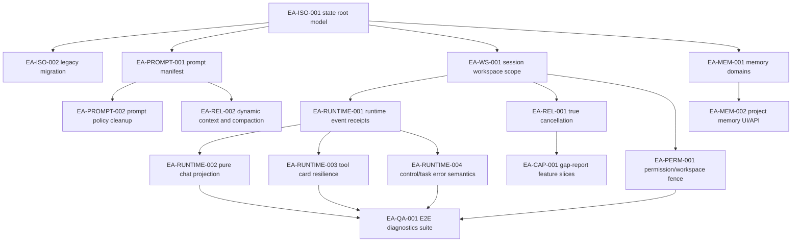

# PLAN-EA-ISO-001 · Emperor Agent 系统提示词、记忆隔离与 Runtime 稳定性升级计划

> **Version**: v1.0
> **Date**: 2026-07-02
> **Status**: planning
> **Owner**: Emperor Agent maintainers
> **Progress File**: `docs/superpowers/plans/2026-07-02-emperor-agent-system-isolation-and-runtime-hardening.progress.json`
> **Check Script**: `docs/superpowers/plans/2026-07-02-emperor-agent-system-isolation-and-runtime-hardening.check_progress.py`
> **Reference**: `/Users/anhuike/Desktop/emperor-agent-vs-claude-code-架构差距报告-2026-07-01.md`

## 1. 结论先行

本计划把用户反馈的三类问题作为同一个系统边界问题处理：

1. **系统提示词没有可审计清单**：`ContextBuilder` 会组合 `SOUL.md`、`TOOL.md`、`USER.local.md`、`identity.md`、记忆、项目 AGENTS、skills summary 和 Control Mode prompt，但目前没有 per-turn manifest，也没有 UI 能直接解释“这轮到底用了哪些提示词和记忆来源”。
2. **运行态数据和工作区语义混在一起**：`root` 同时被用作 runtime 根、配置根、memory 根、默认工具根、技能根；`ProjectStore` 还会直接在用户项目目录创建或改写 `AGENTS.md` 的托管记忆块。Build session 一旦 project path、workspace root 或 active session 绑定错误，就会出现“空工作区读取旧项目内容”的表现。
3. **Chat runtime UI 缺少单一投影事实源**：后端 runtime event 有 `seq`，但前端 `useRuntime.ts` 仍承担提交、流式、重放、快照、错误、工具卡片、Ask/Plan、Team/Subagent 等多重职责。文本 transcript 匹配不足以恢复工具段和控制段，容易造成工具卡片渲染失败、部分 chat 丢失、重复或莫名的 Internal error。

核心方向：

- 引入 **`.emperor` state root**，位于 Emperor runtime root 内，不位于用户项目目录内。用户项目目录只作为 `workspaceRoot`，除非用户明确让 agent 编辑项目文件，否则不写入运行态记忆、会话、token、runtime events、team state。
- 把 **prompt sources、memory sources、workspace scope、session scope** 都做成显式 manifest，并随每轮 turn 生成可审计快照。
- 把 **runtime events 作为 UI 的结构化事实源**，前端通过纯 reducer/idempotent projection 恢复消息和工具卡片，不再靠文本 transcript 猜测结构化状态。
- 优先实现架构差距报告中的 P0/P1：真实取消、动态 context window、compaction 失败隔离、任务取消状态、权限/工作区 fence、runtime replay 与 UI 投影稳定性。

## 2. 当前链路梳理

### 2.1 系统提示词链路

当前主要拼装点：

| 来源                                                  | 当前代码                                                    | 作用域        | 风险                                                                                   |
| ----------------------------------------------------- | ----------------------------------------------------------- | ------------- | -------------------------------------------------------------------------------------- |
| `templates/SOUL.md`                                   | `ContextBuilder.BOOTSTRAP_FILES`                            | 全局          | 强制人格前缀，技术排障和普通聊天中容易显得突兀                                         |
| `templates/TOOL.md`                                   | `ContextBuilder.BOOTSTRAP_FILES`                            | 全局          | 仍描述旧式工具偏好，需和 TS 工具协议对齐                                               |
| `templates/USER.local.md` 或 `templates/init/USER.md` | `ContextBuilder.bootstrapPath()` + `ensureUserFile()`       | 全局用户档案  | 当前写在 `templates/`，不应继续作为 runtime 私有数据位置                               |
| `templates/agent/identity.md`                         | `ContextBuilder.renderTemplate()`                           | 全局/会话     | 文案仍写 `memory/MEMORY.local.md`、`templates/USER.local.md`，与目标 `.emperor` 不一致 |
| Chat 长期记忆                                         | `ContextBuilder.buildSections()`                            | Chat session  | 全局记忆和项目 index summary 同时注入，缺少 source manifest                            |
| Build 项目 AGENTS                                     | `ContextBuilder.buildSections()`                            | Build session | 当前来自用户项目 `AGENTS.md`，且 `ProjectStore` 会写托管块                             |
| Skills summary                                        | `FileSkillsLoader.summary()`                                | 全局          | 全量 summary 注入但没有 token budget/report                                            |
| Control prompt                                        | `ControlManager.systemPrompt()` in `AgentRunner.askModel()` | 每轮动态      | 无快照，Plan/Ask 状态跨 session 归属需继续收紧                                         |
| Clarification prompt                                  | `AgentRunner.askModel()`                                    | 每轮动态      | 作为临时段拼接，缺少 manifest                                                          |
| Subagent/Team prompts                                 | `templates/subagents/*`、`teamPrompt()`                     | 子运行体      | workspaceRoot 继承已开始修补，但需纳入 scope receipt                                   |

需要新增：`PromptManifest`，记录每段 name/source/version/priority/budget/charCount/hash/scope/sessionId/projectId/turnId，并在 diagnostics 和开发 UI 中可查看。

### 2.2 记忆、会话与工作区链路

当前关键点：

| 领域                         | 当前位置                             | 当前代码                                   | 主要问题                                                 |
| ---------------------------- | ------------------------------------ | ------------------------------------------ | -------------------------------------------------------- |
| 全局长期记忆                 | `memory/MEMORY.local.md`             | `MemoryStore`                              | 与会话目录同级，仍在 runtime root 直接暴露               |
| 用户档案                     | `templates/USER.local.md`            | `ensureUserFile()`                         | 私人运行数据写在模板目录，不符合 runtime state 隔离      |
| Session history              | `sessions/<id>/history.jsonl`        | `ConversationStore`                        | 已独立，但仍在 runtime root 直下                         |
| Session runtime events       | `sessions/<id>/runtime/events.jsonl` | `RuntimeEventStore(...sessionDirOverride)` | 有 seq，但归档 replay API 和 UI 投影不足                 |
| Project index                | `memory/projects/index.json`         | `ProjectStore`                             | 存在 runtime root，但 project memory 写回用户项目 AGENTS |
| Project memory               | 用户项目 `AGENTS.md` managed block   | `ProjectStore.ensureAgents/updateMemory`   | 会污染用户项目，且容易把项目源代码与 agent 运行态混淆    |
| Attachments/media            | runtime root 下的 attachments/media  | `AttachmentStore`、`MediaStore`            | 需要确认 `.emperor` 迁移后的 `app://` 协议路径           |
| Team/tasks/scheduler/control | runtime root 下分散目录              | 多个 Store                                 | 需要统一 state root，避免默认写进 workspace              |
| 工具工作区                   | `ctx.workspaceRoot ?? ctx.root`      | `ToolRegistry`、工具类                     | 已修过一轮，但需要 schema 化和 diagnostics 证明          |

目标分离：

```text
runtimeRoot/
  templates/                  # 默认模板和技能资产，非私人运行数据
  skills/
  assets/
  model_config.json           # 现阶段保持兼容，后续可迁入 .emperor/config
  mcp_config.json
  .emperor/
    manifest.json
    config/
    memory/
      global/MEMORY.local.md
      user/USER.local.md
      episodes/YYYY-MM-DD.md
      versions/
    projects/<projectId>/
      project.json
      AGENTS.local.md          # agent 私有项目记忆和规则，不写用户项目
      prompt-overlay.md
      index.json
    sessions/<sessionId>/
      meta.jsonl
      history.jsonl
      _checkpoint.json
      runtime/events.jsonl
      runtime/archive/
      prompt-snapshots/<turnId>.json
      scope.jsonl
    attachments/
    media/
    tokens/tokens.jsonl
    scheduler/
    team/
    tasks/
    control/
    diagnostics/
```

命名说明：

- `runtimeRoot`：Electron packaged runtime 根，目前由 `desktop/src/main/runtime-root.ts` 提供。
- `stateRoot`：`join(runtimeRoot, '.emperor')`，所有私人运行态数据默认进入这里。
- `workspaceRoot`：用户选择的项目源码目录，只能通过 Build session 或显式工具参数进入。
- `sessionRoot`：`stateRoot/sessions/<sessionId>`。
- `projectStateRoot`：`stateRoot/projects/<projectId>`。

### 2.3 Chat runtime UI 链路

当前关键点：

| 领域             | 当前代码                                                   | 风险                                                                        |
| ---------------- | ---------------------------------------------------------- | --------------------------------------------------------------------------- |
| 后端事件         | `packages/core/src/runtime/events.ts`、`RuntimeEventStore` | 事件 schema 多为宽松 `Record<string, unknown>`，缺少 receipt/owner 字段约束 |
| Bootstrap replay | `CoreApi.bootstrap()`                                      | 只取 active turn events，archive/cross-session replay 不完整                |
| 前端投影         | `desktop/src/renderer/src/composables/useRuntime.ts`       | 一个 composable 处理太多副作用，难以证明 idempotent                         |
| Reducer          | `desktop/src/renderer/src/runtime/reducer.ts`              | 目前只是排序后 dispatch，没有真正纯投影                                     |
| Snapshot         | `desktop/src/renderer/src/runtime/snapshot.ts`             | 主要用 transcript 文本匹配，结构化 segments 可能丢失                        |
| 工具卡片         | `useRuntime.ts` + `toolStatus.ts`                          | queued/started/result/run-completed 混合，未知或缺结束事件时需要统一降级    |
| Internal error   | `desktop/src/main/ipc.ts` + `useRuntime.ts`                | 已修 TurnPaused/CancelledTaskError 一轮，但需要 task/control 语义全链路固化 |

## 3. 非目标

- 不恢复 Python runtime，不新增 Python Web/CLI fallback。
- 不把用户项目目录作为 agent 私有状态目录；即使有 `.emperor`，也放在 Emperor runtime root 内。
- 不照搬 Claude Code 的 TUI、Anthropic 专属协议、企业 telemetry 或内部 coordinator。
- 不一次性重写所有模块；每个任务必须有回归测试和迁移策略。
- 不自动删除历史 `memory/` 或用户项目 `AGENTS.md` 托管块；迁移先读入并停止继续写，清理需要单独用户确认。

## 4. 架构约束与验收总线

### 4.1 隔离不变量

1. 每个 turn 在开始时固定 `sessionId`、`projectId`、`workspaceRoot`、`stateRoot`、`sessionRoot`，后续 active session 切换不得影响 in-flight turn。
2. Chat session 默认 `workspaceRoot = runtimeRoot` 或一个明确的 scratch workspace，不继承最近 Build project。
3. Build session 的工具 `workspaceRoot` 只来自该 session 绑定的 `project_path`。
4. Project memory 不再写用户项目 `AGENTS.md`；读取用户项目已有 `AGENTS.md` 只能作为 workspace facts 或显式 external project instructions。
5. 所有 runtime events 带 `session_id`、`turn_id`、`seq`；涉及 project/tool/task/control 时带 owner 字段。
6. UI 只从 session-owned runtime events 和 history 重建当前 session，不从全局 active task 猜测消息归属。
7. 正常暂停、用户取消、Ask/Plan 等待不得渲染为 `Internal error`。
8. `.emperor/`、旧 `memory/`、旧 `sessions/`、`.team/` 都保持 gitignored。

### 4.2 必跑验证

每个实现任务至少跑对应 workspace 测试；阶段性合并前跑：

```bash
npm test --workspace @emperor/core
npm run typecheck --workspace @emperor/core
npm --prefix desktop run test
npm --prefix desktop run typecheck
git diff --check
```

涉及 UI 投影、工具卡片、session 切换的任务，额外跑：

```bash
npm --prefix desktop run build
npm --prefix desktop run screenshots
```

## 5. 依赖图



## 6. 执行顺序

| Phase | Tasks                                                     | 目的                                           |
| ----- | --------------------------------------------------------- | ---------------------------------------------- |
| P0-A  | EA-ISO-001, EA-ISO-002                                    | 先建立 `.emperor` state root 和迁移兼容层      |
| P0-B  | EA-PROMPT-001, EA-WS-001, EA-MEM-001                      | 显式化 prompt/memory/workspace/session 边界    |
| P0-C  | EA-RUNTIME-001, EA-RUNTIME-004, EA-REL-001                | 消灭 Internal error 类控制流和假取消           |
| P1-A  | EA-RUNTIME-002, EA-RUNTIME-003, EA-MEM-002, EA-PROMPT-002 | 修 UI 丢段、工具卡片、项目记忆写入和提示词风格 |
| P1-B  | EA-REL-002, EA-PERM-001                                   | context/compaction/权限/路径 fence             |
| P2    | EA-CAP-001, EA-QA-001                                     | 参考差距报告补齐能力和全链路验收               |

## 7. Task Decomposition

### EA-ISO-001 · 建立 state root 模型与 `.emperor` 目录布局

1. **Task ID + Title**: `EA-ISO-001 · 建立 state root 模型与 .emperor 目录布局`
2. **Purpose & Scope**: 将 `runtimeRoot` 与 `stateRoot` 分离，所有私人运行态默认写入 `runtimeRoot/.emperor`。保留旧路径兼容读取。
3. **Source Mapping**: `desktop/src/main/runtime-root.ts`、`desktop/src/main/core-host.ts`、`packages/core/src/agent/loop.ts`、各 Store constructor。
4. **Target Files**: 新增 `packages/core/src/runtime/paths.ts`；修改 `AgentLoopCreateOptions`、`CoreApi.create()`、`AttachmentStore`、`RuntimeEventStore`、`TaskManager`、`TeamManager`、`SchedulerStore`、`ControlStore`、`.gitignore`。
5. **Detailed Design**: 新增 `RuntimePaths`：
   ```ts
   interface RuntimePaths {
     runtimeRoot: string
     stateRoot: string
     templatesDir: string
     skillsDir: string
     assetsDir: string
     memoryRoot: string
     sessionsRoot: string
     projectsRoot: string
     attachmentsRoot: string
     mediaRoot: string
   }
   ```
6. **Implementation Steps**: 先只集中路径解析，不迁移行为；然后逐个 Store 接收 `RuntimePaths` 或明确 root 参数；最后让 diagnostics 返回 effective paths。
7. **Tests**: 覆盖默认 `stateRoot = runtimeRoot/.emperor`、自定义 stateRoot、目录创建、旧 root 不被误当 workspace、`.gitignore` 包含 `/.emperor/`、packaged runtime 初始化不复制 `.emperor`、CoreApi diagnostics 返回路径、重复启动幂等。
8. **Acceptance Criteria**: 新启动只在 `.emperor` 下生成运行态目录；模板/技能仍在 runtime root；旧测试通过。
9. **Dependencies**: 无。
10. **Risks**: 一次性改所有 Store 易出错，需 adapter 过渡。
11. **Migration**: 旧路径先只读兼容，不移动数据。
12. **Verification**: core path tests、desktop runtime-root tests、`git diff --check`。

### EA-ISO-002 · 迁移旧 `memory/`、`sessions/`、项目 AGENTS 托管块到 `.emperor`

1. **Task ID + Title**: `EA-ISO-002 · 迁移旧运行数据到 .emperor`
2. **Purpose & Scope**: 保证现有用户数据继续可读，并停止向旧位置写新运行数据。
3. **Source Mapping**: `MemoryStore.ensure()`、`migrateLegacyMainlineToDefaultSession()`、`ProjectStore.resolve()`、`ProjectStore.ensureAgents()`。
4. **Target Files**: 新增 `packages/core/src/runtime/migrate-state-root.ts`；修改 memory/session/project stores 与测试。
5. **Detailed Design**: 启动时扫描旧 `memory/`、`sessions/`、`.team/`、项目 `AGENTS.md` 托管块，写入 `.emperor/migration-log.jsonl`。迁移采用 copy-then-marker，不删除旧数据。
6. **Implementation Steps**: 定义 migration manifest；迁移全局 memory/user；迁移 session 目录；迁移 project index；从项目 `AGENTS.md` 提取托管块到 `projects/<id>/AGENTS.local.md`；ProjectStore 停止 ensure/write 用户项目 AGENTS。
7. **Tests**: 旧 memory 可复制、旧 sessions 可复制、腐坏 JSON 跳过并记录、项目 AGENTS 托管块被导入、无托管块不创建用户项目文件、重复迁移不重复追加、迁移日志可读、旧数据仍保留。
8. **Acceptance Criteria**: 老安装启动后现有会话和项目记忆可见；用户项目目录不会新增 agent 私有文件。
9. **Dependencies**: EA-ISO-001。
10. **Risks**: 路径 hash 变更会影响 projectId，需要保持算法稳定或写 alias。
11. **Migration**: 不删除旧数据，提供 diagnostics 告知 legacy read fallback 状态。
12. **Verification**: core migration tests、手工临时目录迁移 smoke test。

### EA-PROMPT-001 · 提示词清单、PromptManifest 与 per-turn prompt snapshot

1. **Task ID + Title**: `EA-PROMPT-001 · 提示词清单与 per-turn 快照`
2. **Purpose & Scope**: 让每一轮模型请求可审计：用了哪些系统提示词、记忆、项目说明、控制段、skills summary。
3. **Source Mapping**: `ContextBuilder.buildSections()`、`AgentRunner.askModel()`、`ControlManager.systemPrompt()`、`PlanContextBuilder`。
4. **Target Files**: 修改 `packages/core/src/agent/context-builder.ts`、`runner.ts`、新增 `packages/core/src/prompts/manifest.ts`、测试与 diagnostics API。
5. **Detailed Design**: `buildSections()` 返回 `ContextSection[]` 已有基础，扩展为 `PromptManifestSection`，增加 `hash`、`charCount`、`tokenEstimate`、`scope`、`turnId`。Runner 每轮写 `sessionRoot/prompt-snapshots/<turnId>.json`。
6. **Implementation Steps**: 扩展类型；把 Control/Clarification prompt 纳入 manifest；在 ModelCaller 前落快照；Diagnostics 展示最近 N 个 prompt snapshot；敏感内容默认只显示 hash/长度，开发开关可读全文。
7. **Tests**: Chat prompt manifest 包含 bootstrap/identity/memory/skills/control；Build prompt manifest 包含 project state source；Plan 模式包含 plan control；Ask clarification 包含 clarification section；snapshot 带 sessionId/turnId；hash 稳定；敏感内容 redaction；超预算 section 有 clipped 标记。
8. **Acceptance Criteria**: 用户能从 diagnostics 判断“为什么 agent 读到了某项目/某记忆”。
9. **Dependencies**: EA-ISO-001。
10. **Risks**: 保存完整 prompt 可能含隐私，默认 redacted。
11. **Migration**: 旧 turn 没有 snapshot 时显示 unavailable，不影响历史。
12. **Verification**: prompt tests、diagnostics-service tests。

### EA-PROMPT-002 · 提示词策略清理与语气 profile

1. **Task ID + Title**: `EA-PROMPT-002 · 提示词策略清理与语气 profile`
2. **Purpose & Scope**: 把人格口吻、技术契约、工具契约拆开，避免技术排障时出现不合时宜的固定前缀。
3. **Source Mapping**: `templates/SOUL.md`、`templates/TOOL.md`、`templates/agent/identity.md`、`ContextBuilder`。
4. **Target Files**: 修改模板和 context-builder tests；新增 prompt profile 配置。
5. **Detailed Design**: profile 分为 `classic`、`neutral`、`technical`。默认可保持现有风格，但技术错误、机器输出、内部诊断、Ask/Plan 协议走 neutral/technical。
6. **Implementation Steps**: 抽出 `persona` section；identity 中路径文案改为 `.emperor` manifest；新增 `PromptProfile` 配置和 diagnostics；更新测试固定断言。
7. **Tests**: classic 普通回复仍允许前缀；technical prompt 不强制前缀；机器可读输出不带角色文案；identity 不再引用旧 `memory/` 和 `templates/USER.local.md`；profile 配置持久化；缺配置时兼容旧行为；Control prompt 不被人格改写；子代理 prompt 不受主 profile 污染。
8. **Acceptance Criteria**: 技术排障和内部错误场景不再被人格口吻放大混乱感。
9. **Dependencies**: EA-PROMPT-001。
10. **Risks**: 口吻变化影响用户习惯，提供 profile 而不是硬删除。
11. **Migration**: 旧配置缺省映射到 classic。
12. **Verification**: context-builder tests、snapshot 手工检查。

### EA-WS-001 · Session/workspace scope receipt 与 in-flight turn 隔离

1. **Task ID + Title**: `EA-WS-001 · 会话工作区 scope receipt`
2. **Purpose & Scope**: 彻底固定每个 turn 的会话、项目、工作区和状态路径，防止 active session 切换污染正在执行的 turn。
3. **Source Mapping**: `AgentLoop.activateSession()`、`runUserTurnInner()`、`buildMainRunner()`、`workspaceRootForActiveSession()`、`ToolRegistry.execute()`。
4. **Target Files**: `packages/core/src/agent/loop.ts`、`runner.ts`、`runner-factory.ts`、`tools/base.ts`、`tools/registry.ts`、subagent/team runner。
5. **Detailed Design**: 新增 `TurnScope`：
   ```ts
   interface TurnScope {
     sessionId: string
     turnId: string
     mode: 'chat' | 'build'
     projectId: string | null
     workspaceRoot: string
     stateRoot: string
     sessionRoot: string
     projectStateRoot: string | null
   }
   ```
6. **Implementation Steps**: turn 开始时创建 immutable scope；runner/tool/subagent/team 只从 scope 读 workspaceRoot；runtime event 自动附加 scope owner 字段；Chat submit 拒绝 unknown/draft session。
7. **Tests**: Build 工具读取项目目录；Chat 不继承 Build 项目；发送后切换 active session 不影响 in-flight tool root；subagent 继承 parent workspaceRoot；Team 继承项目 scope；runtime event 带 session_id/turn_id；unknown session submit 被拒绝；draft session submit 被拒绝。
8. **Acceptance Criteria**: 空项目/新会话不会读取旧项目地址；错误 workspace 会在 diagnostics 里可见。
9. **Dependencies**: EA-ISO-001。
10. **Risks**: Scheduler/External submit 也要传 session，否则会回落 active session。
11. **Migration**: 旧事件无 owner 字段时 replay 走 legacy mode。
12. **Verification**: core agent loop tests、chat-service tests、team/subagent tests。

### EA-MEM-001 · Memory domain 分层与 ProjectStateStore

1. **Task ID + Title**: `EA-MEM-001 · 记忆域分层与 ProjectStateStore`
2. **Purpose & Scope**: 把 global memory、user profile、project private memory、session history、runtime events 分开存储和注入。
3. **Source Mapping**: `MemoryStore`、`SessionMemoryStore`、`ProjectSessionMemoryStore`、`ProjectStore`、`CoreMemoryService.contextPayload()`。
4. **Target Files**: 新增 `packages/core/src/projects/state-store.ts`；修改 memory/project/session stores 和 memory service。
5. **Detailed Design**: `ProjectStateStore` 管理 `.emperor/projects/<projectId>/AGENTS.local.md`、`project.json`、`prompt-overlay.md`。用户项目 `AGENTS.md` 作为只读 workspace file，只有用户显式写文件工具才会改。
6. **Implementation Steps**: 定义 `MemoryDomain`；ProjectSessionMemoryStore 改读写 ProjectStateStore；contextPayload 返回 memory source map；versions 支持 global/user/project 三类。
7. **Tests**: Chat 读 global memory；Build 读 project private memory；Build 不读其他 project memory；项目 memory 写入 `.emperor`；用户项目 AGENTS 不被创建；版本快照按 domain 分类；memory API 返回 source map；project index summary 不泄露全文。
8. **Acceptance Criteria**: 记忆不会再写入用户源码目录，且 UI 能说明当前 session 使用了哪类记忆。
9. **Dependencies**: EA-ISO-001、EA-ISO-002。
10. **Risks**: 旧用户可能依赖项目 AGENTS 托管块，需要迁移提示。
11. **Migration**: 导入旧托管块后标记 `legacyImportedAt`。
12. **Verification**: core memory/project tests、memory-service tests。

### EA-MEM-002 · 项目记忆与工作区 UI/API 重新梳理

1. **Task ID + Title**: `EA-MEM-002 · 项目记忆和工作区 UI/API`
2. **Purpose & Scope**: 让用户能清楚看到 Build session 绑定哪个项目、使用哪个 private project memory、工具根在哪。
3. **Source Mapping**: `CoreApi.projects.*`、`CoreMemoryService.getMemory()`、renderer sidebar/project creation flow。
4. **Target Files**: Core projects/memory API、desktop renderer project/session UI、diagnostics panel。
5. **Detailed Design**: `ProjectInfo` 新增 `workspace_path`、`state_path`、`memory_path`、`legacy_agents_path`、`legacy_imported_at`。UI 区分“项目源码路径”和“Agent 私有状态路径”。
6. **Implementation Steps**: API payload 扩展；renderer 类型同步；Build 创建/切换面板显示 effective workspace；项目记忆编辑器写 `.emperor`；旧 AGENTS 托管块显示只读迁移来源。
7. **Tests**: API payload 类型测试；renderer project model 测试；Build session 创建显示 workspace；项目记忆保存路径正确；legacy AGENTS 只读提示；切换项目刷新 context；空项目不会显示旧 project memory；项目删除不删源码。
8. **Acceptance Criteria**: 用户在 UI 中能定位“agent 正在操作的项目源码”和“agent 自己的状态目录”。
9. **Dependencies**: EA-MEM-001。
10. **Risks**: UI 文案过载，放 diagnostics/详情页，不打断日常聊天。
11. **Migration**: 旧 ProjectInfo 字段保留 alias。
12. **Verification**: core-api tests、renderer tests、截图检查。

### EA-RUNTIME-001 · Runtime event receipt、owner 字段与 replay API

1. **Task ID + Title**: `EA-RUNTIME-001 · Runtime event receipt 与 replay API`
2. **Purpose & Scope**: 后端事件成为 UI 唯一结构化事实源，所有事件可按 session/turn/seq 重放。
3. **Source Mapping**: `runtime/events.ts`、`RuntimeEventStore`、`AgentLoop.emit()`、`CoreApi.bootstrap()`。
4. **Target Files**: runtime events/store、CoreApi route operations、desktop preload/API 映射。
5. **Detailed Design**: `RuntimeEventEnvelope` 后端标准字段：`event`、`seq`、`ts`、`session_id`、`turn_id`、`source`、`owner`。新增 `runtime.replay(sessionId, afterSeq, includeArchive)`。
6. **Implementation Steps**: emit 自动补 owner；store 支持按 session replay；bootstrap 使用 replay API；archive 支持读取索引；renderer 只接收当前 session events。
7. **Tests**: append 自动加 seq/session/turn；replayAfter 按 session；archive replay 可取回；bootstrap latestSeq 正确；跨 session events 不返回；旧事件兼容；event schema 校验；diagnostics 显示 replay gap。
8. **Acceptance Criteria**: 刷新、重连、切 session 不再依赖文本 transcript 恢复结构化段。
9. **Dependencies**: EA-WS-001。
10. **Risks**: archive gzip 追加方式需要验证可读性。
11. **Migration**: 旧 events 缺 session_id 时用 session directory 推断。
12. **Verification**: runtime-store tests、core-api bootstrap tests。

### EA-RUNTIME-002 · 前端纯 ChatProjection reducer 与快照一致性

1. **Task ID + Title**: `EA-RUNTIME-002 · 纯 ChatProjection reducer`
2. **Purpose & Scope**: 从 `useRuntime.ts` 中抽出可测试的纯投影，解决消息段丢失和重复渲染。
3. **Source Mapping**: `desktop/src/renderer/src/composables/useRuntime.ts`、`runtime/reducer.ts`、`runtime/snapshot.ts`。
4. **Target Files**: 新增 `desktop/src/renderer/src/runtime/chatProjection.ts`、修改 useRuntime 和 tests。
5. **Detailed Design**: `ChatProjectionState` 包含 `messages`、`currentAssistantId`、`lastSeq`、`control`、`tasks`、`plans`。所有 event reducer idempotent，按 `(sessionId, seq)` 去重。
6. **Implementation Steps**: 先复制现有事件处理到 pure reducer；useRuntime 只负责 IPC/stream/watch/persist；snapshot 保存 projection state 和 lastSeq；replay 使用 pure reducer 重建。
7. **Tests**: user_message + text_delta 重建；tool_call/result 重建；ask/plan segment 重建；refresh snapshot 与 replay 等价；重复事件不重复段；乱序事件排序后稳定；跨 session event 忽略；stream 中断后 running 段 settle。
8. **Acceptance Criteria**: UI 刷新后工具卡片、Ask/Plan 卡片、思考段和文本段保持一致。
9. **Dependencies**: EA-RUNTIME-001。
10. **Risks**: 大文件变动，需要先做 characterization tests。
11. **Migration**: 保留旧 snapshot 读取 adapter。
12. **Verification**: desktop runtime tests、useRuntime tests。

### EA-RUNTIME-003 · 工具卡片韧性和未知事件降级

1. **Task ID + Title**: `EA-RUNTIME-003 · 工具卡片韧性`
2. **Purpose & Scope**: 确保工具卡片在 queued/started/completed/failed/cancelled/orphan/unknown 情况下都能稳定渲染。
3. **Source Mapping**: `toolStatus.ts`、`findToolSegment()`、`useRuntime.ts` tool event branches、chat components。
4. **Target Files**: runtime tool projection、ToolCard components、tests。
5. **Detailed Design**: Tool segment 采用统一状态机：`queued -> running -> done|error|cancelled|orphaned`。缺 call 但收到 result 时创建 synthetic card；缺 result 时 assistant 完成时 settle 为 orphaned。
6. **Implementation Steps**: 定义 tool state reducer；统一 `tool_call` 与 `tool_run_*` 事件；补 unknown tool display；组件对 metadata/artifacts/todos 做 schema guard。
7. **Tests**: 正常工具调用；只有 tool_run 事件；result 先到；failed 渲染；cancelled 渲染；missing completion settle；unknown metadata 不崩；artifact preview 缺字段不崩。
8. **Acceptance Criteria**: 不再出现工具卡片渲染失败导致整条 assistant 消息损坏。
9. **Dependencies**: EA-RUNTIME-001、EA-RUNTIME-002。
10. **Risks**: Tool event 历史形态多，需要兼容旧事件。
11. **Migration**: 旧 `tool_result` 继续支持。
12. **Verification**: desktop component/runtime tests、截图检查。

### EA-RUNTIME-004 · Control/Task 错误语义与 Internal error 清理

1. **Task ID + Title**: `EA-RUNTIME-004 · Control/Task 错误语义`
2. **Purpose & Scope**: 把停止、取消、Ask 等待、Plan 暂停从异常错误中分离，避免 UI 追加莫名 Internal error。
3. **Source Mapping**: `desktop/src/main/ipc.ts`、`useRuntime.ts`、`ControlManager`、`ActiveTaskRegistry`、`runtime/events.ts`。
4. **Target Files**: main IPC error mapping、core control/task errors、renderer error handling。
5. **Detailed Design**: 定义稳定错误码：`turn_paused`、`cancelled`、`control_waiting`、`permission_denied`、`tool_failed`、`internal_error`。只有未知异常显示 internal。
6. **Implementation Steps**: 后端 error class 标准化；IPC `safeIpcError` 覆盖控制流；renderer 按 code settle assistant；runtime event 记录 control/task 状态；TaskProjection 支持 cancelled。
7. **Tests**: stop 不追加 Internal error；ask_user pause 不追加 Internal error；plan pause 不追加 Internal error；真实异常仍显示错误；task_cancelled 状态不被 done 覆盖；control answer 后 resume 不重复错误；IPC code 稳定；renderer local optimistic assistant 正确 settle。
8. **Acceptance Criteria**: 用户暂停/回答问题后，界面不再冒出无意义内部错误。
9. **Dependencies**: EA-RUNTIME-001。
10. **Risks**: 不要吞真实异常，必须保留 diagnostics。
11. **Migration**: 旧错误事件按 message fallback。
12. **Verification**: desktop main tests、renderer useRuntime tests、manual stop/ask smoke。

### EA-REL-001 · 真实取消、AbortSignal 与异步 shell 工具

1. **Task ID + Title**: `EA-REL-001 · 真实取消与异步 shell`
2. **Purpose & Scope**: 解决差距报告 P0：当前取消只改 registry 状态，`run_command` 同步执行无法中断。
3. **Source Mapping**: `ActiveTaskRegistry`、`RunCommand`、`ToolExecutionContext`、`AgentRunner.executeToolCalls()`。
4. **Target Files**: runtime active tasks、tools/base、tools/builtin RunCommand、runner/tool execution tests。
5. **Detailed Design**: `ToolExecutionContext` 增加 `abortSignal`；ActiveTaskRegistry 管理 `AbortController`；RunCommand 用 `spawn`，输出增量 runtime events，取消时 kill process group。
6. **Implementation Steps**: ActiveTaskRegistry 支持 cancel signal；runner 把 signal 传工具；RunCommand 从 execSync 改 spawn；tool cancellation 生成 synthetic tool_result；UI 显示 cancelled。
7. **Tests**: cancel active turn 触发 signal；长命令被 kill；取消后工具 result 成对；普通命令 stdout/stderr 保持；timeout 行为稳定；Windows/Unix 分支最小兼容；subagent command 继承 signal；取消状态不变 completed。
8. **Acceptance Criteria**: 点击停止能真正终止正在运行的 shell 工具。
9. **Dependencies**: EA-WS-001、EA-RUNTIME-004。
10. **Risks**: kill process group 在不同平台行为不同，先覆盖 macOS/Electron 主目标。
11. **Migration**: 工具 API 向后兼容，无 signal 的工具可忽略。
12. **Verification**: core tool tests、manual long-running command smoke。

### EA-REL-002 · 动态 context window、compaction 失败隔离与 reactive retry

1. **Task ID + Title**: `EA-REL-002 · Context 与 compaction 韧性`
2. **Purpose & Scope**: 解决差距报告 P0/P1：maxContext 依模型动态、compaction 失败不污染最终回复、context overflow 能 compact/retry。
3. **Source Mapping**: `ModelRouter`、`AgentRunner.maybeCompact()`、`ContextPipeline`、`Compactor`、`TokenTracker`。
4. **Target Files**: model/router、agent/runner、context pipeline、memory compactor tests。
5. **Detailed Design**: 模型 route snapshot 的 `contextWindowTokens` 成为唯一 maxContext；ModelCaller 捕获 length/context overflow 分类；compaction 失败记录 degraded event，不在 assistant reply 后继续抛出。
6. **Implementation Steps**: 审计 hardcoded 200k；错误分类；overflow 时 compact active session history 后 retry 一次；compaction XML parse 失败降级保留原 history；prompt manifest 记录预算。
7. **Tests**: 不同模型 contextWindow 生效；overflow 触发 compact retry；compact provider 失败不抛到 UI final 后；XML parse 失败记录 degraded；tool result budget 跨消息生效；vision content 不被误截断；fallback route 记录；token stats 区分 usageType。
8. **Acceptance Criteria**: 长上下文失败能解释、能恢复或明确降级，不再造成回复已出但随后报错。
9. **Dependencies**: EA-PROMPT-001。
10. **Risks**: provider 错误格式不同，需要可扩展 classifier。
11. **Migration**: 旧模型缺 context 配置时使用保守默认并提示 diagnostics。
12. **Verification**: core runner/context/memory tests。

### EA-PERM-001 · 权限、路径规则与 effective workspace fence

1. **Task ID + Title**: `EA-PERM-001 · 权限与 workspace fence`
2. **Purpose & Scope**: 把“工具能读写哪里”从隐含 root fallback 变成可配置、可诊断、可测试规则。
3. **Source Mapping**: `permissions/*`、`tools/filesystem.ts`、`tools/builtin.ts`、`media/ingest.ts`、`ControlManager.systemPrompt()`。
4. **Target Files**: permissions policy、tool registry、filesystem tools、diagnostics。
5. **Detailed Design**: `WorkspacePolicy` 包含 allow roots、deny roots、read-only roots、outside-workspace behavior。默认 Build 只允许 project workspace + stateRoot artifact paths；Chat 写入需用户确认或 scratch。
6. **Implementation Steps**: 定义 path normalization；所有 file/shell/media 工具统一调用 policy；run_command cwd 必须在 workspaceRoot；越界错误给出 actual root 和 requested path；权限 AskCard 展示风险。
7. **Tests**: 读 workspace 内文件允许；读 stateRoot 私有文件受控；读其他项目拒绝；符号链接逃逸拒绝；run_command cwd 越界拒绝；media source home/desktop 规则明确；Chat 写项目需显式 project scope；diagnostics 显示 effective roots。
8. **Acceptance Criteria**: 再出现错误地址时，系统能阻止并说明为什么，而不是盲目尝试读取。
9. **Dependencies**: EA-WS-001、EA-MEM-001。
10. **Risks**: 过严会影响用户拖附件和跨目录引用，先做可解释的 ask/deny。
11. **Migration**: 旧工具构造 root 保留，但执行时以 policy 为准。
12. **Verification**: permissions/tool/media tests。

### EA-CAP-001 · 参考差距报告的能力补齐切片

1. **Task ID + Title**: `EA-CAP-001 · 架构差距报告能力切片`
2. **Purpose & Scope**: 把报告中不属于隔离和 UI 稳定性的 P1/P2 能力放入后续有序 backlog。
3. **Source Mapping**: 用户指定差距报告、`docs/claude-code-core-design/*`、scheduler/team/tasks/external/mcp/tools。
4. **Target Files**: 追加 roadmap 文档和按功能拆分的后续 plans。
5. **Detailed Design**: 切片包括 web search tool、background shell tasks、desktop notifications、session fork、streaming tool enqueue、cross-message tool result budget、memory extraction decoupled from compaction、Team wake TaskManager integration、ToolSearch/hook extension。
6. **Implementation Steps**: 为每个能力写 one-page design；标注依赖的事件/权限/存储基础；优先选择能复用 EA-ISO/Runtime 基础的能力。
7. **Tests**: 每个能力进入实现前必须有单独测试矩阵；本任务验收 backlog 完整性、优先级、依赖关系、非目标、风险、验收命令、回滚策略。
8. **Acceptance Criteria**: 差距报告中的 P0/P1/P2 每项都有处理状态：implemented by current plan、planned as task、deferred with reason、not applicable。
9. **Dependencies**: EA-REL-001、EA-RUNTIME-001。
10. **Risks**: 把能力清单当实现清单会失焦，必须保持 feature slice。
11. **Migration**: 无运行数据迁移。
12. **Verification**: 文档审查、check_progress 脚本。

**Output**: `docs/roadmap/2026-07-02-claude-code-gap-capability-backlog.md`

### EA-QA-001 · E2E receipt、诊断面板与防回归套件

1. **Task ID + Title**: `EA-QA-001 · E2E receipt 与防回归`
2. **Purpose & Scope**: 用端到端场景证明隔离、提示词、记忆、runtime UI 不再紊乱。
3. **Source Mapping**: desktop tests、core tests、screenshots、diagnostics service。
4. **Target Files**: 新增 E2E scenario tests、diagnostics view、docs troubleshooting。
5. **Detailed Design**: 定义 receipt 场景：空 Chat、Build project A、Build project B、停止长命令、ask_user pause/resume、工具失败、刷新重放、迁移旧数据。
6. **Implementation Steps**: 先补 core scenario harness；再补 renderer projection tests；最后 Playwright/screenshots 验证工具卡片和诊断面板。
7. **Tests**: 空项目不读旧项目；项目 A/B workspace 隔离；项目 memory 不串；刷新后工具卡片不丢；stop 不显示 Internal error；ask answer 不显示 Internal error；旧 memory 迁移后可读；diagnostics 能定位 prompt/memory/workspace source。
8. **Acceptance Criteria**: 每个用户已反馈 bug 都有自动化或半自动化 receipt。
9. **Dependencies**: EA-RUNTIME-002、EA-RUNTIME-003、EA-RUNTIME-004、EA-PERM-001。
10. **Risks**: E2E 容易慢，核心逻辑仍以单元测试为主。
11. **Migration**: 无。
12. **Verification**: `make check`，加 UI 截图检查。

**Output**: `docs/qa/2026-07-02-system-isolation-runtime-receipts.md`

## 8. 风险登记

| Risk                                      | Impact | Mitigation                                         |
| ----------------------------------------- | ------ | -------------------------------------------------- |
| 路径迁移破坏用户历史                      | 高     | copy-then-marker，不删除旧数据，迁移日志可审计     |
| Project memory 不再写 AGENTS 后用户找不到 | 中     | UI 明确 state path，并显示 legacy imported source  |
| Prompt snapshot 泄露敏感内容              | 高     | 默认 redacted，仅 hash/长度；开发开关需本地确认    |
| Runtime reducer 重构引入 UI 回归          | 高     | characterization tests 先行，pure reducer 并行替换 |
| 权限 fence 过严影响正常附件/跨目录读取    | 中     | ask/deny 可解释，diagnostics 显示 effective roots  |
| 真实取消 kill 子进程不完整                | 中     | macOS 优先测试 process group，失败记录 degraded    |
| 任务过大失焦                              | 高     | 按 phase 执行，每个任务独立验收，不跨 phase 混改   |

## 9. 完成定义

本总计划完成时必须满足：

1. `.emperor` 成为运行态事实目录，旧 `memory/`、`sessions/` 只作为兼容迁移来源。
2. 每轮 turn 可通过 prompt snapshot 和 scope receipt 解释提示词、记忆、workspace、session 归属。
3. Build/Chat/Project/Session 间不会串记忆、串 workspace、串 runtime event。
4. 停止、Ask 等待、Plan 暂停等控制流不再产生莫名 Internal error。
5. 工具卡片和结构化 chat 段可以从 runtime events 稳定重放。
6. 差距报告 P0 项已落地或有独立实现任务；P1/P2 项有明确 backlog 和依赖。
7. 防回归测试覆盖用户已遇到的“空项目读取旧项目、工具卡片失败、chat 丢失、内部错误”。
