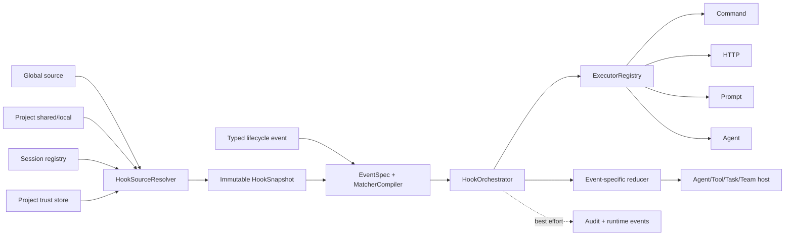
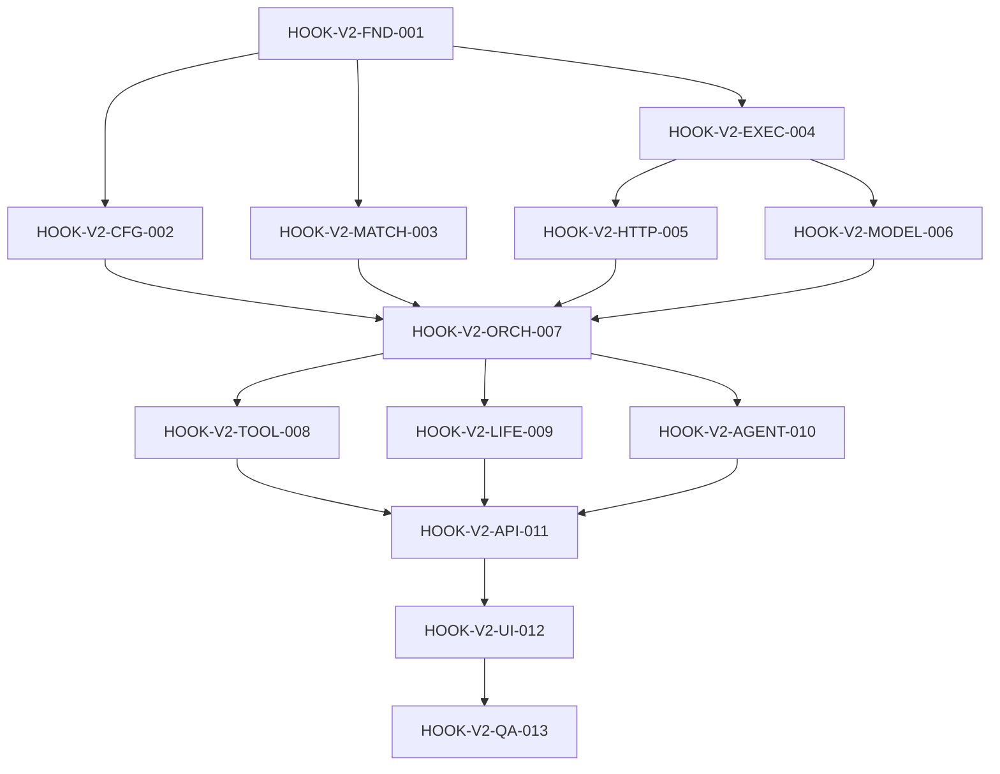

# PLAN-EA-HOOKS-001 · Agent Hooks Architecture-Isomorphic Adaptation Implementation Plan

> **Version**: v2.0
> **Date**: 2026-07-10
> **Status**: complete
> **Owner**: Emperor Agent maintainers
> **Baseline**: `b34cc378` (`Add agent hooks runtime`)
> **Reference**: Claude Code v2.1.88 behavior and architecture
> **Depends On**: TypeScript/Electron mainline after Python runtime retirement
> **Depended By**: Hook presets, skill/agent hook distribution, managed hook policy

> **For implementers**: execute task-by-task with tests first. This is an Emperor-native architectural adaptation, not a source-code port and not a `.claude` configuration compatibility project. Do not restore Python runtime or write private runtime data into the repository.

## 1. Overview

### 1.1 Problem Statement

Emperor Agent already has a working hooks baseline: 11 lifecycle events, command/HTTP handlers, configuration loading, runtime events, audit JSONL, CoreApi operations, and a basic desktop panel. The four hook-related baseline test files currently pass 106 tests. The existing implementation is therefore a migration baseline, not an unimplemented v1 feature.

The baseline does not yet have the architecture required for safe long-term expansion. `HookRuntime` reloads disk configuration for every event, executes handlers sequentially, and awaits telemetry before returning the computed decision. Hook inputs and outputs are broad records instead of event-specific contracts. Project trust is a single global boolean, async execution discards completion state, HTTP lacks network policy and SSRF controls, and subagents/Task/Team do not share the main lifecycle host.

Several correctness defects must be fixed before adding more events: `PermissionRequest` allow cannot currently turn an approval decision into an executable allow; `updatedInput` is not re-run through schema, Ask/Plan Guard, workspace, and permission validation; and a runtime-event or audit failure can cause a previously computed deny to degrade to passthrough. The desired state is a compact, typed, snapshot-based hooks service modeled on Claude Code's architectural ideas while deliberately avoiding its unsafe or incomplete behaviors.

### 1.2 Goals

1. Replace event-wide generic records with typed event input/output contracts and one centralized capability registry.
2. Replace per-event construction and disk loading with a long-lived `HookService` and immutable turn/session snapshots.
3. Preserve Emperor v1 disk data through deterministic in-memory migration and explicit v2 saves.
4. Implement command, HTTP, prompt, and agent handlers behind one executor registry.
5. Make parallel handler execution bounded and deterministic, with `deny > ask > allow > passthrough` aggregation.
6. Guarantee that hook allow and transformed input cannot bypass core schema, Plan, workspace, sandbox, or permission policy.
7. Integrate every hook event that has a real Emperor host, without registering nonfunctional parity events.
8. Make trust, cancellation, async completion, audit, and runtime observability first-class service responsibilities.
9. Preserve current CoreApi operations while adding validation, metadata, trust, dry-run, audit filtering, and cancellation APIs.
10. Keep the desktop UI operational and source-oriented: effective configuration, trust, diagnostics, audit, dry-run, and an Advanced global editor.

### 1.3 Non-Goals

- No verbatim copying from the extracted Claude Code source; it is a behavioral and architectural reference only.
- No `.claude/settings*.json` parser, importer, compatibility profile, or environment-variable emulation.
- No Python runtime, Python Web/CLI fallback, or new Python product code.
- No plugin-distributed hooks, skill/agent frontmatter hooks, managed organization hooks, or hook marketplace in this plan.
- No empty event constants for Setup, Notification, MCP Elicitation, Worktree, InstructionsLoaded, CwdChanged, or FileChanged.
- No visual drag-and-drop hook builder or full form-based CRUD in the first v2 UI.
- No hook decision may weaken a core deny or mutate a completed side effect retroactively.

### 1.4 Constraints and Defaults

| Area | Decision |
|---|---|
| Stack | TypeScript strict, Node.js 22+, Electron, Vue 3, Vitest |
| Validation | Add `zod` as a direct `@emperor/core` dependency; do not rely on a transitive install |
| Storage | Global private state remains under `stateRoot`; project hook files remain read-only to Core |
| Config ownership | Emperor v2 is canonical; existing Emperor v1 is migration input only |
| Project execution | Requires global project-hooks enablement and current per-project digest trust |
| Concurrency | Default 4 handlers, hard maximum 16 |
| Failure mode | `open` by default; `closed` only on blocking events and trusted sources |
| Stop continuation | At most one hook-requested continuation per runner invocation |
| Context budget | 8 KiB aggregate additional context per event |
| Process output | 64 KiB each for stdout and stderr, measured in bytes |
| HTTP response | 1 MiB maximum body; redirects and proxies unsupported in v2 |
| Audit retention | Daily JSONL files, 30-day best-effort retention, redacted by default |

### 1.5 Document Update Boundary

This v2 revision changes only this Markdown plan. It does not update README, code, progress sidecars, Git staging, commits, or remote branches. The implementation tasks below describe future engineering work.

## 2. Claude Code Source Analysis

The reference root used for this analysis is `/Users/anhuike/Documents/workspace/claude-code-source-code`, version 2.1.88. Source paths below are relative to that root.

### 2.1 Source Map

| Concern | Claude Code reference | Adaptation target |
|---|---|---|
| Event list and common input | `src/entrypoints/sdk/coreTypes.ts`, `coreSchemas.ts` | Typed Emperor event map and common envelope |
| Persistent handler schema | `src/schemas/hooks.ts` | Emperor v2 Zod schemas |
| Event-specific outputs | `src/types/hooks.ts`, `coreSchemas.ts` | Per-event output parsers and reducers |
| Matching and orchestration | `src/utils/hooks.ts` | Matcher compiler, execution plan, bounded orchestrator |
| Source snapshots and policy | `src/utils/hooks/hooksConfigSnapshot.ts`, `hooksSettings.ts`, `sessionHooks.ts` | Source resolver, snapshot revision, trust and session registry |
| Command/HTTP/prompt/agent | `src/utils/hooks.ts`, `execHttpHook.ts`, `execPromptHook.ts`, `execAgentHook.ts` | Executor registry with Emperor security policy |
| Async lifecycle | `src/utils/hooks/AsyncHookRegistry.ts`, `hookEvents.ts` | Background registry and correlated runtime events |
| Tool/permission order | `src/services/tools/toolExecution.ts`, `toolHooks.ts`, `src/utils/permissions/permissions.ts` | `AgentRunner` tool lifecycle and revalidation |
| Stop/compact/subagent | `src/query.ts`, `src/query/stopHooks.ts`, `src/services/compact/compact.ts`, `src/tools/AgentTool/runAgent.ts` | Main runner, compaction service, dispatch/team runners |
| Task/Team/MCP events | `src/tools/TaskCreateTool`, `TaskUpdateTool`, `src/services/mcp/elicitationHandler.ts` | Only Task/Team domains that already exist in Emperor |

### 2.2 Confirmed Architectural Behaviors

- Claude Code exposes 27 domain events and uses a common envelope plus event-specific discriminated input schemas.
- Persistent handlers are `command`, `http`, `prompt`, and `agent`; in-memory callbacks are a separate non-persistent mechanism.
- Matching supports empty/`*`, exact strings, `A|B`, regular expressions, and an event-specific matcher target.
- Effective hooks combine settings snapshots, registered sources, and session hooks, then deduplicate before execution.
- Matching handlers execute concurrently and aggregate decisions with `deny > ask > allow` priority.
- Command hooks read one JSON object from stdin; synchronous JSON output is validated against the active event output schema.
- `additionalContext` is not only UI text: it is fed into later model context through event-specific application logic.
- Hook run started/progress/response events are observability events, not additional lifecycle events.

### 2.3 Intentional Emperor Deviations

| Claude behavior or gap | Emperor v2 decision |
|---|---|
| Noninteractive/headless sessions are implicitly trusted | All project hooks require explicit current digest trust in every mode |
| `PermissionRequest.updatedInput` may reach `tool.call()` without full revalidation | Every transformed input restarts schema, Ask/Plan, workspace, and permission checks |
| Stop recursion relies on a protocol flag without an engine limit | One hook continuation maximum per runner invocation |
| Matching handlers run with no concurrency ceiling | Bounded concurrency with stable result order |
| Command hooks inherit broad process environment | Fixed minimal environment plus policy/handler allowlist intersection |
| HTTP proxy mode can bypass target SSRF checks | Proxy mode unsupported; DNS is validated and pinned |
| Valid JSON may override a nonzero process exit | Timeout/abort and exit status are authoritative before JSON output |
| Async timeout and `once` behavior are incomplete across sources | Central registry enforces deadline, cancellation, cleanup, and uniform once claims |
| PreCompact documentation and implementation disagree about blocking | Emperor semantics are explicit: normal compact may defer; emergency compact may bypass with audit |
| No durable tamper-resistant hook audit model | Correlated, rotated, redacted JSONL audit with hashes and source revision |

## 3. Current Emperor Baseline

### 3.1 Implemented at `b34cc378`

- 11 events: SessionStart, UserPromptSubmit, PreToolUse, PostToolUse, PostToolUseFailure, PermissionRequest, PermissionDenied, Stop, PreCompact, PostCompact, ConfigChange.
- `command` and `http` handlers, timeout, simple environment allowlist, JSON output, exit-code deny, and fire-and-forget async acceptance.
- Global `stateRoot/hooks_config.json` and read-only `.emperor/settings.json` / `.emperor/settings.local.json` loading.
- Matcher, fixed decision priority, bounded additional context, audit JSONL, and five runtime hook event types.
- CoreApi get/save/audit/test operations and a desktop Hooks panel with source, audit, and raw global JSON views.
- Baseline verification: `hooks.test.ts` 10, `runner.test.ts` 50, `loop.test.ts` 13, `core-api.test.ts` 33; total 106 passing.

### 3.2 Confirmed Gaps to Drive RED Tests

| Gap | Current location | Required outcome |
|---|---|---|
| Generic input/output records | `packages/core/src/hooks/models.ts` | Event-specific compile-time and runtime contracts |
| Permission matcher omits permission events | `packages/core/src/hooks/matcher.ts` | Permission events match `tool_name` |
| Per-event disk load and runtime construction | `packages/core/src/hooks/runtime.ts`, `agent/loop.ts` | One service and one immutable turn snapshot |
| Sequential handler loop | `packages/core/src/hooks/runtime.ts` | Bounded parallel execution, stable aggregation |
| Telemetry is awaited before aggregation | `packages/core/src/hooks/runtime.ts` | Decision computation independent from audit/event failures |
| Async result is discarded | `packages/core/src/hooks/executor.ts` | Trackable background lifecycle and one completion delivery |
| HTTP uses unrestricted `fetch` | `packages/core/src/hooks/executor.ts` | URL policy, DNS pinning, no redirect, bounded response |
| Plan Guard runs before transform only | `packages/core/src/agent/runner.ts` | Full restart after every accepted transform |
| PermissionRequest allow remains followed by `!decision.allowed` | `packages/core/src/agent/runner.ts` | Allow resolves only an ask state and permits execution after revalidation |
| Subagent runners receive no hook host | `packages/core/src/subagents/dispatch-runner.ts` | Scoped SubagentStart/Stop and tool hooks |
| Manual compaction bypasses hooks | `packages/core/src/api/services/memory-service.ts` | Shared compact lifecycle for manual and automatic paths |
| Project trust is one global enable flag | `packages/core/src/hooks/config.ts` | Canonical project path plus digest trust |
| Settings UI test is hard-coded | `desktop/.../HooksPanel.vue` | Metadata-driven dry-run and effective-plan UI |

## 4. Target Architecture

### 4.1 Service Boundaries



- `HookService` owns source resolution, snapshots, trust, session registrations, executor registry, async registry, audit, and shutdown.
- `HookSnapshot` is created once at turn start and passed to the main runner and nested domain hosts. Outside-turn operations request the latest accepted snapshot.
- `HookOrchestrator` never reads disk. It matches a supplied snapshot, runs handlers, reduces outputs, records observability best-effort, and returns one typed effect.
- Hosts own side-effect timing. The renderer never interprets hook decisions and never spawns a handler.

### 4.2 Public Data Model

```typescript
type HookHandlerType = 'command' | 'http' | 'prompt' | 'agent'
type HookDecision = 'deny' | 'ask' | 'allow' | 'passthrough'
type HookFailureMode = 'open' | 'closed'

interface HookHandlerBase {
  id: string
  enabled: boolean
  timeoutMs?: number
  statusMessage?: string
  once?: boolean // at most once per session; claimed before start
}

interface HookGroup {
  id: string
  enabled: boolean
  matcher?: string
  if?: string
  failureMode?: HookFailureMode
  handlers: Array<CommandHook | HttpHook | PromptHook | AgentHook>
}

interface HooksConfigV2 {
  version: 2
  enabled: boolean
  projectHooks: { enabled: boolean }
  policy: HookPolicy
  hooks: Partial<Record<HookEventName, HookGroup[]>>
}
```

Handler-specific fields:

- `command`: `command`, `args`, `shell: 'none' | 'bash' | 'powershell'`, `allowedEnv`, `async`, `asyncRewake`.
- `http`: `url`, `headers`, `allowedEnv`; no redirects, proxy, or async response mode.
- `prompt`: `prompt`, optional `modelRole: 'secondary' | 'main'`; default secondary.
- `agent`: `prompt`, optional `modelRole`, `maxTurns`; default secondary, maximum 12 turns.

`HookPolicy` is writable only in the global source. Project/session policy fields are invalid diagnostics and cannot widen global limits.

### 4.3 Event Contracts

```typescript
interface HookCommonInput {
  hook_event_name: HookEventName
  session_id: string
  turn_id?: string
  cwd: string
  state_root: string
  project_id?: string
  agent_id?: string
  agent_type?: string
}

type HookInput<E extends HookEventName> = HookCommonInput & HookInputByEvent[E]
type HookOutput<E extends HookEventName> = HookCommonOutput & HookOutputByEvent[E]

interface HookEventSpec<E extends HookEventName> {
  name: E
  matcherTarget(input: HookInput<E>): string | null
  allowedHandlers: readonly HookHandlerType[]
  mode: 'observe' | 'block' | 'transform' | 'continue'
  inputSchema: z.ZodType<HookInput<E>>
  outputSchema: z.ZodType<HookOutput<E>>
  reduce(results: HookRunResult<E>[]): HookEffectByEvent[E]
}
```

The common output supports `continue`, `suppressOutput`, `stopReason`, `systemMessage`, and `reason`. Decision, additional context, updated input/output, compact instructions, and other fields are accepted only by the active event output schema. Unknown or event-inapplicable output fields are diagnostics, not silently ignored behavior.

### 4.4 Implemented Event Matrix

| Event | Matcher target | Host timing and effect | Allowed handlers |
|---|---|---|---|
| SessionStart | `source` | Before first model request; context only, block ignored | command |
| SessionEnd | `reason` | Before archive/delete/shutdown cleanup; observation only | command |
| UserPromptSubmit | none | Before user message commit/model call; deny, update prompt, add context | command, http, prompt |
| PreToolUse | `tool_name` | After original schema/guard validation and before permission; deny/ask/allow/update/context | all except agent |
| PostToolUse | `tool_name` | After successful side effect; context, and MCP-only output replacement | command, http, prompt |
| PostToolUseFailure | `tool_name` | After tool error; context only | command, http, prompt |
| PermissionRequest | `tool_name` | Only for core ask state; allow/deny/update input | command, http, prompt |
| PermissionDenied | `tool_name` | After authoritative core deny; observation/context only | command, http, prompt |
| Stop | none | Before final return; one continuation maximum or explicit stop | command, http, prompt, agent |
| StopFailure | `error_kind` | Model/provider failure; fire-and-forget observation | command, http |
| SubagentStart | `agent_type` | Before first subagent model call; context only | command, http, prompt |
| SubagentStop | `agent_type` | Before subagent final return; one continuation maximum | command, http, prompt, agent |
| PreCompact | `trigger` | Before manual/auto compact; deny/defer and add compact instructions | command, http, prompt |
| PostCompact | `trigger` | After compact result; observation only | command, http |
| ConfigChange | `source` | Old snapshot reviews candidate before activation | command, http |
| TaskCreated | `task_kind` | Candidate task before persistence; deny prevents creation | command, http, prompt |
| TaskCompleted | `task_kind` | Before terminal status commit; deny preserves previous status | command, http, prompt, agent |
| TeammateIdle | `agent_type` | Before member becomes idle; one continuation maximum | command, http, prompt, agent |

Deferred events are absent from the exported union until a real host exists: Setup, Notification, Elicitation, ElicitationResult, WorktreeCreate, WorktreeRemove, InstructionsLoaded, CwdChanged, FileChanged.

### 4.5 Source Resolution, Migration, and Trust

Source precedence is fixed and explicit:

| Rank | Source | Mutability | Trust |
|---:|---|---|---|
| 100 | global `stateRoot/hooks_config.json` | editable | trusted user-private source |
| 200 | project `.emperor/settings.json` | read-only | current project digest required |
| 300 | project `.emperor/settings.local.json` | read-only | current project digest required |
| 400 | in-memory session registration | runtime only | inherits registering Core host |

- A higher source replaces an entire lower-source group only when event name and group `id` are equal. Different IDs all remain active. Handler payload equality is not used as identity.
- v2 requires stable group and handler IDs. v1 entries become one-handler groups with deterministic IDs derived from event, legacy ID, and index.
- v1 files are normalized in memory and never rewritten at startup. The first explicit global save writes v2 atomically and preserves a one-time `.v1.bak` copy.
- `stateRoot/hooks/project-trust.json` stores canonical realpath, SHA-256 digest of both project hook files, trusted timestamp, and optional revoked timestamp.
- Missing/created/deleted project files, symlink target changes, or byte changes produce a new digest and stale trust. No project handlers are matched while trust is missing or stale.
- Snapshot revision is SHA-256 over normalized policy, accepted source revisions, and session registrations. Objects are deep-frozen in development/test builds.

### 4.6 Orchestration and Aggregation

1. Compile matching groups from the supplied snapshot and event spec.
2. Preserve source rank, group order, and handler order as the stable plan order.
3. Claim `once` handlers atomically before starting them.
4. Execute with a semaphore of `min(policy.maxConcurrency, 16)` and a combined caller/timeout signal.
5. Store results by plan index, never completion order.
6. Parse each response through the active event output schema.
7. Convert failed handlers according to group failure mode. `closed` becomes deny only for block/transform/continue events.
8. Aggregate decision priority `deny > ask > allow > passthrough`.
9. Canonicalize transformed inputs. Identical updates collapse; two different updates produce `conflicting_updated_input` deny.
10. Concatenate context in plan order with source/group labels and the 8 KiB byte limit.
11. Compute the final effect before audit or runtime event writes. Telemetry uses best-effort `allSettled` and cannot replace the effect.

### 4.7 Tool and Permission Invariant

```text
resolve tool + prepare original input
  -> Ask Guard + Plan Guard
  -> PreToolUse
  -> if updatedInput: restart from prepare input (one transform cycle maximum)
  -> core permission assessment
  -> deny: emit PermissionDenied, never ask or execute
  -> ask: run PermissionRequest
       -> deny: return denied tool result
       -> updatedInput: restart full validation and permission assessment
       -> allow: resolve this ask only
       -> passthrough/ask: create normal user approval interaction
  -> execute tool
  -> PostToolUse or PostToolUseFailure
```

Core workspace, Plan, schema, tool safety, and permission denies are authoritative. A hook allow never changes them. Tool transforms are limited to one accepted cycle per call to prevent revalidation loops. Both batch and streaming tool execution use this same `runOne` path.

### 4.8 Handler Protocols

#### Command

- `shell: 'none'` uses `spawn(command, args)`; shell modes require empty `args` and global `allowShell=true`.
- stdin is exactly one UTF-8 JSON object plus newline.
- cwd must be the resolved event workspace and must exist; there is no fallback to arbitrary process cwd.
- Environment is fixed platform basics plus the intersection of global policy and handler `allowedEnv`.
- Timeout/abort kills the complete process tree. Output uses byte-counted tail buffers with a truncation marker.
- Exit 2 is deny; other nonzero exits are failed/passthrough or closed-deny. Only exit 0 parses JSON.
- Nonempty stdout beginning with `{` must be valid event output JSON. Other stdout is a bounded system message and never grants permission.

#### HTTP

- Use Node `http`/`https`, not unrestricted `fetch`, so validated DNS addresses can be pinned to the request.
- Global URL patterns are mandatory; an empty allowlist disables HTTP hooks. Project config cannot widen it.
- Resolve all target addresses and reject the request if any address violates private/link-local/metadata policy. Loopback requires both URL allowlist match and `allowLoopback=true`.
- Redirects, proxy environment variables, non-HTTP schemes, userinfo URLs, and oversized request/response bodies are rejected.
- `${NAME}` header interpolation requires the variable in both handler and global allowlists; CR/LF/NUL are removed and unresolved headers are omitted.
- Only 2xx responses are parsed as output JSON. Empty 2xx is passthrough; non-2xx and invalid output follow failure mode.

#### Prompt

- Add `hook_prompt` to secondary model routing with main fallback.
- The configured prompt is the instruction; canonical event JSON is appended as data rather than string-substituted into the instruction.
- One model request, no tools, temperature 0, default timeout 30 seconds, and strict `{ ok: boolean, reason?: string }` output.
- `ok=false` maps to deny only where the event can block; malformed/timeout follows failure mode.

#### Agent

- Add `hook_agent` model routing, default secondary with main fallback.
- Build an isolated runner with only `read_file`, `glob`, and `grep`; no command, write, MCP, dispatch, Team, Ask, or Plan tools.
- Hooks are disabled inside the hook agent (`hookDepth=1`) to prevent recursion.
- Event JSON and a bounded redacted context excerpt are supplied directly; raw private transcript paths are not required.
- The agent must call an internal `submit_hook_result` structured tool. Default timeout is 60 seconds and maximum turns is 12.

#### Async

- Async is supported only by command handlers in v2 and only when declared in config; dynamic stdout backgrounding is unsupported.
- `AsyncHookRegistry` owns run ID, process, deadline, cancellation, output progress, final audit, and shutdown cleanup.
- An async result never changes the event that launched it. `asyncRewake` may enqueue one hidden follow-up only when the final result is blocking and the originating session still exists.

### 4.9 ConfigChange Transaction

- API save: parse candidate -> compute candidate revision -> run ConfigChange against old snapshot -> deny means no write -> allow means atomic write and activate candidate.
- External project change: detect revision at next snapshot refresh -> run old ConfigChange -> deny keeps old accepted snapshot and reports stale candidate -> allow activates new snapshot.
- Global policy changes cannot be weakened by project/session sources. A corrupt candidate is never sent to ConfigChange and never activated.
- Hook configuration changes do not recursively trigger ConfigChange more than once per candidate revision.

### 4.10 Audit and Runtime Events

Each run receives `hookRunId`, snapshot revision, source/group/handler IDs, optional tool use ID, start/end timestamps, outcome, decision, duration, input hash, and output hash. Raw input/output are omitted by default. Reason/system text is secret-scrubbed and capped at 2 KiB.

Audit files live at `stateRoot/hooks/audit/YYYY-MM-DD.jsonl`; cleanup retains 30 days and is best effort. Runtime events retain the existing names and add correlation fields:

- `hook_run_started`
- `hook_run_progress`
- `hook_run_completed`
- `hook_run_failed`
- `hook_decision_applied`

Audit/event append failure emits one degraded diagnostic when possible, but never throws through the hook effect path.

### 4.11 CoreApi and Desktop Contract

Existing operations remain, with v2 request/response shapes:

- `hooks.getConfig()` -> accepted config, effective groups, sources, trust, diagnostics, revision, summary.
- `hooks.saveConfig({ revision, config })` -> optimistic save; stale revision is rejected without write.
- `hooks.getAudit({ cursor?, limit?, eventName?, outcome?, sourceId?, runId? })` -> filtered bounded page.
- `hooks.testRun({ revision, eventName, groupId, handlerId, input, confirmExecution: true })` -> one explicitly selected handler.

New operations:

- `hooks.getMetadata()` -> event capabilities, handler schemas/defaults, limits.
- `hooks.validateConfig({ config, sourceKind })` -> pure normalization and diagnostics, no write or execution.
- `hooks.setProjectTrust({ projectRoot, expectedDigest, trusted })` -> canonical current-project trust mutation.
- `hooks.testMatch({ revision, eventName, input })` -> pure matcher plan, no handler execution.
- `hooks.cancelRun({ runId })` -> cancel a tracked background run.

Every operation is added to CoreApi operation metadata, Electron main IPC, preload, renderer `core()` mapping, shared types, and contract tests. `testRun` never silently runs all hooks and cannot execute an untrusted project handler.

### 4.12 Desktop UX

- Default view is a read-only effective plan grouped by event, with matcher, handler type, source, trust, enablement, and policy-block reason.
- Project trust shows trusted/stale/untrusted and the digest being approved; trust changes require the existing mutation guard.
- Diagnostics display source path and schema path without exposing secret values.
- Dry-run lets the user choose event and edit event JSON, then shows matching groups without execution.
- Handler execution requires selecting one handler and a separate confirmation action.
- Audit supports event/outcome/source filters and a correlated run detail view.
- The global JSON textarea moves under Advanced and saves with the loaded revision. No project file is edited.

## 5. Dependency and Topology



| Phase | Tasks | Parallelism |
|---|---|---|
| P0 Contracts | FND-001 | sequential foundation |
| P1 Resolution | CFG-002, MATCH-003, EXEC-004 | parallel after FND |
| P2 Executors | HTTP-005, MODEL-006 | parallel after EXEC |
| P3 Runtime | ORCH-007 | joins CFG/MATCH/EXEC handlers |
| P4 Hosts | TOOL-008, LIFE-009, AGENT-010 | parallel with disjoint hosts |
| P5 Product | API-011 -> UI-012 | sequential contract then renderer |
| P6 Receipt | QA-013 | after all implementation tasks |

## 6. Standard TDD Workflow

Every task follows this sequence and records the commands/results in its implementation commit or PR:

1. Add the task's listed tests and run the narrow suite; confirm the new assertions fail for the intended reason.
2. Implement the smallest complete behavior that satisfies the contracts; no temporary passthrough or TODO branch counts as implementation.
3. Re-run the narrow suite and confirm green.
4. Run affected integration tests and typecheck.
5. Run lint on touched Core files; zero errors are required.
6. Keep commits task-scoped so a failing phase can be reverted without removing unrelated completed work.

## 7. Task Decomposition

### HOOK-V2-FND-001 · Establish Typed Event and v2 Schema Foundation

- **Purpose**: Define the single source of truth for events, inputs, outputs, handlers, policies, diagnostics, and v1 migration.
- **Scope**: `packages/core/src/hooks` models, event specs, Zod schemas, serializer, migration tests, direct dependency declaration.
- **Excluded**: Disk source loading, execution, runtime hosts, and UI.
- **Source mapping**: Claude `coreTypes.ts`, `coreSchemas.ts`, `schemas/hooks.ts`, `types/hooks.ts`; Emperor current `models.ts`, `schema.ts`.
- **Target**: `HookEventSpecMap`, `HooksConfigV2Schema`, event input/output schemas, `parseHooksConfig`, `serializeHooksConfigV2`, `migrateV1Config`.
- **Design**: Export only the 18 implemented events. Event schemas are strict. IDs are required in v2 and deterministic in migrated v1. Unsupported events/handlers and policy fields at non-global sources produce path diagnostics. Preserve corrupt global config behavior through the existing atomic store layer.
- **Invariants**: input and output types derive from schemas; an event cannot accept an unsupported output field; normalized serialization is deterministic; no `any` in public hooks APIs.
- **Dependencies**: none. External: direct `zod` dependency.
- **Complexity**: L. Main risk is schema/type drift; mitigate with inferred-type compile tests and one registry.
- **Tests**: all 18 events parse; each handler variant parses; unsupported event rejects; event-inapplicable output rejects; defaults normalize; duplicate IDs diagnose; v1 entries migrate deterministically; v2 serialization round-trips; project policy rejects; corrupt input remains isolated.
- **Acceptance**: one registry drives names and capabilities; v1 fixture produces stable v2 normalized data; `npm run typecheck --workspace @emperor/core` passes.
- **Estimate**: 12 hours.
- **Status**: ☑ done.

### HOOK-V2-CFG-002 · Build Source Resolver, Snapshot, Revision, and Trust

- **Purpose**: Resolve effective hooks once per turn with explicit provenance and project trust.
- **Scope**: global/project/session sources, v1 read migration, source precedence, trust store, snapshots, candidate activation.
- **Excluded**: Matcher execution and handler invocation.
- **Source mapping**: Claude `hooksConfigSnapshot.ts`, `hooksSettings.ts`, `sessionHooks.ts`; Emperor current `config.ts`, `AgentLoop` session/project scope.
- **Target**: `HookSourceResolver`, `HookSnapshotStore`, `ProjectHookTrustStore`, `HookSessionRegistry`.
- **Design**: Use fixed ranks 100/200/300/400. Override groups by event+ID. Canonicalize project roots with realpath and hash both project files. Cache only accepted snapshots; compare candidate revision at turn start. Session registrations are keyed by session ID and cleared on session end.
- **Invariants**: one turn sees one revision; project bytes cannot execute without matching trust digest; headless/scheduler paths use the same gate; project files are never written; lower sources cannot change global policy.
- **Dependencies**: FND-001. External: Node crypto/fs/path only.
- **Complexity**: XL. Risks are symlink trust confusion and stale snapshots; mitigate with canonical paths, content digest, and immutable snapshots.
- **Tests**: global-only load; project disabled; trusted shared load; local overrides shared by ID; different IDs coexist; symlink canonicalization; digest change invalidates trust; headless does not imply trust; session isolation/cleanup; snapshot remains stable after disk edit; stale candidate remains inactive; v1 save creates one backup.
- **Acceptance**: no disk read occurs inside `HookOrchestrator.run`; trust status and source provenance are present in every resolved group.
- **Estimate**: 14 hours.
- **Status**: ☑ done.

### HOOK-V2-MATCH-003 · Compile Event-Aware Match Plans

- **Purpose**: Centralize matcher target selection, condition evaluation, diagnostics, and stable execution ordering.
- **Scope**: matcher compiler, `if` rules, group selection, handler capability filter, pure dry-run result.
- **Excluded**: Handler execution and side-effect application.
- **Source mapping**: Claude `utils/hooks.ts` matcher and condition functions; Emperor current `matcher.ts`.
- **Target**: `compileHookPlan(snapshot, input)`, `testHookMatch`, matcher diagnostics.
- **Design**: Support empty/`*`, exact, pipe alternatives, and `/pattern/flags`. Invalid regex is a diagnostic and non-match. Event spec supplies the target, including permission `tool_name`, task kind, agent type, and compact trigger. `if` initially supports `Tool(pattern)` and `path:glob`; unsupported expressions are diagnostics rather than silent false.
- **Invariants**: matching is pure; completion timing never changes plan order; unsupported handler/event pairs never execute; dry-run and live execution use the same compiled plan.
- **Dependencies**: FND-001, CFG-002 interfaces.
- **Complexity**: M.
- **Tests**: wildcard; exact; pipe; regex flags; invalid regex; permission target; task/agent/compact targets; Tool condition; path glob; unsupported condition diagnostic; source override order; handler capability filtering; dry-run/live parity.
- **Acceptance**: all event matcher targets have matrix tests and no event-name switch remains outside the registry.
- **Estimate**: 7 hours.
- **Status**: ☑ done.

### HOOK-V2-EXEC-004 · Implement Executor Registry and Command Lifecycle

- **Purpose**: Provide one cancellable executor contract and a secure command implementation.
- **Scope**: executor registry, execution context/result, command spawn, signals, process-tree kill, byte limits, env policy, JSON protocol.
- **Excluded**: HTTP and model handlers, aggregation, runtime host decisions.
- **Source mapping**: Claude command path in `utils/hooks.ts`; Emperor current `executor.ts`.
- **Target**: `HookExecutorRegistry`, `CommandHookExecutor`, `HookProcessController`, bounded byte buffers.
- **Design**: Registry dispatches by handler type. Combine caller and timeout signals. `shell=none` is default. Resolve minimal environment through policy intersection. Store tail output with truncation metadata. Exit status precedes output parsing. Return normalized run outcomes without applying event decisions.
- **Invariants**: one executor settles once; cancellation closes pipes and process tree; output memory is bounded; no unlisted environment variable is inherited; nonzero exit can never grant allow.
- **Dependencies**: FND-001.
- **Complexity**: L; platform process cleanup is the primary risk.
- **Tests**: stdin Unicode/newline; argv without shell; shell denied by policy; shell enabled; environment intersection; missing cwd; exit 0 JSON; exit 2 deny; other nonzero fail; malformed JSON; timeout; parent abort; descendant process kill; stdout/stderr byte truncation.
- **Acceptance**: tests leave no child process alive; command executor supports external AbortSignal and emits no policy decision on its own.
- **Estimate**: 14 hours.
- **Status**: ☑ done. RED/GREEN evidence: `executor-v2.test.ts` 9/9; command lifecycle, shell policy, env intersection, byte caps, exit protocol, timeout/cancel, and process-tree termination pass.

### HOOK-V2-HTTP-005 · Harden HTTP Handler Transport

- **Purpose**: Make HTTP hooks usable without creating an unrestricted network exfiltration path.
- **Scope**: URL policy, DNS classification/pinning, request construction, header interpolation, timeout, redirects, response limits.
- **Excluded**: Proxy support, redirects, WebSocket, streaming response, and async HTTP jobs.
- **Source mapping**: Claude `execHttpHook.ts`, `ssrfGuard.ts`; Emperor current HTTP branch in `executor.ts`.
- **Target**: `HttpHookExecutor`, `HookUrlPolicy`, `resolveSafeHookTarget`.
- **Design**: Parse only HTTP(S), match full URL against global patterns, resolve all addresses, reject mixed safe/unsafe results, pin the chosen address, preserve Host/TLS servername, and read response incrementally to 1 MiB. Header interpolation uses allowlist intersection and sanitization.
- **Invariants**: empty URL allowlist disables transport; project sources cannot widen policy; redirect is never followed; private/metadata networks remain denied unless explicit loopback policy applies.
- **Dependencies**: FND-001, EXEC-004 registry.
- **Complexity**: XL; DNS/TLS behavior is high risk.
- **Tests**: empty/allow/deny URL patterns; invalid scheme/userinfo; loopback disabled/enabled; private IPv4; IPv6 ULA/link-local; mixed DNS answers; redirect response; TLS servername preservation; CRLF/NUL header cleanup; env intersection; unresolved env omission; non-2xx; empty 2xx; invalid output; timeout/abort; oversized response.
- **Acceptance**: no test can reach a blocked address through hostname, redirect, or header tricks; body and output remain bounded.
- **Estimate**: 14 hours.
- **Status**: ☑ done. RED/GREEN evidence: `http-executor-v2.test.ts` 8/8; allowlist, DNS pinning, SSRF/private-address policy, redirects, headers, response caps, timeout, and cancellation pass.

### HOOK-V2-MODEL-006 · Implement Prompt and Agent Handlers

- **Purpose**: Add model-evaluated and agentic hook checks without recursive or write-capable execution.
- **Scope**: model routing, prompt executor, isolated agent executor, structured result tool, tool filtering, timeout/turn limits.
- **Excluded**: User-selectable arbitrary agent tools, nested hooks, transcript-path access, and persistent agent/frontmatter registration.
- **Source mapping**: Claude `execPromptHook.ts`, `execAgentHook.ts`; Emperor `model/router.ts`, `runner-factory.ts`, tool registry.
- **Target**: `PromptHookExecutor`, `AgentHookExecutor`, `SubmitHookResultTool`; model routes `hook_prompt`, `hook_agent`.
- **Design**: Prompt is one no-tool secondary request with strict result JSON. Agent receives event JSON plus bounded context, only read/glob/grep tools, hooks disabled, and must submit a structured result. Both inherit the caller signal and policy timeout.
- **Invariants**: hook model calls cannot invoke hooks; agent cannot write, execute commands, dispatch, ask, plan, or use Team/MCP; malformed result follows failure mode, never implicit deny/allow.
- **Dependencies**: FND-001, EXEC-004 registry.
- **Complexity**: XL; provider differences and recursion are risks.
- **Tests**: secondary route; main fallback; explicit main role; prompt ok true/false; malformed prompt result; prompt timeout; agent tool allowlist; forbidden tool absence; structured result required; max-turn failure; abort; hook depth prevents recursion; context redaction/limit; event-inapplicable model handler filtered.
- **Acceptance**: no hook agent path has a write-capable or nested-agent tool; usage is recorded under dedicated use cases.
- **Estimate**: 16 hours.
- **Status**: ☑ done. RED/GREEN evidence: `model-executor-v2.test.ts` 7/7 plus `model/router.test.ts` 3/3; secondary/main routing, structured prompt/agent results, restricted tools, context redaction, turn limits, recursion guard, timeout, and cancellation pass.

### HOOK-V2-ORCH-007 · Build Deterministic Orchestrator, Async Registry, and Audit

- **Purpose**: Run compiled plans with bounded parallelism and return a decision independent from observability failures.
- **Scope**: semaphore, stable result ordering, event reducers, once registry, async command registry, audit rotation, runtime event correlation.
- **Excluded**: Domain host application and renderer presentation.
- **Source mapping**: Claude `utils/hooks.ts`, `AsyncHookRegistry.ts`, `hookEvents.ts`; Emperor current `runtime.ts`, `decision.ts`, `audit.ts`.
- **Target**: `HookOrchestrator`, `HookResultAggregator`, `HookOnceRegistry`, `AsyncHookRegistry`, v2 `HookAuditStore`.
- **Design**: Execute plan items concurrently but store by index. Apply event schema before reducer. Claim once before start. Async commands return accepted run IDs and complete through registry. Compute effect first; append audit/events with `allSettled`. Rotate audit daily and scrub content.
- **Invariants**: deny wins regardless of completion order; telemetry cannot erase deny; async cannot alter original event; once means at most one start per session; all run/progress/audit records share one run ID.
- **Dependencies**: CFG-002, MATCH-003, EXEC-004, HTTP-005, MODEL-006.
- **Complexity**: XL.
- **Tests**: concurrency ceiling; shuffled completion stable output; deny/ask/allow priority; identical update collapse; conflicting update deny; context order/byte cap; open failure; closed failure; audit append failure; emit failure; once concurrent claim; async completion once; async deadline; cancel; shutdown cleanup; async rewake eligibility.
- **Acceptance**: fault-injected audit and event sinks cannot change returned effects; no untracked background process survives shutdown.
- **Estimate**: 16 hours.
- **Status**: ☑ done. RED/GREEN evidence: `orchestrator-v2.test.ts` 13/13 and `audit-v2.test.ts` 2/2; bounded concurrency, stable reducers, once/async lifecycle, correlation, observability isolation, daily rotation, and redaction pass.

### HOOK-V2-TOOL-008 · Rebuild Tool and Permission Hook Pipeline

- **Purpose**: Enforce the authoritative validation order and fix PermissionRequest semantics.
- **Scope**: main and streaming tool execution, schema preparation, Ask/Plan guards, permission assessment, transformed input, pre/post/failure hooks.
- **Excluded**: Subagent/Team lifecycle and non-tool events.
- **Source mapping**: Claude `toolExecution.ts`, `toolHooks.ts`, permissions flow; Emperor `agent/runner.ts`, `tools/execution.ts`, permission/control managers.
- **Target**: one `executeToolWithHooks` path used by batch and streaming execution.
- **Design**: Prepare original input before hooks. Run guards, then PreToolUse. One transformed input restarts preparation and all guards. Core deny emits PermissionDenied and stops. PermissionRequest runs only for ask and may resolve that ask; transformed permission input restarts once. Include tool use ID and full permission risk/rule/trace in input.
- **Invariants**: hook allow never overrides core deny; transformed input is never executed unprepared; Plan Guard observes effective arguments; streaming early-start requires a snapshot proving no matching blocking hook.
- **Dependencies**: ORCH-007.
- **Complexity**: XL; this is the highest regression-risk host.
- **Tests**: original schema before PreToolUse; pre deny prevents execution; transformed schema failure; transformed Plan Guard block; workspace deny after transform; permission deny beats allow; ask plus hook allow executes; ask passthrough pauses; PermissionRequest update rechecks; transform loop limit; PermissionDenied matcher/tool data; Post success; Post failure; MCP-only output replacement; batch/streaming parity; cancellation during hook.
- **Acceptance**: existing Ask/Plan/Permission and streaming tests remain green; the current ineffective PermissionRequest allow has a regression test that now passes.
- **Estimate**: 16 hours.
- **Status**: ☑ done. RED/GREEN evidence: `agent/tool-hooks-v2.test.ts` 9/9 plus existing Runner/Tool suites; full core 643/643. PermissionRequest allow, core deny precedence, schema/Plan/permission revalidation, streaming proof, cancellation, Post failure, and MCP replacement pass.

### HOOK-V2-LIFE-009 · Integrate Turn, Session, Stop, Compact, and Config Lifecycles

- **Purpose**: Apply typed hook effects at non-tool lifecycle boundaries using one turn snapshot.
- **Scope**: SessionStart/End, UserPromptSubmit, Stop/StopFailure, Pre/PostCompact, ConfigChange, history/context application.
- **Excluded**: Subagents, tasks, Team, and UI.
- **Source mapping**: Claude `query.ts`, `stopHooks.ts`, `compact.ts`, settings change detector; Emperor `agent/loop.ts`, `agent/runner.ts`, memory and CoreApi config services.
- **Target**: shared lifecycle adapters and context application helpers.
- **Design**: Create snapshot at turn start. SessionStart runs once per session before first model request. User prompt deny does not commit history. Stop continuation is hidden, persisted, and capped once. StopFailure is nonblocking. Both manual and automatic compaction use the same hook wrapper. Config saves use the old-snapshot transaction.
- **Invariants**: one turn never changes revision; denied prompt leaves no user history; Stop cannot loop indefinitely; PostCompact always reflects the actual compact result; config denial leaves the accepted snapshot and disk state consistent.
- **Dependencies**: ORCH-007.
- **Complexity**: XL.
- **Tests**: SessionStart once; start context enters first model request; prompt deny no history; prompt update/display separation; prompt context persistence; Stop deny one continuation; second Stop deny ends; StopFailure on provider error; manual compact deny; auto compact defer; compact instructions; emergency bypass audit; PostCompact success/failure; ConfigChange deny before save; project candidate deny keeps old snapshot; SessionEnd before delete.
- **Acceptance**: no lifecycle method constructs a new `HookRuntime`; manual and auto compaction share behavior.
- **Estimate**: 14 hours.
- **Status**: ☑ done. RED/GREEN evidence: `agent/lifecycle-hooks-v2.test.ts` 9/9 and `hooks/service-v2.test.ts` 6/6; turn snapshots, session/prompt/stop/failure, shared compaction, emergency bypass, ConfigChange transactions, 100-handler snapshot reuse, and SessionEnd ordering pass.

### HOOK-V2-AGENT-010 · Integrate Subagent, Task, and Team Hosts

- **Purpose**: Give nested agent and task domains the same scoped hooks architecture as the main runner.
- **Scope**: dispatch subagents, Team runners, TaskManager create/complete transitions, TeammateIdle continuation, session registry cleanup.
- **Excluded**: Agent frontmatter and plugin sources.
- **Source mapping**: Claude `runAgent.ts`, Task create/update tools, teammate stop flow; Emperor `subagents/dispatch-runner.ts`, `tools/dispatch.ts`, `tasks/manager.ts`, `team/manager.ts`.
- **Target**: scoped `HookRunnerContext`, async task transition APIs, nested runner hook host injection.
- **Design**: Assign agent ID/type and parent session snapshot. Start context enters the first nested request. SubagentStop and TeammateIdle can continue once. Task creation generates a candidate ID, runs hooks, then persists; completion hooks run before terminal status. Always clear session/agent registrations in `finally`.
- **Invariants**: nested agents cannot escape parent project trust/policy; denied task candidates never hit disk; denied completion preserves previous record; one agent's session hooks cannot leak to another.
- **Dependencies**: ORCH-007; may run parallel with TOOL-008 and LIFE-009.
- **Complexity**: XL.
- **Tests**: SubagentStart context; start block ignored; SubagentStop continuation once; nested tool hooks use parent snapshot; unique agent IDs; scope cleanup success/failure; TaskCreated deny no row; TaskCreated allow row; TaskCompleted deny preserves running; completion allow commits; TeammateIdle continuation once; Team error cleanup; parallel subagent isolation; parent trust enforcement.
- **Acceptance**: dispatch and Team runners receive typed hook hosts; no registration survives runner cleanup.
- **Estimate**: 16 hours.
- **Status**: ☑ done. RED/GREEN evidence: `tasks/task-hooks-v2.test.ts` 3/3, `subagents/agent-hooks-v2.test.ts` 3/3, plus Loop SubagentStop/TeammateIdle E2E; full core 663/663 and scoped cleanup/isolation pass.

### HOOK-V2-API-011 · Publish CoreApi, IPC, and Runtime Contracts

- **Purpose**: Expose v2 service capabilities without allowing renderer-side policy interpretation.
- **Scope**: Core hooks service, CoreApi operations, desktop main/preload/renderer mapping, shared types, runtime event fields.
- **Excluded**: Visual layout and editing workflow.
- **Source mapping**: Emperor current `hooks-service.ts`, `core-api.ts`, desktop IPC/preload, renderer API/types.
- **Target**: existing four operations upgraded; five new operations added exactly as section 4.11.
- **Design**: Validate all inputs in Core. Use optimistic revision saves. Trust only the active canonical project and current digest. `testMatch` is pure. `testRun` requires exact handler selection, current revision, confirmation, and source trust. Audit is cursor/limit bounded.
- **Invariants**: renderer cannot spawn directly; stale save never writes; dry-run cannot execute; untrusted project test cannot execute; runtime and audit IDs correlate.
- **Dependencies**: TOOL-008, LIFE-009, AGENT-010.
- **Complexity**: L.
- **Tests**: operation metadata; get payload; metadata capability matrix; validation no write; save roundtrip; stale revision; trust expected digest; trust wrong project/digest; testMatch no audit; testRun confirmation; testRun selected handler only; untrusted test rejection; audit filters/cursor; cancel existing/missing run; IPC/preload/renderer parity; bootstrap summary.
- **Acceptance**: every operation exists in CoreApi, Electron bridge, renderer helper, and contract tests with matching shapes.
- **Estimate**: 10 hours.
- **Status**: ☑ done. CoreApi exposes all nine operations with revision/trust/confirmation validation; ConfigChange now authorizes config/MCP/model writes before disk mutation; runtime events correlate handler/run/snapshot/source fields. CoreApi 39/39, Electron host contract, typecheck, and async cancellation tests pass.

### HOOK-V2-UI-012 · Replace Raw Panel with Effective Hooks Workspace

- **Purpose**: Make source, trust, diagnostics, audit, and testing understandable while retaining a minimal global editor.
- **Scope**: Hooks panel view model, filters, trust control, dry-run editor, selected test execution, audit details, Advanced JSON editor.
- **Excluded**: Full visual CRUD, project file editing, plugin marketplace, and handler log terminal.
- **Source mapping**: Claude read-only `/hooks` source browser; Emperor current `HooksPanel.vue` and renderer types.
- **Target**: metadata-driven panel using CoreApi only and existing design system/icons.
- **Design**: Effective groups are the primary view. Trust states are explicit. Diagnostics include source/schema path. Dry-run defaults from event metadata. Execute is separate and confirmed. Advanced editor validates before save and includes revision. Keep layout utilitarian and responsive.
- **Invariants**: no renderer policy logic; no project write; no secret values in diagnostics/audit; loading/error/empty/stale states are visible; text does not overflow at supported widths.
- **Dependencies**: API-011.
- **Complexity**: L.
- **Tests**: empty state; effective source rows; policy-disabled reason; untrusted/stale state; trust mutation; diagnostics path; event metadata form; dry-run results; execute confirmation; audit filters/detail; Advanced validation; stale save conflict; loading/error; narrow viewport rendering.
- **Acceptance**: hard-coded PreToolUse/read_file test is removed; project sources are always visibly read-only; desktop typecheck/build pass.
- **Estimate**: 12 hours.
- **Status**: ☑ done. The panel now provides Effective/Test/Audit/Advanced views, explicit read-only provenance and project trust, metadata-driven dry-run, confirmed exact execution, async cancellation, audit filtering/detail, validation, and stale-save recovery. Five view-model tests and three desktop/mobile Playwright scenarios pass.

### HOOK-V2-QA-013 · Complete Security, Performance, and Release Receipt

- **Purpose**: Prove the architecture is complete, non-stubbed, and safe across real desktop paths.
- **Scope**: full regression suite, adversarial security tests, performance checks, manual desktop scenarios, documentation status updates inside this plan.
- **Excluded**: New feature scope discovered during QA; defects are fixed in their owning task.
- **Source mapping**: project quality gates and the baseline 106-test receipt.
- **Target**: reproducible command log and checked receipt sections.
- **Design**: Run narrow tests first, then all Core/desktop gates. Add fault injection for telemetry, process, DNS, stale trust, and concurrency. Inspect effective configuration and audit in a packaged-like desktop run. Verify no deferred event or handler contains a stub path.
- **Invariants**: existing behavior remains covered; no private runtime file enters Git; no Python product files appear; quality failures are fixed or explicitly block release.
- **Dependencies**: all prior tasks.
- **Complexity**: L.
- **Tests/receipts**: baseline 106; full Core tests; Core typecheck/lint; desktop tests/typecheck/build; `make check`; 100-hook match plan without per-event disk reads; four simultaneous handlers obey ceiling; project digest revocation; SSRF adversarial matrix; process cancellation; prompt/agent recursion; manual desktop trust/dry-run/audit; v1 migration fixture; deferred-event absence; Git ignored private data.
- **Acceptance**: every checklist in sections 9 and 10 is checked; all commands pass; no TODO/mock/passthrough remains on an acceptance path.
- **Estimate**: 12 hours.
- **Status**: ☑ done. Final receipts: `make check` passes end-to-end with Core 671/671, desktop 266/266, Core/desktop typecheck and lint, parity validation, `git diff --check`, and production build. Three Hooks Playwright scenarios cover desktop/mobile layout, trust, dry-run, audit, validation, and stale-save recovery. Performance receipts cover a 100-handler plan with one source resolution per turn and a four-worker concurrency ceiling.

## 8. Risk Register

| ID | Severity | Risk | Affected tasks | Mitigation |
|---|---|---|---|---|
| R1 | H | Hook allow or transformed input bypasses core policy | TOOL-008 | Full restart invariant and adversarial tests |
| R2 | H | Project command hook executes without valid trust | CFG-002, API-011 | Canonical realpath + digest trust in every execution mode |
| R3 | H | HTTP hook enables SSRF or secret exfiltration | HTTP-005 | Global allowlist, DNS pinning, env intersection, no proxy/redirect |
| R4 | H | Prompt/agent hooks recurse or gain write tools | MODEL-006 | Hook depth, fixed tool registry, max turns/time |
| R5 | H | Stop/Team hooks create infinite model loops | LIFE-009, AGENT-010 | Engine-owned one-continuation cap |
| R6 | M | Parallel completion produces nondeterministic decisions | ORCH-007 | Stable plan indexes and deterministic reducers |
| R7 | M | Audit/event failure changes enforcement outcome | ORCH-007 | Effect-first computation and best-effort telemetry |
| R8 | M | Background command leaks after cancellation/shutdown | EXEC-004, ORCH-007 | Process-tree control and registry finalization |
| R9 | M | v1 migration changes existing user behavior | FND-001, CFG-002 | Fixtures, deterministic IDs, explicit-save migration only |
| R10 | M | TaskManager async conversion regresses callers | AGENT-010 | Compile-time migration of all call sites and domain tests |
| R11 | M | Snapshot change handling runs stale or corrupt config | CFG-002, LIFE-009 | Accepted/candidate split and revision tests |
| R12 | L | UI exposes sensitive hook payloads | API-011, UI-012 | Redacted API contracts and no raw audit by default |

## 9. Verification Strategy

### 9.1 Automated Commands

```bash
npm test --workspace @emperor/core
npm run typecheck --workspace @emperor/core
npm run lint --workspace @emperor/core
npm --prefix desktop run test
npm --prefix desktop run typecheck
npm --prefix desktop run build
make check
```

### 9.2 Security Scenarios

- A project hook is present but global enablement is false: no match and no process/network/model call.
- Global enablement is true but trust is absent/stale: source is visible, blocked reason is explicit, execution is impossible.
- A PreToolUse hook changes a safe read into a write or high-risk command: schema, Plan, workspace, and permission policies all re-run.
- A PermissionRequest hook returns allow for an authoritative deny: the deny remains final.
- Two handlers return different effective inputs: execution is denied with a conflict diagnostic.
- Audit and runtime emitters throw after a handler denies: the host still receives deny.
- HTTP resolves to loopback/private/link-local/metadata or mixed answers: blocked unless the narrow loopback policy applies.
- A command forks descendants then times out/cancels: parent and descendants terminate.
- Prompt/agent hooks attempt nested hooks or write tools: capability is absent and run cannot escalate.

### 9.3 Performance and Resource Scenarios

- A 100-group snapshot is loaded once per turn; event matching performs zero filesystem reads.
- Four slow handlers run concurrently; a fifth waits for the semaphore.
- Output beyond limits is truncated without unbounded memory growth and includes byte counts.
- Daily audit rollover and retention cleanup do not block hook decisions.
- App shutdown cancels and finalizes all tracked async commands.

### 9.4 Compatibility Scenarios

- Existing empty/default v1 config preserves disabled project hooks and current command semantics after normalization.
- Existing valid v1 global/project fixtures match the same event/tool before explicit migration save.
- First v2 save creates one v1 backup, writes valid v2 atomically, and does not touch project files.
- Existing Ask/Plan/Permission, streaming tools, compaction, subagent, Team, scheduler, and runtime replay tests remain green.

## 10. Receipt Verification

### Startup

- [x] Core host creates one long-lived HookService and shuts it down cleanly.
- [x] Desktop bootstrap returns hooks revision, metadata summary, trust, and diagnostics.
- [x] Normal Chat and Build turns work with empty/default hooks configuration.
- [x] No project handler runs before current digest trust.

### Functional Completeness

- [x] All 18 exported events have input/output/matcher tests and a real host.
- [x] All four persistent handler executors run through ExecutorRegistry.
- [x] PreToolUse deny and transformed-input revalidation work in batch and streaming paths.
- [x] PermissionRequest allow resolves an ask but cannot override deny.
- [x] Stop/SubagentStop/TeammateIdle continuation is capped once.
- [x] Manual and automatic compaction use Pre/PostCompact.
- [x] Subagent, Task, and Team scopes are isolated and cleaned.
- [x] ConfigChange candidate rejection preserves accepted config.
- [x] Async runs can be observed, cancelled, finalized, and never act retroactively.

### Security and Observability

- [x] Project trust uses canonical root and digest in all modes.
- [x] HTTP URL/DNS/header/body policy passes adversarial tests.
- [x] Command env, shell, timeout, output, and process-tree policies pass.
- [x] Prompt/agent tools and recursion are constrained.
- [x] Audit and runtime events correlate by run ID and are redacted.
- [x] Telemetry failures cannot change enforcement outcomes.

### UI and API

- [x] Nine v2 CoreApi operations have IPC/preload/renderer parity.
- [x] Effective source view explains overrides and policy blocks.
- [x] Trust, dry-run, selected execution, filters, and Advanced save work.
- [x] Project files remain read-only and stale revisions cannot overwrite global config.

### Anti-Stub

- [x] No exported event lacks a host adapter.
- [x] No accepted handler type returns a permanent placeholder/skipped result.
- [x] No async run is fire-and-forget without registry ownership.
- [x] No TODO branch is reachable from an acceptance path.
- [x] Deferred Claude events are absent rather than silently ignored.

### Quality Gates

- [x] Existing 106 hook-related baseline tests remain green.
- [x] Full Core tests pass.
- [x] Core typecheck and lint pass.
- [x] Desktop tests, typecheck, and build pass.
- [x] `make check` passes.
- [x] Manual desktop security and lifecycle scenarios pass.

## 11. Progress Tracking

> 13 tasks total. Status: ☐ todo · ◐ wip · ☑ done · ⛔ blocked

| ID | Title | Status | Depends On | Notes |
|---|---|---|---|---|
| HOOK-V2-FND-001 | Typed event and v2 schema foundation | ☑ | — | 8 v2 + 10 baseline tests, typecheck, ESLint |
| HOOK-V2-CFG-002 | Source resolver, snapshot, revision, trust | ☑ | FND-001 | 7 tests, typecheck, ESLint |
| HOOK-V2-MATCH-003 | Event-aware match plans | ☑ | FND-001, CFG interfaces | 4 tests, typecheck, ESLint |
| HOOK-V2-EXEC-004 | Executor registry and command lifecycle | ☑ | FND-001 | 9 executor tests pass; typecheck/lint green |
| HOOK-V2-HTTP-005 | Hardened HTTP transport | ☑ | EXEC-004 | 8 transport security tests pass |
| HOOK-V2-MODEL-006 | Prompt and agent handlers | ☑ | EXEC-004 | 7 executor + 3 router tests pass |
| HOOK-V2-ORCH-007 | Orchestrator, async registry, audit | ☑ | CFG-002, MATCH-003, EXEC-004, HTTP-005, MODEL-006 | 13 orchestrator + 2 audit tests pass |
| HOOK-V2-TOOL-008 | Tool and permission pipeline | ☑ | ORCH-007 | 9 focused tests; full core 643/643 |
| HOOK-V2-LIFE-009 | Turn/session/compact/config lifecycles | ☑ | ORCH-007 | 9 lifecycle + 6 service tests pass |
| HOOK-V2-AGENT-010 | Subagent/Task/Team hosts | ☑ | ORCH-007 | 6 focused + Loop E2E; full core 663/663 |
| HOOK-V2-API-011 | CoreApi, IPC, runtime contracts | ☑ | TOOL-008, LIFE-009, AGENT-010 | 39 CoreApi tests + Electron operation parity; cancellation and ConfigChange transactions covered |
| HOOK-V2-UI-012 | Effective Hooks workspace | ☑ | API-011 | 5 model tests + 3 desktop/mobile Playwright scenarios |
| HOOK-V2-QA-013 | Security and release receipt | ☑ | all | `make check`, 671 core, 266 desktop, build, and 3 Hooks Playwright scenarios pass |

## 12. Completion Definition

This plan is complete only when all 13 tasks and every receipt checkbox are complete, all listed quality commands pass, the existing v1 data path remains readable, and no handler/event is accepted without a real executor/host. Partial completion may ship only behind `HooksConfigV2.enabled=false` by default and must not silently activate project hooks.
