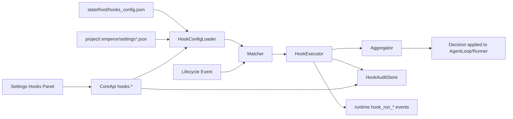
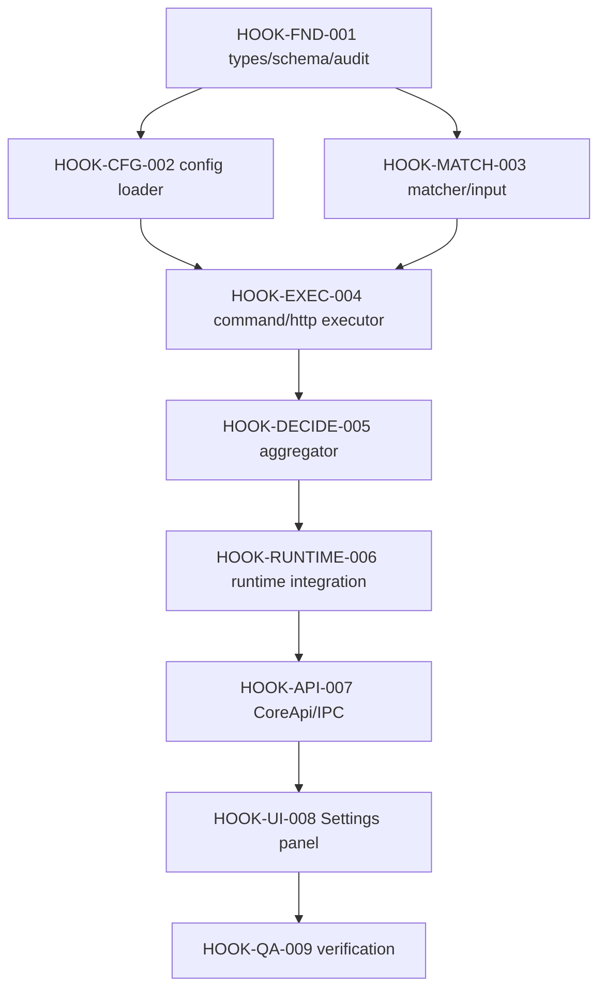

# PLAN-EA-HOOKS-001 · Agent Hooks Implementation Plan

> **Version**: v1.0
> **Date**: 2026-07-07
> **Status**: planned
> **Owner**: Emperor Agent maintainers
> **Depends On**: TypeScript/Electron mainline after Python runtime retirement
> **Depended By**: Hook presets, plugin-distributed hooks, managed policy hooks

> **For implementers**: execute task-by-task with tests first. Do not restore Python runtime, Python Web fallback, or repository-local private runtime data.

## 1. Overview

### 1.1 Problem Statement

Emperor Agent currently relies on prompt guidance, tool descriptions, workspace policy, Ask/Plan, and permission rules to guide agent behavior. These are strong primitives, but they do not provide a user-configurable lifecycle automation layer where deterministic checks run at specific moments such as before a tool call, after a tool result, before stop, or around memory compaction. Claude Code's hooks architecture shows that agent lifecycle hooks are useful when a rule must run reliably, be audited, and optionally block or modify the next action.

The desired state is an Emperor-native hooks system hosted inside `@emperor/core`, exposed through CoreApi/IPC, and manageable from the desktop settings UI. v1 keeps scope controlled: command and HTTP handlers, local/global configuration, project read-only imports, core lifecycle events, runtime/audit visibility, and a basic settings panel. More experimental handlers such as MCP, prompt, agent, plugin, frontmatter, StatusLine, and FileSuggestion are intentionally deferred.

### 1.2 Goals

1. Add a typed hooks subsystem with schema parsing, disk IO, matcher logic, handler execution, decision aggregation, and audit persistence.
2. Support editable global private hooks config under `stateRoot` and read-only project hooks from `.emperor/settings.json` / `.emperor/settings.local.json`.
3. Execute hooks at core lifecycle boundaries: turn start, user prompt submit, tool pre/post/failure, permission request/denial, stop, compaction pre/post, and config changes.
4. Support command and HTTP handlers with timeout, limited environment exposure, JSON stdout protocol, exit-code blocking, and async audit-only execution.
5. Emit runtime events for hook start/progress/completion/failure and applied decisions.
6. Expose CoreApi operations for hooks config, audit, and test runs.
7. Add a Settings hooks panel for visibility and basic global config editing.

### 1.3 Non-Goals

- No Python runtime, Python Web/CLI fallback, or new Python product code.
- No MCP, prompt, agent, plugin, frontmatter, StatusLine, or FileSuggestion handlers in v1.
- No repository-local private hook runtime data; audit and global config live in `stateRoot`.
- No broad auto-approval bypass of existing permission/workspace policy red lines.
- No new heavy runtime dependencies; use Node.js standard library where practical.

### 1.4 Constraints

| Type | Constraint | Reason |
|------|------------|--------|
| Stack | TypeScript / Electron / Vue 3 / Vitest | Project mainline |
| Storage | Global private state under `stateRoot` | Avoid writing runtime private data to project source |
| Security | Hooks do not override workspace deny or permission deny rules | Hooks are automation, not a replacement for core safety |
| Handler scope | Command + HTTP only in v1 | Keeps feature auditable and shippable |
| Config scope | Global editable + project read-only imports | Balances personal use and project sharing |
| Test style | TDD for production behavior | Prevent silent hook regressions |

## 2. Architecture Context

### 2.1 System Boundaries

**In scope**:

- `packages/core/src/hooks/*` for hook models, parser, config, matcher, execution, aggregation, audit.
- `packages/core/src/agent/loop.ts`, `runner.ts`, and `tools/execution.ts` lifecycle integration.
- `packages/core/src/api/core-api.ts` and a new Core hooks service.
- `packages/core/src/runtime/events.ts` and runtime event type projections.
- `desktop/src/renderer/src/views/SettingsView.vue`, renderer types, and a basic hooks panel.

**Out of scope**:

- Hook distribution through project plugins or skills.
- Organization managed policy hooks.
- Hook marketplace/preset packaging.
- Full Claude Code event parity.

### 2.2 Data Flow



### 2.3 Public Interfaces

```typescript
type HookEventName =
  | 'SessionStart'
  | 'UserPromptSubmit'
  | 'PreToolUse'
  | 'PostToolUse'
  | 'PostToolUseFailure'
  | 'PermissionRequest'
  | 'PermissionDenied'
  | 'Stop'
  | 'PreCompact'
  | 'PostCompact'
  | 'ConfigChange'

interface HookCommandHandler {
  type: 'command'
  command: string
  args?: string[]
  timeoutMs?: number
  async?: boolean
  allowedEnv?: string[]
}

interface HookHttpHandler {
  type: 'http'
  url: string
  timeoutMs?: number
  headers?: Record<string, string>
  allowedEnv?: string[]
}
```

CoreApi operations:

- `hooks.getConfig()`
- `hooks.saveConfig(config)`
- `hooks.getAudit({ limit? })`
- `hooks.testRun(input)`

## 3. Dependency & Topology



| Phase | Tasks | Depends On | Parallel |
|-------|-------|------------|----------|
| P0 | `HOOK-FND-001`, `HOOK-MATCH-003` | — | yes |
| P1 | `HOOK-CFG-002`, `HOOK-EXEC-004` | P0 | partly |
| P2 | `HOOK-DECIDE-005`, `HOOK-RUNTIME-006` | P1 | no |
| P3 | `HOOK-API-007`, `HOOK-UI-008` | P2 | no |
| P4 | `HOOK-QA-009` | all | no |

## 4. Task Decomposition

### HOOK-FND-001 · Define Hooks Types, Schema, and Audit Store

- **Purpose**: Establish the typed contract for hook config, hook input/output, and persisted audit records.
- **Scope**: `packages/core/src/hooks/models.ts`, `schema.ts`, `audit.ts`, tests.
- **Excluded**: Runtime integration and UI.
- **Source Mapping**: `config/local-config.ts` parsing pattern, `store/atomic-json.ts`, `runtime/store.ts`.
- **Target Spec**: parse unknown JSON into normalized hooks config; preserve corrupt config as `.corrupt-*`; append JSONL audit rows.
- **Detailed Design**: Hand-written parser accepts only known events and `command`/`http` handlers. Unknown handlers become diagnostics, not runtime hooks. Audit rows include id, eventName, handlerType, source, startedAt, durationMs, status, decision, reason.
- **Dependencies**: none.
- **Risk**: Medium; schema mistakes can silently skip hooks. Mitigation: diagnostics and tests for invalid entries.
- **Test Plan**: valid command/http config, invalid event, invalid handler, defaults, corrupt file fallback, audit append/replay, redaction, empty config.
- **Acceptance Criteria**: normalized config is deterministic; corrupt files are preserved; audit replay is bounded; no `any` in public APIs.
- **Estimate**: 6 hours.
- **Status**: ☐ todo.

### HOOK-CFG-002 · Load Global Editable and Project Read-Only Hooks

- **Purpose**: Merge global and project hook sources without writing private state into project source.
- **Scope**: config loader and source metadata.
- **Excluded**: Project UI editing.
- **Source Mapping**: `AgentLoop.activeSession`, `ProjectStore`, `.emperor` project convention.
- **Target Spec**: Load `stateRoot/hooks_config.json`; when active build session has `project_path`, read `.emperor/settings.json` and `.emperor/settings.local.json` hooks blocks as read-only sources.
- **Detailed Design**: Project hooks run only when `projectHooks.enabled === true` in global config. Duplicate command/http hooks dedupe by source root + event + matcher + payload.
- **Dependencies**: `HOOK-FND-001`.
- **Risk**: High; project hooks execute local commands. Mitigation: disabled by default until global trust flag is enabled and source metadata is visible.
- **Test Plan**: global only, project disabled, project enabled, local override, malformed project file, dedupe, source labels, build vs chat session.
- **Acceptance Criteria**: UI-save path only writes global config; project files are never modified.
- **Estimate**: 5 hours.
- **Status**: ☐ todo.

### HOOK-MATCH-003 · Implement Event Matcher and Input Builder

- **Purpose**: Decide which hooks match each lifecycle event and construct stable JSON input.
- **Scope**: matcher, `if` predicates, event input builders.
- **Excluded**: Handler execution.
- **Target Spec**: matcher supports empty/`*`, pipe lists, and regex. `if` supports v1 deterministic predicates: `Tool(name)`, `Tool(name prefix*)`, and `path:glob`.
- **Detailed Design**: PreToolUse/PostToolUse match on `tool_name`; SessionStart on `source`; ConfigChange on `source`; Stop/Compact default to `*`.
- **Dependencies**: `HOOK-FND-001`.
- **Risk**: Medium. Mitigation: matrix tests for all event match fields.
- **Test Plan**: exact, wildcard, pipe, regex, invalid regex, normalized tool names, if-tool, if-path, event input shape.
- **Acceptance Criteria**: invalid matcher never throws; all hook inputs include session_id, cwd, state_root, hook_event_name.
- **Estimate**: 4 hours.
- **Status**: ☐ todo.

### HOOK-EXEC-004 · Execute Command and HTTP Handlers

- **Purpose**: Run matched handlers and parse responses safely.
- **Scope**: command spawn, HTTP POST, timeout, env allowlist, JSON output parsing.
- **Excluded**: MCP/prompt/agent handlers.
- **Detailed Design**: Command receives hook input on stdin. Exit code `2` maps to block/deny with stderr reason. Exit code `0` parses stdout JSON if present. HTTP handler sends input JSON and only 2xx JSON can produce decisions; transport failure is non-blocking error audit.
- **Dependencies**: `HOOK-CFG-002`, `HOOK-MATCH-003`.
- **Risk**: High; command execution is powerful. Mitigation: timeout default 10s, env allowlist, cwd fixed to workspace, max output cap.
- **Test Plan**: command success, command block exit 2, JSON deny, JSON additionalContext, timeout, async accepted, HTTP 2xx JSON, HTTP failure non-blocking.
- **Acceptance Criteria**: killed process does not hang; stdout/stderr capped; async hooks create audit and do not block.
- **Estimate**: 8 hours.
- **Status**: ☐ todo.

### HOOK-DECIDE-005 · Aggregate Hook Results

- **Purpose**: Convert multiple hook results into one deterministic lifecycle decision.
- **Scope**: result aggregator and decision application helpers.
- **Detailed Design**: Priority is `deny > ask > allow > passthrough`; `updatedInput` only applies when there is no deny and exactly one compatible update exists; `additionalContext` is concatenated with source labels and bounded.
- **Dependencies**: `HOOK-EXEC-004`.
- **Risk**: Medium. Mitigation: priority tests and bounded output.
- **Test Plan**: deny beats allow, ask beats allow, allow alone, passthrough, multiple contexts, conflicting updatedInput, malformed outputs.
- **Acceptance Criteria**: every applied decision emits `hook_decision_applied` and audit metadata.
- **Estimate**: 4 hours.
- **Status**: ☐ todo.

### HOOK-RUNTIME-006 · Integrate Hooks into Core Lifecycle

- **Purpose**: Make hooks affect real agent execution.
- **Scope**: `AgentLoop`, `AgentRunner`, `ToolExecutionEngine`, config service, memory compaction service integration.
- **Detailed Design**: PreToolUse runs after Ask/Plan guard and before actual tool execution; PermissionRequest runs before creating ask interaction; Stop runs before final reply is returned; compaction hooks wrap token/manual compaction; ConfigChange fires after successful saves.
- **Dependencies**: `HOOK-DECIDE-005`.
- **Risk**: High; can regress tool execution. Mitigation: existing runner and permission tests remain green plus new targeted tests.
- **Test Plan**: block write before execution, post hook context feeds next model turn, permission ask override, stop block follow-up, config change audit, compaction pre/post.
- **Acceptance Criteria**: existing Ask/Plan/Permission behavior remains intact; workspace policy deny cannot be bypassed by hook allow.
- **Estimate**: 10 hours.
- **Status**: ☐ todo.

### HOOK-API-007 · Expose CoreApi and Desktop IPC

- **Purpose**: Let desktop read, save, audit, and test-run hooks through CoreApi.
- **Scope**: Core hooks service, CoreApi operation list, IPC bridge, renderer types.
- **Dependencies**: `HOOK-RUNTIME-006`.
- **Risk**: Medium. Mitigation: route operation parity tests.
- **Test Plan**: operation list includes hooks, get/save roundtrip, mutation guard on save, audit limit, testRun command disabled for project sources.
- **Acceptance Criteria**: save is blocked while Ask/Plan pending; bootstrap includes hooks summary.
- **Estimate**: 5 hours.
- **Status**: ☐ todo.

### HOOK-UI-008 · Add Settings Hooks Panel

- **Purpose**: Provide a basic desktop management surface.
- **Scope**: Settings nav, `HooksPanel.vue`, renderer types/helpers.
- **Dependencies**: `HOOK-API-007`.
- **Risk**: Medium. Mitigation: keep UI utilitarian and minimal.
- **Test Plan**: render empty state, show sources/events/handlers, save global config, show audit entries, display diagnostics.
- **Acceptance Criteria**: project hooks are visibly read-only; global JSON editor validates before saving.
- **Estimate**: 6 hours.
- **Status**: ☐ todo.

### HOOK-QA-009 · Verify End-to-End Delivery

- **Purpose**: Confirm the hooks system works in real app paths.
- **Scope**: test gates, desktop build, manual smoke scenarios.
- **Dependencies**: all prior tasks.
- **Test Plan**: protect `.env`, command post-edit audit, stop gate context, config change audit, disabled project hooks, timeout behavior.
- **Acceptance Criteria**: all specified quality commands pass or failures are documented with root cause.
- **Estimate**: 4 hours.
- **Status**: ☐ todo.

## 5. Risk Register

| ID | Severity | Description | Affected Tasks | Probability | Mitigation |
|----|----------|-------------|----------------|-------------|------------|
| R1 | H | Hooks execute local commands with user privileges | EXEC/RUNTIME/API | Medium | Disabled project hooks by default, env allowlist, timeout, audit |
| R2 | H | Hook allow could accidentally bypass existing permission/workspace deny | DECIDE/RUNTIME | Low | Deny rules remain authoritative; allow only skips narrower hook asks, not core deny |
| R3 | M | Existing dirty UI/CoreApi work conflicts with new operations | API/UI | High | Prefer additive files and minimal edits |
| R4 | M | Stop hooks can cause infinite follow-up loops | RUNTIME | Medium | One stop-block follow-up per turn per hook id |
| R5 | M | Async hooks may leak processes | EXEC | Low | Abort/timeout and audit-only completion |

## 6. Receipt Verification

### Startup Verification

- [ ] Desktop dev app starts without CoreApi crash.
- [ ] Bootstrap returns hooks summary.
- [ ] A normal chat turn still sends a model request and can execute read-only tools.

### Functional Completeness Verification

- [ ] PreToolUse command hook can block `write_file`.
- [ ] PostToolUse hook can add bounded context.
- [ ] Stop hook can request one follow-up before final response.
- [ ] ConfigChange hook writes audit after config save.
- [ ] Project hooks are read-only and disabled until trusted.

### Quality Verification

- [ ] `npm test --workspace @emperor/core`
- [ ] `npm run typecheck --workspace @emperor/core`
- [ ] `npm --prefix desktop run test`
- [ ] `npm --prefix desktop run typecheck`
- [ ] `npm --prefix desktop run build`
- [ ] `make check`

## 7. Progress Tracking

> 9 tasks total. Status: ☐ todo · ◐ wip · ☑ done · ⛔ blocked

| ID | Title | Status | PR | Notes |
|----|-------|--------|----|-------|
| HOOK-FND-001 | Define Hooks Types, Schema, and Audit Store | ☐ | — | |
| HOOK-CFG-002 | Load Global Editable and Project Read-Only Hooks | ☐ | — | |
| HOOK-MATCH-003 | Implement Event Matcher and Input Builder | ☐ | — | |
| HOOK-EXEC-004 | Execute Command and HTTP Handlers | ☐ | — | |
| HOOK-DECIDE-005 | Aggregate Hook Results | ☐ | — | |
| HOOK-RUNTIME-006 | Integrate Hooks into Core Lifecycle | ☐ | — | |
| HOOK-API-007 | Expose CoreApi and Desktop IPC | ☐ | — | |
| HOOK-UI-008 | Add Settings Hooks Panel | ☐ | — | |
| HOOK-QA-009 | Verify End-to-End Delivery | ☐ | — | |
