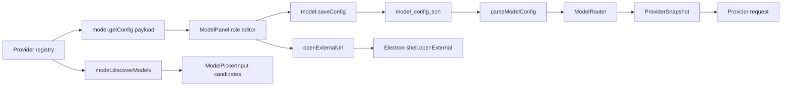
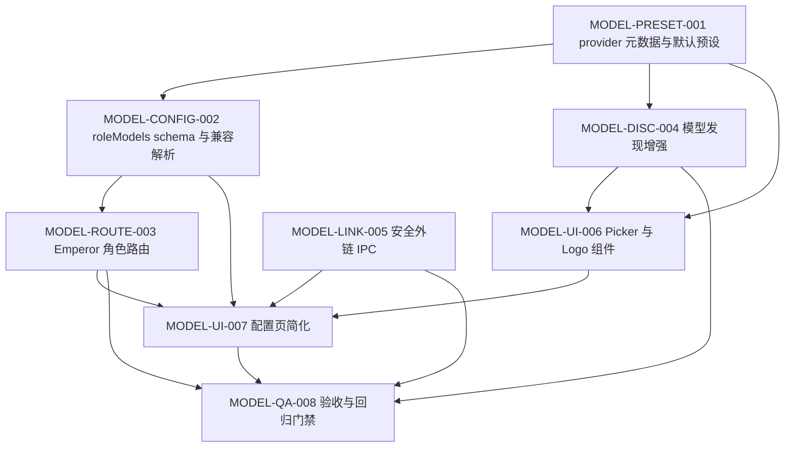

# PLAN-EA-MODEL-002 · 模型厂商默认、角色路由与配置页升级实施计划

> **Version**: v1.0
> **Date**: 2026-07-07
> **Status**: planning
> **Owner**: Emperor Agent maintainers
> **Depends On**: `PLAN-EA-MODEL-001`（模型未配置与会话状态整改）、`docs/roadmap/2026-07-07-cc-switch-model-vendor-research.md`
> **Depended By**: 后续模型定价、用量统计、多 provider 自动路由
> **Progress File**: `docs/superpowers/plans/2026-07-07-model-provider-role-defaults-ui-upgrade.progress.json`
> **Check Script**: `docs/superpowers/plans/2026-07-07-model-provider-role-defaults-ui-upgrade.check_progress.py`

> **For implementers**: 使用 `superpowers:subagent-driven-development` 或 `superpowers:executing-plans` 按任务执行。每个任务先写测试并确认 RED，再实现并确认 GREEN。

## 1. Overview

### 1.1 Problem Statement

当前 `/model` 页面已经具备基础模型条目编辑、`model.discoverModels` 和 provider 下拉，但用户实际测试暴露了三类问题：配置保存仍强制 `Secondary Model ID`，获取模型后原生 `datalist` 在 Electron 中交互弱，官网/API Key 链接没有统一走系统默认浏览器。另一方面，cc-switch 已经沉淀了大量厂商默认配置、logo、模型映射和 1M 上下文开关经验，Emperor 目前只把模型简单拆成 `main/secondary`，缺少清晰、可解释的“简单任务用便宜模型，复杂任务用强大模型”路由。

目标是把 cc-switch 的可验证厂商预设借鉴到 Emperor，但不照搬 Claude Code 的 Sonnet/Opus/Fable/Haiku 命名。Emperor 只保留两个模型角色：`simple` 简单模型和 `powerful` 强大模型；代码、审查、研究、长上下文都归入强大模型，标题、watchlist、轻量后台归入简单模型。最终用户在 fresh state 下能选择厂商、套用默认、获取模型、选择/手填模型 ID、打开官方链接、保存配置，并且 provider 请求 payload 不携带本地 1M 标记。

### 1.2 Goals

1. `Secondary Model ID` 可留空保存；core 路由回退到 `powerful`（旧 schema 中的 main），不再阻塞配置。
2. Provider 元数据补齐 logo、官网、API Key 页面、模型列表 URL、主流默认模型和上下文能力。
3. `openai_codex`、`github_copilot` 保持旧配置兼容读取，但不在 UI 下拉、默认预设、模型发现入口中出现。
4. 新增 Emperor 双角色模型：`simple`、`powerful`，并与旧 `mainModelId` / `secondaryModelId` 双向兼容。
5. 1M/长上下文能力作为 `powerful` 的结构化字段表示；导入 cc-switch 风格 `[1M]` 时只解析为本地能力，不发送给 provider。
6. `model.discoverModels` 优先使用厂商 `modelsUrl`，兼容剥离 `/anthropic`、`/apps/anthropic`、`/step_plan`、`/api/coding` 等子路径后重试。
7. Renderer 使用自定义模型选择控件替代 `datalist`，支持点击展开、搜索、键盘、候选分组和自由输入。
8. 外部链接统一通过 Electron main `shell.openExternal()` 打开，只允许 `http` / `https`。
9. `/model` 页面变成简洁工具型界面：身份、连接、模型角色三块为主，高级参数收起。

### 1.3 Non-Goals

- 不恢复 Python runtime，不新增 Python Web/CLI fallback。
- 不接入 `openai_codex`、`github_copilot` 的 OAuth 或私有模型发现。
- 不把 cc-switch 的 Claude 角色命名作为 Emperor UI 主语义。
- 不引入磁盘 schema migration；旧 `model_config.json` 必须继续可读。
- 不新增定价/用量统计功能；本计划只保留未来扩展字段的兼容空间。
- 不改变 renderer IPC contract 的核心形状；只扩展安全外链能力和模型配置 payload 字段。
- 不把模型列表持久化到磁盘；用户点击获取时内存使用。

### 1.4 Constraints

| Type | Constraint | Reason |
|------|------------|--------|
| Stack | TypeScript / Electron / Vue 3 / Vitest | 项目主线技术栈 |
| Storage | `model_config.json` 兼容旧字段 | 用户已有配置不能迁移失败 |
| Security | 外链只允许 `http` / `https` | 防止 renderer 触发本地协议或 shell 注入 |
| Network | 模型发现 15 秒超时，不落盘 | 避免 UI 卡死和泄露敏感数据 |
| Provider payload | 不发送 `seq`、`turn_id`、`[1M]` 等本地字段 | provider 请求必须保持协议干净 |
| Scope | 只使用主流官方清洗预设 | 避免长尾中转商污染配置体验 |

### 1.5 Reference Inventory

| Source | Usage |
|--------|-------|
| `docs/roadmap/2026-07-07-cc-switch-model-vendor-research.md` | 本地调研，包含主流厂商 base URL、quirk、上下文、模型发现策略 |
| `https://github.com/farion1231/cc-switch` | 参考项目 |
| `cc-switch/src/config/claudeProviderPresets.ts` | 参考厂商默认模型、base URL、1M 能力、API key 页面 |
| `cc-switch/src/config/claudeDesktopProviderPresets.ts` | 参考 Claude Desktop `modelRoutes[].supports1m` 明确 1M 声明 |
| `cc-switch/src/components/providers/forms/shared/ModelInputWithFetch.tsx` | 参考“输入框 + 获取模型 + 下拉选择”交互 |
| `cc-switch/src/components/providers/forms/hooks/useModelState.ts` | 参考模型映射状态管理 |
| `cc-switch/src/components/providers/forms/ClaudeFormFields.tsx` | 参考哪些模型行允许声明 1M：Sonnet/Opus/Fable/Subagent 可勾，Haiku 不可勾 |
| `cc-switch/src-tauri/src/proxy/model_mapper.rs` | 参考 `[1M]` marker 只在本地处理、请求前剥离的做法 |
| `cc-switch/src-tauri/src/claude_desktop_config.rs` | 参考 `[1M]` 到 `supports1m` 的 import 边界翻译 |
| `packages/core/src/config/model-config.ts` | Emperor 当前模型配置 schema、校验、保存 |
| `packages/core/src/model/router.ts` | Emperor 当前 main/secondary 路由 |
| `packages/core/src/providers/registry.ts` | 当前 ProviderSpec 与 providerOptions |
| `packages/core/src/api/services/model-service.ts` | `model.getConfig`、`model.saveConfig`、`model.discoverModels` |
| `desktop/src/renderer/src/components/panels/ModelPanel.vue` | 当前配置页、保存校验、datalist |
| `desktop/src/main/index.ts` / `desktop/src/preload/index.ts` | 外链 IPC 应落点 |

## 2. Architecture Context

### 2.1 System Boundaries

**In scope**:

- `packages/core/src/providers/`：provider 元数据、logo id、默认模型、模型发现元数据。
- `packages/core/src/config/`：`ModelEntry` 扩展、兼容解析、保存校验、masked key 恢复。
- `packages/core/src/model/`：Emperor 双角色路由、1M/长上下文能力选择、不污染 provider payload。
- `packages/core/src/api/services/model-service.ts`：配置 payload、模型发现、测试角色。
- `desktop/src/main` / `desktop/src/preload`：安全外链 IPC。
- `desktop/src/renderer/src/api` / `types.ts`：扩展桥接类型。
- `desktop/src/renderer/src/components/panels/`：模型配置页、模型选择控件、provider logo、角色编辑。
- `assets/generated` 或 `desktop/src/renderer/src/assets/providers`：厂商 logo 资产和授权说明。

**Out of scope**:

- 运行时对多 provider 自动成本优化。
- 模型价格目录和 token 计费面板。
- provider SDK 重写。
- 模型调用链的 prompt snapshot 或 memory compaction 逻辑。

### 2.2 Affected Modules

| File | Action | Description |
|------|--------|-------------|
| `packages/core/src/providers/registry.ts` | Modify | 增加 `icon`、`iconColor`、`modelsUrl`、`roleDefaults` 等 ProviderSpec 字段 |
| `packages/core/src/providers/registry.test.ts` | Modify | 验证 providerOptions 元数据、不可选 provider 过滤、默认预设 |
| `packages/core/src/config/model-config.ts` | Modify | 增加 `roleModels`，解析 `[1M]`，Secondary 可空保存 |
| `packages/core/src/config/model-config.test.ts` | Modify | 兼容 schema、校验、保存、masked key、1M 解析测试 |
| `packages/core/src/model/router.ts` | Modify | 将 `main/secondary` 映射为 Emperor `simple/powerful` 双角色，保持旧 fallback |
| `packages/core/src/model/router.test.ts` | Create/Modify | 覆盖角色路由、长上下文、provider payload 清洁 |
| `packages/core/src/api/services/model-service.ts` | Modify | 返回 role payload，增强模型发现、测试角色 |
| `packages/core/src/api/services/model-service.test.ts` | Modify | Core API 级模型配置和发现回归 |
| `desktop/src/main/index.ts` | Modify | 新增 `emperor:open-external` 和窗口外链拦截 |
| `desktop/src/preload/index.ts` | Modify | 暴露 `openExternalUrl` |
| `desktop/src/renderer/src/api/backend.ts` | Modify | renderer 外链 helper |
| `desktop/src/renderer/src/types.ts` | Modify | ProviderOption、ModelEntry、RoleModel 类型 |
| `desktop/src/renderer/src/components/panels/ModelPanel.vue` | Refactor | 简化页面和角色编辑 |
| `desktop/src/renderer/src/components/panels/model/ModelPickerInput.vue` | Create | 自定义模型 ID 选择控件 |
| `desktop/src/renderer/src/components/panels/model/ProviderLogo.vue` | Create | 统一 provider logo 渲染 |
| `desktop/src/renderer/src/components/onboarding/*` | Modify | onboarding 也使用可空 secondary、picker 和默认预设 |
| `desktop/src/renderer/src/api/*.test.ts` / component tests | Modify/Create | 外链、picker、配置页、onboarding 覆盖 |
| `assets/generated/PROMPTS.md` or provider asset notice | Modify | 记录引入/生成 logo 来源和授权 |

### 2.3 Data Flow



### 2.4 Core Data Invariants

1. **旧配置可读**：没有 `roleModels` 的 entry 必须派生出 `simple` 和 `powerful`，不会报错。
2. **保存不丢字段**：保存新的 `roleModels` 时，保留 `extraHeaders`、`extraBody`、`supportsVision`、masked key 恢复逻辑。
3. **请求模型 ID 干净**：provider 请求中的 `model` 不包含 `[1M]`、`[1m]`、role label 或 UI-only 字段。
4. **Secondary 可空**：`secondaryModelId === ''` 是合法状态，表示 `simple` 未单独配置，运行时回退 `powerful`。
5. **不可选 provider 不露出**：`openai_codex` 和 `github_copilot` 不出现在 `providerOptions()`，但 `findByName()` 仍能找到。
6. **模型发现不写盘**：点击获取模型列表不会修改 `model_config.json`。
7. **外链不可本地执行**：`file:`、`app:`、`javascript:`、空 URL 均返回错误，不调用 `shell.openExternal()`。

## 3. Dependency & Topology

### 3.1 Upstream Dependencies

| Plan/System | Status | Depends On |
|-------------|--------|------------|
| `PLAN-EA-MODEL-001` | implemented locally | 无模型配置启动提示、模型发现 API 基础 |
| `docs/roadmap/2026-07-07-cc-switch-model-vendor-research.md` | available | cc-switch 主流厂商调研 |
| Electron preload bridge | available | `window.emperor` bridge |
| CoreApi `model.discoverModels` | available | 当前已注册 operation |

### 3.2 Downstream Impact

| System | Impact | Blocked On |
|--------|--------|------------|
| AgentLoop model selection | 可以按 Emperor role 路由模型 | `MODEL-ROUTE-003` |
| Onboarding model setup | 可直接套用厂商默认 | `MODEL-UI-007` |
| Future usage/cost panel | 可复用 provider icon、modelsUrl、role defaults | `MODEL-PRESET-001` |
| Manual Electron QA | fresh state 模型配置路径可完整走通 | `MODEL-QA-008` |

### 3.3 Task Dependency Graph



### 3.4 Topological Sort

| Phase | Tasks | Depends On | Parallel |
|-------|-------|------------|----------|
| P0 | `MODEL-PRESET-001`, `MODEL-LINK-005` | — | yes |
| P1 | `MODEL-CONFIG-002`, `MODEL-DISC-004` | `MODEL-PRESET-001` | yes |
| P2 | `MODEL-ROUTE-003`, `MODEL-UI-006` | `MODEL-CONFIG-002`, `MODEL-DISC-004` | yes |
| P3 | `MODEL-UI-007` | `MODEL-LINK-005`, `MODEL-ROUTE-003`, `MODEL-UI-006` | no |
| P4 | `MODEL-QA-008` | all previous | no |

## 4. Task Decomposition

### MODEL-PRESET-001 · 扩展 ProviderSpec 与厂商默认预设

1. **Task ID + Title**: `MODEL-PRESET-001 · 扩展 ProviderSpec 与厂商默认预设`

2. **Purpose & Scope**
   - **Purpose**: 把 cc-switch 中可验证的主流厂商默认、logo、模型发现 URL 和上下文能力转成 Emperor 数据驱动配置。
   - **Scope**: `ProviderSpec` 字段扩展、`providerOptions()` payload、主流 provider 默认 role presets、logo id 和授权记录。
   - **Excluded**: 不实现 UI 页面；不新增 OAuth provider 接入；不新增价格目录。

3. **Source Mapping**
   - `packages/core/src/providers/registry.ts` — `ProviderSpec`、`spec()`、`PROVIDERS`、`providerOptions()`
   - `packages/core/src/providers/registry.test.ts` — provider metadata 单元测试
   - `docs/roadmap/2026-07-07-cc-switch-model-vendor-research.md` — 清洗后的厂商默认和 quirk
   - `cc-switch/src/config/claudeProviderPresets.ts` — 参考默认模型、base URL、1M 能力
   - `cc-switch/src/components/ProviderIcon.tsx`、`cc-switch/src/config/iconInference.ts`、`cc-switch/src/icons/extracted/` — 参考 logo 映射

4. **Target Specification**
   - **Target (TS)**:
     ```typescript
     export type EmperorModelRole =
       | 'simple'
       | 'powerful'

     export interface ProviderRoleDefault {
       modelId: string
       label?: string
       contextWindowTokens?: number
       maxTokens?: number
       supportsLongContext?: boolean
       longContextSource?: 'ccswitch_supports1m' | 'ccswitch_marker' | 'vendor_context' | 'manual'
     }

     export interface ProviderSpec {
       icon: string | null
       iconColor: string | null
       modelsUrl: string | null
       roleDefaults: Partial<Record<EmperorModelRole, ProviderRoleDefault>>
     }
     ```
   - `providerOptions()` 增加 `icon`、`iconColor`、`modelsUrl`、`roleDefaults`，继续过滤 `selectable === false`。
   - Logo 资产落到 renderer 可打包路径，core 只下发 `icon` id，不直接依赖图片文件。

5. **Detailed Design**

   #### Data Models

   ```typescript
   export const EMPEROR_MODEL_ROLES = ['simple', 'powerful'] as const
   export type EmperorModelRole = typeof EMPEROR_MODEL_ROLES[number]

   export interface ProviderRoleDefault {
     modelId: string
     label?: string
     contextWindowTokens?: number
     maxTokens?: number
     supportsLongContext?: boolean
     longContextSource?: 'ccswitch_supports1m' | 'ccswitch_marker' | 'vendor_context' | 'manual'
   }
   ```

   #### Default Preset Table

   | Provider | simple | powerful | Powerful Context |
   |----------|--------|----------|------------------|
   | `deepseek` | `deepseek-v4-flash` | `deepseek-v4-pro` | 1,000,000 |
   | `dashscope` | `qwen3.5-plus` | `qwen3.5-plus` | 32,000 |
   | `moonshot` | `kimi-k2.7-code` | `kimi-k2.7-code` | 262,144 |
   | `zhipu` | `glm-5.1` | `glm-5.1` | 128,000 |
   | `volcengine` | `doubao-seed-2-1-pro-260628` | `doubao-seed-2-1-pro-260628` | 262,144 |
   | `volcengine_coding_plan` | `ark-code-latest` | `ark-code-latest` | 256,000 |
   | `byteplus` | `ark-code-latest` | `ark-code-latest` | 256,000 |
   | `minimax` | `MiniMax-M2.7` | `MiniMax-M2.7` | 200,000 |
   | `stepfun` | `step-3.5-flash-2603` | `step-3.5-flash-2603` | 262,144 |
   | `xiaomi_mimo` | `mimo-v2.5-pro` | `mimo-v2.5-pro` | 1,048,576 |
   | `longcat` | `LongCat-2.0` | `LongCat-2.0` | 1,048,576 |
   | `qianfan` | `qianfan-code-latest` | `qianfan-code-latest` | 131,072 |
   | `openrouter` | `anthropic/claude-haiku-4.5` | `anthropic/claude-sonnet-5` | 1,000,000 |
   | `siliconflow` | `Pro/MiniMaxAI/MiniMax-M2.7` | `Pro/MiniMaxAI/MiniMax-M2.7` | 200,000 |
   | local/custom | empty | empty | manual |

   #### Key Algorithms

   **providerOptions flow**:
   ```
   1. Iterate PROVIDERS.
   2. Skip provider when selectable === false.
   3. Return UI-safe metadata:
      name, displayName, backend, websiteUrl, apiKeyUrl, modelDiscovery,
      defaultApiBase, region, isGateway, isLocal, isOauth, isDirect,
      thinkingStyle, icon, iconColor, modelsUrl, roleDefaults.
   4. Do not include apiKey, envKey, envExtras, or any secret-bearing value.
   ```

   **URL cleanup rule**:
   ```
   1. Only store official vendor URLs.
   2. Remove query params used for referral or affiliate tracking.
   3. Preserve hash fragments only when they are necessary for official console routing.
   4. If no official URL is known, store null and hide link in UI.
   ```

   **1M source-of-truth rule**:
   ```
   1. First read cc-switch Claude Desktop presets:
      modelRoutes[].supports1m === true => supportsLongContext = true,
      longContextSource = 'ccswitch_supports1m'.
   2. Then read cc-switch Claude Code env presets:
      trailing [1M]/[1m] on a model env value => supportsLongContext = true,
      longContextSource = 'ccswitch_marker'.
   3. UI capability alone is not proof of support:
      ClaudeFormFields allows Sonnet/Opus/Fable/Subagent to declare 1M and blocks Haiku,
      but this only tells whether a row may expose the toggle.
   4. Vendor/research context numbers populate contextWindowTokens only.
      They do not auto-check supportsLongContext unless cc-switch has supports1m or [1M].
   5. Unknown or conflicting data defaults to supportsLongContext = false and keeps manual toggle available.
   ```

   #### State Machine

   | Current State | Event | New State | Side Effect |
   |---------------|-------|-----------|-------------|
   | Provider registered | providerOptions called | Visible option | Include icon/defaults if selectable |
   | Provider registered | selectable false | Hidden option | Still findable by `findByName()` |
   | Provider lacks role default | UI applies defaults | Manual role rows | No synthetic unknown model id |

   #### Invariants

   1. **No secret leak**: `assert(!('envKey' in providerOptions()[0]))`
   2. **OAuth hidden**: `assert(providerOptions().every(o => !['openai_codex','github_copilot'].includes(o.name)))`
   3. **Registry compatibility**: `assert(findByName('github_copilot') !== undefined)`
   4. **Role default shape**: Every non-empty role default has `modelId.trim().length > 0`.
   5. **Logo optionality**: Missing logo never blocks provider selection.

   #### Edge Cases

   | Scenario | Expected Behavior |
   |----------|-------------------|
   | Provider has no `modelsUrl` | `modelsUrl` is `null`; discovery falls back to apiBase logic |
   | Provider has no logo | UI renders text/initial fallback |
   | Provider has partial role defaults | Missing role derives from the other role in config layer |
   | Provider has `selectable: false` | Not present in UI options, old configs still parse |
   | URL includes referral query | Query removed before registry entry |
   | Local provider has no API key URL | API Key link hidden |
   | Unknown provider in old config | `findByName` fallback remains `custom` |
   | Role default marks 1M through `supports1m` | `supportsLongContext: true`, `longContextSource: 'ccswitch_supports1m'`, no `[1M]` in `modelId` |
   | Role default marks 1M through `[1M]` suffix | `supportsLongContext: true`, `longContextSource: 'ccswitch_marker'`, suffix stripped from `modelId` |
   | Provider only has a large context number | Fill `contextWindowTokens`, keep `supportsLongContext` false unless user enables it |

   #### Compatibility

   - No disk schema change is required by this task.
   - `providerOptions()` remains an array of plain objects.
   - Existing renderer fields keep their current names.

   #### Library Selection

   - Do not install a large icon dependency for v1.
   - Import/copy only needed provider logo assets under project assets with license notice.

6. **Dependencies**
   - **Internal dependencies**: none.
   - **External dependencies**: cc-switch MIT-licensed assets or equivalent vendor logo assets; official vendor links.

7. **Risk / Complexity**
   - **Complexity**: M
   - **Risk sources**:
     1. Some cc-switch defaults are optimized for Claude Code proxy shape, not Emperor provider calls.
     2. Provider model names may change over time.
     3. Logo asset licensing must be explicit.
     4. A default model can be unavailable for a user's account.
   - **Mitigation strategy**:
     1. Treat defaults as editable seed values, not validation constraints.
     2. Model discovery remains available and free input is preserved.
     3. Record source and license in asset notice/PROMPTS document.
     4. Tests assert field shape, not live vendor availability.

8. **Test Plan**

   #### New Tests

   1. Happy: `providerOptions()` includes `deepseek.icon`, `deepseek.modelsUrl`, `deepseek.roleDefaults.powerful`.
   2. Happy: preset with cc-switch `supports1m: true` maps to `roleDefaults.powerful.supportsLongContext === true` and `longContextSource === 'ccswitch_supports1m'`.
   3. Happy: local providers are selectable and have no required API key URL.
   4. Edge: `openai_codex` and `github_copilot` are absent from options.
   5. Edge: `findByName('github-copilot')` still resolves.
   6. Edge: provider with missing logo returns `icon: null`.
   7. Edge: model env value with trailing `[1M]` maps to `longContextSource === 'ccswitch_marker'`.
   8. Edge: provider with only vendor context window does not auto-enable `supportsLongContext`.
   9. Error: malformed preset with blank model id is rejected by a local assertion helper.
   10. Error: provider URL with unsupported protocol fails registry test.
   11. Regression: existing option fields `name/displayName/defaultApiBase/region` are unchanged.

   #### TDD Flow

   1. Write registry tests above.
   2. Run `npm test --workspace @emperor/core -- packages/core/src/providers/registry.test.ts` and confirm RED.
   3. Implement fields and presets.
   4. Re-run the same test and confirm GREEN.

9. **Acceptance Criteria**
   - [ ] ProviderSpec exposes `icon`, `iconColor`, `modelsUrl`, `roleDefaults`.
   - [ ] `providerOptions()` returns UI-safe metadata only.
   - [ ] `openai_codex` and `github_copilot` are hidden from UI options.
   - [ ] Mainstream providers have clean official links and no affiliate params.
   - [ ] `supports1m` and `[1M]` capability are represented structurally with `longContextSource`.
   - [ ] Vendor context window numbers do not automatically imply checked 1M support.
   - [ ] Logo asset source and license are documented.

10. **Effort Estimate**
   - 6 hours: registry/data modeling 2h, defaults 2h, logo assets 1h, tests 1h.

11. **Status**
   - ☐ todo

12. **Notes**
   - Default model names are seed values. The UI must allow manual overrides after applying defaults.

### MODEL-CONFIG-002 · 增加 roleModels schema 与兼容解析

1. **Task ID + Title**: `MODEL-CONFIG-002 · 增加 roleModels schema 与兼容解析`

2. **Purpose & Scope**
   - **Purpose**: 让 `model_config.json` 能表达 Emperor 自定义角色模型，并保持旧 `mainModelId` / `secondaryModelId` 兼容。
   - **Scope**: `ModelEntry` 类型、parse/normalize/save、validation、wizard config、Secondary 可空、1M marker 解析。
   - **Excluded**: 不改 router 选择策略；不改 UI 布局。

3. **Source Mapping**
   - `packages/core/src/config/model-config.ts` — `ModelEntry`、`WizardModelSettings`、`normalizedRaw()`、`parseEntry()`、`validateCompleteModelEntries()`、`buildWizardModelConfig()`
   - `packages/core/src/config/model-config.test.ts` — schema 与保存测试
   - `desktop/src/renderer/src/components/onboarding/onboardingModel.ts` — onboarding draft validation 同步修改

4. **Target Specification**

   ```typescript
   export interface RoleModelConfig {
     modelId: string
     label: string
     contextWindowTokens: number | null
     maxTokens: number | null
     supportsLongContext: boolean
     longContextSource: 'ccswitch_supports1m' | 'ccswitch_marker' | 'vendor_context' | 'manual' | null
   }

   export interface ModelEntry {
     roleModels: Partial<Record<EmperorModelRole, RoleModelConfig>>
   }
   ```

   - `secondaryModelId` 类型保持 `string`，空字符串合法。
   - 保存时写入 `roleModels`，并镜像 `id/mainModelId/secondaryModelId`：`powerful -> mainModelId`，`simple -> secondaryModelId`。
   - `[1M]` / `[1m]` 只在 parse/normalize 阶段转换成 `supportsLongContext`。

5. **Detailed Design**

   #### Data Models

   ```typescript
   export interface RoleModelConfig {
     modelId: string
     label: string
     contextWindowTokens: number | null
     maxTokens: number | null
     supportsLongContext: boolean
     longContextSource: 'ccswitch_supports1m' | 'ccswitch_marker' | 'vendor_context' | 'manual' | null
   }

   type RawRoleModels = Partial<Record<EmperorModelRole, Partial<RoleModelConfig> | string>>
   ```

   #### Key Algorithms

   **deriveRoleModels(entry, providerDefaults) flow**:
   ```
   1. Read raw roleModels when present.
   2. Normalize each role:
      a. string value => { modelId: string }
      b. object value => normalize fields
      c. blank modelId => omit role
   3. Strip local long-context marker from modelId.
   4. If no powerful exists, set powerful from mainModelId || id.
   5. If no simple exists:
      a. use secondaryModelId when non-empty
      b. else use powerful modelId
   6. If provider defaults include powerful long-context capability, attach it to roleModels.powerful.
   7. Mirror:
      id = powerful.modelId
      mainModelId = powerful.modelId
      secondaryModelId = simple.modelId === powerful.modelId ? '' : simple.modelId
   ```

   **strip marker flow**:
   ```
   1. Match trailing "[1M]" or "[1m]" with optional whitespace.
   2. Remove marker from modelId.
   3. Set supportsLongContext = true and longContextSource = 'ccswitch_marker'.
   4. If contextWindowTokens is empty, set to 1_000_000.
   5. Return clean modelId and capability fields.
   ```

   #### State Machine

   | Current State | Event | New State | Side Effect |
   |---------------|-------|-----------|-------------|
   | Legacy entry | parse | Derived role entry | No disk write |
   | Role entry | save | Mirrored role entry | `mainModelId` and `secondaryModelId` updated |
   | Role entry with `[1M]` | parse | Clean role entry | Long-context flag set |
   | Empty secondary | validate | Valid | Simple falls back to powerful |

   #### Invariants

   1. **Powerful required**: `assert(entry.roleModels.powerful?.modelId)`
   2. **Clean IDs**: `assert(!entry.roleModels.powerful.modelId.includes('[1M]'))`
   3. **Mirror main**: `assert(entry.mainModelId === entry.roleModels.powerful.modelId)`
   4. **Secondary optional**: `assert(entry.secondaryModelId === '' || entry.secondaryModelId === entry.roleModels.simple?.modelId)`
   5. **No migration side effect**: Loading old config does not write file.

   #### Edge Cases

   | Scenario | Expected Behavior |
   |----------|-------------------|
   | Old entry has only `mainModelId` | powerful and simple both derive from main |
   | Old entry has main and secondary | powerful uses main, simple uses secondary |
   | roleModels.powerful missing but main exists | powerful set from main |
   | roleModels.simple same as powerful | `secondaryModelId` saved as empty string |
   | model id `deepseek-v4-pro[1M]` | saved model id is `deepseek-v4-pro`, long context enabled |
   | model id contains `[1M]` in middle | left unchanged unless trailing marker |
   | roleModels has unknown role key | preserved in raw but ignored by typed router |
   | Duplicate model entry name | existing dedupe behavior remains |

   #### Compatibility

   - Disk format remains JSON with 2-space indent and trailing newline.
   - Unknown raw fields remain preserved by `deepMerge` and `normalizedRaw`.
   - Existing renderer that only reads `mainModelId` / `secondaryModelId` still works.

   #### Library Selection

   - Native TypeScript helpers only. No schema library added.

6. **Dependencies**
   - **Internal dependencies**: `MODEL-PRESET-001`.
   - **External dependencies**: none.

7. **Risk / Complexity**
   - **Complexity**: L
   - **Risk sources**:
     1. Mirroring role fields can accidentally overwrite user-entered main/secondary.
     2. Masked API key restore happens during save and must remain unaffected.
     3. Onboarding and panel may have duplicate validation logic.
   - **Mitigation strategy**:
     1. All mirror behavior is deterministic and covered by snapshot-style config tests.
     2. Keep `restoreMaskedKeys()` in service unchanged and test save with masked key.
     3. Update onboarding validation in same task.

8. **Test Plan**

   #### New Tests

   1. Happy: old main/secondary config parses into powerful/simple roles.
   2. Happy: roleModels config saves and mirrors `mainModelId`.
   3. Happy: simple equal powerful saves `secondaryModelId: ''`.
   4. Edge: missing secondary passes `validateCompleteModelEntries()`.
   5. Edge: `[1M]` trailing marker becomes structured long-context capability.
   6. Edge: unknown role key is preserved in raw config.
   7. Error: missing powerful/main still fails validation.
   8. Error: duplicate entry names still fail validation.
   9. Regression: masked API key is restored during save.
   10. Regression: onboarding draft accepts empty secondary.

   #### TDD Flow

   1. Write config and onboarding tests.
   2. Run targeted tests and confirm RED.
   3. Implement schema normalization and validation changes.
   4. Re-run tests and confirm GREEN.

9. **Acceptance Criteria**
   - [ ] `secondaryModelId` empty is legal.
   - [ ] Old configs derive role models without disk mutation.
   - [ ] New configs persist role models and legacy mirrors.
   - [ ] `[1M]` never remains in parsed `modelId`.
   - [ ] Existing masked key flow still works.

10. **Effort Estimate**
   - 10 hours: schema 4h, validation 2h, onboarding compatibility 1h, tests 3h.

11. **Status**
   - ☐ todo

12. **Notes**
   - This task introduces the schema, but routing behavior is implemented in `MODEL-ROUTE-003`.

### MODEL-ROUTE-003 · 实现 Emperor 角色路由与干净 provider payload

1. **Task ID + Title**: `MODEL-ROUTE-003 · 实现 Emperor 角色路由与干净 provider payload`

2. **Purpose & Scope**
   - **Purpose**: 让 runtime 根据 Emperor `simple/powerful` 双角色选择模型，并在复杂或长上下文场景优先使用 `powerful`。
   - **Scope**: `ModelRole` 扩展、`ProviderSnapshot`、`ModelRouter.route()`、`buildProviderSnapshot()`、model test role。
   - **Excluded**: 不实现 UI；不改变 provider factory 协议。

3. **Source Mapping**
   - `packages/core/src/model/router.ts` — `ModelRole`、`ProviderSnapshot`、`ModelRouter.route()`、`entryModelForRole()`
   - `packages/core/src/api/services/model-service.ts` — `CurrentModelPayload`、`test()`、`snapshotForModelTest()`
   - `packages/core/src/agent/runner.ts` and callers — confirm snapshots continue to pass clean model id
   - `packages/core/src/subagents/*` and `packages/core/src/team/*` — agent type names used by router

4. **Target Specification**

   ```typescript
   export type ModelRole = EmperorModelRole

   export interface ProviderSnapshot {
     modelRole: ModelRole
     routeReason: string
     contextWindowTokens: number
   }
   ```

   Routing table:

   | Use case / agent | Role |
   |------------------|------|
   | `main_agent` | `powerful` |
   | `memory_compaction` | `simple`, unless estimated too large then `powerful` |
   | `watchlist_check` | `simple` |
   | `session_title` | `simple` |
   | `subagent/team: neiguan_yingzao` | `powerful` |
   | `subagent/team: dongchang_tanshi` | `powerful` |
   | `subagent/team: shangbao_dianbu` | `powerful` |
   | `subagent/team: sili_suitang` | `powerful` |
   | `subagent/team: xiaohuangmen` | `simple` |
   | unknown use case | `powerful` |

5. **Detailed Design**

   #### Data Models

   ```typescript
   interface RoleSelection {
     role: ModelRole
     modelId: string
     routeReason: string
     contextWindowTokens: number
     supportsVision: boolean
   }
   ```

   #### Key Algorithms

   **selectRole flow**:
   ```
   1. Determine preferred role by useCase and agentType.
   2. Estimate tokens with roughTokenEstimate(task) when task is available.
   3. If estimated tokens exceed preferredRole.contextWindowTokens * 0.65:
      a. If powerful has larger context, use powerful.
      b. Else keep preferred role and expose reason ":context_risk".
   4. If preferred role has no model id, fallback:
      a. simple -> powerful
      b. powerful missing -> synth legacy entry
   5. Build ProviderSnapshot with clean model id.
   ```

   **provider payload cleanliness**:
   ```
   1. buildProviderSnapshot receives selected role config.
   2. It uses role.modelId after stripLongContextMarker normalization.
   3. createProvider defaultModel receives clean modelId.
   4. AgentRunner passes snapshot.model to provider.chat().
   5. No role metadata is added to provider messages or request body.
   ```

   #### State Machine

   | Current State | Event | New State | Side Effect |
   |---------------|-------|-----------|-------------|
   | powerful route | normal main turn | powerful snapshot | no fallback |
   | simple route | context too large | powerful snapshot | fallback reason recorded |
   | simple route | simple missing | powerful snapshot | routeReason includes fallback |
   | old config | route any use case | derived role snapshot | no disk write |

   #### Invariants

   1. **Model never blank**: `assert(snapshot.model.trim().length > 0)`
   2. **No marker upstream**: `assert(!snapshot.model.match(/\[1m\]$/i))`
   3. **Simple fallback safe**: If simple missing, route returns powerful and no exception.
   4. **Vision remains powerful only**: `supportsVision` is true only when selected role maps to powerful with entry vision enabled.
   5. **Payload stable**: `payload().mainModel` remains compatible for status UI.

   #### Edge Cases

   | Scenario | Expected Behavior |
   |----------|-------------------|
   | No models configured | existing synthetic default behavior remains |
   | roleModels absent | derive powerful from main and simple from secondary/main |
   | simple context too small and powerful configured | route to powerful |
   | powerful and simple use same model | snapshot role still records requested simple/powerful role |
   | coding or review subagent | route to powerful |
   | unknown agent type | powerful |
   | model override passed | selected entry respected, then role selected within that entry |

   #### Compatibility

   - `ModelRouter.payload()` keeps `mainModel`, `secondaryModel`, `fallbackToMain`.
   - `modelRole` string changes from `main/secondary` to Emperor role values; renderer must treat it as display metadata.

   #### Library Selection

   - No third-party routing library.

6. **Dependencies**
   - **Internal dependencies**: `MODEL-CONFIG-002`.
   - **External dependencies**: none.

7. **Risk / Complexity**
   - **Complexity**: L
   - **Risk sources**:
     1. Existing tests may assert `modelRole === 'main'`.
     2. Context-risk routing could unexpectedly select expensive models.
     3. ProviderSnapshot is shared by runner, tests, status UI.
   - **Mitigation strategy**:
     1. Update tests to assert role semantics, not old string names.
     2. Auto switch to powerful only happens when estimated tokens exceed 65% of simple context.
     3. Keep `payload()` legacy fields for status display.

8. **Test Plan**

   #### New Tests

   1. Happy: `main_agent` routes to `powerful`.
   2. Happy: `session_title` routes to `simple`.
   3. Happy: `neiguan_yingzao` routes to `powerful`.
   4. Happy: `dongchang_tanshi` routes to `powerful`.
   5. Edge: missing simple falls back powerful.
   6. Edge: large simple task switches to powerful.
   7. Edge: old main/secondary config still routes.
   8. Error: blank selected model triggers validation before provider creation.
   9. Error: unsupported provider falls back custom as current behavior.
   10. Regression: snapshot.model never includes `[1M]`.

   #### TDD Flow

   1. Add router tests and service model test role assertions.
   2. Run targeted tests and confirm RED.
   3. Implement route selection and snapshot changes.
   4. Re-run targeted and core model tests and confirm GREEN.

9. **Acceptance Criteria**
   - [ ] Runtime can route all listed use cases to Emperor roles.
   - [ ] Simple-to-powerful routing is deterministic and bounded by token estimate.
   - [ ] Provider request model id is clean.
   - [ ] Legacy payload fields still exist.
   - [ ] Tests cover old and new config shapes.

10. **Effort Estimate**
   - 12 hours: route design 3h, implementation 4h, service compatibility 2h, tests 3h.

11. **Status**
   - ☐ todo

12. **Notes**
   - If future UI exposes per-turn manual role selection, it should call into this router rather than bypass it.

### MODEL-DISC-004 · 增强模型发现与候选数据

1. **Task ID + Title**: `MODEL-DISC-004 · 增强模型发现与候选数据`

2. **Purpose & Scope**
   - **Purpose**: 让“获取模型列表”对主流厂商更稳定，并提供足够数据给自定义 picker 展示。
   - **Scope**: `model.discoverModels`、endpoint 候选生成、`modelsUrl` 优先、masked key 恢复、结果去重排序。
   - **Excluded**: 不做磁盘缓存；不实现前端 dropdown。

3. **Source Mapping**
   - `packages/core/src/api/services/model-service.ts` — `discoverModels()`、`discoverOpenAiCompatibleModels()`、`discoveryApiBase()`、`discoveryApiKey()`
   - `packages/core/src/api/services/model-service.test.ts` — discovery tests
   - `packages/core/src/api/core-api.ts` — operation list already includes `model.discoverModels`
   - `desktop/src/renderer/src/api/model.ts` — renderer wrapper payload

4. **Target Specification**

   ```typescript
   export interface ModelDiscoveryPayload {
     ok: boolean
     provider: string
     apiBase: string | null
     source: string
     models: Array<{ id: string; ownedBy?: string; created?: number | string }>
     code?: 'credential_required' | 'unsupported_backend' | 'missing_api_base' | 'request_failed' | 'invalid_response'
     message?: string
   }
   ```

   - `source` contains the endpoint URL used for successful responses.
   - `modelsUrl` from ProviderSpec is attempted before derived endpoints.

5. **Detailed Design**

   #### Data Models

   ```typescript
   interface DiscoveryCandidate {
     url: string
     source: 'provider_models_url' | 'api_base_models' | 'normalized_api_base_models'
   }
   ```

   #### Key Algorithms

   **candidate generation flow**:
   ```
   1. If spec.modelsUrl exists, push it first.
   2. Resolve apiBase from input, entry, provider config, spec.defaultApiBase.
   3. Normalize apiBase:
      a. trim trailing slash
      b. remove /anthropic
      c. remove /api/anthropic
      d. remove /apps/anthropic
      e. remove /step_plan
      f. remove /api/coding and /api/coding/v3
   4. For OpenAI compatible:
      a. if base already ends /v1, use base + /models
      b. else try base + /v1/models and base + /models
   5. Deduplicate candidates by exact URL.
   6. Attempt candidates sequentially with 15s timeout.
   7. First valid model list returns ok.
   8. All failures return request_failed with last safe error message.
   ```

   **response normalization flow**:
   ```
   1. Accept OpenAI shape: { data: [{ id, owned_by, created }] }.
   2. Accept Anthropic shape: { data: [{ id, display_name, created_at }] }.
   3. Drop items without string id.
   4. Deduplicate by id.
   5. Sort stable by provider order when present; otherwise lexicographic id.
   6. Return at most all received models; UI handles filtering.
   ```

   #### State Machine

   | Current State | Event | New State | Side Effect |
   |---------------|-------|-----------|-------------|
   | idle | request with missing remote key | unavailable | no network |
   | idle | local provider no key | fetching | network allowed |
   | fetching | first candidate ok | success | models returned |
   | fetching | candidate fails | fetching next | no throw until exhausted |
   | fetching | all fail | failed | safe code/message |

   #### Invariants

   1. **No disk writes**: discovery never calls `saveModelConfig`.
   2. **Masked key restore in memory only**: `***last4` can recover existing key for request.
   3. **Local providers allow no key**: `assert(spec.isLocal || apiKeyRequired)`.
   4. **Unsupported stable**: Azure/Bedrock return `unsupported_backend`, no internal error.
   5. **Result ids unique**: `new Set(models.map(m => m.id)).size === models.length`.

   #### Edge Cases

   | Scenario | Expected Behavior |
   |----------|-------------------|
   | DeepSeek apiBase `https://api.deepseek.com/anthropic` | Try `modelsUrl` or normalized `/models` |
   | DashScope `/apps/anthropic` | Strip subpath before compatible `/v1/models` candidates |
   | StepFun `/step_plan` | Strip subpath and try `/v1/models` |
   | Remote provider missing key | Return `credential_required` without network |
   | Ollama missing key | Network request allowed |
   | Masked key submitted | Existing real key used only in memory |
   | Invalid JSON response | Return `invalid_response` |
   | Network timeout | Return `request_failed` with timeout message |

   #### Compatibility

   - Core operation key remains `model.discoverModels`.
   - Renderer wrapper signature remains compatible with existing call.

   #### Library Selection

   - Use built-in `fetch`/AbortController already available in Node/Electron runtime.

6. **Dependencies**
   - **Internal dependencies**: `MODEL-PRESET-001`.
   - **External dependencies**: live provider endpoints only in manual QA; tests mock fetch.

7. **Risk / Complexity**
   - **Complexity**: M
   - **Risk sources**:
     1. Provider endpoints differ subtly.
     2. Network tests can be flaky if live.
     3. Error messages can leak raw provider internals.
   - **Mitigation strategy**:
     1. Unit tests mock each endpoint shape.
     2. No live network in automated tests.
     3. Return safe user-facing messages and code.

8. **Test Plan**

   #### New Tests

   1. Happy: OpenAI-compatible `{ data }` returns deduped models.
   2. Happy: Anthropic models endpoint returns normalized models.
   3. Happy: `modelsUrl` is attempted before derived apiBase.
   4. Edge: DeepSeek `/anthropic` path normalizes.
   5. Edge: DashScope `/apps/anthropic` path normalizes.
   6. Edge: local provider with no key still fetches.
   7. Error: remote provider with no key returns `credential_required`.
   8. Error: Azure/Bedrock return `unsupported_backend`.
   9. Error: invalid response returns `invalid_response`.
   10. Regression: masked key restore does not write config.

   #### TDD Flow

   1. Add mocked service tests.
   2. Run targeted tests and confirm RED.
   3. Implement candidate generation and normalization.
   4. Re-run targeted tests and confirm GREEN.

9. **Acceptance Criteria**
   - [ ] `modelsUrl` priority works.
   - [ ] Common cc-switch Anthropic-compatible subpaths are stripped.
   - [ ] Missing credential and unsupported backend are clear non-throw payloads.
   - [ ] Results are deduped and UI-friendly.
   - [ ] No disk writes occur during discovery.

10. **Effort Estimate**
   - 8 hours: endpoint logic 3h, result normalization 2h, tests 3h.

11. **Status**
   - ☐ todo

12. **Notes**
   - Manual QA should verify at least one real provider with a temporary config root.

### MODEL-LINK-005 · 新增安全外链 IPC 并使用默认浏览器

1. **Task ID + Title**: `MODEL-LINK-005 · 新增安全外链 IPC 并使用默认浏览器`

2. **Purpose & Scope**
   - **Purpose**: 确保模型配置里的官网/API Key 链接从 Electron 打开系统默认浏览器，而不是在应用内或无反应。
   - **Scope**: main IPC、preload bridge、renderer helper、窗口外链拦截、链接点击点替换。
   - **Excluded**: 不改变 `openPath` 的本地文件打开语义。

3. **Source Mapping**
   - `desktop/src/main/index.ts` — `ipcMain.handle('emperor:open-path')`、`createWindow()`
   - `desktop/src/preload/index.ts` — `contextBridge.exposeInMainWorld`
   - `desktop/src/renderer/src/api/backend.ts` — bridge helper
   - `desktop/src/renderer/src/api/backend.test.ts` — renderer helper tests
   - `desktop/src/renderer/src/components/panels/ModelPanel.vue`、`OnboardingWizard.vue` — existing `<a target="_blank">`

4. **Target Specification**

   ```typescript
   // preload bridge
   openExternalUrl: (url: string) => Promise<{ ok: boolean; error?: string }>

   // renderer helper
   export async function openExternalUrl(url: string): Promise<void>
   ```

   Main process rejects any URL whose protocol is not `http:` or `https:`.

5. **Detailed Design**

   #### Data Models

   ```typescript
   interface OpenExternalResult {
     ok: boolean
     error?: string
   }
   ```

   #### Key Algorithms

   **safe external open flow**:
   ```
   1. Renderer calls openExternalUrl(raw).
   2. Main trims raw string.
   3. new URL(raw) must succeed.
   4. Protocol must be http: or https:.
   5. shell.openExternal(url.toString()).
   6. Return { ok: true } on success.
   7. Return { ok: false, error } on validation or shell failure.
   ```

   **window open interception**:
   ```
   1. In createWindow, set webContents.setWindowOpenHandler.
   2. If URL is http/https, shell.openExternal and return { action: 'deny' }.
   3. For non-http URL, return { action: 'deny' } without opening.
   4. Add will-navigate guard for accidental external navigation.
   ```

   #### State Machine

   | Current State | Event | New State | Side Effect |
   |---------------|-------|-----------|-------------|
   | renderer click | valid http URL | external opened | system browser |
   | renderer click | invalid URL | rejected | inline error possible |
   | window.open | valid external | denied in app | system browser |
   | window.open | invalid protocol | denied | no shell call |

   #### Invariants

   1. **No local protocol**: `assert(fileUrlRejected)`.
   2. **No in-app external navigation**: external HTTP never replaces Electron app URL.
   3. **Bridge stable**: `openPath` still works for diagnostics.
   4. **Renderer never imports electron**.

   #### Edge Cases

   | Scenario | Expected Behavior |
   |----------|-------------------|
   | Empty string | `{ ok:false, error:'url is required' }` |
   | `javascript:alert(1)` | rejected |
   | `file:///tmp/x` | rejected |
   | `https://platform.deepseek.com/api_keys` | opened externally |
   | `http://localhost:11434` | opened externally |
   | `shell.openExternal` throws | return safe error |
   | Browser-only test environment | helper throws bridge unavailable |
   | Existing Diagnostics `openPath` | unchanged |

   #### Compatibility

   - Adds a new bridge function; existing preload fields are unchanged.

   #### Library Selection

   - Use Electron `shell.openExternal`.

6. **Dependencies**
   - **Internal dependencies**: none.
   - **External dependencies**: Electron shell.

7. **Risk / Complexity**
   - **Complexity**: M
   - **Risk sources**:
     1. External navigation can accidentally hijack app window.
     2. URL validation mistakes can allow local protocol execution.
   - **Mitigation strategy**:
     1. Implement both explicit IPC and webContents interception.
     2. Unit test accepted/rejected protocol matrix.

8. **Test Plan**

   #### New Tests

   1. Happy: renderer helper delegates to `openExternalUrl`.
   2. Happy: valid https returns success.
   3. Happy: valid http returns success.
   4. Edge: whitespace around URL is trimmed.
   5. Edge: `openPath` tests remain passing.
   6. Error: empty URL rejects.
   7. Error: `file:` rejects.
   8. Error: `javascript:` rejects.
   9. Regression: `target="_blank"` links no longer exist in ModelPanel provider meta.

   #### TDD Flow

   1. Add main/preload/backend tests.
   2. Run desktop tests and confirm RED.
   3. Implement IPC and link replacements.
   4. Re-run tests and confirm GREEN.

9. **Acceptance Criteria**
   - [ ] 官网/API Key 链接使用系统默认浏览器。
   - [ ] 非 http/https 协议不能打开。
   - [ ] App 窗口不会跳转到外部页面。
   - [ ] `openPath` 行为不变。

10. **Effort Estimate**
   - 5 hours: IPC 2h, link replacement 1h, tests 2h.

11. **Status**
   - ☐ todo

12. **Notes**
   - 用户指定默认 Chrome 时，由操作系统默认浏览器配置决定；Electron 只调用系统默认浏览器。

### MODEL-UI-006 · 新增模型选择器与 ProviderLogo 组件

1. **Task ID + Title**: `MODEL-UI-006 · 新增模型选择器与 ProviderLogo 组件`

2. **Purpose & Scope**
   - **Purpose**: 修复 `datalist` 点击无反应问题，并统一 provider logo 呈现。
   - **Scope**: `ModelPickerInput.vue`、`ProviderLogo.vue`、renderer types、组件测试。
   - **Excluded**: 不重排整个 `/model` 页面；不实现保存逻辑。

3. **Source Mapping**
   - `desktop/src/renderer/src/components/panels/ModelPanel.vue` — current datalist usage
   - `desktop/src/renderer/src/types.ts` — `DiscoveredModel`、`ProviderOption`
   - `desktop/src/renderer/src/components/brand/BrandMark.vue` — image component style reference
   - `cc-switch/src/components/providers/forms/shared/ModelInputWithFetch.tsx` — 参考输入 + 下拉组合交互

4. **Target Specification**

   ```typescript
   interface ModelPickerInputProps {
     modelValue: string
     candidates: DiscoveredModel[]
     placeholder?: string
     disabled?: boolean
     ariaLabel: string
   }

   interface ProviderLogoProps {
     provider?: ProviderOption | null
     size?: number
   }
   ```

   - Picker emits `update:modelValue`.
   - 支持 free typing；候选只是辅助。

5. **Detailed Design**

   #### Data Models

   ```typescript
   interface PickerCandidateGroup {
     label: string
     items: DiscoveredModel[]
   }
   ```

   #### Key Algorithms

   **filter/group flow**:
   ```
   1. Read current input query.
   2. Normalize query lower-case.
   3. Filter candidates where id or ownedBy includes query.
   4. Group by ownedBy || 'models'.
   5. Sort groups alphabetically, but keep exact id match first.
   6. Limit visible list to 100 items for rendering.
   ```

   **keyboard flow**:
   ```
   1. ArrowDown opens list and moves active index.
   2. ArrowUp moves active index.
   3. Enter selects active candidate when list open.
   4. Escape closes list without changing input.
   5. Tab leaves input and closes list.
   ```

   #### State Machine

   | Current State | Event | New State | Side Effect |
   |---------------|-------|-----------|-------------|
   | closed | focus/click button | open | compute filtered candidates |
   | open | type | open | emit free input, update filter |
   | open | click candidate | closed | emit selected id |
   | open | escape | closed | no value change |
   | open | blur outside | closed | keep typed value |

   #### Invariants

   1. **Free input**: User can enter a model id not in candidates.
   2. **No layout jump**: dropdown is absolutely positioned inside stable wrapper.
   3. **Accessible label**: input has label or `aria-label`.
   4. **Logo fallback**: missing provider icon renders initials or generic mark.

   #### Edge Cases

   | Scenario | Expected Behavior |
   |----------|-------------------|
   | No candidates | dropdown shows no list, input still works |
   | 500 candidates | list limited/scrollable |
   | duplicate ids | duplicates collapsed by parent result or local set |
   | candidate ownedBy empty | group label `models` |
   | click dropdown scrollbar | input retains focus enough to select |
   | narrow panel | dropdown width matches input |
   | provider icon missing | fallback rendered |
   | icon fails to load | fallback rendered |

   #### Compatibility

   - Component has no direct CoreApi dependency.
   - Can be reused by onboarding and ModelPanel.

   #### Library Selection

   - Vue component only; no headless UI dependency.

6. **Dependencies**
   - **Internal dependencies**: `MODEL-PRESET-001`, `MODEL-DISC-004`.
   - **External dependencies**: logo image assets from `MODEL-PRESET-001`.

7. **Risk / Complexity**
   - **Complexity**: M
   - **Risk sources**:
     1. Blur/click ordering can close dropdown before selection.
     2. Keyboard interaction can be brittle.
     3. Large candidate lists can degrade rendering.
   - **Mitigation strategy**:
     1. Use pointerdown for selection before blur.
     2. Test keyboard paths.
     3. Cap rendered candidates and keep free search.

8. **Test Plan**

   #### New Tests

   1. Happy: typing emits model value.
   2. Happy: click opens dropdown.
   3. Happy: click candidate selects id.
   4. Happy: keyboard ArrowDown + Enter selects id.
   5. Edge: no candidates still accepts free input.
   6. Edge: filter by `ownedBy`.
   7. Edge: Escape closes without changing value.
   8. Error: invalid/missing provider icon renders fallback.
   9. Regression: component does not render native `datalist`.

   #### TDD Flow

   1. Add component tests.
   2. Run desktop tests and confirm RED.
   3. Implement components.
   4. Re-run component tests and confirm GREEN.

9. **Acceptance Criteria**
   - [ ] Model ID dropdown responds to click.
   - [ ] Candidate selection works by mouse and keyboard.
   - [ ] User can still type any model id.
   - [ ] Provider logo renders without pixelation or layout shift.

10. **Effort Estimate**
   - 8 hours: picker 4h, provider logo 1h, styling 1h, tests 2h.

11. **Status**
   - ☐ todo

12. **Notes**
   - Keep visual style quiet and tool-like; avoid decorative card nesting.

### MODEL-UI-007 · 简化模型配置页并接入角色默认

1. **Task ID + Title**: `MODEL-UI-007 · 简化模型配置页并接入角色默认`

2. **Purpose & Scope**
   - **Purpose**: 把当前杂乱的 `/model` 页面改成简洁配置工具，支持套用厂商默认、角色模型编辑、保存和 onboarding 复用。
   - **Scope**: `ModelPanel.vue` 重构、`ModelEntryList` 展示、`ModelTestPanel` 角色适配、onboarding 模型配置、状态文案。
   - **Excluded**: 不重做全应用设置页导航；不新增独立 setup 路由。

3. **Source Mapping**
   - `desktop/src/renderer/src/components/panels/ModelPanel.vue` — current form layout/save/discovery
   - `desktop/src/renderer/src/components/panels/model/ModelEntryList.vue` — entry list chips
   - `desktop/src/renderer/src/components/panels/model/ModelTestPanel.vue` — main/secondary test buttons
   - `desktop/src/renderer/src/components/onboarding/OnboardingWizard.vue` and `onboardingModel.ts` — first-run model setup
   - `desktop/src/renderer/src/styles/*.css` — model page styling

4. **Target Specification**

   UI sections:

   1. **身份**：条目名称、显示标签、激活状态。
   2. **连接**：provider with logo、API Key、API Base、官网/API Key 外链、获取模型。
   3. **模型角色**：`powerful` 强大模型 + `simple` 简单模型两行。
   4. **高级**：context/max tokens/temperature/reasoning/extras/model tests.

   Role row fields:

   ```typescript
   interface RoleRowDraft {
     role: EmperorModelRole
     label: string
     modelId: string
     contextWindowTokens: number | null
     supportsLongContext: boolean
   }
   ```

5. **Detailed Design**

   #### Data Models

   ```typescript
   interface EditableModelEntry extends ModelEntry {
     roleModels: Partial<Record<EmperorModelRole, RoleModelConfig>>
   }
   ```

   #### Key Algorithms

   **hydrate flow**:
   ```
   1. Read payload.config.models.
   2. Clone entries.
   3. Ensure each entry has roleModels using payload role metadata or local derivation.
   4. Set editingIndex to active entry.
   5. Reset discovery state when provider/apiBase/apiKey changes.
   ```

   **apply provider defaults flow**:
   ```
   1. Read selected ProviderOption.roleDefaults.
   2. For simple and powerful:
      a. if default exists, set role row model/context/longContext.
      b. else derive missing simple from powerful, or missing powerful from mainModelId.
   3. Set mainModelId/id from powerful.
   4. Set secondaryModelId from simple when different from powerful.
   5. Mark form dirty.
   ```

   **save flow**:
   ```
   1. Validate at least one entry.
   2. Validate unique non-empty entry names.
   3. Validate provider non-empty.
   4. Validate powerful model id non-empty.
   5. Do not require simple/secondary when powerful exists.
   6. Normalize role rows to wire payload.
   7. Mirror main/secondary fields.
   8. Emit save(config).
   ```

   #### State Machine

   | Current State | Event | New State | Side Effect |
   |---------------|-------|-----------|-------------|
   | clean | edit field | dirty | bottom save bar active |
   | dirty | save success | clean | payload refresh |
   | dirty | save validation fail | dirty | inline/toast error |
   | provider changed | apply defaults | dirty | role rows replaced |
   | discovery success | select candidate | dirty | role model id updated |

   #### Invariants

   1. **Powerful visible**: powerful role row is always shown.
   2. **Simple optional**: empty simple row never blocks save.
   3. **Advanced collapsed**: capacity/reasoning/extras/test are not first visual block.
   4. **No duplicate status chips**: bottom bar shows one save state and one save button.
   5. **No native datalist**: all model fields use `ModelPickerInput`.

   #### Edge Cases

   | Scenario | Expected Behavior |
   |----------|-------------------|
   | No model entries | Show empty state and add/config guide |
   | Fresh default entry synthesized by backend | UI can save it after user fills powerful |
   | Provider has no defaults | Role rows stay manual, “套用默认” disabled or no-op with clear text |
   | Model discovery fails | Candidate list clears, manual entry remains possible |
   | API Key is masked | Save preserves existing key when unchanged |
   | Narrow width | Sections stack, role rows remain readable |
   | Long model id | Input truncates visually but full text selectable |
   | User changes provider after filling roles | Warn via dirty state; do not erase roles unless user clicks apply defaults |

   #### Compatibility

   - `emit('save', config)` signature unchanged.
   - Existing parent save handling remains.
   - Onboarding saves through existing `model.saveOnboardingConfig`.

   #### Library Selection

   - Vue components and existing CSS only.

6. **Dependencies**
   - **Internal dependencies**: `MODEL-CONFIG-002`, `MODEL-ROUTE-003`, `MODEL-LINK-005`, `MODEL-UI-006`.
   - **External dependencies**: none.

7. **Risk / Complexity**
   - **Complexity**: XL
   - **Risk sources**:
     1. Large single-file `ModelPanel.vue` has many coupled local states.
     2. Onboarding and settings panel can diverge.
     3. Visual simplification may accidentally hide necessary advanced settings.
   - **Mitigation strategy**:
     1. Extract role row/picker/logo helpers before replacing layout.
     2. Share normalization helpers between onboarding and panel where practical.
     3. Keep advanced section accessible and covered by tests.

8. **Test Plan**

   #### New Tests

   1. Happy: existing entry hydrates into role rows.
   2. Happy: applying DeepSeek defaults fills powerful/simple and powerful long-context capability.
   3. Happy: save emits config with roleModels and mirrored main/secondary.
   4. Happy: API Key and website links call `openExternalUrl`.
   5. Edge: secondary/simple empty save succeeds.
   6. Edge: provider without defaults still allows manual powerful.
   7. Edge: discovery success populates picker candidates.
   8. Error: blank powerful blocks save with clear message.
   9. Error: duplicate entry name blocks save.
   10. Regression: no `<datalist>` remains in ModelPanel or OnboardingWizard.
   11. Regression: onboarding accepts empty secondary.
   12. Visual: narrow viewport keeps buttons and text within containers.

   #### TDD Flow

   1. Add renderer tests for save, defaults, picker wiring, links, onboarding validation.
   2. Run `npm --prefix desktop run test` and confirm RED.
   3. Refactor UI and helpers.
   4. Re-run renderer tests and confirm GREEN.

9. **Acceptance Criteria**
   - [ ] `/model` 页面只突出身份、连接、模型角色三块。
   - [ ] 用户能套用厂商默认并保存。
   - [ ] Secondary 为空不会阻塞保存。
   - [ ] 获取模型后下拉可点击选择。
   - [ ] 官网/API Key 链接走外部默认浏览器。
   - [ ] Onboarding 使用同一套可用模型配置语义。

10. **Effort Estimate**
   - 16 hours: layout refactor 6h, role editor 4h, onboarding 2h, CSS 2h, tests 2h.

11. **Status**
   - ☐ todo

12. **Notes**
   - 视觉目标参考用户给出的主界面图：少解释、低装饰、信息分组清晰。

### MODEL-QA-008 · 完成端到端验收与防回归门禁

1. **Task ID + Title**: `MODEL-QA-008 · 完成端到端验收与防回归门禁`

2. **Purpose & Scope**
   - **Purpose**: 用自动化和 Electron fresh state 手工路径证明本计划没有只停留在 UI 或 mock 层。
   - **Scope**: core/desktop 测试、typecheck、build、diff check、manual QA checklist、plan progress 更新。
   - **Excluded**: 不向 GitHub 推送；不删除真实用户 stateRoot。

3. **Source Mapping**
   - `package.json` / workspace scripts — core tests/typecheck
   - `desktop/package.json` — renderer tests/typecheck/build
   - `docs/superpowers/plans/2026-07-07-model-provider-role-defaults-ui-upgrade.progress.json` — task status
   - Electron manual command with `EMPEROR_CONFIG_DIR="$(mktemp -d)"`

4. **Target Specification**

   Required command sequence:

   ```bash
   npm test --workspace @emperor/core
   npm run typecheck --workspace @emperor/core
   npm --prefix desktop run test
   npm --prefix desktop run typecheck
   npm --prefix desktop run build
   git diff --check
   ```

   Manual Electron verification:

   ```bash
   EMPEROR_CONFIG_DIR="$(mktemp -d)" npm --prefix desktop run dev
   ```

5. **Detailed Design**

   #### Data Models

   ```json
   {
     "manual_qa": {
       "fresh_state": "pending",
       "provider_defaults": "pending",
       "model_discovery": "pending",
       "external_links": "pending",
       "save_roundtrip": "pending"
     }
   }
   ```

   #### Key Algorithms

   **manual QA flow**:
   ```
   1. Start Electron with temporary EMPEROR_CONFIG_DIR.
   2. Open model setup from onboarding modal.
   3. Select DeepSeek.
   4. Apply provider defaults.
   5. Leave simple/secondary empty once, save should pass using powerful fallback.
   6. Fill API key or use mocked/local provider for discovery path.
   7. Click get models and select candidate from dropdown.
   8. Click official/API Key link, verify system default browser opens.
   9. Save config, restart app with same temp dir, verify values persist.
   10. Send a test chat if a real usable model is configured.
   ```

   #### State Machine

   | Current State | Event | New State | Side Effect |
   |---------------|-------|-----------|-------------|
   | tasks pending | task completed | progress updated | check script still fails until all done |
   | all tasks done | check script run | success | exit 0 |
   | fresh state | configure model | usable model | onboarding no longer blocks send |

   #### Invariants

   1. **No real user data deletion**: manual QA uses temporary config dir.
   2. **No tracked runtime files**: `git status` does not include `model_config.json`, `sessions`, `memory`, or build output.
   3. **All gates pass** before claiming complete.
   4. **Electron, not web preview** is used for manual validation.

   #### Edge Cases

   | Scenario | Expected Behavior |
   |----------|-------------------|
   | No API key in fresh state | UI shows credential-required, save still possible for local/manual provider |
   | Provider unsupported discovery | Inline message says manual model ID required |
   | Build output generated | Ignored by git or not tracked |
   | Test command fails | Do not mark plan complete |
   | Manual browser link opens wrong app | Document OS default browser setting issue, app behavior still shell.openExternal |
   | App restart after save | Config persists in temp stateRoot |
   | Dirty form after save | Dirty status clears |
   | Candidate dropdown after restart | Empty until user fetches again because no disk cache |

   #### Compatibility

   - Verification does not require live paid API unless testing real send.
   - Live key is not stored in repo and not printed in logs.

   #### Library Selection

   - Existing npm scripts and Electron dev workflow.

6. **Dependencies**
   - **Internal dependencies**: all previous tasks.
   - **External dependencies**: optional real provider API key for manual live model discovery.

7. **Risk / Complexity**
   - **Complexity**: M
   - **Risk sources**:
     1. Full desktop build can reveal type issues not covered by unit tests.
     2. Manual live provider discovery depends on network/account state.
   - **Mitigation strategy**:
     1. Run full command sequence.
     2. Treat live provider discovery as manual evidence; automated tests use mocked fetch.

8. **Test Plan**

   #### Required Verification Cases

   1. Happy: core unit tests pass.
   2. Happy: core typecheck passes.
   3. Happy: desktop tests pass.
   4. Happy: desktop typecheck passes.
   5. Happy: desktop build passes.
   6. Edge: `git diff --check` passes.
   7. Edge: Electron fresh state opens onboarding/model path.
   8. Edge: save roundtrip persists role models.
   9. Error: unsupported provider discovery shows non-internal error.
   10. Error: missing API key discovery shows `credential_required`.

   #### TDD Flow

   1. Add/adjust tests during prior tasks.
   2. Confirm each targeted suite RED before implementation and GREEN after.
   3. Run full gates in this task.
   4. Only mark all tasks done after full gates and manual Electron verification.

9. **Acceptance Criteria**
   - [ ] All required commands pass.
   - [ ] Electron fresh state path is manually verified.
   - [ ] No real user data is deleted or modified during QA.
   - [ ] Progress JSON accurately reflects completion.
   - [ ] check script exits 0 only when all tasks are done.

10. **Effort Estimate**
   - 6 hours: full gates 2h, manual QA 2h, fixes from verification 2h.

11. **Status**
   - ☐ todo

12. **Notes**
   - If `make check` is affordable after required commands, run it as an additional confidence gate.

## 5. Risk Register

| Risk | Severity | Probability | Impact | Mitigation | Owner Task |
|------|----------|-------------|--------|------------|------------|
| cc-switch defaults become stale | M | M | 用户套用后不可用 | 默认只作 seed，保留模型发现和手填 | `MODEL-PRESET-001` |
| Role schema breaks old config | H | M | 老用户无法启动模型配置 | old config parse tests + no migration | `MODEL-CONFIG-002` |
| 1M marker leaks to provider | H | L | provider 报模型不存在 | parser/router tests assert clean model | `MODEL-CONFIG-002`, `MODEL-ROUTE-003` |
| Simple-to-powerful route increases cost | M | M | 用户使用更贵模型 | 只在 context risk 时自动切换，UI 明示 | `MODEL-ROUTE-003`, `MODEL-UI-007` |
| External link security regression | H | L | 打开本地或危险协议 | main 进程 protocol allowlist tests | `MODEL-LINK-005` |
| Picker blur/click bug | M | M | 下拉仍无法选择 | pointerdown + keyboard tests | `MODEL-UI-006` |
| ModelPanel refactor regressions | H | M | 保存、dirty、masked key 失效 | component tests + core save tests | `MODEL-UI-007` |
| Live model discovery flaky | M | M | 手工验证不稳定 | 自动测试 mock，手工记录 provider/network state | `MODEL-DISC-004`, `MODEL-QA-008` |

## 6. Receipt Verification

### 6.1 Startup Verification

- [ ] `EMPEROR_CONFIG_DIR="$(mktemp -d)" npm --prefix desktop run dev` starts Electron without crash.
- [ ] Fresh state opens model setup/onboarding path.
- [ ] `/model` page can add or edit one entry.
- [ ] App restart with same temp dir preserves saved config.

### 6.2 Functional Completeness

- [ ] Applying DeepSeek defaults fills Emperor roles.
- [ ] Empty Secondary/Simple does not block save.
- [ ] `Get models` displays selectable candidates after mocked or real success.
- [ ] Model picker selection updates the target role row.
- [ ] Official/API Key links open system default browser.
- [ ] Running a configured model request uses clean model id.

### 6.3 Quality Gates

```bash
npm test --workspace @emperor/core
npm run typecheck --workspace @emperor/core
npm --prefix desktop run test
npm --prefix desktop run typecheck
npm --prefix desktop run build
git diff --check
```

### 6.4 Anti-Stub Gates

- [ ] No fake provider model list hardcoded in product logic.
- [ ] No UI-only save success without core persistence.
- [ ] No provider request contains local role metadata.
- [ ] No native browser preview is used as the final validation surface.

## 7. Verification Strategy

| Layer | Command/Test | Expected |
|-------|--------------|----------|
| Core registry | `npm test --workspace @emperor/core -- packages/core/src/providers/registry.test.ts` | Provider metadata and visibility pass |
| Core config | `npm test --workspace @emperor/core -- packages/core/src/config/model-config.test.ts` | Role schema compatibility pass |
| Core service | `npm test --workspace @emperor/core -- packages/core/src/api/services/model-service.test.ts` | Discovery/save payload pass |
| Desktop API | `npm --prefix desktop run test -- backend` | bridge helpers pass |
| Renderer components | `npm --prefix desktop run test -- Model` | picker/panel/onboarding pass |
| Type safety | core + desktop typecheck | zero TS errors |
| Build | `npm --prefix desktop run build` | renderer/main package builds |
| Whitespace | `git diff --check` | no whitespace errors |

## 8. Progress Tracking

### 8.1 Status Table

| Task | Status | Owner | Depends On |
|------|--------|-------|------------|
| `MODEL-PRESET-001` | ☐ todo | Core/provider | — |
| `MODEL-CONFIG-002` | ☐ todo | Core/config | `MODEL-PRESET-001` |
| `MODEL-ROUTE-003` | ☐ todo | Core/model | `MODEL-CONFIG-002` |
| `MODEL-DISC-004` | ☐ todo | Core/API | `MODEL-PRESET-001` |
| `MODEL-LINK-005` | ☐ todo | Desktop main/preload | — |
| `MODEL-UI-006` | ☐ todo | Renderer components | `MODEL-PRESET-001`, `MODEL-DISC-004` |
| `MODEL-UI-007` | ☐ todo | Renderer panel | `MODEL-CONFIG-002`, `MODEL-ROUTE-003`, `MODEL-LINK-005`, `MODEL-UI-006` |
| `MODEL-QA-008` | ☐ todo | QA | all previous |

### 8.2 Progress File Contract

`docs/superpowers/plans/2026-07-07-model-provider-role-defaults-ui-upgrade.progress.json` stores:

```json
{
  "plan_id": "PLAN-EA-MODEL-002",
  "total_tasks": 8,
  "completed": 0,
  "tasks": {
    "MODEL-PRESET-001": { "status": "pending" }
  }
}
```

### 8.3 Completion Rule

The plan is complete only when:

1. Every task status is `done`.
2. The check script exits 0.
3. All receipt verification commands pass.
4. Manual Electron fresh-state verification is recorded in the implementation summary.
