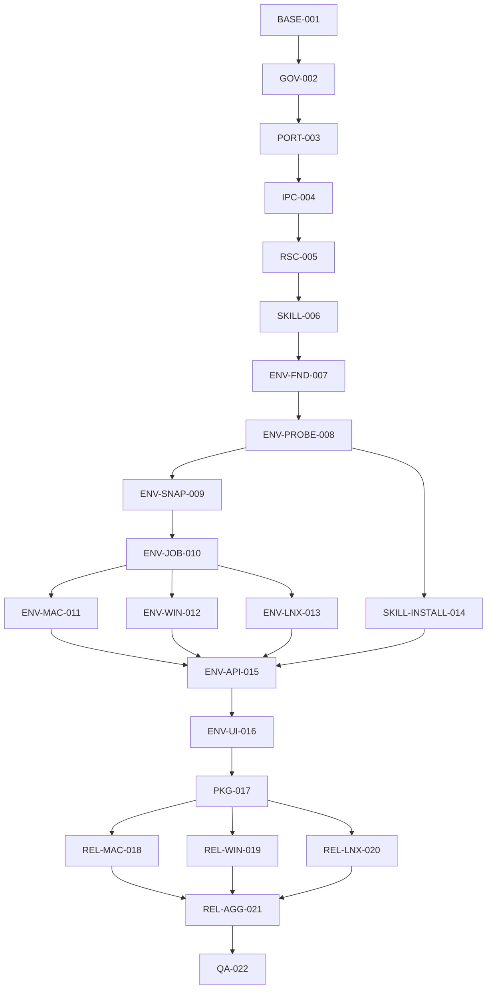

# PLAN-EA-XPLAT-002 · 跨平台环境配置与可信 Release 实施计划

> **Version**: v2.0
> **Date**: 2026-07-10
> **Status**: planning
> **Owner**: Emperor Agent maintainers
> **Design**: `docs/superpowers/specs/2026-07-10-cross-platform-environment-release-design.md`
> **Progress**: `docs/superpowers/plans/2026-07-10-cross-platform-environment-release-implementation.progress.json`
> **Checker**: `docs/superpowers/plans/2026-07-10-cross-platform-environment-release-implementation.check_progress.py`

> **Execution rule**: 使用 `superpowers:executing-plans` 或 `superpowers:subagent-driven-development`。一次只执行一个未阻塞任务；行为改动必须先写测试并确认 RED，再实现并确认 GREEN。任务未通过专属验收和相关全局门禁时不得标记 `done`。

## 1. Overview

### 1.1 Problem Statement

Emperor 主程序已经是 TypeScript/Electron 单 runtime，但干净系统上的 Coding Agent 能力、Skill 可移植性和正式 Release 仍没有闭环。当前内建搜索依赖 Unix shell，IPC 类型跨进程漂移，测试没有全部 typecheck，runtime defaults 不会可靠升级，默认打包 Skills 含外部 runtime/绝对路径，Release workflow 仍引用退役桌宠项目且没有签名硬门禁。

本计划按“先治理基础，再增加能力”的顺序完成 22 个任务。正式完成条件不是“能构建安装包”，而是三平台签名或等价证明、安装 smoke、资源清单、SBOM、provenance 和干净 PATH receipt 全部通过。

### 1.2 Goals

1. 保持主程序纯 TypeScript/Electron，目标机无需 Node/Python 即可启动和执行基础文件能力。
2. 建立零 warning、全仓格式化、测试 typecheck 和类型化 IPC 基线。
3. 实现 Node 原生 Glob/Grep，关闭搜索工具 shell 注入和 Windows 缺命令问题。
4. 建立 signed runtime resources、最小 built-in Skill 和安全 Skill 安装流程。
5. 实现 EnvironmentService、三平台 adapter、不可变执行环境 snapshot 和诊断一键安装。
6. 建立 macOS/Windows/Ubuntu 正式 Release 硬门禁与供应链回执。

### 1.3 Non-Goals

- 自动更新、在线 Skill 市场、私有 GitHub 认证、任意网页 Skill 抽取。
- Windows ARM64、非 Ubuntu Linux、macOS 14 以下、Windows 10 22H2 以下。
- Python backend、HTTP/WS fallback、静默系统安装、远程动态 ToolCatalog。

### 1.4 Current Baseline

| Gate           | Baseline                                                                                                                  |
| -------------- | ------------------------------------------------------------------------------------------------------------------------- |
| Core Vitest    | 84 files / 671 tests passing                                                                                              |
| Desktop Vitest | 62 files / 272 tests passing                                                                                              |
| Typecheck      | Core and Desktop passing                                                                                                  |
| Build          | Electron production build passing                                                                                         |
| ESLint         | 0 errors, 15 warnings                                                                                                     |
| Playwright     | 28 scenarios; current mode-menu assertion expects 3 options while product exposes 4, so BASE-001 must reconcile and rerun |
| macOS package  | arm64 unpacked package succeeds but is unsigned                                                                           |
| Git            | `main` contains a large uncommitted Hooks/UI/pet baseline that must be accepted before feature work                       |

No task may delete existing tests merely to preserve these counts. Test replacement is allowed only when behavior is explicitly superseded and equivalent or stronger coverage remains.

## 2. System Boundaries

### 2.1 In Scope

- Core tools, API registry, runtime paths, Skills, environment domain, Hooks/MCP/tool execution environment.
- Electron main/preload/renderer typed IPC and packaged smoke mode.
- Diagnostics and Skills settings UI.
- electron-builder configurations and GitHub Actions CI/internal/release workflows.
- README、AGENTS、迁移状态和 Release 运维说明的最终同步。

### 2.2 Compatibility Invariants

1. 不修改已有 model、MCP、memory、sessions、Hooks 磁盘 schema。
2. 现有 Core operation key 保持名称不变。
3. `stateRoot` 继续承载全部用户私有数据；signed runtime 只读。
4. 当前 turn 的环境 snapshot 永不被安装完成事件追溯修改。
5. Hook/MCP 环境统一不能扩大 secret 白名单。
6. 正式 Release 不能因为凭据缺失降级为 unsigned。
7. 用户提供的 URL、路径或 Tool ID 不能变成安装命令、参数或下载来源。

## 3. Dependency Topology

| Phase               | Tasks                                                            | Parallelism                                            | Exit Gate                                 |
| ------------------- | ---------------------------------------------------------------- | ------------------------------------------------------ | ----------------------------------------- |
| P0 Baseline         | `BASE-001`                                                       | no                                                     | current work accepted and committed       |
| P1 Governance       | `GOV-002` → `PORT-003` → `IPC-004`                               | no                                                     | format/type/lint/search/IPC green         |
| P2 Resources        | `RSC-005` → `SKILL-006`                                          | no                                                     | signed runtime and Creator-only baseline  |
| P3 Environment Core | `ENV-FND-007` → `ENV-PROBE-008` → `ENV-SNAP-009` → `ENV-JOB-010` | no                                                     | environment domain green                  |
| P4 Adapters         | `ENV-MAC-011`, `ENV-WIN-012`, `ENV-LNX-013`, `SKILL-INSTALL-014` | adapters parallel after job; Skill install after probe | platform contracts green                  |
| P5 Product          | `ENV-API-015` → `ENV-UI-016` → `PKG-017`                         | no                                                     | packaged smoke green                      |
| P6 Release          | `REL-MAC-018`, `REL-WIN-019`, `REL-LNX-020` → `REL-AGG-021`      | platform jobs parallel                                 | signed candidate set complete             |
| P7 Receipt          | `QA-022`                                                         | no                                                     | all quality and documentation gates green |

## 4. Global Execution Protocol

For every task:

1. Set its progress status to `in_progress`, increment attempts, and record the branch/commit context.
2. Read the complete target modules and existing tests before editing.
3. Add task-specific tests or an equivalent failing acceptance check.
4. Run the narrow command and confirm expected RED caused by missing behavior.
5. Implement only the task scope; do not mix formatting, refactors, or unrelated cleanup.
6. Run narrow GREEN, related workspace tests, typecheck and lint.
7. Run `git diff --check`; inspect the diff for private state or generated output.
8. Update progress to `done` only after all binary acceptance criteria pass.
9. Commit code, tests and progress update together. Platform adapter tasks may use separate branches but must merge only after independent verification.

Configuration-only tasks use a failing check instead of code-level RED. Formal Release tasks can remain `blocked` only for documented external credentials; code and unsigned internal verification must still be completed first.

## 5. Task Specifications

### BASE-001 · 固定当前 Hooks/UI/桌宠基线

- **Purpose**: 将计划开始前已有的 Hooks v2、模型 UI、设置滚动和桌宠迁移作为独立、可追溯基线，避免与全仓格式化混合。
- **Depends On**: none。
- **Source**: 当前 `main` 工作树、`make check`、desktop Playwright、electron-builder dry-run。
- **Target**: 一个不包含本计划新功能的 baseline commit；随后创建 `codex/cross-platform-release-v2`。
- **Checks First**:
  - `git diff --check` 必须通过。
  - `make check` 必须通过。
  - Playwright 28 个场景必须全绿；将遗留 3-mode 断言更新为当前 4 个正式模式并校验标签。
  - `npm --prefix desktop run package:dir` 必须通过。
- **Acceptance**:
  - [ ] 当前所有预期文件均已审查，没有运行态私有数据或 secret。
  - [ ] Core 671、Desktop 272 测试基线不下降。
  - [ ] Playwright 28/28 通过。
  - [ ] baseline commit 与后续格式化 commit 完全分离。
  - [ ] 专用分支创建成功，工作树干净。
- **Risk/Effort**: High / 5 points。大范围已有改动必须先确定所有权和验收证据。

### GOV-002 · 建立全仓格式化与零告警门禁

- **Purpose**: 用可重复工具代替人工风格约定，并让测试源码进入类型检查。
- **Depends On**: `BASE-001`。
- **Target**:
  - `.editorconfig`、Prettier config/ignore。
  - root `format`、`format:check` scripts。
  - Desktop test tsconfig 覆盖 renderer/main/preload/pet/Playwright。
  - ESLint `--max-warnings=0`，清理当前 15 warning。
  - `make check` 增加 format、test typecheck、`bash -n`。
- **Checks First**: 在配置缺失时 `npm run format:check` 不存在或失败；测试 tsconfig file list 不含 test/spec 的现状必须被断言。
- **Execution**: 配置 commit 与全仓 `prettier --write .` 机械 commit 分开；格式化后不得夹带行为改动。
- **Acceptance**:
  - [ ] 所有 Prettier 支持文件通过 `prettier --check`。
  - [ ] 所有 Desktop test/spec 出现在 test typecheck file list。
  - [ ] Core/Desktop ESLint 为 0 errors / 0 warnings。
  - [ ] Ruff、`bash -n`、parity、test、typecheck、build 通过。
  - [ ] 格式化 commit 可单独回滚且不改变测试结果。
- **Risk/Effort**: High / 8 points。全仓 Markdown diff 很大，必须独立审查。

### PORT-003 · 用 Node 原生实现 Glob/Grep

- **Purpose**: 移除内建搜索的 Unix 命令依赖和 shell 解释边界。
- **Depends On**: `GOV-002`。
- **Source**: `packages/core/src/tools/builtin.ts`、workspace policy、现有工具测试。
- **Target Behavior**:
  - Glob 递归遍历、mtime 排序、噪声目录过滤、200 项上限。
  - Grep 支持 regex、glob、content/files/count、前后文、2 MiB 文件上限和 200 项上限。
  - canonical path 与符号链接重新经过 workspace policy。
- **TDD Cases**: 正常匹配、无匹配、mtime 排序、Unicode、Windows separator、非法 regex、二进制、大文件、取消、权限错误、symlink escape、`$()`/反引号/分号输入不执行。
- **Acceptance**:
  - [ ] 搜索实现不 import `exec/execSync`，不出现外部搜索命令。
  - [ ] macOS/Windows path fixtures 输出一致。
  - [ ] shell injection canary 文件不会被创建。
  - [ ] AgentLoop 和 Hook agent handler 的搜索工具均使用新实现。
  - [ ] Core 全量测试/typecheck/lint 通过。
- **Risk/Effort**: High / 8 points。必须保持既有工具输出兼容。

### IPC-004 · 建立全量类型化 Core operation registry

- **Purpose**: 让 Core、main、preload、renderer 在编译期共享 operation 参数和返回类型，并在 IPC 边界校验输入。
- **Depends On**: `PORT-003`。
- **Source**: CoreApi operation 列表、desktop main IPC reflection、preload bridge、renderer `core<T>()`。
- **Target**:
  - `CoreOperationMap`、`CoreOperationKey`、typed args/result helpers。
  - 每项 operation 的 Zod tuple 和固定 invoke adapter。
  - Generic preload bridge 与 renderer helper。
  - 统一 safe error envelope。
- **TDD Cases**: operation key 完整性、无参/单参/多参、schema 拒绝、异步结果、domain error、internal error 脱敏、非法 key、compile-time positive/negative fixtures。
- **Acceptance**:
  - [ ] 所有现有 operation key 在 registry 中且没有字符串 fallback。
  - [ ] main 不通过点分字符串反射 CoreApi 方法。
  - [ ] preload/renderer 不暴露 `operationKey: string -> Promise<unknown>` 主路径。
  - [ ] 新增 operation 缺 schema/adapter 时 typecheck 失败。
  - [ ] Core/Desktop tests/typecheck/lint 通过。
- **Risk/Effort**: High / 13 points。operation 数量多，必须分域迁移但一次性关闭 fallback。

### RSC-005 · 直接读取签名 runtime defaults

- **Purpose**: 保证每次应用升级获得当前签名模板、Creator 和 ToolCatalog，同时保持用户 state 独立。
- **Depends On**: `IPC-004`。
- **Source**: desktop runtime-root、main startup、Core runtime paths、electron-builder resources。
- **Target**: packaged `runtimeRoot = resourcesPath/runtime-defaults`；runtime manifest；旧 `userData/runtime` 诊断与安全迁移 receipt。
- **TDD Cases**: dev path、packaged path、read-only resources、state precedence、manifest 校验、旧目录缺失、未知 Skill、重复迁移、collision、损坏 receipt。
- **Acceptance**:
  - [ ] 新安装和升级都直接读取当前包内资源。
  - [ ] 用户写操作只进入 stateRoot。
  - [ ] 旧 runtime 不删除、不覆盖 signed resources。
  - [ ] 未知旧 Skill 迁移后为 `blocked_pending_review`。
  - [ ] package test 校验 manifest 和无开发机绝对路径。
- **Risk/Effort**: High / 8 points。涉及现有安装的数据兼容。

### SKILL-006 · 最小内置 Skill 与 Core 原生 Creator

- **Purpose**: 默认只激活无需外部 runtime 的 skill-creator，其他 Skills 保留为非激活 catalog。
- **Depends On**: `RSC-005`。
- **Target**:
  - 其他 Skills 移入 `skills-catalog/`。
  - Creator create/validate/package 迁入 Core TypeScript。
  - `manage_skill` 工具和 `{{skill_dir}}` expansion。
  - Skill source/status/requirements model。
- **TDD Cases**: 创建合法 Skill、名称拒绝、frontmatter 校验、资源目录校验、ZIP 打包、deterministic files、路径占位符、built-in read-only、user precedence、catalog 不加载。
- **Acceptance**:
  - [ ] `skills/` 只包含 skill-creator。
  - [ ] Creator 不包含 Python script 或外部 Node CLI 依赖。
  - [ ] 开发态与 packaged runtime 默认只列出 Creator。
  - [ ] `skills-catalog/` 不被扫描和打包。
  - [ ] 所有 catalog Skill 不再包含开发机绝对路径。
- **Risk/Effort**: Medium / 8 points。

### ENV-FND-007 · 建立 Environment schemas、catalog 与 store

- **Purpose**: 创建后续探测、安装和 UI 共用的稳定领域模型。
- **Depends On**: `SKILL-006`。
- **Target**: Zod schemas、error codes、signed ToolCatalog、job/receipt/log stores、catalog revision/hash。
- **TDD Cases**: valid catalog、unknown schema、duplicate tool、invalid dependency、unsupported platform/arch、unsafe executable/args/URL、missing digest/publisher、atomic store、corrupt isolation、redaction。
- **Acceptance**:
  - [ ] Catalog 启动时 fail closed 校验。
  - [ ] Catalog 不能从网络或 renderer 修改。
  - [ ] 所有 tool/version/source/license 数据可生成稳定 revision。
  - [ ] JSON/JSONL 写入原子、损坏可诊断。
  - [ ] error code 和 safe payload 完整测试。
- **Risk/Effort**: High / 8 points。

### ENV-PROBE-008 · 实现无 shell 探测和项目识别

- **Purpose**: 识别三平台工具、PATH、项目声明和 Skill requirements，不修改系统。
- **Depends On**: `ENV-FND-007`。
- **Target**: EnvironmentProbe、ProjectEnvironmentDetector、PATH providers、fingerprint/cache。
- **TDD Cases**: 每平台 PATH、case-sensitive dedupe、command timeout/output cap、版本解析、Node/Python/Go/Rust 优先级、invalid declaration、unsupported range、Skill bins、cache invalidation。
- **Acceptance**:
  - [ ] 所有 probe 使用固定 args 和 `shell:false`。
  - [ ] 只读取项目根声明，不写项目。
  - [ ] 无法解释的版本范围不猜测。
  - [ ] 状态明确区分 missing/version_mismatch/unsupported/blocked。
  - [ ] 刷新、项目切换、catalog 变化正确失效缓存。
- **Risk/Effort**: High / 13 points。

### ENV-SNAP-009 · 统一执行环境 snapshot

- **Purpose**: 让所有命令型能力获得一致 PATH 和版本选择，同时保持 turn 稳定与 secret 隔离。
- **Depends On**: `ENV-PROBE-008`。
- **Target**: ExecutionEnvironmentSnapshot service；接入 RunCommand、Hooks、MCP、Scheduler、Subagent、agent handler。
- **TDD Cases**: snapshot revision、turn stable、next-turn refresh、minimal env、secret exclusion、Hook allowedEnv intersection、MCP stale reconnect、Scheduler fresh snapshot、Subagent inheritance、project switch。
- **Acceptance**:
  - [ ] 所有指定执行入口不再直接构造独立 PATH。
  - [ ] 当前 turn 安装完成后仍使用旧 snapshot。
  - [ ] 新 turn 使用新 revision。
  - [ ] stdio MCP 只在下一调用前重连。
  - [ ] PATH 扩展不改变 secret 白名单。
- **Risk/Effort**: High / 13 points。

### ENV-JOB-010 · 安装计划、job 和中断恢复

- **Purpose**: 将系统安装限制在不可篡改计划、单一 job 和可审计状态机内。
- **Depends On**: `ENV-SNAP-009`。
- **Target**: plan registry、dependency planner、file lock、job state machine、process tree cancellation、logs/receipts、startup recovery。
- **TDD Cases**: stable plan、ten-minute expiry、catalog/project/tool stale、license mismatch、global lock、dependency skip、partial、cancel、awaiting_user、interrupted、restart reprobe、log cap/redaction。
- **Acceptance**:
  - [ ] Renderer 无法提交命令、URL、args 或目标路径。
  - [ ] 任一 plan binding 变化均拒绝执行。
  - [ ] 多进程只能有一个 job。
  - [ ] partial 只继续无关步骤。
  - [ ] 重启不自动续装，receipt 与实际 reprobe 一致。
- **Risk/Effort**: Very High / 13 points。

### ENV-MAC-011 · macOS 安装 adapter

- **Purpose**: 在 macOS arm64/x64 上以固定策略安装基础和项目工具。
- **Depends On**: `ENV-JOB-010`。
- **Target**: Homebrew detection/formula、Xcode Git flow、官方 pkg/archive、publisher/digest、用户 PATH。
- **TDD Cases**: arm64/x64 brew path、brew absent、Git system flow、formula args、pkg signature、archive digest、elevation decline、post-probe、cancel、PATH refresh。
- **Acceptance**:
  - [ ] 不自动安装 Homebrew。
  - [ ] 不读取管理员密码。
  - [ ] 所有命令来自 catalog 固定 adapter。
  - [ ] 签名/摘要失败不执行。
  - [ ] internal workflow 产出 macOS adapter receipt。
- **Risk/Effort**: High / 8 points。

### ENV-WIN-012 · Windows 安装 adapter

- **Purpose**: 在 Windows x64 上使用 winget 或已验证官方安装器，并刷新用户环境。
- **Depends On**: `ENV-JOB-010`。
- **Target**: winget exact packages、Authenticode、MSI/EXE/ZIP、Machine/User PATH、MSVC separate confirmation。
- **TDD Cases**: winget present/absent、exact args、agreement confirmation、publisher valid/mismatch、UAC decline、PATH expansion、zip install、MSVC exclusion、post-probe、process tree cancel。
- **Acceptance**:
  - [ ] package ID/source/args 固定。
  - [ ] MSI/EXE 在运行前验证 Authenticode publisher。
  - [ ] MSVC 永远不进入普通批量计划。
  - [ ] 安装后无需重启应用即可新建 snapshot。
  - [ ] internal workflow 产出 Windows adapter receipt。
- **Risk/Effort**: Very High / 13 points。

### ENV-LNX-013 · Ubuntu 安装 adapter

- **Purpose**: 支持 Ubuntu 22.04/24.04 x64，拒绝其他发行版进入安装流程。
- **Depends On**: `ENV-JOB-010`。
- **Target**: distro detection、apt/pkexec、官方 Volta/uv/rustup/Go 资产、PATH refresh。
- **TDD Cases**: supported releases、unsupported distro/arch、apt args、pkexec decline、asset digest、Go conflict、post-probe、cancel、AppImage diagnostic、PATH refresh。
- **Acceptance**:
  - [ ] 非目标发行版只诊断不安装。
  - [ ] 不读取或缓存 sudo 密码。
  - [ ] 远程脚本不管道到 shell。
  - [ ] Go 版本冲突不自动覆盖。
  - [ ] 22.04/24.04 internal receipts 可验证。
- **Risk/Effort**: High / 8 points。

### SKILL-INSTALL-014 · 安全预览并安装外部 Skill

- **Purpose**: 支持用户本地导入或向 Agent 发送受支持链接，同时关闭供应链和 archive 攻击面。
- **Depends On**: `ENV-PROBE-008`。
- **Target**: source resolver、HTTPS downloader、GitHub normalizer、archive inspector、staging registry、preview/confirm、blocked requirements。
- **TDD Cases**: local ZIP、direct HTTPS、GitHub repo/tree、multiple candidates、preview expiry、digest change、redirect、SSRF、zip bomb、path traversal、symlink、rollback、permission denial、missing deps。
- **Acceptance**:
  - [ ] 只接受设计指定来源。
  - [ ] 所有限制在下载和解压前/中强制执行。
  - [ ] confirm 必须匹配 previewId 和 digest 并经过权限确认。
  - [ ] 失败恢复旧 Skill，无部分目录。
  - [ ] 缺依赖 Skill 为 blocked 且不进入模型上下文。
- **Risk/Effort**: Very High / 13 points。

### ENV-API-015 · 接入 CoreApi、IPC、事件和 diagnostics

- **Purpose**: 将 Environment/Skill 能力以稳定 typed contract 提供给 Desktop。
- **Depends On**: `ENV-MAC-011`、`ENV-WIN-012`、`ENV-LNX-013`、`SKILL-INSTALL-014`。
- **Target**: 设计中 10 个新增 operations、diagnostics environment summary、5 个 runtime events、log cursor API、mutation guard。
- **TDD Cases**: get status、single/batch plan、install/cancel、log pagination、Skill APIs、invalid schemas、guard denial、event payload redaction、safe errors、operation completeness。
- **Acceptance**:
  - [ ] CoreOperationMap 是 operation 的唯一类型来源。
  - [ ] diagnostics 不返回无限日志。
  - [ ] mutation 操作在 Plan/Ask pending 时拒绝。
  - [ ] runtime events 不含 secrets/完整 URL query。
  - [ ] Core/main/preload/renderer contract tests 全绿。
- **Risk/Effort**: High / 8 points。

### ENV-UI-016 · 诊断环境与 Skill 状态 UI

- **Purpose**: 在现有 Settings 体验中提供可理解、可确认、可恢复的环境管理。
- **Depends On**: `ENV-API-015`。
- **Target**: Diagnostics 开发环境分区、install confirmation modal、progress/log/partial views、Skills source/blocked/preview views。
- **TDD Cases**: ready/missing/mismatch/blocked、single plan、batch plan、license、elevation warning、MSVC second confirm、progress、cancel、partial、interrupted、log pagination、stale refresh、narrow layout。
- **Acceptance**:
  - [ ] Renderer 不构造命令、URL 或 installer args。
  - [ ] 安装前完整展示计划与不可取消步骤。
  - [ ] 所有错误码有中文摘要和恢复动作。
  - [ ] 1280×820、390×844 可滚动且无横向溢出。
  - [ ] Playwright 覆盖关键流程和截图。
- **Risk/Effort**: High / 13 points。

### PKG-017 · 最小资源打包与 packaged smoke

- **Purpose**: 证明生产包资源正确、无外部开发环境仍能启动和执行基础能力。
- **Depends On**: `ENV-UI-016`。
- **Target**: electron-builder resource filters、runtime manifest、headless smoke mode、receipt、package inspection tests。
- **TDD Cases**: Creator-only resources、catalog excluded、no Python backend、no absolute path、manifest mismatch、minimal PATH、bootstrap、diagnostics、native search、no auto-install、atomic receipt。
- **Acceptance**:
  - [ ] 包内只含允许 runtime resources。
  - [ ] `skills-catalog/` 和旧 `desktop-pet` project 不存在于包内。
  - [ ] 最小 PATH smoke 不依赖外部 Node/Python/Git/ripgrep。
  - [ ] smoke 不创建 install job 或系统 prompt。
  - [ ] macOS local unpacked smoke receipt 通过。
- **Risk/Effort**: High / 8 points。

### REL-MAC-018 · macOS 双架构签名、公证与安装验收

- **Purpose**: 产出 Gatekeeper 可接受的 arm64/x64 DMG/ZIP。
- **Depends On**: `PKG-017`；完成最终 gate 还依赖 Apple credentials。
- **Target**: `macos-15` arm64、`macos-15-intel` x64、release signing config、entitlements、notarization/stapling、DMG smoke。
- **Checks**: missing credentials must fail; signed build; `codesign`、`spctl`、`stapler`; DMG mount; packaged smoke; artifact naming/hash。
- **Acceptance**:
  - [ ] `minimumSystemVersion` 为 14.0，Hardened Runtime 与 helper entitlements 生效。
  - [ ] 两架构签名 identity、team 和 notarization ticket 可验证。
  - [ ] DMG 与 ZIP 都有 smoke/checksum/SBOM 输入。
  - [ ] 无凭据或任一验证失败时 workflow 失败。
- **Risk/Effort**: External/High / 8 points。凭据未准备时状态为 blocked，不得伪造完成。

### REL-WIN-019 · Windows Artifact Signing 与安装验收

- **Purpose**: 产出受信任 publisher 签名的 x64 NSIS 安装包。
- **Depends On**: `PKG-017`；完成最终 gate 还依赖 Azure Artifact Signing 或受信任 OV PFX。
- **Target**: `windows-2022`、`azureSignOptions`、`forceCodeSigning:true`、Authenticode verification、silent install/smoke/uninstall。
- **Checks**: missing credentials fail、publisher exact match、signature valid、temporary install、receipt、uninstall、artifact hash。
- **Acceptance**:
  - [ ] EXE 和已安装 executable 都由预期 publisher 签名。
  - [ ] SmartScreen/Authenticode 所需链路配置记录完整。
  - [ ] 安装和卸载退出码为 0，receipt 可解析。
  - [ ] unsigned candidate 无法进入正式 artifact 集合。
- **Risk/Effort**: External/Very High / 8 points。

### REL-LNX-020 · Ubuntu DEB/AppImage 与双版本 smoke

- **Purpose**: 产出 Ubuntu x64 DEB/AppImage 并建立 Linux 验证链。
- **Depends On**: `PKG-017`。
- **Target**: Ubuntu 22.04 build、22.04/24.04 DEB install smoke、AppImage xvfb smoke、checksums。
- **Checks**: package metadata、DEB install/remove、AppImage executable/FUSE diagnostics、minimal PATH receipt、artifact hash。
- **Acceptance**:
  - [ ] DEB 和 AppImage 在目标 runner 启动。
  - [ ] 22.04/24.04 receipt 均通过。
  - [ ] AppImage 失败能区分 FUSE/沙箱/应用错误。
  - [ ] 两类 artifact 进入 SBOM/provenance 输入。
- **Risk/Effort**: High / 8 points。

### REL-AGG-021 · 供应链证明与原子 Release 发布

- **Purpose**: 只有完整、可验证的三平台候选集合才能创建正式 Release。
- **Depends On**: `REL-MAC-018`、`REL-WIN-019`、`REL-LNX-020`。
- **Target**: CI/internal/release workflow split、SHA-256 manifest、CycloneDX SBOM、GitHub provenance/SBOM attestations、final publish job。
- **Checks**: missing artifact、hash mismatch、invalid signature、missing SBOM、attestation verify failure、unsigned marker、atomic publish、internal retention。
- **Acceptance**:
  - [ ] build jobs 不直接发布 Release。
  - [ ] final job 下载并重新验证所有 artifact。
  - [ ] `gh attestation verify` 对每个正式 artifact 通过。
  - [ ] internal unsigned workflow 仅手动触发、保留期 ≤7 天、无 publish 权限。
  - [ ] 任一依赖失败时不存在半成品正式 Release。
- **Risk/Effort**: Very High / 13 points。

### QA-022 · 最终安全回归、receipt 与文档签收

- **Purpose**: 证明功能、兼容、安全和运维文档达到交付标准。
- **Depends On**: `REL-AGG-021`。
- **Target**: 完整质量门禁、三平台 receipt bundle、README/AGENTS/STATUS/Release runbook、catalog review checklist。
- **Verification**:
  - `git diff --check`
  - `npm run format:check`
  - `make check`
  - `npm --prefix desktop run screenshots`
  - platform package smoke and signature checks
  - SBOM/provenance verification
  - progress checker exit 0
- **Acceptance**:
  - [ ] Core tests ≥671、Desktop tests ≥272，新增测试全部通过。
  - [ ] 0 lint warnings，所有 test/spec typecheck。
  - [ ] 三平台正式 receipts 与 artifact manifest 对应。
  - [ ] 文档不再引用独立 `desktop-pet/` 或 Python backend。
  - [ ] 运维文档说明凭据轮换、catalog 升级、internal workflow 和失败恢复。
  - [ ] 所有任务状态为 done，checker 返回 0。
- **Risk/Effort**: High / 8 points。

## 6. Risk Register

| Risk                            | Level    | Trigger                           | Mitigation                                              | Owner Task        |
| ------------------------------- | -------- | --------------------------------- | ------------------------------------------------------- | ----------------- |
| 全仓 Prettier 淹没业务 diff     | High     | 格式化与功能同 commit             | baseline、配置、机械格式化分别提交                      | GOV-002           |
| 搜索行为兼容回退                | High     | 顺序/上下文/过滤与旧实现不同      | golden fixtures + platform paths                        | PORT-003          |
| IPC 迁移遗漏 operation          | High     | renderer 运行时 operation missing | registry completeness compile/test gate                 | IPC-004           |
| Signed runtime 升级丢失用户内容 | High     | runtime/state 边界错误            | read-only package + receipt migration + no delete       | RSC-005           |
| 外部 Skill 供应链攻击           | Critical | URL/ZIP/script 恶意               | staging、limits、SSRF、digest、permission、blocked deps | SKILL-INSTALL-014 |
| 安装器参数注入                  | Critical | renderer/model controls command   | catalog-only adapter + shell:false + Zod                | ENV-JOB-010       |
| 安装中断留下未知系统状态        | High     | app crash/UAC/system installer    | interrupted + reprobe + no auto-resume                  | ENV-JOB-010       |
| PATH 刷新破坏运行中任务         | High     | install completes mid-turn        | immutable turn snapshot + next-call MCP reconnect       | ENV-SNAP-009      |
| macOS/Windows 凭据不可用        | Blocking | signing identity/tenant absent    | external blocked status; unsigned internal only         | REL-MAC/WIN       |
| 半成品 Release                  | Critical | platform job directly publishes   | candidate upload + final aggregate verification         | REL-AGG-021       |

## 7. Receipt Verification

### 7.1 Startup Receipt

Packaged smoke receipt 必须记录 app version、commit、platform、arch、runtime manifest hash、stateRoot 临时路径、bootstrap status、diagnostics status、environment status、Glob/Grep status、install job count 和 exit code。Receipt 不含 HOME、用户名、token 或完整 PATH。

### 7.2 Functional Receipt

- Diagnostics：刷新 → create plan → confirm → progress → complete/partial → refresh。
- Skill：preview local/GitHub → risk summary → permission → install/blocked → dependency resolution。
- Runtime：安装前后两个 turn 的 snapshot revision 不同，单 turn 内不变。
- MCP：environment_changed 后下一调用发生一次重连。

### 7.3 Release Receipt

每个平台上传 artifact inventory、SHA-256、signature/publisher result、install result、smoke receipt 和 SBOM path。Final publish job 生成总 manifest，记录每个输入 workflow run 和 attestation verification result。

## 8. Progress Tracking

- 状态仅允许 `pending`、`in_progress`、`done`、`blocked`、`failed`。
- 同一时间最多一个串行任务为 `in_progress`；平台并行阶段最多允许相互独立的 adapter/release tasks 同时进行。
- `blocked` 必须记录具体外部前置；Apple/Azure 凭据是允许的外部阻塞，测试失败不是长期 blocked 理由。
- `completed` 必须等于 tasks 中 `done` 数量；checker 会验证数量、状态和依赖。
- 每次任务 commit 同步更新 `updated_at`、`rounds`、attempts、notes 和 commit/PR 信息。

Initial state is defined in `2026-07-10-cross-platform-environment-release-implementation.progress.json`.
