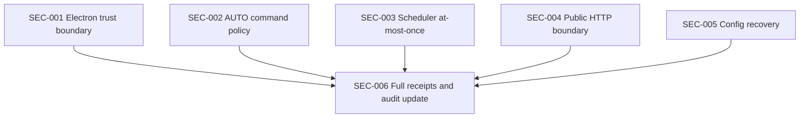

# PLAN-SEC-001 · Audit Findings Remediation Implementation Plan

> **Version**: v1.0  
> **Date**: 2026-07-13  
> **Status**: approved  
> **Owner**: Codex  
> **Depends On**: `docs/superpowers/specs/2026-07-13-audit-findings-remediation-design.md`  
> **Depended By**: release readiness

> **For agentic workers:** REQUIRED SUB-SKILL: use `superpowers:executing-plans` to implement this plan task-by-task. Multi-agent dispatch is intentionally disabled by repository-session instructions. Steps use checkbox syntax for tracking.

**Goal:** Eliminate all five findings in `docs/audit/2026-07-13-code-audit.md` with regression-proof trust boundaries, concurrency semantics, network validation, and recoverable persistence.

**Architecture:** Add focused boundary modules instead of expanding existing large files. Each finding is implemented as an independent RED → GREEN task; a final receipt task verifies all invariants together and updates the audit record.

**Tech Stack:** TypeScript, Electron, Vue 3, Node.js built-ins, Vitest, ESLint, Prettier.

## Global constraints

- Do not add Python runtime files, Python tests, requirements files, or Python fallback paths.
- Preserve `model_config.json` and `mcp_config.json` disk schemas.
- Preserve `stateRoot` as the private global data root.
- Preserve production `app://bundle` and exact-origin `ELECTRON_RENDERER_URL` development startup.
- Do not add a new runtime event or CoreApi operation.
- Every production behavior change follows RED → GREEN with the expected audited failure observed first.
- Tests use inert fakes and temporary directories; no destructive shell, live private-network access, or real MCP process execution.
- Commit only after the focused tests for a task are green.

---

## 1. Overview

### 1.1 Problem statement

The audited baseline permits an externally navigated Electron page to retain the privileged preload bridge, classifies only a finite subset of effectful shell commands as approval-worthy in AUTO, starts Scheduler dispatch Promises before duplicate registration succeeds, validates WebFetch targets only by URL text, and directly overwrites boot-critical configuration files. These defects cross trust and durability boundaries and can lead to user-level process execution, duplicate automation side effects, private-network reads, or persistent startup failure. The desired state enforces each boundary at the point the effect originates and proves the boundary with executable tests.

### 1.2 Goals

1. Untrusted documents, subframes, webContents, and remote URLs cannot access privileged Electron IPC.
2. AUTO executes only positively classified read-only diagnostics without approval.
3. A duplicate Scheduler run starts no task factory, state transition, event, message, or external side effect.
4. WebFetch validates the actual connected address and every redirect while enforcing a 1 MiB streamed body limit.
5. Model/MCP configuration writes are atomic and corrupt files recover without blocking Core startup.
6. `make check`, desktop build, packaged smoke, and targeted security tests pass.

### 1.3 Non-goals

- Replacing Electron IPC or the MCP protocol.
- Building a general-purpose operating-system sandbox.
- Adding permanent command approvals.
- Adding private-network escape hatches to WebFetch.
- Changing provider, Scheduler, Team, or configuration schemas.
- Refactoring unrelated UI or runtime behavior.

## 2. Architecture context

### 2.1 Affected modules

| File                                                    | Action | Responsibility                                                |
| ------------------------------------------------------- | ------ | ------------------------------------------------------------- |
| `desktop/src/main/trusted-renderer.ts`                  | Create | Trusted URL, navigation, popup, and IPC caller policy         |
| `desktop/src/main/trusted-renderer.test.ts`             | Create | Pure policy regression tests                                  |
| `desktop/src/main/index.ts`                             | Modify | Wire navigation/popup policy and protect desktop handlers     |
| `desktop/src/main/ipc.ts`                               | Modify | Authorize caller before Core operation parsing/invocation     |
| `desktop/src/main/core-host.ts`                         | Modify | Pass IPC authorization into Core host registration            |
| `desktop/src/main/ipc.test.ts`                          | Modify | Prove rejected callers never reach CoreApi                    |
| `packages/core/src/permissions/pipeline.ts`             | Modify | Positive AUTO command authorization                           |
| `packages/core/src/permissions/permissions.test.ts`     | Modify | AUTO classification regression tests                          |
| `packages/core/src/tools/builtin.ts`                    | Modify | Remove unsafe script-indirection guidance                     |
| `packages/core/src/tools.test.ts`                       | Modify | Safety refusal regression tests                               |
| `packages/core/src/runtime/active.ts`                   | Modify | Start effect factory only after unique registration           |
| `packages/core/src/runtime/runtime.test.ts`             | Modify | Duplicate factory non-start regression                        |
| `packages/core/src/scheduler/service.ts`                | Modify | Per-job in-flight lease                                       |
| `packages/core/src/scheduler/executor.ts`               | Modify | Pass lazy factory to registry                                 |
| `packages/core/src/scheduler/executor.test.ts`          | Modify | Executor duplicate regression                                 |
| `packages/core/src/scheduler/scheduler.test.ts`         | Modify | Manual/timer lease regression                                 |
| `packages/core/src/network/public-http.ts`              | Create | DNS/IP/redirect/stream-size public HTTP client                |
| `packages/core/src/network/public-http.test.ts`         | Create | Network policy and transport tests                            |
| `packages/core/src/environment/download.ts`             | Modify | Reuse public address policy while retaining HTTPS-only assets |
| `packages/core/src/environment/download.test.ts`        | Modify | Environment download compatibility tests                      |
| `packages/core/src/tools/web-fetch.ts`                  | Create | WebFetch adapter over public HTTP client                      |
| `packages/core/src/tools/builtin.ts`                    | Modify | Export/import the focused WebFetch implementation             |
| `packages/core/src/tools.test.ts`                       | Modify | WebFetch compatibility and error mapping tests                |
| `packages/core/src/store/atomic-json.ts`                | Modify | fsync, mode, atomic replace, corrupt isolation                |
| `packages/core/src/store/atomic-json.test.ts`           | Modify | Atomicity, mode, cleanup, corruption tests                    |
| `packages/core/src/config/model-config.ts`              | Modify | Atomic save and recoverable validated load                    |
| `packages/core/src/config/model-config.test.ts`         | Modify | Model corruption and compatibility tests                      |
| `packages/core/src/mcp/config.ts`                       | Modify | Async atomic save and recoverable validated load              |
| `packages/core/src/mcp/client.ts`                       | Modify | Await MCP configuration loads                                 |
| `packages/core/src/mcp/mcp.test.ts`                     | Modify | MCP corruption and compatibility tests                        |
| `packages/core/src/api/services/config-service.ts`      | Modify | Await MCP load/save operations                                |
| `packages/core/src/api/services/config-service.test.ts` | Modify | API recovery behavior                                         |
| `docs/audit/2026-07-13-code-audit.md`                   | Modify | Record remediation evidence and residual risk                 |

### 2.2 Data flow

```mermaid
flowchart TD
  R[Renderer URL/frame] --> TP[TrustedRendererPolicy]
  TP -->|trusted| IPC[Privileged IPC]
  TP -->|external HTTP(S)| EXT[System browser]
  TP -->|untrusted| DENY[Prevent and deny]

  M[Model tool call] --> PERM[PermissionPipeline]
  PERM -->|positive readonly| EXEC[Execute]
  PERM -->|other command| APPROVE[Approval]

  S[Scheduler request] --> LEASE[Per-job lease]
  LEASE --> REG[ActiveTaskRegistry]
  REG --> EFFECT[Lazy dispatch]

  WF[WebFetch URL] --> NET[PublicHttpClient]
  NET --> DNS[Resolve and block special IPs]
  DNS --> REDIR[Validate every redirect]
  REDIR --> LIMIT[Streamed byte limit]

  CFG[Model/MCP config] --> ATOMIC[fsync + atomic rename]
  CFG --> VALIDATE[parse + validate]
  VALIDATE -->|invalid| RECOVER[isolate + default + diagnostic]
```

## 3. Dependency topology



| Phase | Tasks                                       | Depends on              | Parallelism                   |
| ----- | ------------------------------------------- | ----------------------- | ----------------------------- |
| W01   | SEC-001, SEC-002, SEC-003, SEC-004, SEC-005 | Design spec             | Independent by code ownership |
| W02   | SEC-006                                     | SEC-001 through SEC-005 | Sequential receipt            |

Inline execution order is SEC-001 → SEC-002 → SEC-003 → SEC-004 → SEC-005 → SEC-006 so every change has an isolated regression signal.

## 4. Task decomposition

### SEC-001 · Enforce trusted Electron navigation and IPC callers

- **Purpose:** Close the P0 renderer-to-process propagation path.
- **Scope:** Main window navigation/popup handlers, Core IPC authorization, and all preload-exposed desktop handlers.
- **Excluded:** Renderer UI redesign, preload API renaming, browser-only HTTP fallback.
- **Source mapping:**
  - `desktop/src/main/index.ts` — `createWindow()` and privileged `ipcMain.handle` registrations.
  - `desktop/src/main/ipc.ts` — `registerCoreIpc()`.
  - `desktop/src/main/core-host.ts` — `registerCoreHostIpc()` and `createCoreHost()`.
- **Target interfaces:**

  ```typescript
  export type IpcAuthorizer = (event: IpcInvokeEventLike) => void

  export function createTrustedRendererPolicy(opts: {
    productionUrl: string
    developmentUrl?: string | null
    mainWebContents: () => WebContentsIdentity | null
    openExternal: (url: string) => Promise<unknown>
  }): TrustedRendererPolicy
  ```

- **Detailed design:** Parse trusted URLs once. Compare production protocol/host and development `URL.origin`; reject credentials and malformed values. `handleNavigation` allows trusted targets, otherwise always prevents and only forwards HTTP(S). `authorizeIpc` requires top frame identity, trusted frame URL, and exact main webContents identity. `registerCoreIpc` calls the injected authorizer before `invokeOperation`; forbidden errors use a stable `forbidden_ipc_caller` safe envelope. `index.ts` wraps directory, path, and pet handlers with the same authorizer.
- **Invariants:**
  - `assert(untrustedNavigation.preventDefaultCalls === 1)`.
  - `assert(untrustedCoreCalls === 0)`.
  - `assert(subframeCoreCalls === 0)`.
  - `assert(externalOpenCalls <= 1 && newWindowAction === 'deny')`.
- **Edge cases:** malformed URL, credentials, origin prefix confusion, subdomain confusion, dev path change, missing senderFrame, subframe, destroyed main window, `file:`/`javascript:`/custom schemes.
- **Dependencies:** Electron types only; no new package.
- **Risk/complexity:** M; Electron event mocks can drift from runtime types. Mitigate with narrow structural interfaces plus one wiring test using existing main test patterns.
- **Test plan:**
  1. Production bundle URL is trusted.
  2. Exact development origin with another path is trusted.
  3. Lookalike origin and subdomain are denied.
  4. External HTTPS navigation is prevented and opened externally.
  5. Non-HTTP scheme is prevented without external open.
  6. Popup is always denied.
  7. Trusted top-frame IPC invokes CoreApi.
  8. Remote, subframe, missing-frame, and wrong-webContents IPC do not invoke CoreApi.
  9. External opener rejection does not allow navigation.
- **TDD flow:**
  - [ ] Add `trusted-renderer.test.ts` and untrusted caller cases to `ipc.test.ts`.
  - [ ] Run `npm --prefix desktop test -- trusted-renderer.test.ts ipc.test.ts`; confirm failures because policy/authorizer do not exist.
  - [ ] Implement the policy and Core IPC authorizer.
  - [ ] Wire BrowserWindow and desktop IPC handlers.
  - [ ] Re-run the focused tests; confirm all pass.
  - [ ] Run `npm --prefix desktop run typecheck` and `npm --prefix desktop run lint`.
- **Acceptance criteria:**
  - [ ] External/current-window navigation cannot retain preload privileges.
  - [ ] Popup creation is denied.
  - [ ] Untrusted IPC returns a safe forbidden envelope.
  - [ ] No untrusted call reaches CoreApi or desktop privileged handlers.
  - [ ] Production and development renderer startup remain supported.
- **Estimate:** 8 hours / 5 points; policy and tests 4h, wiring 2h, Electron compatibility verification 2h.
- **Status:** ☑ done
- **Notes:** Opening an external browser is best-effort; failure is logged and never changes deny behavior.

### SEC-002 · Replace AUTO shell blacklist authorization with positive readonly classification

- **Purpose:** Close script and unknown-executable approval bypasses.
- **Scope:** AUTO branch of PermissionPipeline and RunCommand safety refusal copy.
- **Excluded:** OS sandbox, persistent approvals, changes to non-command tools.
- **Source mapping:**
  - `packages/core/src/permissions/pipeline.ts` — AUTO mode branch.
  - `packages/core/src/tools/resolvers.ts` — `isReadonlyCommand()`.
  - `packages/core/src/tools/builtin.ts` — `RunCommand.execute()` safety refusal.
- **Target behavior:**

  ```typescript
  if (mode === PermissionMode.AUTO && profile.name === 'run_command') {
    return isReadonlyCommand(profile.command)
      ? allow(profile, 'mode.auto.read_only_command', trace)
      : approval(profile, 'mode.auto.command', reason, trace, RiskLevel.HIGH)
  }
  ```

- **Detailed design:** `isReadonlyCommand` is the sole positive automatic command gate. Unsupported parsing, control operators, redirection, interpreters, scripts, package scripts, tests, builds, and unknown binaries require approval. Existing `RunCommand` deny patterns remain a non-bypassable final safety layer. Replace indirection guidance with a message requiring a safer tool or explicit user approval.
- **Invariants:**
  - `assert(autoAllowedCommand => isReadonlyCommand(command))`.
  - `assert(interpreterInvocation.requiresApproval)`.
  - `assert(refusalText does not contain script-indirection guidance)`.
- **Edge cases:** quoted interpreter path, absolute shell path, PowerShell, `.cmd`/`.ps1`, workspace executable, control operators, redirection, Hook-updated input, empty command.
- **Dependencies:** Existing command parser and approval flow.
- **Risk/complexity:** S; behavior becomes stricter. Mitigate with explicit tests for currently supported diagnostics and clear approval copy.
- **Test plan:**
  1. `pwd` remains allowed in AUTO.
  2. `git status` remains allowed in AUTO.
  3. `bash payload.sh` requires approval.
  4. `sh`, `zsh`, PowerShell and absolute interpreter paths require approval.
  5. Workspace executable requires approval.
  6. `npm test` and build commands require approval.
  7. control operators and redirections require approval.
  8. direct deny-pattern command still returns safety refusal after approval path.
  9. refusal text contains no indirection recommendation.
- **TDD flow:**
  - [ ] Add AUTO cases to `permissions.test.ts` and copy assertion to `tools.test.ts`.
  - [ ] Run `npm test --workspace @emperor/core -- permissions.test.ts tools.test.ts`; confirm script cases are wrongly allowed and copy assertion fails.
  - [ ] Change the AUTO decision branch and refusal copy.
  - [ ] Re-run focused tests; confirm all pass.
  - [ ] Run Core typecheck and lint.
- **Acceptance criteria:**
  - [ ] AUTO automatically executes only positively read-only commands.
  - [ ] All script/interpreter/unknown executable paths require approval.
  - [ ] Hook-transformed input is reclassified by the existing runner recheck.
  - [ ] Direct deny rules remain effective.
- **Estimate:** 4 hours / 3 points.
- **Status:** ☑ done
- **Notes:** This is an intentional security tightening of AUTO semantics.

### SEC-003 · Guarantee Scheduler at-most-once effect start

- **Purpose:** Ensure duplicate Scheduler runs produce no dispatch or persistent message.
- **Scope:** ActiveTaskRegistry lazy execution and SchedulerService per-job lease.
- **Excluded:** Distributed/multi-process leases and changes to schedule persistence schema.
- **Source mapping:**
  - `packages/core/src/runtime/active.ts` — `ActiveTaskRegistry.run()`.
  - `packages/core/src/scheduler/executor.ts` — `SchedulerJobExecutor.run()`.
  - `packages/core/src/scheduler/service.ts` — `runJob()`, `onTimer()`, `executeJob()`.
- **Target interfaces:**

  ```typescript
  async run<T>(opts: ActiveTaskRunOptions & {
    execute: () => Promise<T>
  }): Promise<T>

  private async withJobLease<T>(jobId: string, execute: () => Promise<T>): Promise<T | null>
  ```

- **Detailed design:** Registry checks `tasks.has`, creates cancellation state, inserts the active record, then invokes `opts.execute()`. All current callers migrate from `awaitable` to `execute`. SchedulerService acquires a Set-backed lease before changing job state or emitting events and releases it in `finally`. Manual duplicates return `false`; timer duplicates continue to the next due job.
- **Invariants:**
  - `assert(rejectedFactoryCalls === 0)`.
  - `assert(maxConcurrentDispatchesPerJob <= 1)`.
  - `assert(duplicateRunEvents === 0)`.
  - `assert(leaseReleasedAfterErrorOrCancel)`.
- **Edge cases:** synchronous factory throw, async rejection, cancellation, manual/manual race, manual/timer race, timer list with one busy and one free job, run after completion, deleted job snapshot.
- **Dependencies:** Existing ActiveTaskRegistry cancellation behavior.
- **Risk/complexity:** M; changing a shared registry affects memory compaction and agent turns. Migrate every `activeTasks.run` call found by `rg` and run full Core tests.
- **Test plan:**
  1. First registered factory starts.
  2. Duplicate registered factory is never invoked.
  3. Factory synchronous throw removes active record.
  4. Cancellation removes active record.
  5. Concurrent manual runs dispatch once.
  6. Manual/timer collision dispatches once.
  7. Busy job does not block another due job.
  8. Duplicate team wake sends one message.
  9. Later run after completion succeeds.
- **TDD flow:**
  - [ ] Add duplicate factory failure to `runtime.test.ts`.
  - [ ] Run focused runtime test; confirm second factory currently starts.
  - [ ] Change registry to lazy `execute` and migrate all callers.
  - [ ] Add Scheduler lease concurrency tests; confirm current service dispatches twice.
  - [ ] Implement per-job lease.
  - [ ] Re-run runtime and Scheduler tests; confirm all pass.
  - [ ] Run complete Core tests, typecheck, and lint.
- **Acceptance criteria:**
  - [ ] Duplicate Registry calls start no second effect.
  - [ ] Duplicate Scheduler calls create no task, event, state transition, or message.
  - [ ] Errors and cancellation release both registry state and Scheduler lease.
  - [ ] Unrelated jobs retain existing sequential timer behavior.
- **Estimate:** 8 hours / 5 points.
- **Status:** ☐ todo
- **Notes:** Process-local at-most-once matches the current single Electron main-process architecture.

### SEC-004 · Introduce a pinned public HTTP client for WebFetch and assets

- **Purpose:** Close literal, DNS, mapped-address, redirect, and response-size SSRF paths.
- **Scope:** Shared network policy/client, WebFetch adapter, and environment downloader reuse.
- **Excluded:** authenticated requests, cookies, proxies, private-network exceptions, non-HTTP protocols.
- **Source mapping:**
  - `packages/core/src/tools/builtin.ts` — current `WebFetch`.
  - `packages/core/src/environment/download.ts` — existing pinned HTTPS transport and BlockList.
- **Target interfaces:**

  ```typescript
  export interface PublicHttpClientOptions {
    resolve?: (hostname: string) => Promise<ResolvedAddress[]>
    transport?: PublicHttpTransport
    maxRedirects?: number
    timeoutMs?: number
  }

  export class PublicHttpClient {
    get(input: PublicHttpRequest): Promise<PublicHttpResponse>
  }
  ```

- **Detailed design:** Move `ResolvedAddress`, BlockList, `isPublicIp`, URL parsing, redirect detection, header parsing, and pinned request transport into `network/public-http.ts`. Transport selects `node:http` or `node:https`; both receive a pinned lookup callback. HTTPS retains original hostname for certificate validation/SNI. Reject if resolution is empty or any returned address is non-public. Close responses on redirect/error/limit. Accumulate chunks only until `maxBytes`; throw before appending an over-limit chunk. Environment downloader consumes the same policy with HTTPS-only protocol set and streams to its existing atomic destination writer. WebFetch uses a 1 MiB body and existing 30,000-character model output cap.
- **Invariants:**
  - `assert(everyConnectedAddressWasValidated)`.
  - `assert(everyRedirectTargetWasResolvedAndValidated)`.
  - `assert(bufferedBytes <= maxBytes)`.
  - `assert(blockedResponse.closeCalls === 1)`.
- **Edge cases:** bracketed IPv6, mapped IPv4, mixed public/private DNS answers, credentials, fragments, `.local`, relative redirects, redirect loop, invalid content-length, missing content-length, timeout, cancellation, TLS hostname preservation.
- **Dependencies:** Node `http`, `https`, `dns/promises`, `net`; no new package.
- **Risk/complexity:** L; transport extraction can regress release downloads. Keep asset tests green before switching WebFetch and verify TLS/Host behavior with injected transport tests.
- **Test plan:**
  1. Public HTTP and HTTPS literal/domain requests are accepted with injected transport.
  2. Loopback IPv4/IPv6 and unspecified addresses are blocked.
  3. Link-local, private, CGNAT and mapped private IPv6 are blocked.
  4. Mixed public/private DNS answer is blocked.
  5. Public-to-private redirect is blocked before second transport call.
  6. Redirect limit is enforced and response closed.
  7. Declared content-length over limit is rejected.
  8. Streamed body crossing limit is rejected without over-buffering.
  9. Cancellation and timeout close the request.
  10. WebFetch raw/text behavior and environment HTTPS download remain compatible.
- **TDD flow:**
  - [ ] Add failing public network policy and redirect/size tests.
  - [ ] Run `public-http.test.ts`; confirm module/behavior is absent.
  - [ ] Implement policy and injected transport until focused tests pass.
  - [ ] Move WebFetch into `tools/web-fetch.ts`; add failing adapter compatibility tests before wiring.
  - [ ] Reuse the policy from environment downloader; run its existing tests after each extraction step.
  - [ ] Run complete Core tests, typecheck, and lint.
- **Acceptance criteria:**
  - [ ] No special-use or private address can be reached through literal, DNS, mapped IPv6, or redirect.
  - [ ] Actual connected address is pinned to a validated result.
  - [ ] WebFetch buffers at most 1 MiB.
  - [ ] Environment downloads remain HTTPS-only, integrity-compatible, and streamed atomically.
- **Estimate:** 16 hours / 8 points.
- **Status:** ☐ todo
- **Notes:** Rejecting a hostname when any DNS answer is private is intentionally fail-closed against rebinding and ambiguous resolution.

### SEC-005 · Make Model/MCP configuration atomic and recoverable

- **Purpose:** Prevent interrupted saves or corrupt JSON/schema from bricking desktop startup.
- **Scope:** Shared atomic JSON durability, Model/MCP load/save, API awaits, and startup fallback.
- **Excluded:** Schema migration, remote backup, encryption at rest.
- **Source mapping:**
  - `packages/core/src/store/atomic-json.ts` — atomic primitive.
  - `packages/core/src/config/model-config.ts` — model load/save.
  - `packages/core/src/mcp/config.ts` — MCP load/save.
  - `packages/core/src/mcp/client.ts` — MCP initialization and snapshot loads.
  - `packages/core/src/api/services/config-service.ts` — CoreApi config adapter.
- **Target interfaces:**

  ```typescript
  export interface AtomicWriteOptions {
    mode?: number
  }

  export async function writeJsonAtomic(
    path: string,
    data: unknown,
    opts?: AtomicWriteOptions,
  ): Promise<void>

  export interface ConfigRecoveryInfo {
    path: string
    backupPath: string
    error: unknown
  }
  ```

- **Detailed design:** Implement atomic write with `open(tmp, 'wx', mode)`, complete write, `sync`, close, and same-directory `rename`; cleanup temp in catch/finally without touching the destination. Model and MCP saves await this helper with `0o600`. Load raw JSON, parse and validate in one try; on any parse/schema error, rename the corrupt original to a versioned backup, invoke recovery diagnostics, and return validated defaults. Model defaults preserve onboarding behavior; MCP defaults contain no enabled servers. Convert MCP config APIs and all callers to async. Preserve environment-variable expansion after recovery-safe parse and before schema conversion.
- **Invariants:**
  - `assert(finalBytes === oldBytes || finalBytes === completeNewBytes)`.
  - `assert(writeFailure => destinationBytes === oldBytes)`.
  - `assert(corruptBackupBytes === originalCorruptBytes)`.
  - `assert(startupReturnsLoopForCorruptModelAndMcp)`.
- **Edge cases:** empty file, invalid JSON, valid JSON with invalid schema, backup name collision, isolation failure, missing file, write ENOSPC/rename failure, POSIX mode, environment placeholders, concurrent sequential service calls.
- **Dependencies:** Existing default config builders and diagnostics logging.
- **Risk/complexity:** L; async MCP API propagation and secret durability are cross-cutting. Migrate all `rg` call sites and retain compatibility tests.
- **Test plan:**
  1. Atomic JSON writes and reads complete data.
  2. Temp file is synced/closed and removed after success.
  3. Injected write/rename failure preserves old bytes and removes temp.
  4. Mode is `0o600` on POSIX.
  5. Invalid model JSON is isolated and defaults load.
  6. Semantically invalid model config is isolated and defaults load.
  7. Invalid MCP JSON/schema is isolated and no server loads.
  8. Valid legacy Model/MCP schemas load unchanged.
  9. AgentLoop/CoreApi startup succeeds with both corrupt files.
  10. ConfigService awaits save before MCP reload.
- **TDD flow:**
  - [ ] Add atomic store durability/mode tests; confirm missing sync/options behavior fails.
  - [ ] Implement minimal atomic helper changes and make store tests green.
  - [ ] Add model corruption tests; confirm current loader throws.
  - [ ] Implement recoverable model load/save and make focused tests green.
  - [ ] Add MCP corruption/async tests; confirm current loader throws/direct save behavior fails.
  - [ ] Implement async recoverable MCP config and migrate callers.
  - [ ] Add Core startup recovery test and make it green.
  - [ ] Run compatibility, full Core tests, typecheck, and lint.
- **Acceptance criteria:**
  - [ ] Interrupted/failed saves preserve the old destination.
  - [ ] Corrupt bytes are preserved in a versioned backup.
  - [ ] Invalid Model/MCP config no longer prevents Core startup.
  - [ ] Valid existing config requires no migration.
  - [ ] Newly written secret-bearing files use `0o600` on POSIX.
- **Estimate:** 16 hours / 8 points.
- **Status:** ☐ todo
- **Notes:** Recovery diagnostics may initially use the existing logger callback; no new runtime event is required.

### SEC-006 · Run full receipts and close the audit

- **Purpose:** Prove all five remediation requirements against the final current state.
- **Scope:** Full quality gate, build/package smoke, targeted invariant review, audit update, and progress receipt.
- **Excluded:** Publishing, pushing, PR creation, or real external side effects.
- **Source mapping:** `Makefile`, `scripts/check.sh`, desktop package scripts, audit acceptance criteria.
- **Target artifacts:** Updated audit status table, final command receipt, completed progress JSON.
- **Detailed design:** Re-run each focused security suite, then `make check`, `desktop` package smoke, and a requirement-by-requirement source audit. Update each finding with fix files, regression tests, residual risk, and status. Do not mark complete when any invariant lacks direct test or source evidence.
- **Invariants:**
  - `assert(allFiveFindings.status === 'fixed')`.
  - `assert(makeCheckExitCode === 0)`.
  - `assert(packagedSmokeExitCode === 0)`.
  - `assert(progress.completed === progress.total_tasks)`.
- **Edge cases:** ignored build artifacts, platform-specific smoke limitations, stale audit line links, changed snapshot commit, warning-only output, test filters accidentally omitting files.
- **Dependencies:** SEC-001 through SEC-005.
- **Risk/complexity:** M; packaged checks may expose unrelated baseline issues. Diagnose rather than weakening gates.
- **Test/receipt plan:**
  1. Electron trusted renderer focused tests pass.
  2. Permission and RunCommand focused tests pass.
  3. Active registry and Scheduler concurrency tests pass.
  4. Public HTTP/WebFetch/environment download tests pass.
  5. Atomic/model/MCP/startup recovery tests pass.
  6. `make check` passes.
  7. `npm --prefix desktop run package:verify` passes.
  8. Audit links and Prettier checks pass.
  9. Final `git diff --check` passes and no private runtime files are tracked.
- **Execution flow:**
  - [ ] Run all focused suites without filters that hide sibling failures.
  - [ ] Run `make check` and inspect the complete exit status.
  - [ ] Run `npm --prefix desktop run package:verify`.
  - [ ] Review each audit invariant against source and tests.
  - [ ] Update the audit and progress artifacts.
  - [ ] Re-run documentation format/link checks and `git diff --check`.
- **Acceptance criteria:**
  - [ ] Every explicit audit remediation criterion has direct evidence.
  - [ ] Full repository quality gate passes.
  - [ ] Packaged application smoke passes on the current platform.
  - [ ] Audit document accurately records fixed and residual states.
  - [ ] No private state or generated package output is staged.
- **Estimate:** 8 hours / 5 points.
- **Status:** ☐ todo
- **Notes:** Release publication is outside this plan.

## 5. Risk register

| ID  | Severity | Description                                                    | Tasks   | Probability | Mitigation                                                          |
| --- | -------- | -------------------------------------------------------------- | ------- | ----------- | ------------------------------------------------------------------- |
| R1  | H        | IPC mock tests pass while Electron runtime event shape differs | SEC-001 | Medium      | Narrow structural types plus main-process wiring and packaged smoke |
| R2  | M        | AUTO tightening surprises existing users                       | SEC-002 | High        | Preserve readonly diagnostics and provide explicit approval reason  |
| R3  | H        | Shared ActiveTaskRegistry migration misses a caller            | SEC-003 | Medium      | Exhaustive `rg activeTasks.run` and TypeScript interface break      |
| R4  | H        | HTTP extraction regresses signed environment downloads         | SEC-004 | Medium      | Keep existing downloader tests green at each extraction step        |
| R5  | H        | Async MCP conversion leaves a non-awaited caller               | SEC-005 | Medium      | Type signature migration, exhaustive call-site search, typecheck    |
| R6  | M        | Config recovery silently hides data loss                       | SEC-005 | Low         | Preserve corrupt bytes and emit diagnostic callback                 |
| R7  | M        | Packaging gate fails for environmental reasons                 | SEC-006 | Medium      | Diagnose exact failure; do not weaken code or gate                  |

## 6. Receipt verification

### 6.1 Startup

- [ ] CoreApi starts with valid configuration.
- [ ] CoreApi starts with corrupt Model and MCP configuration after preserving backups.
- [ ] Desktop build completes.
- [ ] Packaged smoke launches and exits successfully.

### 6.2 Functional completeness

- [ ] Trusted renderer invokes CoreApi through IPC.
- [ ] Untrusted renderer and subframe cannot invoke privileged handlers.
- [ ] AUTO readonly command remains automatic and effectful command requests approval.
- [ ] Scheduler duplicate produces one effect.
- [ ] WebFetch returns bounded public content and rejects private redirects.
- [ ] Valid existing Model/MCP configuration round-trips without schema change.

### 6.3 Quality

- [ ] Core tests, typecheck, lint pass.
- [ ] Desktop tests, typecheck, lint, build pass.
- [ ] Migration parity and `git diff --check` pass through `make check`.
- [ ] Prettier check passes.
- [ ] `node docs/superpowers/plans/check-audit-remediation-progress.mjs` exits 0.

### 6.4 Anti-stub

- No hardcoded success responses, disabled checks, skipped tests, or fake production transports.
- Network and persistence production paths call real Node primitives; tests inject only boundary dependencies.
- Scheduler and IPC tests assert absence of effects, not only returned error text.

## 7. Progress tracking

> 6 tasks total / 2 phases. Status: ☐ todo · ◐ wip · ☑ done · ⛔ blocked

| ID      | Title                           | Status | Commit | Notes                                 |
| ------- | ------------------------------- | ------ | ------ | ------------------------------------- |
| SEC-001 | Electron trust boundary         | ☑      | —      | 22 focused and 353 desktop tests pass |
| SEC-002 | AUTO command policy             | ☑      | —      | 47 focused and 914 core tests pass    |
| SEC-003 | Scheduler at-most-once          | ☐      | —      |                                       |
| SEC-004 | Public HTTP boundary            | ☐      | —      |                                       |
| SEC-005 | Config recovery                 | ☐      | —      |                                       |
| SEC-006 | Full receipts and audit closure | ☐      | —      |                                       |
