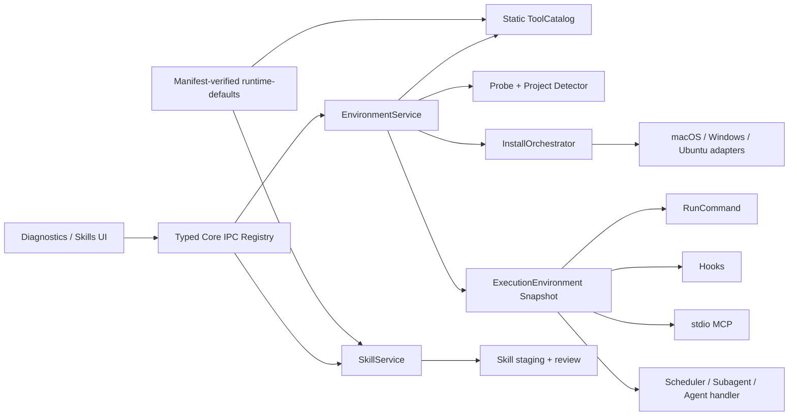

# Emperor Agent 跨平台环境配置与未签名 Preview Release 设计

> **Plan ID**: `PLAN-EA-XPLAT-002`
> **Version**: v2.2
> **Date**: 2026-07-13
> **Status**: complete; Preview-only scope accepted
> **Targets**: macOS 14+ arm64/x64、Windows 10 22H2+ x64、Ubuntu 22.04/24.04 x64
> **Implementation Plan**: `docs/superpowers/plans/2026-07-10-cross-platform-environment-release-implementation.md`

> **Document boundary**: 本文件冻结目标架构、协议、安全边界和公开未签名 Preview Release 门禁。实际完成状态以配套 progress 文件及公开 receipt 为准。

> **v2.2 amendment**: 取消正式签名 Stable 的当前规划、任务和进度门禁。`Unsigned Preview` 是本计划唯一公开发布通道；未来若恢复代码签名、公证或稳定版发布，必须使用新的 Plan ID 重新设计和审批。

## 1. 背景与基线

Emperor Agent 已经完成 Python runtime 退役。Electron main 进程托管 `@emperor/core`，renderer 通过 preload IPC 调用 CoreApi；安装包内含 Chromium、Electron Node runtime、Core、模板、Skills、Assets 和桌宠资源，主程序启动不要求目标机安装 Node 或 Python。

v2.0 启动时工程基线经本地验证（历史快照）：

- Core：84 个测试文件、671 项 Vitest 通过。
- Desktop：62 个测试文件、272 项 Vitest 通过。
- Core/Desktop typecheck 与 production build 通过。
- ESLint 当前有 15 个 warning，尚未执行零 warning 门禁。
- macOS arm64 unpacked package 可生成，但因没有有效 Developer ID 身份而跳过签名，当前不能视为正式 Release。

审计同时确认以下阻塞问题：

1. `GlobTool`、`GrepTool` 拼接 Unix shell 命令，既不支持干净 Windows，也允许模型参数进入 shell 解释边界。
2. Release workflow 仍安装、测试已迁入 `desktop/src/pet` 的旧 `desktop-pet/` 项目。
3. Core IPC 以字符串 operation 和 `Promise<unknown>` 为主，编译器不能约束 Core/preload/renderer 的完整契约。
4. Desktop 测试文件被 tsconfig 排除，Vitest 转译不能替代 TypeScript 语义检查。
5. 安装包首次复制 `runtime-defaults` 后整目录跳过更新，内置模板、Skill 和 catalog 可能长期停留在旧版本。
6. 当前打包全部仓库 Skills，部分 Skill 含开发机绝对路径或外部 Python/CLI 依赖，干净机器无法可靠运行。

## 2. 目标与非目标

### 2.1 Goals

1. 三类目标平台上的 Preview 安装包可以在没有外部 Node、Python、Git、ripgrep 的干净用户环境中启动、完成 bootstrap、配置云模型并执行基础文件任务。
2. 内建 Glob/Grep 不依赖系统 shell 或外部搜索命令，所有模型输入都不会进入 shell 解释器。
3. 诊断页能够识别基础开发工具、当前项目语言声明和已安装 Skill 依赖，并通过受控、可取消、可审计流程安装缺失环境。
4. RunCommand、command hooks、stdio MCP、Scheduler、Subagent 和 agent handler 使用同一不可变执行环境快照。
5. 默认只内置无需外部 runtime 的 Core 原生 `skill-creator`；其他 Skills 由用户从本地包、公开 GitHub 或 HTTPS Skill 包显式安装。
6. CoreApi、preload 和 renderer 使用同一个类型化 operation registry；所有 IPC 参数在 main 侧通过 Zod 校验。
7. macOS、Windows、Ubuntu 未签名产物完成安装 smoke、SBOM、摘要与 provenance 后，以明确风险披露的 GitHub Pre-release 公开发布。

### 2.2 Non-Goals

- 不恢复 Python backend、Python CLI、HTTP/WS fallback 或独立 server。
- 不静默安装语言、IDE、容器、数据库、云 CLI 或大型系统组件。
- 不支持 Windows ARM64、macOS 14 以下、Windows 10 22H2 以下或 Ubuntu 以外的 Linux 发行版。
- 不建设自动更新、在线 Skill 市场、私有 GitHub 凭证接入或远程 ToolCatalog 更新。
- 不允许从任意网页抽取并直接安装 Skill；普通网页只允许作为用户参考资料。
- 不自动覆盖不满足项目要求的现有 Go，不自动卸载用户已安装工具。
- 不在本计划内建设 Developer ID、Apple notarization、Windows publisher signing 或签名 Stable Release。
- 不把 Preview 描述为稳定版、自动更新源、企业部署包或受信任 publisher 产物。

## 3. 已确认决策

| Topic            | Decision                                                                                     |
| ---------------- | -------------------------------------------------------------------------------------------- |
| 实施顺序         | 基础治理是 EnvironmentService 的硬前置，不并行绕过                                           |
| 格式规范         | 全仓 Prettier，覆盖其支持的代码、配置和 Markdown；机械格式化独立提交                         |
| IPC              | 共享 `CoreOperationMap` + Zod 参数 registry，不使用代码生成                                  |
| 内置 Skills      | 正式包和开发默认只激活 `skill-creator`                                                       |
| Skill Creator    | 初始化、校验、打包迁入 Core 原生 TypeScript，无外部 runtime                                  |
| 其他 Skills      | 移入非激活 `skills-catalog/`，后续由用户显式安装                                             |
| Skill 来源       | 本地 `.skill/.zip`、公开 GitHub repo/tree、HTTPS `.skill/.zip`                               |
| Skill 信任       | 下载预览、digest 绑定、风险摘要、二次确认后安装                                              |
| Runtime defaults | 生产环境直接读取只读 `Resources/runtime-defaults`；由 manifest、checksum 与 attestation 验证 |
| 基础环境         | Git、ripgrep、Volta、Node、npm                                                               |
| 项目生态         | Node、Python、Go、Rust；Skill requirements 为第三类来源                                      |
| 安装归属         | 系统包管理器优先、用户级版本管理器优先，最终对当前用户全局可用                               |
| 版本隔离         | Node 使用 Volta，Python 使用 uv，Rust 使用 rustup；Go 冲突只提示                             |
| 批量确认         | 展示来源、版本、许可、体积、提权、不可取消步骤后一次确认                                     |
| Rust on Windows  | MSVC Build Tools 单独二次确认，不进入普通批量计划                                            |
| Release          | `Unsigned Preview` 是当前唯一公开发布通道；正式签名发布已取消并移出本计划                    |
| 自动更新         | 本轮继续排除                                                                                 |

## 4. 总体架构



`EnvironmentService` 是 Core composition root 中的长期存活服务。每个 turn 创建不可变 `ExecutionEnvironmentSnapshot`；安装或项目切换只能影响下一 turn，不追溯修改正在运行的命令、Hook 或子 Agent。

## 5. 工程治理与类型边界

### 5.1 Formatting And Quality Gates

- 新增 `.editorconfig`、Prettier 配置、`format` 与 `format:check` scripts。
- Prettier 首次机械格式化覆盖所有受支持且被 Git 跟踪的文本文件；只排除依赖、构建输出、运行态数据和二进制资产。
- Python 计划辅助脚本继续使用 Ruff；Shell 脚本至少执行 `bash -n`。
- Core/Desktop lint 使用 `--max-warnings=0`，先清理现有 warning 再开启门禁。
- Desktop renderer/main/preload/pet/Playwright 测试必须被专用 test tsconfig 覆盖。
- `make check` 固定执行 diff、parity、format、test、test typecheck、production typecheck、lint 和 build。

### 5.2 Node Native Search

Glob 使用 `fs.opendir`/`lstat`/`realpath` 和 Node glob 匹配能力；Grep 使用流式读取和 Node RegExp。共同约束：

- 不调用 shell、`rg`、`grep`、`find`、`ls`、`sort`、`head` 或 `cut`。
- 禁止越过 workspace policy；符号链接目标按 canonical path 重新校验。
- 默认跳过 `.git`、`node_modules`、`__pycache__` 和隐藏运行态目录。
- Grep 跳过二进制和超过 2 MiB 的文件；最多返回 200 个结果，并遵守现有 output mode/context 语义。
- 无匹配返回既有兼容文案；非法正则、取消、权限错误和遍历失败返回可诊断错误。

### 5.3 Typed Core Operations

```ts
interface CoreOperationSpec<Args extends readonly unknown[], Result> {
  args: z.ZodTuple
  invoke(api: CoreApi, args: Args): Result | Promise<Result>
}

type CoreOperationMap = {
  bootstrap: { args: []; result: BootstrapPayload }
  'environment.getStatus': {
    args: [EnvironmentStatusRequest?]
    result: EnvironmentStatusPayload
  }
  // Every existing operation is represented; no string fallback.
}
```

- Operation registry 是 Core operation key 的唯一来源，替代字符串 route 列表和反射路径查找。
- 每个 renderer 参数先通过 registry 的 Zod tuple，再调用固定 adapter。
- preload 暴露 `invokeCore<K extends CoreOperationKey>(key, ...args)`；renderer 返回类型由 `K` 推导。
- operation 不存在、参数无效、domain error 与内部错误使用统一、脱敏的 IPC error envelope。
- 所有现有 operations 一次性进入类型 map，不保留 `string` 或调用方任意泛型逃生口。

## 6. Runtime Resources And Skills

### 6.1 Packaged Runtime Defaults

- 开发环境 `runtimeRoot` 指向仓库根；生产环境 `runtimeRoot` 直接指向 `process.resourcesPath/runtime-defaults`。
- `stateRoot` 继续保存用户配置、会话、安装记录和用户 Skills；只读 runtime 与私有 state 永远不合并。
- 旧 `userData/runtime` 不删除。迁移只复制其中不属于已知内置集合的 Skill，并标记 `blocked_pending_review`；旧模板和资产保留原位供诊断，不覆盖包内只读资源。
- 包内生成 runtime manifest，记录 schema version、app version、文件路径与 SHA-256；packaged smoke 校验 manifest。
- Preview 通过 artifact checksum、manifest 和 GitHub attestation 证明来源与内容完整性；这些证据不代表操作系统 publisher 信任。

### 6.2 Built-In And Catalog Layout

```text
skills/                 # only skill-creator; active in dev and packaged runtime
skills-catalog/         # repository library; not scanned or packaged
stateRoot/skills/       # user-installed, writable, higher precedence
```

- `skill-creator` 的 create/validate/package 逻辑迁入 `@emperor/core`，Skill 文档调用 `manage_skill`，不运行 Python helper。
- `{{skill_dir}}` 是保留占位符；LoadSkill 返回内容前替换为当前 canonical Skill 目录，磁盘原文不改写。
- Skill metadata 支持 `emperor.requires.bins/runtimes/env`；兼容读取现有 `nanobot.requires.bins`，但未知依赖不自动映射为安装命令。
- 缺失依赖的 Skill 标记 `blocked`，不出现在模型可调用 Skill 集合中；诊断页仍展示名称、来源和缺失项。

### 6.3 Skill Installation

新增能力：

- `skills.create`
- `skills.validate`
- `skills.package`
- `skills.previewInstall`
- `skills.confirmInstall`
- Agent 工具 `manage_skill`

本地和网络来源都先进入 `stateRoot/skills/.staging/<previewId>`。Preview 包含 source、resolved URL、digest、candidate roots、文件数、体积、脚本类型、外部命令、环境变量和缺失依赖。

安全限制：

- 网络只接受公开 GitHub repo/tree 或 HTTPS `.skill/.zip` 直链；不使用用户 GitHub token。
- GitHub 多 Skill 仓库必须选择唯一 candidate root，不能一次安装多个未审查 Skill。
- 下载最多 20 MiB、解压最多 100 MiB、最多 1000 个文件、单文件最多 20 MiB。
- 拒绝绝对路径、`..`、符号链接、硬链接、设备文件、重复规范化路径和多根歧义。
- 只允许最多三次 HTTPS 重定向，并对每一跳重新执行 DNS/SSRF 校验。
- Preview 十分钟失效并绑定 digest；confirm 时来源、digest 或文件状态变化即拒绝。
- `confirmInstall` 永远是 mutation，必须通过 permission/mutation guard；模型不能把 preview 视为用户授权。
- 安装使用 staging → backup → rename；失败恢复旧版本，不留下部分目录。

## 7. Environment Domain Model

```ts
type EnvironmentToolId =
  | 'git'
  | 'ripgrep'
  | 'volta'
  | 'node'
  | 'npm'
  | 'uv'
  | 'python'
  | 'go'
  | 'rustup'
  | 'rust'
  | 'cargo'
  | 'msvc-build-tools'

type EnvironmentToolStatus =
  | 'ready'
  | 'missing'
  | 'version_mismatch'
  | 'installing'
  | 'awaiting_user'
  | 'failed'
  | 'unsupported'
  | 'blocked'

type EnvironmentJobStatus =
  | 'planned'
  | 'running'
  | 'awaiting_user'
  | 'cancelling'
  | 'completed'
  | 'partial'
  | 'failed'
  | 'cancelled'
  | 'interrupted'

interface EnvironmentToolState {
  id: EnvironmentToolId
  category: 'base' | 'project' | 'skill' | 'large-prerequisite'
  required: boolean
  reason: string
  declarationSource: string | null
  status: EnvironmentToolStatus
  detectedVersion: string | null
  requiredVersion: string | null
  executablePath: string | null
  installStrategy: string | null
  sourceUrl: string | null
  requiresElevation: boolean
  requiresSeparateConfirmation: boolean
}

interface ExecutionEnvironmentSnapshot {
  revision: string
  projectFingerprint: string
  createdAt: string
  pathEntries: readonly string[]
  env: Readonly<Record<string, string>>
  toolPaths: Readonly<Partial<Record<EnvironmentToolId, string>>>
}

interface EnvironmentInstallPlan {
  planId: string
  catalogRevision: string
  projectFingerprint: string
  toolStateHash: string
  expiresAt: string
  steps: EnvironmentInstallStep[]
  requiredLicenseIds: string[]
  warnings: string[]
}
```

ToolCatalog 是随 Release 锁定的静态 JSON，启动时用 Zod 校验。每个条目声明平台、架构、探测命令、版本规则、依赖、安装策略、官方来源、许可、估算体积、摘要和发布者；catalog 不接受运行时远程更新。

## 8. Probe, Project Detection And PATH

### 8.1 Probe Rules

- 仅执行 catalog 允许的 executable 和固定参数，`shell:false`、5 秒超时、64 KiB 输出上限。
- 探测记录 executable canonical path、原始版本摘要和规范化版本，不记录完整环境变量。
- 刷新状态使用 project fingerprint + catalog revision 缓存；用户点击刷新或安装完成后强制失效。

### 8.2 Project Declaration Priority

| Ecosystem | Priority                                                                                         | No Declaration                   |
| --------- | ------------------------------------------------------------------------------------------------ | -------------------------------- |
| Node      | `package.json.volta.node` → `.node-version` → `.nvmrc` → `package.json.engines.node`             | catalog-pinned Node 24 LTS patch |
| Python    | `.python-version` → `pyproject.toml project.requires-python` → `Pipfile requires.python_version` | catalog-pinned Python 3.12 patch |
| Go        | `go.mod toolchain` → `go.mod go`                                                                 | catalog reviewed stable patch    |
| Rust      | `rust-toolchain.toml` → `rust-toolchain` → `Cargo.toml`                                          | catalog-pinned stable toolchain  |

只读取项目根声明，不递归依赖目录，不修改项目文件。JSON/TOML 和版本范围使用结构化解析器；无法完整解释的范围标记 `unsupported_requirement`，不得猜测安装版本。

### 8.3 Effective PATH

- macOS：继承安全系统 PATH，并补入 `/opt/homebrew/bin`、`/usr/local/bin`、Volta、uv、Cargo 标准用户路径。
- Windows：通过固定系统查询读取 Machine/User PATH，展开受支持变量，再补入 Volta、uv、Cargo shim。
- Ubuntu：继承系统 PATH，并补入 `/usr/local/go/bin` 和版本管理器用户路径。
- 去重使用平台对应的大小写规则；不存在目录可保留为预期安装目标，但不会被报告为 ready。
- Snapshot 只扩展 PATH 和明确白名单，不扩大 token、API key、代理凭证或 Hook allowedEnv。

环境变化后：当前 turn 保持旧 snapshot；下一 turn、Scheduler 新 run 和新 subagent 使用新 revision；已连接 stdio MCP 标记 stale，下一调用前重连，不能在活跃请求中强制终止。

## 9. Install Orchestration And Security

### 9.1 Plan And Job Lifecycle

1. `createInstallPlan` 根据当前状态生成依赖图和稳定顺序，默认包含缺失 base、当前项目 required 和 blocked Skill requirements。
2. Plan 在内存 registry 保存十分钟，绑定 catalog revision、project fingerprint 和 tool state hash。
3. Renderer 只能提交 `planId`、确认标记和已展示的 license IDs；不能提交命令、URL、参数或目标目录。
4. 执行前重新探测。任何绑定字段变化返回 `plan_stale`，不执行旧计划。
5. 全局文件锁保证多个窗口或进程只能存在一个安装 job。
6. 失败跳过依赖它的步骤，但继续无关步骤；结果允许 `partial`。
7. 可取消子进程使用组合 AbortSignal 和进程树终止。进入 UAC/System Installer/pkexec 的步骤显示 `awaiting_user`，不能伪装为已取消。
8. 应用退出时记录活跃 step；下次启动标记 `interrupted`、重新探测实际状态，永不自动续装。

### 9.2 Persistence

```text
stateRoot/environment/
├── jobs/<jobId>.json
├── installations/<jobId>.jsonl
├── receipts/<jobId>.json
├── downloads/<jobId>/
└── environment.lock
```

日志默认脱敏 HOME、用户名、token、authorization、cookie、代理凭证和 URL query；单条输出、总日志和保留天数都有上限。下载临时目录在完成、失败或下次启动清理。

### 9.3 Download And Publisher Verification

- 只使用 HTTPS 和 catalog allowlist；禁止把远程脚本管道到 shell。
- 每次 DNS 解析和重定向都拒绝 loopback、link-local、private、multicast 和非公网目标。
- 官方 fallback 资产必须匹配固定版本与 SHA-256。
- Windows MSI/EXE 在执行前验证 Authenticode `Valid` 和 publisher CN。
- macOS pkg 验证签名或 catalog 中固定摘要；归档资产验证摘要。
- package manager 策略信任已配置的 Homebrew/winget/apt repository，执行后必须验证实际版本满足要求。
- 校验失败、发布者不符或安装后探测失败不得标记成功。

### 9.4 Error Codes

固定错误码包括：

`unsupported_platform`、`unsupported_arch`、`unsupported_requirement`、`plan_stale`、`job_active`、`confirmation_required`、`license_not_accepted`、`network_unavailable`、`proxy_failed`、`disk_space_insufficient`、`download_failed`、`redirect_blocked`、`integrity_failed`、`publisher_mismatch`、`elevation_declined`、`installer_failed`、`post_install_probe_failed`、`cancelled`、`interrupted`。

每个错误码必须映射到稳定中文摘要和可执行恢复动作；内部 stack、命令行和 secret 不返回 renderer。

## 10. Platform Adapters

### 10.1 macOS

- 探测 Apple Silicon `/opt/homebrew/bin/brew` 与 Intel `/usr/local/bin/brew`。
- 不自动安装 Homebrew。Git 缺失时调用固定 `xcode-select --install` 系统流程。
- Homebrew 使用固定 formula 和参数数组；官方 pkg/归档 fallback 必须验证签名或摘要。
- 版本管理器优先安装到用户目录；需要系统写入时通过系统授权流程，不读取密码。

### 10.2 Windows

- winget 使用精确 package ID、`--exact`、固定 source 和用户已确认的 agreement 参数。
- winget 缺失时只使用 catalog 固定的官方 MSI/EXE/ZIP。
- 安装前验证 Authenticode，安装后重新读取 Machine/User PATH，无需重启 Emperor。
- MSVC Build Tools 独立计划和二次确认；取消 UAC 归类为 `elevation_declined`。

### 10.3 Ubuntu

- 仅支持 Ubuntu 22.04/24.04 x64。
- Git/ripgrep 使用 apt；提权仅通过 `pkexec`，不读取或缓存 sudo 密码。
- Volta、uv、rustup 使用固定版本官方资产；Go 使用固定官方 tarball。
- AppImage 的 FUSE/沙箱问题只诊断，不自动修改系统。

## 11. CoreApi, Events And Diagnostics

新增 operations：

- `environment.getStatus`
- `environment.createInstallPlan`
- `environment.install`
- `environment.cancelInstall`
- `environment.getInstallLog`
- `skills.create`
- `skills.validate`
- `skills.package`
- `skills.previewInstall`
- `skills.confirmInstall`

`diagnostics.get` 增加 environment summary，但不内嵌无限日志。日志 API 使用 cursor 和 limit 分页。

新增 runtime events：

- `environment_install_started`
- `environment_install_progress`
- `environment_install_completed`
- `environment_install_failed`
- `environment_changed`

事件只包含 jobId、toolId、stepId、状态、进度、error code 和脱敏摘要，不包含下载 token、完整 URL query、命令环境或系统密码。

所有 install/cancel/Skill confirm 操作接入 mutation guard；Plan 模式、等待中的 Ask/Plan 或只读宿主不得修改系统。

## 12. Diagnostics And Skill UI

诊断页沿用设置页标准行布局，在现有滚动壳内新增“开发环境”，不新增独立设置路由。

展示顺序：

1. 平台、架构、安装器能力和 catalog revision。
2. 基础开发环境。
3. 当前项目声明、来源和版本冲突。
4. 已安装 Skill requirements 与 blocked 原因。
5. 大型依赖和需要单独确认的项目。

交互要求：

- 每行展示状态、检测版本、要求版本、路径、来源和原因。
- 支持单项安装与“安装所需环境”。
- 确认 modal 展示步骤、依赖、来源、许可、体积、提权和不可取消步骤。
- 运行期间展示 step 计数、当前工具、状态、取消和日志入口。
- Partial/failed/interrupted 提供重新探测和重建计划，不复用旧 plan。
- MSVC 只能从单项入口打开第二确认。
- 1280×820 与 390×844 下可以滚动，无横向溢出、文本覆盖或按钮裁剪。

Skills 页面展示 built-in/user/legacy 来源、digest、依赖状态和 blocked 原因。本地导入或 Agent 链接安装都复用同一个 Preview/Confirm 模型。

## 13. Unsigned Preview Release

### 13.1 Package Outputs

- macOS arm64：DMG + ZIP
- macOS x64：DMG + ZIP
- Windows x64：NSIS EXE
- Ubuntu x64：DEB + AppImage
- 全平台：SHA-256、CycloneDX SBOM、build provenance、SBOM attestation

包内必须包含 `app.asar`、manifest-verified runtime defaults、仅一个 built-in skill-creator、Assets 和桌宠资源；不得包含 Python backend、`skills-catalog/`、开发机绝对路径或旧 `desktop-pet` npm project。Preview 依赖 checksum、manifest 和 attestation 验证包来源与完整性。

### 13.2 Workflow Separation

- `ci.yml`：三平台测试、typecheck、零 warning lint、format、build、package dry-run。
- `release-internal.yml`：手动 unsigned 构建，artifact 名含 `UNSIGNED-INTERNAL`，保留不超过七天，不创建 Release。
- `release-preview.yml`：仅匹配 `v*-preview.*` tag，构建未签名三平台产物，验证、聚合后创建 GitHub Pre-release。
- `release.yml`：属于已保留的历史签名能力，不是本计划交付入口；本计划不得创建无 prerelease suffix 的正式发布 tag。
- 平台 job 先上传候选 artifact；最终 publish job 下载并校验全部候选，通过后一次性创建 GitHub Release。

### 13.3 Unsigned Preview Contract

- 首个目标 tag 为 `v0.1.0-preview.1`；后续使用单调递增的 `preview.N`，同名 tag 或 Release 不得覆盖。
- Preview tag 必须指向默认分支可达的 commit；路由测试必须证明 Preview tag 不会触发其他发布 workflow。
- artifact 文件名、artifact display name、release title、release notes、bundle manifest 和 receipt 都包含 `UNSIGNED-PREVIEW` 或等价结构化字段 `channel: preview`、`signingStatus: unsigned`。
- macOS arm64/x64 生成 unsigned DMG/ZIP，Windows x64 生成 unsigned NSIS EXE，Ubuntu x64 生成 AppImage/DEB；不得读取 Apple/Azure signing secrets，也不得设置 `forceCodeSigning`。
- Preview 仍执行 `make check`、packaged smoke、资源清单、SHA-256、CycloneDX SBOM、provenance 和 SBOM attestation；这些证据只证明构建来源与完整性，不代表操作系统 publisher 信任。
- GitHub Release 必须设置 `prerelease: true`，发布说明用中英文明确披露 macOS Gatekeeper 与 Windows SmartScreen/Unknown Publisher 警告，并链接系统官方的单应用放行说明。
- 不指导用户全局关闭 Gatekeeper、Defender、SmartScreen 或执行移除整机安全策略的命令；只允许记录系统提供的单应用确认路径。
- Preview 聚合必须拒绝 legacy signed/internal receipt 与跨 channel marker；`UNSIGNED-INTERNAL` 不得进入公开 Preview Release。
- Preview 发布失败时删除 draft/pre-release 半成品；不得手工混用不同 commit、run 或版本的 artifact 补发。

### 13.4 Cancelled Signed Release Boundary

- Developer ID、Apple notarization、Azure Artifact Signing、OV PFX 和正式 Stable 聚合均不属于 v2.2 交付范围。
- 原有签名配置、验证脚本与 `release.yml` 可以保留用于历史审计，但不计入 progress，不要求准备凭据，也不得作为当前公开发布入口。
- 当前维护者只创建 `v*-preview.*` tag。无 prerelease suffix 的正式 tag 不属于本计划的发布流程。
- 未来恢复签名发布时必须建立新的设计、implementation plan、progress 和凭据轮换方案；不得把本计划中的 Preview receipt 直接升级为签名 receipt。

## 14. Packaged Smoke Contract

新增无窗口 smoke mode，使用临时 HOME/stateRoot 和最小 PATH：

1. 启动已打包 Electron main，不创建窗口，不请求模型凭证。
2. 初始化 CoreApi、读取并校验 packaged runtime manifest 和唯一 built-in skill-creator。
3. 执行 bootstrap、diagnostics、environment probe。
4. 在没有外部 Git/ripgrep/Node/Python 的 PATH 下，用内建 Glob/Grep 完成临时 workspace 搜索。
5. 确认 smoke 不创建 install plan、不安装系统环境、不启动 UAC/pkexec/System Installer。
6. 原子写入 receipt，包含 app version、platform、arch、runtime manifest hash、operation 结果和退出状态。

## 15. Test And Acceptance Gates

### 15.1 Core

- 保持至少 671 项现有测试，不通过删除测试降低基线。
- Glob/Grep 覆盖 `$()`、反引号、引号、Unicode、Windows 路径、符号链接、二进制、大文件、取消和 workspace escape。
- IPC 覆盖 operation 完整性、参数 schema、非法 key、错误脱敏和 renderer 编译期约束。
- Environment 覆盖三平台 PATH、版本范围、项目优先级、Skill requirements、stale plan、锁、partial、取消、中断和 snapshot 稳定性。
- 安全测试覆盖 SSRF、重定向、摘要、publisher、zip bomb、路径穿越、权限拒绝和日志脱敏。
- 每个行为任务先验证 RED，再实现并验证 GREEN。

### 15.2 Desktop

- 保持至少 272 项现有 Vitest，并让所有 test/spec 文件进入 TypeScript typecheck。
- 覆盖 typed IPC、环境视图模型、确认 modal、单项/批量安装、日志分页、取消和恢复。
- 覆盖 Skill Preview/Confirm、blocked 状态和 Core-native Creator。
- Playwright 覆盖诊断滚动、390px 窄屏、进度、partial、错误和日志状态。

### 15.3 Release

- `prettier --check`、Core/Desktop test/typecheck/lint、production build、Playwright、package smoke 和 `make check` 全绿。
- 三平台目标架构产物齐全且文件名包含版本、平台和架构。
- Preview 产物与 Release 元数据明确标识 unsigned，GitHub Release 为 Pre-release，tag routing 不触发其他发布 workflow。
- Preview 的 SHA-256、SBOM、provenance、资源清单和 packaged smoke 可验证；receipt 不声称 signature/publisher 成功。
- `gh attestation verify` 能验证发布 artifact。
- runtime package inspection 证明只包含允许资源。

## 16. Migration And Compatibility

- 不修改已有 `model_config.json`、`mcp_config.json`、sessions、memory 或 Hooks schema。
- `stateRoot` 与现有用户 Skill 优先级保持不变。
- 旧 `userData/runtime` 只读保留，不自动删除；迁移 receipt 防止重复处理。
- 旧 Core operation key 保持名称不变；typed registry 是内部契约升级，不改变 renderer 可观察 operation 名。
- 安装中断不视为成功；重新启动后必须重新探测和生成 plan。
- Catalog schema 和 Skill metadata 都带 `schemaVersion`；未知未来版本 fail closed。

## 17. 发布与环境约束

- Preview workflow 不读取 Apple/Azure 凭据，项目不因缺少代码签名账号产生未完成任务。
- 正式签名、公证和受信任 publisher 发布已取消；任何相关恢复工作必须进入新的独立计划。
- 每个 Release 将 Node 24 LTS、Python 3.12、Rust stable 和 Go stable 解析为审核过的具体 patch/toolchain；不能让 `latest` 在运行时改变安装内容。
- Homebrew、winget、apt package identifiers 和官方资产摘要属于 Release 审核数据；每次 catalog revision 变化必须经过 golden tests 和三平台 internal installer workflow。

## 18. 参考资料

- [GitHub-hosted runners](https://docs.github.com/en/actions/reference/runners/github-hosted-runners)
- [GitHub artifact attestations](https://docs.github.com/en/actions/how-tos/secure-your-work/use-artifact-attestations)
- [Homebrew Installation](https://docs.brew.sh/Installation)
- [WinGet install](https://learn.microsoft.com/en-us/windows/package-manager/winget/install)
- [Volta Getting Started](https://docs.volta.sh/guide/getting-started)
- [uv Installation](https://docs.astral.sh/uv/getting-started/installation/)
- [rustup Installation](https://rust-lang.github.io/rustup/installation/)

## 19. 实施交接边界

本设计由配套 implementation plan 收敛为 20 个任务，全部具有可验证 receipt。v2.2 取消原五个正式 Stable 任务，不把取消项计作完成，也不保留 blocked 门禁。

当前交接状态：

1. `v0.1.0-preview.1` 已从默认分支可达 commit 发布为公开 GitHub Pre-release。
2. macOS arm64/x64、Windows x64、Linux x64 候选与 Ubuntu 22.04/24.04 生命周期测试均已有真实 receipt。
3. checksum、CycloneDX SBOM、provenance 与 SBOM attestation 已从公开 Release 重新验证。
4. progress 默认 checker 与 `--milestone unsigned_preview` 均应返回 0。
5. 正式签名发布没有 pending 或 blocked 任务；未来恢复时不得复用 `PLAN-EA-XPLAT-002`，必须创建新的 Plan ID。
