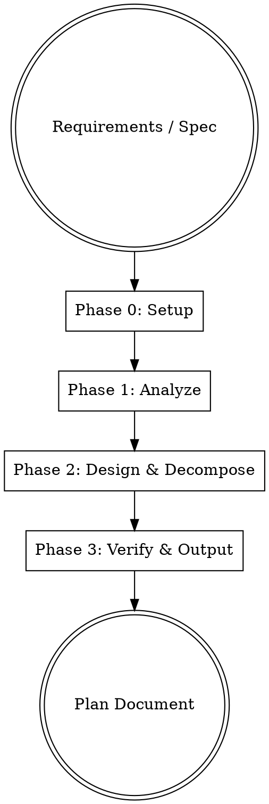

# Planning Implementation

## Overview

Write comprehensive implementation planning **documents** — not just task lists. Each plan produces a self-contained, reviewable document that a skilled engineer with zero domain context can execute. Plans include per-task detailed design, quantified acceptance criteria, dependency topology, risk assessment, and progress tracking.

**Announce at start:** "Using planning-implementation skill to create the implementation plan."

**Save plans to:** `docs/superpowers/plans/YYYY-MM-DD-<feature-name>.md`

## The Rule

**Plan before code. Always.** Even when the path seems obvious, writing it down surfaces hidden complexity, missing dependencies, and ambiguous requirements before they waste implementation time.

## Quality Standard

The plan document must meet this bar: **an engineer who has never seen this codebase, given only this document, can implement every task correctly and verify their own work.** If they'd need to ask you a question, the plan has a gap.

## Red Flags

These thoughts mean STOP — you're producing an insufficient plan:

| Thought                                      | Reality                                                                              |
| -------------------------------------------- | ------------------------------------------------------------------------------------ |
| "This is too simple to need detailed design" | Simple things become complex with no fallback. Write the design.                     |
| "Passing tests is the acceptance criteria"   | That's not AC. Write a binary checklist.                                             |
| "I'll figure out dependencies later"         | Dependencies determine execution order. Draw the topology now.                       |
| "One sentence for design is enough"          | One sentence cannot guide implementation. Write data models, algorithms, invariants. |
| "Edge cases will be handled in code"         | Edge cases not listed now will be missed during implementation.                      |
| "Risks don't need mitigation strategies"     | Identifying without mitigating = not identifying. Every risk needs a response.       |
| "Too many source files to list them all"     | Then it's not a complete plan. Trace every file.                                     |
| "Estimates are always wrong anyway"          | A wrong estimate beats no estimate. Estimate by order of magnitude.                  |
| "I'll think about tests later"               | Tests are a design tool now. List test cases before writing tasks.                   |
| "Skipping RED confirmation saves time"       | Skipping RED = tests are invalid. Fail first, then pass.                             |

## The 4-Phase Process

### Phase 0: Setup

**Goal:** Confirm toolchain and reference sources are ready. Create directory skeleton.

1. Verify toolchain (Claude Code/Codex version, skill-creator available)
2. Locate and read all input materials (requirements docs, specs, issues, designs, reference code)
3. For migrations/refactors: confirm reference source is complete and readable
4. Determine plan output location: `docs/superpowers/plans/YYYY-MM-DD-<name>.md`

**Output:** Toolchain confirmed, reference source inventory, output path ready.

### Phase 1: Analyze

**Goal:** Understand requirements, define boundaries, confirm key decisions with user.

1. Read all input materials and extract:
   - **Problem statement**: current state → desired state, why change
   - **Goals**: specific, verifiable outcomes
   - **Non-goals**: explicitly excluded (prevent scope creep)
   - **Constraints**: tech stack limits, compatibility, performance, deadlines
2. Analyze system boundaries: which modules are in scope, which require integration
3. **⚠️ Confirm key decisions with user** (don't decide for them):
   - Tech stack selection (present options + pros/cons, let user choose)
   - Scope boundary confirmation (what's in, what's out)
   - Module breakdown (if multiple independent subsystems, suggest splitting into separate plans)
4. If input materials are ambiguous or incomplete → **stop and ask**, never assume

**Output:** Overview section, architecture context, user-confirmed key decisions.

### Phase 2: Design & Decompose

**Goal:** Break work into independently verifiable tasks, fill in detailed design for each.

1. **Decompose tasks**:
   - Split by functional boundaries (not by technical layer or by function)
   - Each task has independently verifiable output, moderate size (half-day to two days)
   - ❌ "Implement ContextManager class" — too coarse
   - ✅ "Auto-compress when context exceeds 50 messages, retaining system prompt + last 10 messages"
   - For large projects: output overview (00-overview) first for review, then output per module

2. **Draw dependency topology** (Mermaid), mark parallel opportunities, output topological sort table

3. **Fill detailed design per task** (per `references/task-template.md`):
   - Data models (interface/zod schema, concrete code blocks)
   - Key algorithms/logic (pseudocode or decision tables, explicit branches)
   - State machines (if applicable)
   - Invariants (assertion form, must hold under any operation)
   - Edge cases (list concrete scenarios: empty input, concurrency, disk full, Windows file locks)
   - Compatibility requirements (disk format, API version, encoding)

4. **⚠️ Every task MUST have TDD flow**:
   - List test cases (happy path ≥3 + edge cases ≥3 + error handling ≥2, total ≥8)
   - Flow: write all tests → confirm RED (all fail) → implement → confirm GREEN (all pass)
   - Skipping RED confirmation = tests are invalid

5. **Zero placeholders**: no TBD/TODO/"implement later"/"handle appropriately" — these are plan failures

**Output:** Dependency & topology section + complete task decomposition (all 12 fields per task)

### Phase 3: Verify & Output

**Goal:** Self-review the plan, add receipt verification tasks, establish progress tracking, produce the document.

1. **Self-review** (see Self-Review section)

2. **Add receipt verification tasks** — not optional nice-to-haves, but hard gates for actual delivery:

   **Startup verification**:
   - System can start (server/CLI/app runs without crash)
   - Core functionality works end-to-end (send message → receive reply, not echo/stub)

   **Quality verification**:
   - All tests pass, lint has zero errors, coverage meets target

   **Functional completeness verification**:
   - Key user paths are walkable
   - Every module's core interface is verified by actual invocation

3. **Establish progress tracking**:
   - Output `progress.json`: `{total_tasks, completed, rounds, tasks: {id: {status}}}`
   - Output `check_progress.py`: reads progress.json, non-zero exit if pending tasks remain
   - Progress table format aligned with project STATUS.md (☐ ◐ ☑ ⛔)

4. **Write complete plan document per `references/plan-template.md`**

**Output:** Complete plan document + progress.json + check_progress.py

## Plan Document Structure

Organized per `references/plan-template.md`. 8 core sections:

1. **Header Metadata** — Plan ID, version, date, status, dependencies
2. **Overview** — Problem statement, goals, non-goals, constraints
3. **Architecture Context** — System boundaries, affected modules, data flow
4. **Dependency & Topology** — Mermaid diagram + topological sort table (parallelism marked)
5. **Task Decomposition** — N tasks, each with 12 fields + TDD flow
6. **Risk Register** — Cross-task risks (H/M/L) + mitigation strategies
7. **Receipt Verification** — Startup + quality + functional completeness + E2E
8. **Progress Tracking** — Status table + progress.json + check_progress.py

## Task Specification (12 Fields + TDD Flow)

Each task written per `references/task-template.md`. Overview:

| #   | Field               | Description                                                                                                      |
| --- | ------------------- | ---------------------------------------------------------------------------------------------------------------- |
| 1   | Task ID + Title     | Namespaced `<AREA>-NNN`, e.g. `MIG-FND-002`                                                                      |
| 2   | Purpose & Scope     | Why + what's covered + **explicitly excluded**                                                                   |
| 3   | Source Mapping      | Existing code/artifact paths (function-level precision)                                                          |
| 4   | Target Spec         | Output file paths + API signatures + data shapes                                                                 |
| 5   | Detailed Design     | Data models, algorithm pseudocode, state machines, invariants, edge case table, compatibility, library selection |
| 6   | Dependencies        | Internal task IDs + external libraries/services                                                                  |
| 7   | Risk/Complexity     | S/M/L/XL + risk source + mitigation strategy                                                                     |
| 8   | Test Plan           | Test case list (≥8: happy≥3 + edge≥3 + error≥2) + TDD flow + golden data                                         |
| 9   | Acceptance Criteria | **Checklist** (grouped: function/safety/edge/compat/quality), binary ✓/✗                                         |
| 10  | Effort Estimate     | Story points or hours + breakdown rationale                                                                      |
| 11  | Status              | ☐ todo / ◐ wip / ☑ done / ⛔ blocked + PR                                                                        |
| 12  | Notes               | Design decisions, known limitations, deferred TODOs + tracking issue                                             |

## Quantified Standards

| Dimension         | Standard                                                     | Source           |
| ----------------- | ------------------------------------------------------------ | ---------------- |
| Test cases        | ≥8 per task (happy≥3 + edge≥3 + error≥2)                     | step-2 prompts   |
| TDD flow          | Write all tests → RED confirm → implement → GREEN confirm    | step-2 prompts   |
| Task granularity  | Half-day to two days to complete                             | Project practice |
| Zero placeholders | No TBD/TODO/"implement later"/"handle appropriately"         | step-2 prompts   |
| Anti-stub         | No stub/echo/placeholder fake implementations                | step-2 prompts   |
| Real verification | System tasks must actually start + verify real functionality | step-3 prompts   |
| RED confirmation  | Must see tests fail before implementing                      | step-2 prompts   |

## Self-Review

After writing the plan, check against:

### 1. Completeness Check

- [ ] Every spec requirement maps to at least one task?
- [ ] Every task has 12 fields + TDD flow + test case list?
- [ ] Every AC checklist item is binary-decidable?
- [ ] No "TBD", "TODO", "handle appropriately", "implement later"?
- [ ] Receipt verification covers startup + quality + functional completeness?

### 2. Design Depth Check (sample 3 tasks)

- [ ] Data models written as concrete code blocks (not descriptions)?
- [ ] Key algorithms have pseudocode or decision tables?
- [ ] Edge cases list ≥5 concrete scenarios?
- [ ] Invariants written as assertions?

### 3. Test Adequacy Check

- [ ] Each task has ≥8 test cases?
- [ ] Covers happy path, edge conditions, error handling?
- [ ] TDD flow explicitly states RED → GREEN?
- [ ] I/O tasks have mock + real integration tests?

### 4. Dependency Consistency Check

- [ ] Mermaid diagram covers all tasks?
- [ ] Topological sort correct (dependencies come first)?
- [ ] progress.json total_tasks matches plan?

### 5. Placeholder Scan

Search for: `TBD`, `TODO`, `implement later`, `handle appropriately`, `reference X` (without concrete content), "Similar to Task N"

Fix issues inline. No need to re-review — just fix and move on.

## Execution Handoff

After plan is complete:

1. Output `progress.json` (all tasks pending) and `check_progress.py`
2. Present execution options:

**"Plan complete. Saved to `docs/superpowers/plans/<filename>.md`.**

**Execution approach:**
**1. Subagent-Driven (recommended)** — Fresh subagent per task, review between tasks
**2. Inline Execution** — Execute tasks in this session via executing-plans, checkpoint reviews

**Which approach?"**

Invoke the corresponding skill after user chooses.

## Templates

Detailed templates and examples in `skills/planning-implementation/references/`:

- **Plan document template**: `references/plan-template.md` — Full 9-section structure with writing guidelines
- **Task template + full example**: `references/task-template.md` — 12-field specification + TDD flow + MIG-FND-002 example
