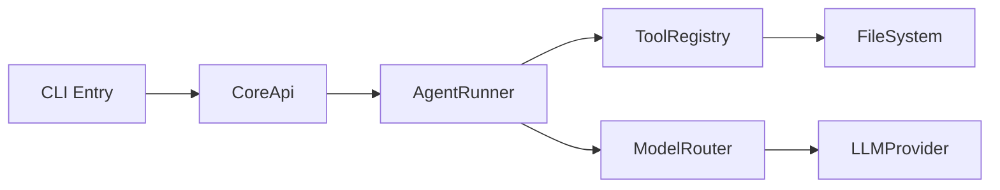
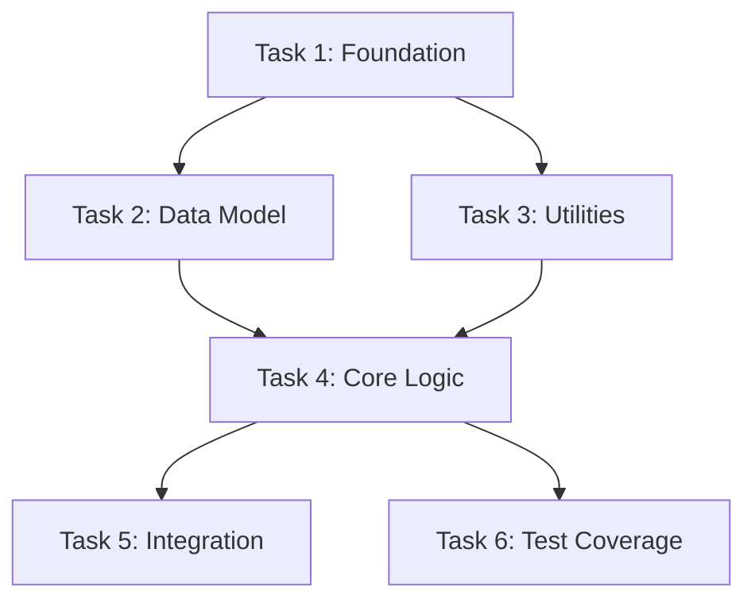

# Plan Document Template

This template defines the complete plan document structure produced by the `planning-implementation` skill. Each section includes writing guidelines and brief examples.

---

## Document Structure Overview

```
1. Header Metadata
2. Overview (Problem / Goals / Non-goals / Constraints)
3. Architecture Context (System boundaries / Affected modules / Data flow)
4. Dependency & Topology (Mermaid diagram + Topological sort table)
5. Task Decomposition (N tasks, each per task-template.md + TDD flow)
6. Risk Register (Cross-task systemic risks)
7. Receipt Verification (Startup / Functional completeness / Quality / Anti-stub)
8. Verification Strategy (E2E tests / Quality gates / Regression risks)
9. Progress Tracking (Status table + progress.json + check_progress.py)
```

---

## 1. Header Metadata

```markdown
# [Plan ID] · [Feature Name] Implementation Plan

> **Version**: v1.0
> **Date**: YYYY-MM-DD
> **Status**: draft | review | approved | implementing | done
> **Owner**: [@name]
> **Depends On**: [upstream plan ID or "—"]
> **Depended By**: [downstream plan ID or "—"]

> **For implementers**: Use `subagent-driven-development` (recommended) or `executing-plans` to execute task-by-task. Steps use `- [ ]` checkbox syntax for tracking.
```

**Requirements**:

- Plan ID uses format `PLAN-<AREA>-NNN` or project naming convention
- Status follows lifecycle: draft → review → approved → implementing → done
- Upstream/downstream plans ensure traceable topological order

---

## 2. Overview

### 2.1 Problem Statement

Current state → desired state, why change is needed. 3-5 sentences on background and motivation.

```markdown
## Problem Statement

Currently [describe current state]. This causes [pain/risk]. Need to [high-level approach] to achieve [desired benefit].
```

### 2.2 Goals

Specific, verifiable outcomes. Each goal should answer "did we achieve this?"

```markdown
## Goals

1. [Verifiable outcome 1]
2. [Verifiable outcome 2]
```

**Examples**:

- Migrate Agent core execution logic from Python to TypeScript, behavior identical word-for-word ✅/❌
- All 487 existing Python tests have passing vitest equivalents ✅/❌

### 2.3 Non-Goals

Explicitly excluded. Equally important for preventing scope creep.

```markdown
## Non-Goals

- [Thing we are NOT doing 1]
- [Thing we are NOT doing 2]
```

**Examples**:

- Do not improve existing algorithms (language migration only)
- Do not modify disk storage format
- Do not refactor frontend UI

### 2.4 Constraints

Tech stack limits, compatibility requirements, performance targets, deadlines.

```markdown
## Constraints

| Type          | Constraint                       | Reason              |
| ------------- | -------------------------------- | ------------------- |
| Tech stack    | TypeScript strict / vitest       | Project standard    |
| Compatibility | Disk JSON schema unchanged       | Zero migration cost |
| Performance   | 0 compile errors, 100% test pass | Quality gate        |
| Timeline      | Complete by YYYY-MM-DD           | Milestone           |
```

---

## 3. Architecture Context

### 3.1 System Boundaries

Which modules are in scope, which require external integration.

```markdown
## System Boundaries

**In scope**:

- `packages/core/src/xxx/` — [description]
- `packages/core/src/yyy/` — [description]

**Out of scope (integration needed)**:

- `desktop/src/` — Frontend render layer, IPC bridge
- Python `agent/` — Reference source, do not modify
```

### 3.2 Affected Modules

List of files to modify (one file per row + brief description).

```markdown
## Affected Modules

| File                       | Action | Description              |
| -------------------------- | ------ | ------------------------ |
| `packages/core/src/xxx.ts` | Modify | Add Y interface          |
| `packages/core/src/yyy.ts` | Create | Z feature module         |
| `desktop/src/renderer/...` | Modify | Adapt to new IPC channel |
```

### 3.3 Data Flow Diagram (optional)

For multi-module interactions, draw a Mermaid data flow diagram.



---

## 4. Dependency & Topology

### 4.1 Upstream Dependencies

What completed or in-progress work this plan depends on.

```markdown
## Upstream Dependencies

| Plan/System        | Status    | Depends On            |
| ------------------ | --------- | --------------------- |
| [Upstream plan ID] | done      | [specific dependency] |
| [External service] | available | [API version/config]  |
```

### 4.2 Downstream Impact

Which subsequent plans depend on this plan's output.

```markdown
## Downstream Impact

| Plan/System          | Impact            | Blocked On         |
| -------------------- | ----------------- | ------------------ |
| [Downstream plan ID] | [describe impact] | [specific blocker] |
```

### 4.3 Task Dependency Graph (Mermaid)

Task-level dependency diagram, marking parallel execution opportunities.



### 4.4 Topological Sort Table

Tasks ordered by execution sequence, marking phases and parallelism.

```markdown
## Topological Sort

| Phase | Tasks      | Depends On | Parallel    |
| ----- | ---------- | ---------- | ----------- |
| W01   | T001, T002 | —          | T001 ‖ T002 |
| W02   | T003, T004 | T001       | T003 ‖ T004 |
| W03   | T005       | T002, T004 | —           |
| W04   | T006       | T005       | —           |
```

---

## 5. Task Decomposition

Each task written per `references/task-template.md` (12-field specification). This is the core of the plan.

```markdown
### <TASK-ID> · <One-line title>

(12 fields fully filled, see task-template.md)
```

Tasks listed in topological order.

---

## 6. Risk Register

Cross-task systemic risks. Each risk includes: severity, description, affected tasks, mitigation.

```markdown
## Risk Register

| ID  | Severity | Description               | Affected Tasks | Probability | Mitigation            |
| --- | -------- | ------------------------- | -------------- | ----------- | --------------------- |
| R1  | H        | [High risk description]   | T003, T005     | Medium      | [Specific mitigation] |
| R2  | M        | [Medium risk description] | T002           | Low         | [Specific mitigation] |
| R3  | L        | [Low risk description]    | T006           | High        | [Specific mitigation] |

**Severity**: H = Blocking (may cause >3 days rework) / M = Significant (1-3 days rework) / L = Acceptable (<1 day rework)
**Probability**: High (>50%) / Medium (10-50%) / Low (<10%)
```

---

## 7. Receipt Verification Tasks

The plan MUST end with these verification tasks. These are NOT "optional nice-to-haves" — they are **hard gates for actual delivery**. Any failure invalidates all prior "done" tasks.

### 7.1 Startup Verification

```markdown
## Startup Verification

- [ ] System can start (server/CLI/app starts without crash)
- [ ] Core functionality works end-to-end (e.g., send message → receive reply, not echo/stub)
- [ ] Key CLI commands work (`--version` / `--help` / `status`)
```

### 7.2 Functional Completeness Verification

```markdown
## Functional Completeness Verification

- [ ] Every module's core interface is verified by actual invocation (not just import tests)
- [ ] Key user paths are walkable (complete end-to-end operations)
- [ ] External dependency integration works (LLM API / database / filesystem / MCP)
- [ ] Graceful degradation: when external deps are unreachable, system returns friendly messages (no 500 crash)
```

### 7.3 Quality Verification

```markdown
## Quality Verification

- [ ] All tests pass (`vitest run` / `pytest` all green)
- [ ] Lint has zero errors (`tsc --noEmit` / `ruff check` all pass)
- [ ] Coverage ≥ target (e.g., 80%)
- [ ] `check_progress.py` returns 0 (all tasks done)
```

### 7.4 Anti-Stub Constraints

Written into every task (especially system/service tasks) as exit criteria:

```markdown
## Anti-Stub Constraints

- **Forbidden**: `return ""` / `pass` / `raise NotImplementedError` / pure echo / hardcoded responses
- **Required**: Call real dependencies or have actual business logic
- Server tasks must actually start + verify real functionality (cannot mark done based on import or test pass alone)
```

---

## 8. Verification Strategy

### 8.1 End-to-End Test Plan

Cross-task integration verification independent of per-task tests.

```markdown
## End-to-End Test Plan

| Scenario     | Steps                | Expected Result | Tasks Covered |
| ------------ | -------------------- | --------------- | ------------- |
| [Scenario 1] | 1. ... 2. ... 3. ... | [Expected]      | T001-T005     |
| [Scenario 2] | 1. ... 2. ...        | [Expected]      | T003-T006     |
```

### 8.2 Quality Gates

Checks that must pass at key milestones.

```markdown
## Quality Gates

| Gate | Trigger           | Pass Criteria           | Blocks         |
| ---- | ----------------- | ----------------------- | -------------- |
| G1   | All tasks done    | `tsc --noEmit` 0 errors | Cannot merge   |
| G2   | All tasks done    | `vitest run` all pass   | Cannot merge   |
| G3   | Integration phase | All E2E scenarios pass  | Cannot release |
```

### 8.3 Regression Risk Areas

Known areas needing extra attention.

```markdown
## Regression Risk Areas

- [High-risk area 1] — [why it's prone to issues]
- [High-risk area 2] — [why it's prone to issues]
```

---

## 9. Progress Tracking

### 9.1 Task Status Summary Table

Format aligned with project STATUS.md.

```markdown
## Progress Tracking

> **N** tasks total / **M** phases. Status: ☐ todo · ◐ wip · ☑ done · ⛔ blocked

| ID         | Title      | Status | PR   | Notes        |
| ---------- | ---------- | ------ | ---- | ------------ |
| <TASK-001> | Task title | ☐      | —    |              |
| <TASK-002> | Task title | ◐      | #123 | Blocked on X |
| <TASK-003> | Task title | ☑      | #124 |              |
```

### 9.2 progress.json

Generated at plan output time, updated each execution round.

```json
{
  "started_at": "YYYY-MM-DDTHH:mm:ssZ",
  "updated_at": "YYYY-MM-DDTHH:mm:ssZ",
  "total_tasks": 0,
  "completed": 0,
  "rounds": 0,
  "tasks": {
    "1": { "title": "...", "module": "...", "status": "pending" }
  }
}
```

Status flow: `pending` → `in_progress` → `done` | `failed`
`total_tasks` must strictly match the plan's task count.

### 9.3 check_progress.py

```python
#!/usr/bin/env python3
"""Check whether all planned tasks are complete."""
import json, sys
from pathlib import Path

PROGRESS_FILE = Path(__file__).parent / "progress.json"

def main():
    if not PROGRESS_FILE.exists():
        print("no progress file — tasks not started")
        sys.exit(1)
    with open(PROGRESS_FILE) as f:
        p = json.load(f)
    remaining = [tid for tid, t in p["tasks"].items() if t["status"] != "done"]
    if not remaining:
        print(f"all tasks done — total: {p['total_tasks']}, rounds: {p['rounds']}")
        sys.exit(0)
    print(f"{len(remaining)} tasks remaining out of {p['total_tasks']}")
    for tid in sorted(remaining, key=int):
        print(f"  task {tid}: {p['tasks'][tid]['status']}")
    sys.exit(1)

if __name__ == "__main__":
    main()
```

Returns 0 = all done; non-zero = pending tasks remain.

---

## Template Usage Notes

1. **Task decomposition is core value**: Section 5 is the heart of the plan — every task must have all 12 fields + TDD flow. Other sections provide context and management perspective.
2. **Receipt verification is mandatory**: Section 7 is a hard gate, not a nice-to-have — any failure invalidates all prior tasks.
3. **Progress tracking updates with execution**: Section 9 (progress.json + check_progress.py) is initialized at plan output and updated each execution round.
4. **Trim as needed**: Simple plans can omit 3.3 (data flow diagram), 8.3 (regression risks); complex plans may need expanded 4.3 (multi-level dependency graphs).
5. **Reference, don't duplicate**: If the project already has STATUS.md or similar tracking files, reference them rather than copying.
